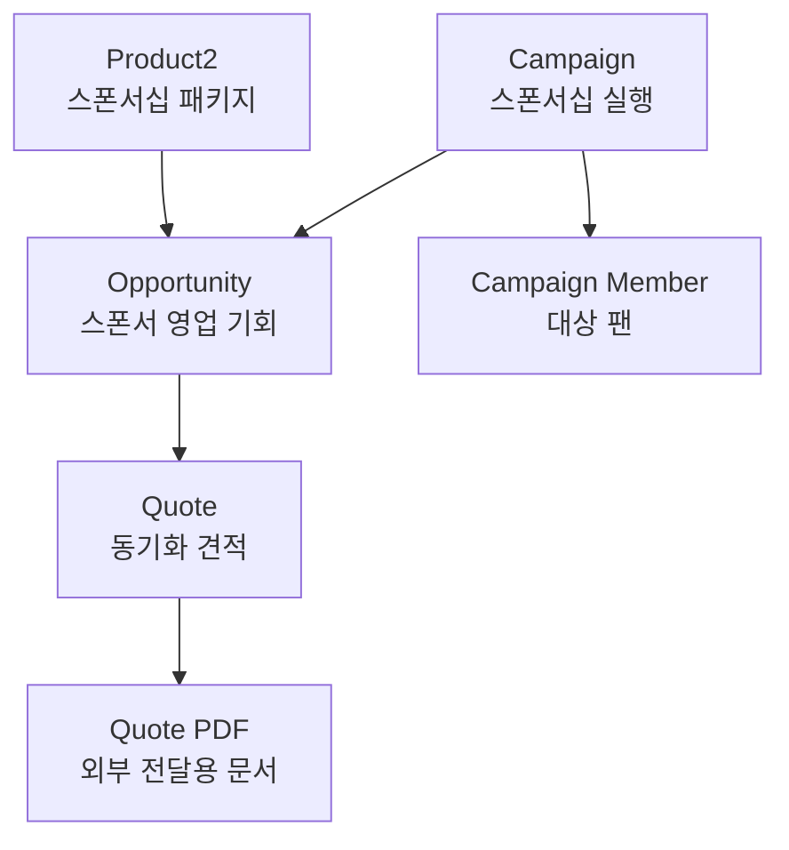

# PRM Product · Quote · Campaign 구현 결과

> Cloud Alpacas PRM의 스폰서십 상품 구성부터 Opportunity 연결, 견적서 생성, 실행 Campaign 관리까지의 구현 결과를 정리한 문서입니다.

| 항목 | 내용 |
| --- | --- |
| 작성자 | 승우(Rafael) |
| 기준일 | 2026-08-20 |
| 대상 App | `Cloud Alpacas PRM` |
| 구현 상태 | 완료 및 End-to-End 검증 완료 |
| 구현 원칙 | Salesforce 표준 기능 우선, 필요한 구분만 선언형 설정으로 확장 |

## 1. 구현 범위와 구분

이 문서에서는 각 항목의 구현 방식을 다음과 같이 표시합니다.

- **[표준]**: Salesforce가 기본 제공하는 오브젝트 또는 기능
- **[선언]**: Setup에서 구성한 Record Type, Page Layout, Picklist, List View 등의 설정
- **[개발]**: Apex, LWC 등 코드 개발

이번 범위는 **[표준] + [선언]만으로 구현**했으며, Apex·LWC 등의 **[개발] 작업은 없습니다.** 기존 B2C 구성이나 공용 데이터를 삭제하지 않고, 전용 Record Type과 Layout으로 PRM 사용 영역을 분리했습니다.

## 2. 최종 업무 흐름



연결 기준은 다음과 같습니다.

| 연결 | Salesforce 관계/기능 | 검증 결과 |
| --- | --- | --- |
| Product → Opportunity | Opportunity Product (`OpportunityLineItem`) | 상품 1개, 3억 원 연결 확인 |
| Opportunity → Quote | Standard Quote 및 Quote Sync | Quote 1건, Syncing 체크 확인 |
| Quote → PDF | Standard Quote Template / Quote PDF | PDF 생성 및 저장 확인 |
| Campaign → Opportunity | `Primary Campaign Source` | Campaign의 Opportunities 관련 목록에서 1건 확인 |
| Campaign → Fan | `CampaignMember` | 테스트 Fan 1명, `Targeted` 등록 확인 |

## 3. Product 구성

### 3.1 사용 기능

| 구분 | 구성 |
| --- | --- |
| **[표준]** | `Product2`, `Pricebook2`, `PricebookEntry` |
| **[선언]** | Product Record Type, Page Layout, Product Family 값, List View |
| **[개발]** | 없음 |

### 3.2 Record Type과 Layout

| 항목 | 설정값 |
| --- | --- |
| Record Type Label | `Sponsorship Package` |
| Record Type Name | `Sponsorship_Package` |
| Page Layout | `Sponsorship Package Layout` |
| Product Family 허용값 | `Sponsorship` |
| Product Family 기본값 | `Sponsorship` |

`Sponsorship Package Layout`의 주요 필드는 다음과 같습니다.

- Product Name
- Product Code
- Product Family
- Active
- Product Description
- Product Record Type

기존 B2C 전용 필드는 오브젝트에서 삭제하지 않고 Sponsorship 전용 Layout에서만 제외했습니다.

### 3.3 테스트 상품

| 필드 | 값 |
| --- | --- |
| Product Name | `전광판 광고 + Brand Day 패키지` |
| Product Code | `SPN-LED-BRANDDAY` |
| Product Family | `Sponsorship` |
| Active | `True` |
| Product Description | `전광판 광고 노출과 홈경기 Brand Day 운영을 결합한 스폰서십 패키지` |
| Standard Price Book | KRW 300,000,000 |

초기 검토 금액보다 기존 Opportunity 금액을 기준으로 통일하는 것이 데이터 정합성에 적합하다고 판단해, 최종 상품 가격을 **3억 원**으로 설정했습니다.

### 3.4 List View

`Active Sponsorship Packages`

필터:

- Product Record Type = `Sponsorship Package`
- Active = `True`

주요 표시 열:

- Product Name
- Product Code
- Product Family
- Active
- Product Description

## 4. Opportunity 연결

Opportunity 자체의 영업 정보는 Opportunity 담당자가 생성한 기존 데이터를 유지하고, 승우 담당 범위에서는 Product·Quote·Campaign을 연결했습니다.

| 필드 | 값 |
| --- | --- |
| Opportunity Name | `d'Alba(달바) × Cloud Alpacas — Advertising Sponsorship` |
| Account | `d'Alba(달바)` |
| Opportunity Owner | Eunyeong Doh |
| Stage | `Qualification` |
| Amount | KRW 300,000,000 |
| Close Date | 2026-12-31 |
| Primary Campaign Source | `d’Alba Sponsorship Campaign` |

연결된 Opportunity Product:

| 상품 | 수량 | Sales Price | Total |
| --- | ---: | ---: | ---: |
| 전광판 광고 + Brand Day 패키지 | 1 | KRW 300,000,000 | KRW 300,000,000 |

## 5. Quote 구성

### 5.1 사용 기능

| 구분 | 구성 |
| --- | --- |
| **[표준]** | `Quote`, `QuoteLineItem`, Quote Sync, Quote PDF |
| **[선언]** | Quote Template, Page Layout 활용, List View |
| **[개발]** | 없음 |

Quote는 별도 Record Type을 만들지 않고 Salesforce Standard Quote를 사용했습니다. 또한 독립 Quote 생성을 허용하지 않고, Opportunity에서 Quote를 생성하는 구조를 유지했습니다.

### 5.2 Quote Template

| 항목 | 설정값 |
| --- | --- |
| Template Name | `Cloud Alpacas Sponsorship Quote` |
| 기반 Template | Standard Template 복제 |
| 상태 | Active |
| Header | `CLOUD ALPACAS` / `SPONSORSHIP QUOTE / 스폰서십 견적서` |

### 5.3 테스트 Quote

| 필드 | 값 |
| --- | --- |
| Quote Number | `000000006` |
| Quote Name | `d'Alba Sponsorship Quote` |
| Status | `Draft` |
| Expiration Date | 2026-12-15 |
| Quote Currency | KRW |
| Grand Total | KRW 300,000,000 |
| Syncing | `True` |
| 생성 PDF | `d'Alba Sponsorship Quote_V1.pdf` |

Quote Line Item:

| 상품 | 수량 | List Price | Sales Price | Total Price |
| --- | ---: | ---: | ---: | ---: |
| 전광판 광고 + Brand Day 패키지 | 1 | KRW 300,000,000 | KRW 300,000,000 | KRW 300,000,000 |

PDF는 `Quote PDFs` 및 `Notes & Attachments`에서 생성 결과를 확인했습니다.

### 5.4 Quote Sync 검증

`Start Sync` 실행 후 다음을 확인했습니다.

- Quote 상단의 `Syncing` 체크
- Opportunity의 Quotes 관련 목록에서 동기화 Quote 1건 확인
- Opportunity Product의 수량 및 금액 유지
- Opportunity Amount, Opportunity Product, Quote Grand Total이 모두 3억 원으로 일치

한 Opportunity에서는 한 Quote만 동기화 상태로 운영합니다. 다른 Quote를 동기화하면 기존 동기화 Quote가 해제될 수 있으므로 운영 시 주의가 필요합니다.

### 5.5 List View

`My Open Sponsorship Quotes`

필터:

- Filter by Owner = `My quotes`
- Quote Name contains `sponsorship`
- Status ≠ `Rejected`
- Status ≠ `Accepted`
- Status ≠ `Denied`

주요 표시 열:

- Quote Number
- Quote Name
- Opportunity Name
- Account Name
- Status
- Expiration Date
- Total Price
- Syncing

최종 검증 시 Draft 상태의 `d'Alba Sponsorship Quote` 1건과 3억 원, Syncing 체크가 정상적으로 표시됐습니다.

## 6. Campaign 구성

### 6.1 사용 기능

| 구분 | 구성 |
| --- | --- |
| **[표준]** | `Campaign`, `CampaignMember`, Primary Campaign Source |
| **[선언]** | Campaign Record Type, Page Layout, Type/Status 값, Member Status, List View |
| **[개발]** | 없음 |

### 6.2 Record Type과 Layout

| 항목 | 설정값 |
| --- | --- |
| Record Type Label | `Sponsorship Collaboration` |
| Record Type Name | `Sponsorship_Collaboration` |
| Page Layout | `Sponsorship Collaboration Layout` |
| Campaign Type 허용값 | `Sponsorship` |
| Campaign Type 기본값 | `Sponsorship` |

주요 Layout 구성:

| 영역 | 구성 |
| --- | --- |
| Campaign Information | Campaign Name, Type, Status, Active, Campaign Owner, Description |
| Planning | Start Date, End Date |
| Related Lists | Campaign Members, Campaign Member Statuses, Opportunities, Open Activities, Activity History |

Campaign Status 허용값:

- Planned (기본값)
- In Progress
- Completed
- Aborted

Campaign Member Status:

| Status | 기본값 | Responded |
| --- | --- | --- |
| Targeted | Yes | No |
| Responded | No | Yes |

### 6.3 테스트 Campaign

| 필드 | 값 |
| --- | --- |
| Campaign Name | `d’Alba Sponsorship Campaign` |
| Record Type | `Sponsorship Collaboration` |
| Type | `Sponsorship` |
| Status | `Planned` |
| Active | `False` |
| Start Date | 2027-03-10 |
| End Date | 2027-03-12 |
| Description | `[SCN-B2B-001] d'Alba 전광판 광고 + Brand Day 스폰서십 실행 캠페인` |

`Active = False`는 현재 Campaign이 실행 전 `Planned` 단계이기 때문입니다. 실제 실행을 시작할 때 `Active = True`, `Status = In Progress`로 변경합니다.

### 6.4 Campaign Member 테스트

| 항목 | 값 |
| --- | --- |
| Member | 김루키 |
| Member Type | Contact (Person Account의 내부 Contact) |
| Status | `Targeted` |

Person Account Fan은 Campaign Member 추가 화면에서 `Add Contacts`를 사용합니다. 실제 운영에서는 대상 세그먼트가 확정된 Fan만 추가해야 하며, 테스트 목적으로 모든 Fan을 임의 등록하지 않습니다.

### 6.5 List View

`Open Sponsorship Campaigns`

필터:

- Filter by Owner = `All campaigns`
- Campaign Record Type = `Sponsorship Collaboration`
- Status ≠ `Completed`
- Status ≠ `Aborted`

주요 표시 열:

- Campaign Name
- Type
- Status
- Start Date
- End Date
- Active
- Owner Alias

최종 검증 시 `d’Alba Sponsorship Campaign` 1건이 `Sponsorship / Planned`로 정상 표시됐습니다.

## 7. End-to-End 검증 결과

| 검증 항목 | 기대 결과 | 실제 결과 | 판정 |
| --- | --- | --- | --- |
| Sponsorship Product 조회 | 전용 List View에 활성 상품 표시 | 상품 1건 표시 | PASS |
| Opportunity Product 연결 | 1개 × 3억 원 | 수량 1, 3억 원 | PASS |
| Quote 생성 | Opportunity 기반 Quote 생성 | Quote 1건 생성 | PASS |
| Quote 총액 | Opportunity와 동일한 3억 원 | Grand Total 3억 원 | PASS |
| Quote PDF | 전용 Template로 PDF 생성 | PDF 1건 저장 | PASS |
| Quote Sync | Opportunity와 동기화 | Syncing 체크 | PASS |
| Campaign 연결 | Primary Campaign Source 연결 | Opportunities 1건 표시 | PASS |
| Campaign Member | 대상 Fan 등록 | 김루키 / Targeted | PASS |
| Quote List View | 종료 상태 제외 후 진행 건 표시 | Draft Quote 1건 표시 | PASS |
| Campaign List View | 종료 Campaign 제외 후 진행 건 표시 | Planned Campaign 1건 표시 | PASS |

## 8. 팀 운영 시 주의사항

### 8.1 데이터 책임 경계

- Opportunity Stage, Close Date, Amount 등 영업 정보는 Opportunity 담당자와 합의 후 변경합니다.
- Product 가격 변경 시 이미 생성된 Opportunity Product와 Quote Line Item의 가격이 자동으로 과거까지 일괄 변경되는 것은 아닙니다. 각 거래 레코드의 금액 정합성을 별도로 확인해야 합니다.
- Quote Sync는 상품 구성을 Opportunity와 맞추는 기능입니다. 동기화 Quote를 변경하기 전에 영업 담당자와 확인합니다.
- Campaign Member는 실제 타깃 기준이 확정된 후 추가하며, 응답이 확인되면 `Targeted`에서 `Responded`로 변경합니다.

### 8.2 외부 전달 전 Quote PDF 보완

현재 PDF는 기능 검증용으로 정상 생성됐습니다. 고객에게 실제 발송하기 전에는 다음을 보완합니다.

- 회사 주소 및 대표 연락처
- 발신 사용자 이메일이 개인 계정으로 노출되지 않는지 확인
- 로고, 한글 제목, 안내 문구의 최종 시각 검수
- 할인, 세금, 계약 조건 표기 기준 확정

### 8.3 공용 Layout/Action 영향

Quote 화면의 `Product Request`, `Vehicle Inspection` 등의 액션은 기존 공용 구성에서 상속된 항목입니다. 다른 팀 기능에 영향을 줄 수 있으므로 공용 Quote Layout에서 임의 삭제하지 않았습니다. 필요 시 앱/Record Type별 분리 또는 Dynamic Actions 적용 여부를 팀 단위로 결정합니다.

## 9. 후속 작업

| 우선순위 | 작업 | 담당/협의 |
| --- | --- | --- |
| P1 | 실제 스폰서십 운영 시 Campaign Active 및 Status 변경 | Campaign 운영 담당 |
| P1 | Quote 상태를 실제 검토·승인·제시 결과에 맞춰 갱신 | 영업/Quote 담당 |
| P1 | 고객 발송 전 Quote PDF 회사 정보 및 발신 정보 정비 | 팀 공통 설정 담당과 협의 |
| P2 | 확정된 Fan 세그먼트를 Campaign Member로 일괄 등록 | Campaign/Fan 데이터 담당 협의 |
| P2 | 공용 Quote 액션 정리 여부 결정 | 앱·권한 담당과 협의 |
| P3 | 실제 경영 분석 수요 발생 시 Tableau 등 고급 시각화 검토 | 분석 범위 확정 후 검토 |

DART API 연동과 Agentforce Matching은 이번 Product·Quote·Campaign 구현 범위에 포함되지 않으며 별도 팀 과제로 관리합니다.

## 10. GitHub 반영 제안

권장 경로:

```text
docs/prm/PRM_PRODUCT_QUOTE_CAMPAIGN_IMPLEMENTATION.md
```

권장 Commit Message:

```text
docs: document PRM product quote campaign implementation
```

이 문서는 실제 Org 설정 완료 상태를 기준으로 작성했습니다. 이후 Record Type, Picklist, Layout 또는 가격 정책을 변경하면 본 문서도 함께 갱신해야 합니다.
