# 01_PROJECT.md — Cloud Alpacas Customer 360 Domain Model & Workflow

> 이 문서는 Domain Model, Workflow, 프로젝트의 전체 설계(Business Entity → Salesforce Mapping)를 다룬다.
> Task, Sprint, Bug, Progress 같은 Backlog는 문서가 아니라 **GitHub Projects**에서 관리한다(CLAUDE.md §7).

---

이전 버전은 **Story**(`00_STORY.md` — 이루키의 이야기) 관점에서 "이 세계에 어떤 명사가
존재하는가"를 정의했다. 이 문서는 같은 질문을 **Workflow**(§2 — 마케팅/티켓/멤버십/굿즈/고객지원/스폰서십
6개 팀의 실제 업무 흐름)를 기준으로 다시 검증한다. Story는 "왜 이 데이터가 의미 있는가"를 보여주고,
Workflow는 "실제 업무에서 어떤 명사가 반드시 필요한가"를 보여준다 — 이 둘은 서로 다른 렌즈이며, 둘 다 맞을 수 있다.

문서의 구조(Domain Overview → Entity 목록 → Entity 간 관계 → Salesforce Mapping)와 철학(Story보다
Business, Salesforce보다 Domain, 명사 중심, Field는 아직 안 만듦)은 그대로 유지한다. 핵심은 **왜 이
Entity가 필요한지에 대한 근거가 Story의 서사가 아니라 Workflow의 업무 단계**라는 것이다.

---

## 0. 이 문서를 읽는 법

이 문서는 아래 순서로 사고 과정을 따라간다.

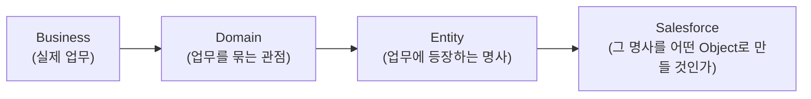

각 단계에서 "왜 그렇게 나눴는가"를 설명한다. 정답이 하나만 있는 단계는 거의 없다 — 특히 마지막
Salesforce Mapping 단계는 선택지가 여러 개인 경우가 많고, 이 문서는 정답을 강요하지 않고 비교만 제공한다.
최종 결정은 팀이 한다.

---

## 1. Domain Overview

기존 문서는 Fan / Operations / Partnership 3개 Domain을 제시했다. §2의 6개 팀 업무를 그대로
이 3개 Domain에 밀어넣어 보면, **두 팀의 업무가 어디에도 깔끔하게 들어가지 않는다.**

- **마케팅팀** 업무(세분화, 발송 대상 확정, 반응 모니터링)는 "무엇을 파는가"(Operations)도, "누구와
  협업하는가"(Partnership)도 아니다. **누구에게, 언제, 무엇을 알릴 것인가**라는 별개의 관심사다.
- **고객지원팀** 업무(문의 접수, 유형별 처리, 재발 방지)도 마찬가지로 상품·이벤트 자체가 아니라
  **문제가 생겼을 때 어떻게 대응하는가**라는 별개의 관심사다.

그래서 이 문서는 Domain을 3개에서 **5개**로 늘린다. Domain은 "이 명사가 어떤 업무 관심사에서
나왔는가"를 보여주는 라벨이지, 서로 겹치지 않는 상자가 아니다 — 예를 들어 `Campaign`은 Marketing에서도
Partnership에서도 쓰인다. 그건 잘못된 게 아니라 자연스러운 일이다.

| Domain | 질문 | 담당 Workflow |
|---|---|---|
| **Fan Domain** | 이 사람은 누구고, 우리와 어떤 관계인가? | (모든 팀의 분석 단계 — 팬은 모든 워크플로우의 출발점) |
| **Operations Domain** | 우리가 직접 만들고 파는 것은 무엇이고, 어떻게 처리되는가? | 티켓팀, 멤버십팀, 굿즈팀 |
| **Marketing Domain** | 누구에게, 무엇을, 언제 알릴 것인가? | 마케팅팀 |
| **Service Domain** | 문제가 생겼을 때 어떻게 접수하고 해결하는가? | 고객지원팀 |
| **Partnership Domain** | 외부 조직과 어떤 관계·계약을 맺는가? | 스폰서십팀 |

> **왜 "Operations"를 더 잘게 쪼개지 않았나?** 티켓/멤버십/굿즈 세 팀은 서로 다른 상품을 다루지만,
> 업무 패턴이 똑같다 — *상품/자격 기획 → 판매 → 처리(발급·배송) → 이용 분석*. 팀은 다르지만 Domain
> 관점에서는 "구단이 파는 것"이라는 하나의 관심사로 묶는 것이 더 명확하다. 굳이 Ticket Domain, Membership
> Domain, Goods Domain으로 쪼개면 나중에 세 팀이 공통으로 쓰는 개념(예: 자격 확인, 혜택 적용)을 중복
> 정의하게 된다.

Domain(관심사)과 Entity 카테고리(명사의 종류 — Person/Product/Event 등, §4)는 서로 다른 축이다.
하나의 Domain은 여러 카테고리의 Entity를 포함한다. 이 매핑은 §4 표의 각 Entity 옆에 표시한다.

---

## 2. Workflow 기준 Entity 추출

6개 팀 Workflow를 각 단계별로 훑으며 등장하는 명사를 뽑는다. 다이어그램의 화살표는 업무 순서이지,
Entity 간의 데이터 관계가 아니다(관계는 §5에서 별도로 정리한다).

### 2.1 마케팅 Workflow

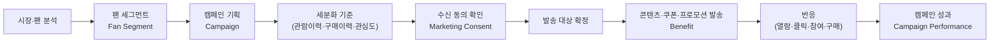

**새로 등장한 명사:** Fan Segment(팬 세그먼트), Marketing Consent(수신 동의), Benefit(혜택 — 쿠폰 포함).
기존 문서의 "Promotion"과 "Marketing Message"는 여기서도 등장하지만, Workflow는 이걸 **하나의 캠페인
생애주기**(기획→발송→모니터링→분석)로 다룬다 — 이유는 §3에서 다룬다.

### 2.2 티켓 Workflow

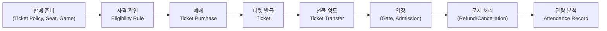

**새로 등장한 명사:** Ticket Policy(판매 정책), Eligibility Rule(구매 자격), Ticket Transfer(선물·양도),
Gate(게이트), Admission(입장 기록). 사용자가 제시한 예시(Seat → Game → Ticket → Policy → Qualification
→ Purchase → Gift → Transfer → Admission)와 거의 그대로 일치한다 — Gift는 Transfer의 한 유형(양도
사유가 "선물"인 경우)으로 흡수했다. 이유는 §3.

### 2.3 멤버십 Workflow

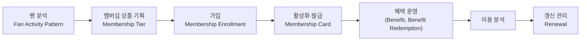

**새로 등장한 명사:** Membership Tier(등급), Membership Card(카드/자격증), Benefit Redemption(혜택 사용),
Renewal(갱신).

### 2.4 굿즈 Workflow

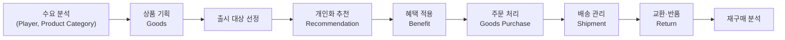

**새로 등장한 명사:** Recommendation(추천), Shipment(배송), Return(교환·반품). Product Category는
후보로만 남긴다(§3).

### 2.5 고객지원 Workflow

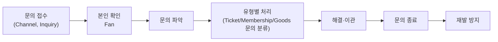

**새로 등장한 명사:** 실질적으로 새 Entity는 없다. Channel(접수 채널)은 후보로만 남긴다(§3). 이
Workflow가 확인해주는 것은 **Inquiry가 Ticket/Membership/Goods Purchase 등 다른 Entity를 참조해야
한다**는 관계 정보다(§5에 반영).

### 2.6 스폰서십 Workflow

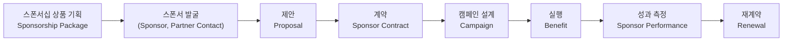

**새로 등장한 명사:** Sponsorship Package(제공 권리 패키지), Proposal(제안서). Renewal은 2.3과 공유.

### 2.7 [P2] Phase 2 확장 — Fan Insight → 기업 Matching → Outbound Lead (B2B Sponsorship Sales)

> **2026-08-18 멘토링으로 갱신**(`05_DECISIONS.md` Decision 019). 이 섹션은 §2.6을 대체하지 않는다. §2.6은 "이미 접촉 대상이 정해진 이후, 어떻게 제안·계약하는가"를 다뤘고, 이 섹션은 그보다 **앞단계 — "애초에 누구에게 접촉할지 어떻게 찾아내는가"**를 다룬다(`00_STORY.md` §8 Phase 2 Story 기반). Cloud Alpacas는 팬이 늘고 있지만 구단 재정 운영상 적자 상황이라, 이 앞단계 없이 "스폰서 발굴"만으로는 후보를 무작위로 찾는 것과 다르지 않다.

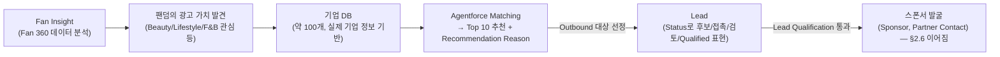

**새로 등장한 명사:** Fan Insight(팬층 분석 결과), 기업 DB(약 100개 기업 정보), Agentforce Matching(Fit/Recommendation Score 산출), Top 10 Recommendation(Agentforce 출력), Lead(Outbound 영업 대상). 이 개념들은 §2.6의 "스폰서 발굴" 앞에 붙는 새로운 단계이며, §2.6 이후(제안→계약→실행→성과→재계약)는 그대로 이어진다. Fan Insight는 새 저장 Entity가 아니라 §4의 기존 Fan Analytics Entity(Attendance Record, Engagement Signal, Fan Activity Pattern 등)를 활용하는 **분석 과정**이다 — Lead만 §4에 새 Entity로 추가한다.

> **✅ 2026-08-19 확정 (Decision 020)**: 기업 DB(약 100개)는 **Salesforce Object가
> 아니다** — Lead Status=Candidate로 표현하는 방식도 채택하지 않는다. **Primary
> Data Source는 DART Open API**로 확정한다 — CSV는 기업 DB의 기본 저장 방식이
> 아니라, 필요할 때만 쓰는 개발/테스트용 대체 입력(Optional)일 뿐이다. Agentforce의
> 출력인 Top 10 Recommendation도 Salesforce Object가 아니고 반드시 DB에 저장해야
> 하는 레코드로 정의하지 않으며, 아직 Lead가 아니다 — 이 중 담당자가 실제 영업
> 대상으로 **선택한 기업만** Standard Lead가 된다: DART Open API → 약 100개 기업
> 데이터 조회 → Agentforce Matching → Top 10 Recommendation → 담당자가 기업
> 선택 → (선택된 기업만) Lead. 남은 TBD는 DART Open API의 실제 연동 기술 방식
> (커넥터/Apex/External Object 등)뿐이다 — 임의로 새 Object/Field를 만들지 않는다.

> **Agentforce Fit/Recommendation Score ≠ Lead Score**: Agentforce Matching이 산출하는 것은 "우리 팬덤과 이 기업이 잘 맞는가"(Fan 360 데이터 기반)이고, Lead Score는 "이 Lead가 실제 계약까지 이어질 가능성이 높은가"(담당자 권한, 접촉 이력, 예산 등 실제 영업 활동 기반)다. 두 값은 서로 다른 시점, 다른 근거로 산출되는 별개 개념이다 — §6.11에서 더 자세히 다룬다.

> **왜 Fan 360이 이 흐름의 출발점인가?** Phase 1에서 만든 Fan 360 데이터(관심사, 구매·관람 행동, Engagement, Fan Value 등)가 없으면 "어떤 기업이 우리 팬덤에 광고 가치가 있는지"를 판단할 근거가 없다. B2B가 별도의 독립된 CRM이 아니라 **기존 Fan 360을 Sponsorship Sales에 활용하는 확장**이라는 점이 여기서 드러난다(`00_STORY.md` §8.2): **B2C Fan Activity → Fan 360 Insight → B2B Sponsorship Sales Decision**.

---

## 3. 기존 Domain Model과 비교

### 3.1 신규 추가 Entity와 이유

| Entity | 어느 Workflow에서 나왔나 | 추가 이유 |
|---|---|---|
| Fan Segment | 마케팅 (대상 세분화) | "발송 대상을 어떤 기준으로 묶었는가"는 캠페인마다 재사용되는 독립된 개념이다. Fan 개인에 귀속된 속성이 아니라, 여러 Fan을 묶는 **그룹 자체**가 실체를 가진다. |

> **구현 현황(`05_DECISIONS.md` Decision 009)**: 여기서 제안한 "Fan Segment"는 마케팅
> 발송 대상을 묶는 **그룹**(세분화) 개념이었다. 실제로는 `03_SYSTEM.md`에서 **Current
> Segment(Life Cycle)** — "지금 이 팬이 활동 주기의 어디에 있는가" — 쪽으로만 구현됐다
> (`Fan_Segment_History__c` + Person Account.`Current_Segment__c`). 여기서 제안한
> "발송 대상 그룹"이라는 원래 의미는 별도 Object로 만들어지지 않았다 — 필요해지면
> §6.10에서 비교한 List View/Report 기반(비저장) 대안으로 다룬다. 이 분석 자체(왜
> Fan Segment가 독립된 개념으로 보였는지)는 여전히 유효하므로 표는 그대로 둔다.
| Marketing Consent | 마케팅 (발송 대상 확정) | "수신 가능 여부"는 단순 참고 정보가 아니라, 발송 전 반드시 확인해야 하는 **법적/운영적 필수 조건**이다. 채널별(SMS/이메일/앱푸시)로 따로 관리될 수 있어 Fan의 단순 속성보다 별도 추적이 안전하다. |
| Benefit | 마케팅·멤버십·굿즈·스폰서십 4개 팀 공통 | 쿠폰, 할인, 선예매권, 멤버십 데이 참여권이 4개 워크플로우에 반복 등장한다. 각 팀마다 따로 정의하면 "이 팬이 받은 혜택을 다 합치면 뭐가 있는지" 한눈에 볼 수 없다 — 하나의 상위 개념으로 통합했다. |
| Benefit Redemption | 멤버십·굿즈·스폰서십 | "혜택을 받은 것"과 "혜택을 실제로 쓴 것"은 다른 시점의 다른 사실이다(멤버십 할인권을 받았지만 안 쓸 수도 있다). Workflow가 "혜택 사용을 검증한다"고 명시하므로 별도 기록이 필요하다. |
| Ticket Policy | 티켓 (판매 준비) | 가격·등급별 정책은 경기마다, 시즌마다 달라진다. Game이나 Seat의 속성이 아니라 독립적으로 관리·재사용되는 규칙이다. |
| Eligibility Rule | 티켓·멤버십·굿즈 공통 (자격 확인, 혜택 적용) | "누가 이 혜택/가격을 받을 자격이 있는가"라는 판단 로직이 3개 팀에서 반복된다. |
| Ticket Transfer | 티켓 (선물·양도) | 구매자와 실제 입장자가 다를 수 있다는 것은 Workflow가 명시한 별도 단계다. 누가 누구에게 언제 넘겼는지는 CS 문의(양도 오류) 해결에도 필요한 이력이다. |
| Gate | 티켓 (입장) | 입장 인증이 일어나는 물리적 지점으로, Seat/Section과는 다른 층위의 Location이다. |
| Admission | 티켓 (입장) | 사용자가 제시한 예시에도 명시된 개념이다. 기존 "Attendance Record"는 팬의 **누적 관람 이력**(분석 결과)이고, Admission은 **경기 1건, 게이트 1번 통과**라는 개별 사건이다. 이 둘을 합치면 "몇 번 왔는가"와 "언제 왔는가"를 구분할 수 없게 된다. |
| Membership Card | 멤버십 (활성화·발급) | 디지털/실물 카드 발급이 별도 업무 단계로 명시되어 있다. (다만 §6.6에서 Entity로 만들지, 필드로 둘지는 다시 논의한다.) |
| Renewal | 멤버십·스폰서십 공통 (갱신 관리, 재계약) | 신규 가입/계약과 갱신은 발생 조건(만료 임박)과 후속 조치(갱신 유도, 재계약 제안)가 달라 별도로 추적할 가치가 있다. |
| Shipment | 굿즈 (배송 관리) | 주문(결제 완료)과 배송(물류 처리)은 상태와 시점이 다른 별개의 프로세스다. |
| Return | 굿즈 (교환·반품) | 원 주문과 별개의 사유·처리 절차·후속 정산이 필요하다. |
| Recommendation | 굿즈 (개인화 추천) | 팬에게 시스템이 제안한 상품이라는, 팬의 행동이 아니라 **구단(시스템)이 생성한 결과물**이다. 분석 결과라는 점에서 Fan Activity Pattern과 같은 성격(Analytics)이다. |
| Sponsorship Package | 스폰서십 (상품 기획) | 실제 계약 이전에 "우리가 제공할 수 있는 권리 목록"이 먼저 존재한다. 계약(Sponsor Contract)은 이 패키지 중 일부를 선택한 결과다. |
| Proposal | 스폰서십 (제안) | 계약 전 단계의 기록이다. 제안이 계약으로 이어지지 않는 경우도 추적해야 "어떤 제안이 잘 통했는지" 분석할 수 있다. |

### 3.2 기존 Entity 중 그대로 유지한 것과 근거

대부분의 기존 Entity(Fan, Player, Staff, Cloud Alpacas, Sponsor, Ticket, Season Pass, Membership,
Goods, Game, Ticket Purchase, Goods Purchase, Membership Enrollment, Sponsor Contract, Settlement,
Ballpark, Seat, Section, Partner Store, Inquiry, Attendance Record, Engagement Signal, Fan Activity
Pattern, Campaign Performance, Sponsor Performance)는 6개 Workflow 어딘가에서 명확히 다시 확인됐다.
예를 들어 Fan은 모든 팀의 "분석" 단계에서, Inquiry는 고객지원 전체 흐름에서, Settlement는 스폰서십의
성과 측정·정산 개념에서 근거를 찾을 수 있다. 이 Entity들은 Story뿐 아니라 실제 업무에서도 반복적으로
필요하므로 그대로 유지한다.

### 3.3 정리(병합)한 Entity와 이유

| 기존 Entity | 처리 | 이유 |
|---|---|---|
| Promotion + Collaboration Campaign | **`Campaign` 하나로 통합** | Workflow를 보면 마케팅 캠페인과 스폰서 캠페인은 참여 조직 수만 다를 뿐 업무 단계(기획→실행→성과측정)가 동일하다. "혼자 하는 것"과 "같이 하는 것"을 별도 Entity로 나누기보다, `Campaign`에 "참여 조직"이 몇 개인지로 구분하는 편이 Workflow의 실제 흐름과 맞는다. |
| Licensor | **별도 Entity에서 제외 → `Partner`로 흡수** | `00_STORY.md`(산리오 사례)에는 등장하지만, 스폰서십 Workflow는 스폰서와 라이선스사를 구분하지 않고 "스폰서 발굴→제안→계약"이라는 동일한 절차로 처리한다. 실제 업무 프로세스가 다르지 않다면, 별도 Entity보다 `Partner`의 유형(스폰서/라이선스/제휴 등) 정도로 남기는 것이 Workflow에 더 부합한다. Story가 보여준 "산리오는 다른 종류의 파트너"라는 통찰은 사라지지 않는다 — Entity 레벨이 아니라 값(분류) 레벨로 내려갈 뿐이다. |
| License Contract | **`Sponsor Contract`로 흡수** | 위와 같은 이유로, 계약의 한 유형으로 처리한다. |

> 이건 "Story가 틀렸다"는 뜻이 아니다. Story는 구체적 사례(산리오라는 특정 조직)를 보여주고, Workflow는
> 반복되는 절차를 보여준다. 이 문서는 Workflow를 Source of Truth로 삼기로 했기 때문에 이번엔 절차 기준을
> 따른 것뿐이다.

### 3.4 Entity로 만들지 않고 "속성(Field)"으로 남긴 후보

Workflow에 명사로 등장한다고 전부 Entity가 되는 것은 아니다. **자기만의 생애주기 없이, 다른 Entity에
붙어있을 때만 의미가 있는 값**은 필드로 남기는 것이 맞다. 이번에 검토한 후보들:

| 후보 | 왜 명사로 보였나 | 왜 Entity로 만들지 않았나 |
|---|---|---|
| Seat Grade(좌석 등급) | 티켓 판매 준비 단계에서 "등급별 정책" 언급 | 좌석마다 고정된 값이다. Seat이 스스로 갖는 속성이지, 등급 자체가 여러 Seat과 관계를 맺거나 상태가 바뀌지 않는다. |
| Channel(문의 접수 채널) | "전화, 앱, 웹 등 채널별로" 접수 | 문의가 어디서 들어왔는지 분류하는 값일 뿐, Channel 자체가 이력을 쌓거나 상태를 갖지 않는다. |
| Product Category(굿즈 카테고리) | "어떤 카테고리에 수요가 높은지" | 상품 분류값이다. 다만 카테고리별 성과 분석이 중요해지면(예: "유니폼 카테고리 전체 매출") 나중에 Entity로 승격할 수 있다 — 지금은 속성으로 시작하고 필요해지면 올리는 것이 안전하다. |
| Membership Card | 활성화·발급이 별도 업무 단계 | "카드번호 + 발급일 + 상태" 정도의 정보라면 Membership Enrollment의 필드로 충분하다. 다만 카드 자체의 재발급·분실 이력을 따로 추적해야 한다면 Entity로 승격이 맞다 — §6.6에서 선택지로 다룬다. |
| Refund / Cancellation | 티켓 "문제 처리" 단계 | 대부분 "이 Ticket Purchase의 상태가 결제완료→환불로 바뀐 것"이지, 구매와 무관한 새로운 사건이 아니다. 환불 사유·금액 등 추가 정보가 많아지면 Entity로 승격할 수 있다 — §6.7에서 선택지로 다룬다. |

> **구현 현황(`05_DECISIONS.md` Decision 013)**: 여기서 예상한 대로 별도 Entity로
> 승격하지 않고 Order의 필드(`Payment_Status__c`/`Refund_Date__c`/`Refund_Reason__c`)로
> 확정했다. 다만 예상과 달리 필드는 Ticket Purchase 전용이 아니라 **Order 전체
> (Ticket/Goods/Membership 공통)**에 추가했고, MVP는 Order 전체 단위 환불만 지원한다
> — OrderItem 단위의 부분 환불은 Future Scope로 남겼다.

---

## 4. Business Entity 목록 (Workflow 기준 개정판)

각 행에 소속 Domain을 표시했다. `신규`는 이번 Workflow 분석에서 추가된 Entity다. `[P2]`는
이번 Phase 2 B2B 확장(§2.7)에서 추가된 Entity다. Salesforce Object 구현 여부는 아직
확정되지 않았다(§6.11 참고, TBD).

### 👤 Person

| Entity | 설명 | Domain |
|---|---|---|
| Fan | 구단과 접점을 가진 개인 | Fan |
| Player | 소속 선수 | Fan / Operations |
| Staff | 구단 직원 (부서 무관 통칭) | 전 Domain 공통 |
| Partner Contact | 파트너사 소속 담당자 | Partnership |

### 🏢 Organization

| Entity | 설명 | Domain |
|---|---|---|
| Cloud Alpacas | 구단 본체 | 전 Domain 공통 |
| Sponsor | 스폰서 조직 | Partnership |
| Partner | 협업/제휴 조직 (라이선스사 등 유형 포괄) | Partnership |
| **[P2] Lead** | Agentforce가 기업 DB(약 100개)에서 추천한 후보 중 **실제 Outbound 영업 대상으로 선정된** 기업/스폰서 후보. **표준 Lead Object 사용 확정**(§6.11, `05_DECISIONS.md` Decision 018-A) — Lead Status를 세분화해 후보/접촉/검토/Qualified 단계까지 표현하며, 정확한 Status Label은 TBD. **단순 "추천 기업 목록"이 아니다** — Agentforce의 추천(Fit/Recommendation Score)과 Lead Score(실제 계약 가능성)는 서로 다른 개념이다(§2.7, §6.11) | Partnership |

### 🎫 Product

| Entity | 설명 | Domain |
|---|---|---|
| Ticket | 단일 경기 입장권 | Operations |
| Season Pass | 시즌 전체 관람권 | Operations |
| Membership | 구단 멤버십 | Operations |
| Goods | 유니폼, 응원용품 등 상품 | Operations |
| Collaboration Item | 파트너사와 공동 기획한 한정 상품 | Operations / Partnership |
| **Benefit** `신규` | 쿠폰, 할인, 선예매권 등 팬이 받는 혜택 (마케팅/멤버십/굿즈/스폰서십 공통) | Marketing / Operations / Partnership |

### ⚙️ Policy & Eligibility `신규 카테고리`

> Workflow를 보기 전에는 없던 카테고리다. "무엇을 파는가"(Product)와 "그것을 누가, 얼마에, 어떤
> 조건으로 살 수 있는가"(Policy)는 다른 성격의 명사라는 게 Workflow 분석에서 드러났다.

| Entity | 설명 | Domain |
|---|---|---|
| Ticket Policy | 경기·좌석·등급별 판매 정책과 가격 | Operations |
| Membership Tier | 멤버십 등급별 가격·혜택 구성 | Operations |
| Sponsorship Package | 스폰서에게 제공 가능한 권리 목록(예: 구장 광고, 전광판/펜스 광고, 공식 SNS 노출, Brand Day, 프로모션, Collaboration Goods 등 — "무엇을 얼마에 판매하는가", `00_STORY.md` §8.3 Step 6) | Partnership |
| Eligibility Rule | 구매/혜택 이용 자격 조건 | Operations |

### ⚾ Event

| Entity | 설명 | Domain |
|---|---|---|
| **Season** `05_DECISIONS.md Decision 011 추가` | 시즌. 경기 수·관람률 집계 기준이며 Game의 상위 개념 | Operations |
| Game | 경기 | Operations |
| Campaign | 마케팅/스폰서 캠페인 (참여 조직 수와 무관하게 하나의 개념으로 통합, §3.3) | Marketing / Partnership |
| Fan Meeting | 팬 미팅 | Fan / Operations |

> **Season은 왜 이번 Workflow 분석에는 없었나?** 이 Entity는 Workflow 분석(2026-08-06)
> 이후, Fan Profile·Dashboard 설계 과정에서 "시즌별 관람률을 어떻게 계산할까"를
> 고민하다 새로 확정됐다(`05_DECISIONS.md` Decision 011). `신규` 표시 대신 Decision
> 번호를 달아 이 표의 다른 Entity와 발견 시점이 다르다는 것을 구분한다.

### 💰 Transaction

| Entity | 설명 | Domain |
|---|---|---|
| Ticket Purchase | 티켓/시즌권 구매 | Operations |
| **Ticket Transfer** `신규` | 티켓 구매자가 실제 관람자에게 넘기는 행위 (선물 포함) | Operations |
| **Admission** `신규` | 경기 1건, 게이트 1회 통과라는 개별 입장 사건 | Operations |
| Goods Purchase | 굿즈 구매(주문) | Operations |
| **Shipment** `신규` | 굿즈 배송 처리 | Operations |
| **Return** `신규` | 굿즈 교환·반품 처리 | Operations |
| Membership Enrollment | 멤버십 가입 | Operations |
| **Benefit Redemption** `신규` | 혜택을 실제로 사용/검증한 사건 | Marketing / Operations / Partnership |
| **Renewal** `신규` | 멤버십 갱신, 스폰서 재계약 | Operations / Partnership |
| **Proposal** `신규` | 계약 전 스폰서십 제안 기록 | Partnership |
| **[P2] Collaboration** | Opportunity가 성사된 뒤 필요 시 실행하는 단기 협업 활동(공동 캠페인·굿즈·이벤트 등 — 예시이며 미확정). **Campaign의 Record Type으로 구현 확정**(별도 Object 아님, §6.11, `05_DECISIONS.md` Decision 018-D). Phase 2 B2B Sales Pipeline의 중심 개념은 아니며, Sponsorship Opportunity/Contract가 중심이다(§2.7, §8, Decision 019) | Partnership |
| Sponsor Contract | 스폰서십 계약 (라이선스 계약 포함, §3.3) | Partnership |
| Settlement | 정산 | Partnership |

### 📍 Location

| Entity | 설명 | Domain |
|---|---|---|
| Ballpark | 구장 | Operations |
| Section | 좌석 구역 | Operations |
| Seat | 좌석 | Operations |
| **Gate** `신규` | 입장 게이트 | Operations |
| Partner Store | 파트너사 매장 | Partnership |

### 💬 Service

| Entity | 설명 | Domain |
|---|---|---|
| Inquiry | 팬 문의 | Service |
| Notification | 팬 대상 개인화 안내 발송 | Marketing |
| **Marketing Consent** `신규` | 채널별 마케팅 수신 동의 여부 | Marketing |

### 📊 Analytics

| Entity | 설명 | Domain |
|---|---|---|
| Attendance Record | 팬의 누적 관람 이력 (여러 Admission의 분석 결과) | Fan |
| Engagement Signal | SNS 반응 등 관심 신호 | Fan / Marketing |
| Fan Activity Pattern | 팬의 시즌별 활동 패턴 | Fan |
| **Fan Segment** `신규` | 특정 기준으로 묶인 팬 그룹(제안 당시 개념 — 실제 구현은 Current Segment/Life Cycle, §3.1 구현 현황 참고) | Marketing |
| **Recommendation** `신규` | 팬에게 제안할 개인화 Action | Marketing / Operations |
| Campaign Performance | 캠페인 성과 | Marketing / Partnership |
| Sponsor Performance | 스폰서십 성과 | Partnership |

---

## 5. Entity 간 관계 (Workflow 기준)

기존 다이어그램(Fan 축 / Partnership 축)은 유지하되, Workflow에서 드러난 관계를 반영해 세분화한다.

### Operations 축 — 구단이 파는 것 (① 티켓·입장)

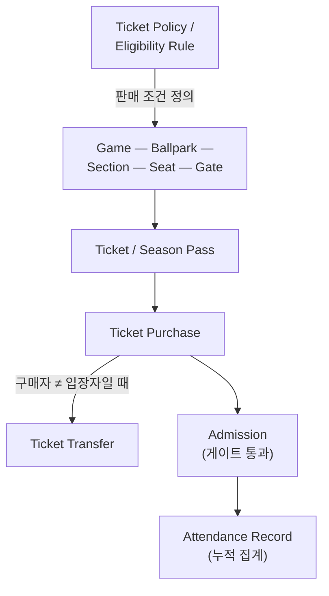

### Operations 축 — 구단이 파는 것 (② 멤버십·굿즈·혜택)

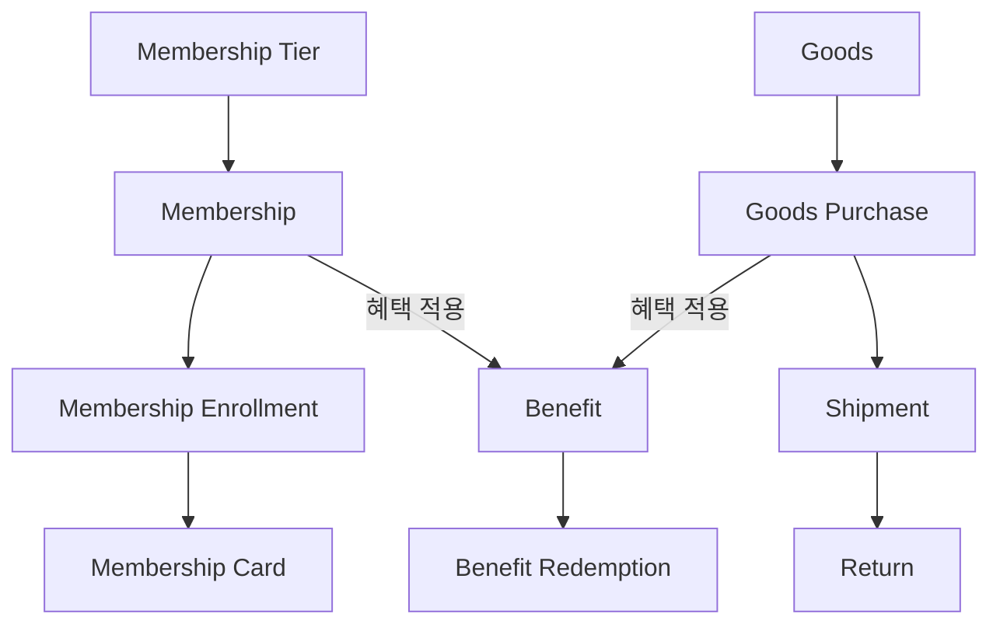

### Fan 축 — 팬이 누구고, 무엇을 좋아하는가

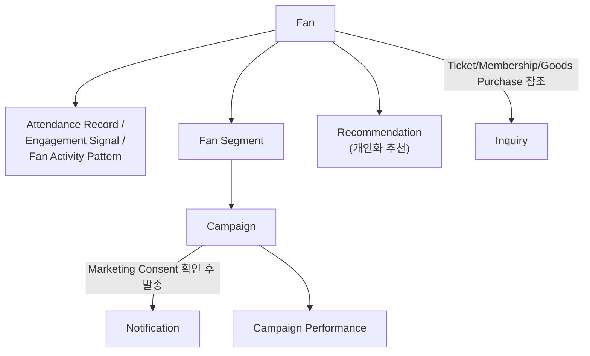

### Partnership 축 — 외부 조직과의 관계

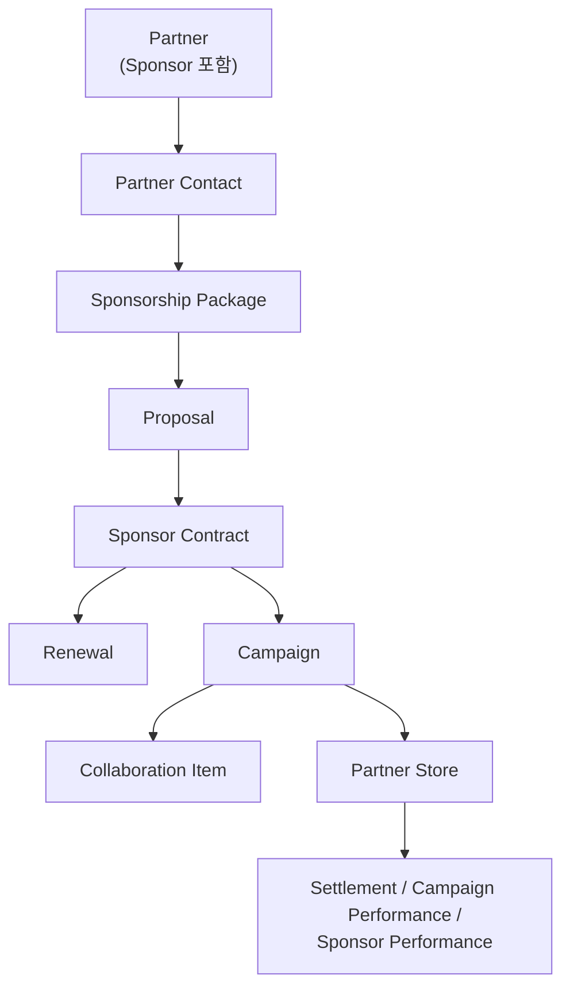

### [P2] Partnership 축 — Phase 2 확장: Fan Insight → 기업 Matching → Outbound Lead

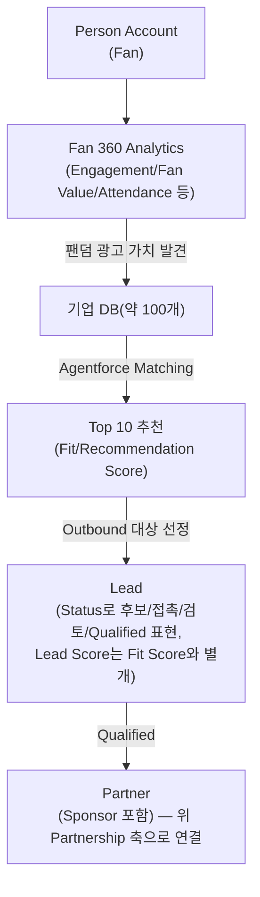

> 이 다이어그램은 위 Partnership 축의 시작점(`Partner`) **앞에 붙는** 새로운 흐름이다. 기존
> Partnership 축 다이어그램은 수정하지 않는다.

**Workflow가 새로 확인해준 관계:**

- `Inquiry`는 이제 Case 그 자체로 끝나지 않고, 반드시 `Ticket Purchase` / `Membership Enrollment` /
  `Goods Purchase` 중 하나를 참조해야 한다 — 고객지원 Workflow의 "유형별 처리" 단계가 이걸 명시한다.
- `Campaign`은 `Fan Segment`(누구에게)와 `Marketing Consent`(보내도 되는지)를 모두 거쳐야 `Notification`이
  나간다 — 마케팅 Workflow의 "발송 대상 확정" 단계가 이 순서를 강제한다.
- `Benefit`은 한 곳에서 발급되고 다른 상황(멤버십/굿즈/스폰서 캠페인)에서 쓰일 수 있다 — 발급 주체와
  사용 주체가 다를 수 있다는 뜻이므로, `Benefit`과 `Benefit Redemption`을 분리해야 한다.

---

## 6. Salesforce Mapping

### 6.1 전체 매핑 표

| Business Entity | Salesforce Object 제안 |
|---|---|
| Fan | Person Account (§6.2 참조 — 결정 근거) |
| Player | Contact (RecordType으로 구분) |
| Staff | User |
| Partner Contact | Contact |
| Cloud Alpacas | (내부 조직, 레코드 불필요) |
| Sponsor / Partner | Account |
| Ticket / Season Pass / Membership / Goods / Collaboration Item / Benefit | Custom Object 또는 Standard Product2 (§6.3) |
| Ticket Policy / Membership Tier / Sponsorship Package | Custom Object (Price Book/Price Book Entry로 대체 가능 — §6.3과 함께 검토) |
| Eligibility Rule | Custom Object 또는 Validation Rule/Flow 로직 (§6.4) |
| Season | Custom Object (`Season__c`, `Game__c`의 Master-Detail 부모 — `05_DECISIONS.md` Decision 011) |
| Game | Custom Object |
| Campaign / Fan Meeting | Standard Campaign |
| Ticket Purchase / Goods Purchase / Membership Enrollment | Standard Order 또는 Opportunity (§6.5) |
| Ticket Transfer | Ticket의 필드 또는 별도 Custom Object (§6.6) |
| Admission | Custom Object |
| Shipment / Return | Custom Object |
| Benefit Redemption | Custom Object |
| Renewal | Custom Object 또는 기존 Contract/Enrollment의 상태 변경 (§6.7) |
| Proposal | Standard Opportunity (계약 전 단계) |
| **[P2] Lead** | **Standard Lead 확정**(`05_DECISIONS.md` Decision 018-A) — Status로 후보/접촉/검토/Qualified 단계 표현, 정확한 Status Label은 TBD |
| **[P2] Collaboration** | **Campaign Record Type으로 구현 확정**(`05_DECISIONS.md` Decision 018-D) — 별도 Object 아님. Sponsorship Opportunity가 성사된 뒤 필요 시 실행하는 수단이며, Phase 2 B2B Sales Pipeline의 중심 Entity는 아니다(§2.7, §8) |
| Sponsor Contract | Standard Contract |
| Settlement | Custom Object |
| Ballpark / Section / Gate | Custom Object |
| Seat | Custom Object (Ballpark/Section 하위) |
| Partner Store | Account(RecordType) 또는 Custom Object (§6.8) |
| Inquiry | Standard Case |
| Notification / Marketing Message | Campaign Member/Message 또는 Custom Object |
| Marketing Consent | Contact/Person Account의 필드 또는 별도 Custom Object (§6.9) |
| Attendance Record / Fan Activity Pattern / Recommendation | Custom Object 또는 Report/Dashboard 기반 집계 (§6.7 로직과 동일한 판단 기준) |
| Fan Segment | Custom Object 또는 List View/Report 기반(비저장) (§6.10) |
| Campaign Performance / Sponsor Performance | Report/Dashboard 기반 |

*Field 정의는 이후 `03_SYSTEM.md` 단계에서 진행한다.*

---

### 6.2 Fan — Contact vs Person Account

> **왜 두 선택지가 존재하나?** Salesforce의 "사람"을 표현하는 기본 방법은 원래 두 개다. B2B(기업 고객)를
> 다루는 조직은 `Account`(회사) 아래에 `Contact`(그 회사 담당자)를 붙이는 구조를 쓴다. B2C(개인 고객)를
> 다루는 조직은 `Account`가 필요 없는데도 구조상 강제로 있어야 해서, `Person Account`라는 "개인을 위한
> 특수 Account"를 쓴다.

**선택 1. Contact**
- 장점: 기본 기능이라 별도 설정(Person Account 활성화)이 필요 없다. B2B 파트너(스폰서 담당자 등)와
  일관된 구조를 쓸 수 있다.
- 단점: Fan은 회사가 아니라 개인인데, 구조상 소속될 Account(회사)가 필요하다는 게 어색하다.
- 언제 사용하는가: 고객이 대부분 "회사"이고, 개인은 그 회사의 담당자로만 존재할 때 (예: B2B 영업 CRM).

**선택 2. Person Account**
- 장점: Account가 곧 개인이 되므로, Fan 한 명 = 레코드 한 개로 자연스럽게 표현된다. 구매 이력, 계약
  등 Account 레벨 기능을 개인에게 그대로 쓸 수 있다.
- 단점: 조직에서 한 번 켜면 되돌릴 수 없는 설정(Feature)이라 신중해야 한다. 일부 표준 기능·리포트가
  Account/Contact를 나눠서 가정하고 만들어져 있어 혼동을 줄 수 있다.
- 언제 사용하는가: 고객이 대부분 "개인"이고, 그 개인이 직접 구매·이용의 주체일 때 (예: 커머스, 멤버십
  기반 서비스).

**우리 프로젝트에서 고민해야 하는 점**

Cloud Alpacas CRM은 Fan(개인)이 압도적으로 많고, 회사 소속과 무관하게 직접 티켓을 사고 멤버십에
가입한다 — 전형적인 B2C 패턴이다. 반면 Sponsor/Partner처럼 B2B 관계도 동시에 존재한다(Partner
Contact가 소속된 Account). 두 성격이 한 Org 안에 공존할 때 Person Account를 쓰면 "Fan은
Person Account, Sponsor는 일반 Account + Contact"처럼 같은 Account 오브젝트 안에 서로 다른
레코드 타입이 섞인다 — 이게 팀에게 자연스러운지, 아니면 혼란스러운지가 판단 기준이다. (현재
표에는 "결정됨"으로 표시했으나, 이 비교는 그 결정이 왜 합리적인지 팀이 함께 이해하기 위해 남겨둔다.)

---

### 6.3 Product 계열(Ticket/Membership/Goods/Benefit 등) — Custom Object vs Standard Product2

**선택 1. Custom Object**
- 장점: 우리 도메인에 맞는 필드(좌석 등급, 멤버십 혜택 등)를 자유롭게 설계할 수 있다. 처음 배우는
  입장에서 구조가 단순해서 이해하기 쉽다.
- 단점: 가격표(Price Book), 견적(Quote) 같은 Salesforce의 판매 관련 표준 기능과 자동으로 연결되지 않는다.
- 언제 사용하는가: 표준 판매 프로세스(견적서, 가격 승인 등)를 쓸 계획이 없고, 우리만의 상품 구조가
  명확할 때.

**선택 2. Standard Product2 (+ Price Book)**
- 장점: 가격 정책(Ticket Policy에 해당하는 개념)을 Price Book/Price Book Entry로 표준 기능으로
  관리할 수 있다. Opportunity/Order와 자동으로 연결된다.
- 단점: Price Book 구조가 처음 보면 개념이 하나 더 늘어나 복잡하게 느껴진다. 좌석 등급처럼 우리
  도메인 특수 필드를 넣으려면 결국 확장이 필요하다.
- 언제 사용하는가: Ticket Purchase/Goods Purchase를 Order나 Opportunity로 만들 계획이 있고(§6.5),
  가격 정책을 표준 기능으로 관리하고 싶을 때.

**우리 프로젝트에서 고민해야 하는 점**

이 선택은 §6.5(Ticket Purchase를 Order로 할지 Opportunity로 할지)와 묶어서 결정하는 게 좋다.
거래를 표준 Order/Opportunity로 만들기로 하면 Product2를 쓰는 게 자연스럽게 이어지고, 거래도
Custom Object로 만들기로 하면 상품도 Custom Object로 통일하는 게 관리가 쉽다.

---

### 6.4 Eligibility Rule — Custom Object vs Validation Rule/Flow 로직

> **초보자를 위한 예시:** "학생 할인은 학생증이 있어야 받을 수 있다"는 규칙이 있다고 하자. 이걸
> ① "학생 할인 자격"이라는 표(레코드)를 만들어서 관리할 수도 있고, ② 그냥 Flow 안에 "이 조건이면
> 할인 적용"이라는 로직으로만 넣고 별도 표는 안 만들 수도 있다.

**선택 1. Custom Object로 저장**
- 장점: "어떤 자격 규칙들이 있는지" 목록으로 한눈에 볼 수 있고, 규칙이 많아지거나 자주 바뀔 때
  코드/Flow를 건드리지 않고 데이터만 추가·수정하면 된다.
- 단점: 규칙을 해석해서 실제로 "적용"하는 로직은 결국 Flow/Apex가 따로 필요하다 — Object만 만든다고
  자동으로 동작하지 않는다.
- 언제 사용하는가: 자격 조건의 종류가 많고, 비개발자(Admin)가 계속 새 규칙을 추가해야 할 때.

**선택 2. Validation Rule / Flow 로직으로만 존재 (별도 저장 없음)**
- 장점: 구조가 단순하다. 규칙이 몇 개 안 되면 굳이 표로 관리할 필요가 없다.
- 단점: 규칙이 늘어나면 Flow가 점점 복잡해지고, "지금 어떤 규칙이 있는지" 확인하려면 Flow를
  직접 열어봐야 한다.
- 언제 사용하는가: 자격 조건이 몇 가지로 고정되어 있고, 자주 안 바뀔 때 (예: MVP 단계).

**우리 프로젝트에서 고민해야 하는 점**

지금 단계(설계 초기, Demo 목표)에서는 자격 조건 종류가 많지 않을 가능성이 높다 — 이 경우
"일단 Flow 로직으로 시작하고, 나중에 규칙이 늘어나면 Object로 승격"하는 것도 합리적인 선택이다.
반대로 "선예매/학생/시즌권 보유자 할인" 등 조합이 이미 여러 개라면 처음부터 Object로 만드는 게
관리가 쉽다.

---

### 6.5 Ticket Purchase / Goods Purchase / Membership Enrollment — Order vs Opportunity

**선택 1. Standard Order**
- 장점: "이미 확정된 거래"를 표현하는 표준 오브젝트다. 수량, 상품, 금액을 Product2와 자연스럽게
  연결한다. 이커머스/구독 성격의 반복 구매에 적합하다.
- 단점: 영업 파이프라인(협상 중, 제안 중 같은 단계) 개념이 약하다 — 원래 "이미 결정된 주문"을 위한
  오브젝트이기 때문이다.
- 언제 사용하는가: 팬이 스스로 결제까지 끝내는 셀프서비스형 거래(티켓 예매, 굿즈 주문처럼 협상 없이
  바로 사는 경우)에 적합하다.

**선택 2. Standard Opportunity**
- 장점: "진행 중인 단계"(문의→검토→계약)를 표현하는 데 강하다. 리포트/대시보드에서 매출 예측
  기능과 잘 맞는다.
- 단점: 원래 B2B 영업(영업사원이 딜을 진행시키는 상황)을 가정한 오브젝트라, "팬이 앱에서 즉시 결제"
  같은 상황에는 개념이 과하게 무겁다.
- 언제 사용하는가: 사람이 개입해서 단계별로 진행시키는 거래(예: 스폰서십 계약, 대량 단체 티켓 협상)에
  적합하다.

**우리 프로젝트에서 고민해야 하는 점**

Ticket Purchase/Goods Purchase/Membership Enrollment는 팬이 스스로 즉시 결제를 끝내는 셀프서비스형
거래에 가깝다 — Order 쪽에 더 잘 맞는 성격이다. 반면 §6.5와 별개로, 스폰서십의 `Proposal`은 사람이
단계별로 진행시키는 B2B 딜이라 Opportunity가 자연스럽다(§6.1 표에도 그렇게 표시했다). "팬 거래는
전부 같은 방식으로 통일해야 하는가, 아니면 거래 성격에 따라 다른 Object를 써도 되는가"가 팀이
결정할 지점이다.

---

### 6.6 Ticket Transfer — Ticket 필드 vs 별도 Custom Object

**선택 1. Ticket(또는 Ticket Purchase)의 필드로 처리** (예: "양도받은 사람" 필드)
- 장점: 구조가 단순하다. "지금 이 티켓의 최종 소유자가 누구인지"만 알면 될 때 충분하다.
- 단점: 한 티켓이 여러 번 양도될 경우(A→B→C) 중간 이력이 사라진다. "누가 양도 오류를 신고했는지"
  같은 CS 처리에 필요한 히스토리를 재구성할 수 없다.
- 언제 사용하는가: 양도가 드물게 일어나고, 최종 소유자만 알면 충분할 때.

**선택 2. 별도 Custom Object (Transfer 이력 기록)**
- 장점: 몇 번 양도됐는지, 언제 누구에게 넘어갔는지 전체 이력을 남길 수 있다. 티켓 Workflow의
  "문제 처리(양도 오류)" 단계를 지원하기 쉽다.
- 단점: Object가 하나 더 늘어난다 — 관리 포인트가 늘어난다는 뜻이다.
- 언제 사용하는가: 양도가 자주 일어나고, CS가 양도 관련 문의를 자주 처리해야 할 때.

**우리 프로젝트에서 고민해야 하는 점**

티켓팀 Workflow는 "선물·양도"를 "문제 처리(양도 오류)"와 별도 단계로 명시하고 있다 — 즉 양도가
CS 이슈로 이어질 수 있다는 뜻이다. 이 빈도가 높다고 예상되면 선택 2가, Demo 범위 안에서는 단순
표시로 충분하다면 선택 1이 맞다.

---

### 6.7 Renewal / Attendance Record / Fan Activity Pattern / Recommendation — 저장 vs 계산

이 넷은 공통된 질문을 갖는다: **"이 정보를 레코드로 저장해둘 것인가, 아니면 필요할 때마다
계산해서 보여줄 것인가?"**

**선택 1. Custom Object로 저장**
- 장점: 언제 그 판단(예: "이 팬은 이탈 위험군이다")이 내려졌는지 시점을 남길 수 있다. Flow가 이
  레코드를 트리거로 삼아 후속 액션(알림 발송 등)을 자동으로 실행하기 쉽다.
- 단점: 원본 데이터(Admission, Ticket Purchase 등)가 바뀌어도 저장된 값은 자동으로 갱신되지 않는다
  — 별도로 재계산하는 로직이 필요하다.
- 언제 사용하는가: 그 시점의 판단을 근거로 자동화(알림, 캠페인 트리거)를 실행해야 할 때.

**선택 2. Report/Dashboard 또는 Flow로 그때그때 계산 (비저장)**
- 장점: 항상 최신 데이터 기준으로 정확하다. 별도 Object 없이 원본 데이터만으로 충분하다.
- 단점: "그 시점에 어떤 판단이었는지" 이력을 남길 수 없다. 복잡한 계산은 Report만으로 표현하기
  어려울 수 있다.
- 언제 사용하는가: 실시간 확인용 대시보드로만 쓰고, 이 값을 근거로 자동화를 실행할 계획이 없을 때.

**우리 프로젝트에서 고민해야 하는 점**

`00_STORY.md`처럼 "장기간 활동이 없다가 갑자기 이탈 신호가 감지되어 시스템이 메시지를 자동 발송"하는
시나리오를 생각하면, 이 판단이 **자동화(Notification 발송)의 트리거**로 쓰인다 — 이건 선택 1(저장)
쪽에 힘을 싣는 근거다. 반대로 단순히 "관리자가 대시보드에서 훑어보는" 용도라면 선택 2로 충분하다.
Renewal도 같은 기준으로 판단하면 된다 — 갱신 임박을 이유로 자동 알림을 보낼 계획이면 저장, 관리자가
리포트로 확인만 하면 된다면 비저장.

---

### 6.8 Partner Store — Account(RecordType) vs Custom Object

**선택 1. Account (RecordType으로 구분)**
- 장점: Partner(협업사)와 Partner Store(그 협업사의 매장)를 Account-Account 관계
  (Parent Account)로 자연스럽게 표현할 수 있다. Contact, Opportunity 등 표준 관계 기능을 그대로 쓴다.
- 단점: 매장 고유 정보(주소, 매장 유형)를 담다 보면 Account 표준 필드와 안 맞는 부분이 생길 수 있다.
- 언제 사용하는가: Partner Store가 "협업사 소속의 한 위치"라는 관계가 중요할 때.

**선택 2. Custom Object**
- 장점: 매장 전용 필드(위치, 운영시간 등)를 자유롭게 설계할 수 있다.
- 단점: Partner(Account)와의 관계를 Lookup으로 별도 연결해야 하고, Account가 기본 제공하는 계층
  구조·공유 규칙을 그대로 못 쓴다.
- 언제 사용하는가: 매장 수가 많고 매장 고유 데이터가 복잡할 때.

**우리 프로젝트에서 고민해야 하는 점**

Partner Store가 등장하는 이유(B2B 콜라보 — "이 상품을 산 사람이 경기장에도 왔는가")를 생각하면,
핵심은 "이 매장이 어느 Partner 소속인가"라는 관계다. 관계가 핵심이면 선택 1이, 매장 자체의 운영
데이터가 더 중요해지면 선택 2가 맞다.

---

### 6.9 Marketing Consent — 필드 vs 별도 Object

**선택 1. Contact/Person Account의 필드** (예: "이메일 수신 동의" 체크박스)
- 장점: 가장 단순하다. 확인할 때 Fan 레코드 하나만 보면 된다.
- 단점: 채널(이메일/SMS/앱푸시)마다 동의 여부가 다르면 필드가 계속 늘어난다. "언제 동의했는지,
  언제 철회했는지" 이력을 남기기 어렵다.
- 언제 사용하는가: 채널이 하나뿐이거나, 이력 추적이 중요하지 않을 때.

**선택 2. 별도 Custom Object** (채널별 동의 이력)
- 장점: 채널별로 여러 건을 가질 수 있고, 동의/철회 시점을 이력으로 남길 수 있다 — 나중에
  "왜 이 사람에게 메시지를 보냈는지" 근거가 필요할 때 중요하다.
- 단점: Object가 늘어나고, 발송 전 확인 로직이 한 단계 더 필요하다.
- 언제 사용하는가: 채널이 여러 개이고, 동의 이력을 감사(audit) 목적으로 남겨야 할 때.

**우리 프로젝트에서 고민해야 하는 점**

Demo 범위에서는 채널이 단순할 가능성이 높아 필드로 시작해도 충분할 수 있다. 다만 마케팅 Workflow가
"발송 대상 확정" 단계에서 이걸 명시적으로 확인하도록 되어 있으므로, 최소한 "이 팬에게 지금 보내도
되는지"를 판단할 수 있는 필드 하나는 반드시 있어야 한다 — Object로 만들지 여부는 이력 추적이
얼마나 중요한지에 달려 있다.

---

### 6.10 Fan Segment — Custom Object vs List View/Report(비저장)

**선택 1. Custom Object로 저장**
- 장점: "이 세그먼트에 어떤 팬이 왜 포함됐는지"를 시점 고정해서 남길 수 있다. Campaign이 이
  세그먼트를 반복해서 재사용하거나, 다른 팀도 참조하기 쉽다.
- 단점: 원본 데이터가 바뀌면 세그먼트 멤버도 다시 갱신해줘야 한다(자동화 필요).
- 언제 사용하는가: 같은 세그먼트를 여러 캠페인에서 반복 사용하거나, "그때 이 세그먼트에 누가
  있었는지" 기록이 중요할 때.

**선택 2. List View 또는 Report 기반 (그때그때 조건으로 걸러서 확인, 비저장)**
- 장점: 별도 Object 없이 항상 최신 조건으로 대상을 뽑을 수 있다. 설정이 간단하다.
- 단점: 캠페인 발송 시점의 "확정된 대상 목록"을 별도로 남기지 않으면, 나중에 "그때 누구에게
  보냈는지" 재구성하기 어렵다.
- 언제 사용하는가: 세그먼트가 거의 매번 새로 정의되고, 재사용이나 이력 추적이 중요하지 않을 때.

**우리 프로젝트에서 고민해야 하는 점**

마케팅 Workflow는 "대상 세분화"와 "발송 대상 확정"을 별개 단계로 나눈다 — 세분화(넓은 후보군)와
확정(실제 발송 리스트)이 다르다는 뜻이다. 이 둘을 모두 저장할지, 확정 단계만 저장할지(세분화는
Report로 훑어보고 최종 확정 리스트만 Object로 남기기)도 팀이 고를 수 있는 절충안이다.

### 6.11 [P2] Lead vs Proposal — Phase 2 B2B Business 관점 재검토

> 이 섹션은 §6.2~6.10과 형식은 같지만 성격이 다르다 — 기존 Object를 새로 고르는 것이 아니라,
> **새로 필요해진 개념(Lead)이 기존 개념(Proposal)과 어떻게 다른지**를 Business 관점에서 정리한
> 것이다. Salesforce Object 구현은 확정하지 않는다.

**기존 이해 (§2.6, §6.1)**

Proposal은 "계약 전 제안 기록"으로, 이미 접촉·관계가 있는 상대에게 제안서를 보내는 단계였다.
Salesforce Mapping도 이미 Proposal → Opportunity로 제안되어 있었다 — 즉 Proposal은 사실상
협상 진행 중인 Opportunity의 다른 이름에 가까웠다.

**Phase 2에서 드러난 공백**

`00_STORY.md` §8 Phase 2 Story는 "아직 아무 관계도 없는 잠재 기업을 Fan 데이터로 세운 가설로
처음 찾아내는" 단계에서 시작한다. 이 단계는 기존 Proposal/Opportunity가 다루지 않던 영역이다 —
Opportunity는 "진행 중인 딜"을 표현하는 데 강하지만, "아직 딜이 아닌, 검증 전 가설 단계 후보"를
표현하기엔 무겁다(§6.5의 Opportunity 성격 설명과 같은 이유).

**재정의 (2026-08-18 멘토링으로 Lead 개념 재확인 — `05_DECISIONS.md` Decision 019)**

- **Lead** = Agentforce가 기업 DB(약 100개)에서 추천한 후보 중, **실제 Outbound 영업 대상으로
  선정된** 잠재 스폰서/광고주. Fan Insight → 기업 DB → Agentforce Matching(§2.7)을 거쳐 나온다.
  **단순한 "추천 기업 목록"이 아니다** — Agentforce의 추천 자체는 아직 Lead가 아니고, 영업
  대상으로 선정되어 Lead Status가 부여된 순간부터 Lead다.
- **Fan Fit/Recommendation Score(Agentforce) ≠ Lead Score**: 이 둘을 같은 의미로 혼용하지
  않는다.
  - Fan Fit/Recommendation Score = "우리 팬덤과 이 기업이 잘 맞는가"(Fan 360 데이터 기반,
    Agentforce가 산출)
  - Lead Score = "이 Lead가 실제 계약까지 이어질 가능성이 높은가"(담당자 의사결정 권한,
    직무/역할, 접촉 이력, 메시지/미팅 반응, 예산/구매 가능성 등 실제 영업 활동 기반)
  - 두 값 모두 Lead 레코드와 관련될 수 있지만, 산출 시점과 근거가 다른 별개의 축이다.
- **Proposal** = Lead가 아니다. 실제 접촉이 성사되어 Opportunity가 진행되는 동안 오가는 제안 내용(문서/활동)이며, 기존 정의(§2.6·§6.1)를 그대로 유지한다.
- **Opportunity** = 성사 여부를 다투는 협상 단계(예: Advertising Sponsorship, F&B Partnership, Campaign Partnership).
- **Collaboration** = Opportunity가 Won된 뒤 필요 시 실행하는 활동. §3.3의 기존 결정("Collaboration Campaign → Campaign으로 통합")과 연결되며, Campaign Record Type으로 확정됐다(Decision 018-D). 다만 Phase 2 B2B Sales Pipeline의 중심 개념은 아니다 — 중심은 Opportunity → Sponsorship Package/Quote → Contract/Revenue다.

**우리 프로젝트에서 고민해야 하는 점(2026-08-18 회의로 대부분 해결됨)**

2026-08-18 Technical Decision 회의에서 Lead는 **표준 Lead Object**로(Status 세분화로
Partner Candidate까지 흡수), Collaboration은 **Campaign의 Record Type**으로 구현하기로
확정했다(`03_SYSTEM.md` §7.2 A·D, `05_DECISIONS.md` Decision 018-A·D) — Decision 003의
"Standard First, Custom When Needed" 원칙을 그대로 적용한 결과다.

> **TBD / Team Decision Needed (남은 것)**
> - Lead Status의 정확한 Picklist Label(Candidate 단계를 어떤 값으로 표현할지)
> - Business Fit 가설을 어떤 데이터(Fan Segment/Engagement/Fan Value 등)로 판단할지 —
>   Decision 009가 제안했던 "마케팅 발송 대상 그룹" 개념이 아직 구현되지 않았다는 점도
>   함께 고려해야 한다.

---

## 7. 마무리 — Business → Domain → Salesforce 사고 흐름 요약

이번 개정은 세 가지를 확인했다.

1. **Workflow는 Story가 놓친 명사를 드러낸다.** Fan Segment, Marketing Consent, Ticket Policy,
   Eligibility Rule, Admission, Shipment, Return, Proposal, Sponsorship Package 등은 특정 인물의
   이야기에는 없었지만, 실제 업무 절차에는 반드시 필요한 개념이다.
2. **Workflow는 Story가 과하게 나눈 명사를 정리해준다.** Promotion과 Collaboration Campaign은
   업무상 같은 절차를 따르므로 Campaign 하나로 합쳤고, Licensor/License Contract는 Sponsor/Partner
   프로세스와 다르지 않아 별도 Entity를 없앴다.
3. **Entity를 만드는 것과 Salesforce Object로 구현하는 것은 다른 결정이다.** "업무에 명사로
   등장한다"는 것이 자동으로 "Custom Object가 필요하다"를 뜻하지 않는다(§3.4, §6의 각 비교).
   이 판단은 "이 정보가 자기만의 생애주기·이력을 갖는가", "이 정보를 근거로 자동화를 실행할
   것인가"라는 두 가지 질문으로 나눠서 팀이 결정하면 된다.

다음 단계(`03_SYSTEM.md` — Salesforce Object, Data Model, Architecture, ERD, Flow)로 넘어가기 전에,
§6의 각 "우리 프로젝트에서 고민해야 하는 점"에 대한 팀의 판단을 먼저 확정하는 것을 권한다 — 특히
§6.5(Order vs Opportunity)와 §6.3(Product2 여부)은 서로 연결되어 있어 함께 결정하는 것이 좋다.

---

## 8. [P2] Phase 2 — B2B Sponsorship Sales Business Workflow

> **2026-08-18 멘토링으로 이 섹션 전체가 갱신됐다**(`05_DECISIONS.md` Decision 019). 이
> 섹션은 §1~§7(Phase 1 B2C 중심 분석)을 대체하지 않는다. `00_STORY.md` §8/§9의 Phase 2
> Story를 Business → Domain → Workflow 수준으로 구체화한 것이며, Salesforce Object/Field
> 설계는 다루지 않는다(→ `03_SYSTEM.md`). B2B는 별도의 독립 CRM이 아니라 **기존 Fan 360을
> Sponsorship Sales에 활용하는 확장**이다:
>
> **B2C Fan Activity → Fan 360 Insight → B2B Sponsorship Sales Decision**

### 8.1 Business Workflow 표

| 단계 | Business Question | 담당자 | Input | Action | Output | 다음 단계 |
|---|---|---|---|---|---|---|
| 1. Fan Insight | 우리 팬은 누구이고 어떤 광고 가치를 가지는가? | 이 매니저 | Fan 360 데이터(Engagement, Fan Value, 관람·구매 행동, 관심사 — §2.1~2.4의 기존 Fan 데이터를 그대로 활용) | 팬덤 광고 가치 분석 | 팬층 특성 인사이트(예: 뷰티/라이프스타일/F&B 관심) | 2 |
| 2. 기업 DB / Agentforce Matching | 이 팬덤과 광고 가치가 높은 기업은 어디인가? | Agentforce | 팬층 특성 인사이트 + 기업 DB(약 100개) | Fit Matching → Top 10 추천 + Recommendation Reason | 추천 후보 목록(Fit/Recommendation Score, 아직 Lead 아님) | 3 |
| 3. Outbound Lead 선정 | 이 추천 후보 중 실제 영업을 시작할 곳은 어디인가? | 이 매니저 | 추천 후보 목록 | 우선순위 판단, Outbound 접촉 시도 | Lead(§4·§6.11 — 표준 Lead Object 확정, Status Label TBD) | 4 |
| 4. Lead Qualification / Lead Score | 이 Lead가 실제 계약까지 이어질 가능성이 높은가? | 이 매니저 | 접촉 이력, 담당자 반응, 예산 정보 등 | 실제 영업 활동 기반 Lead Score 평가(Agentforce Fit Score와 별개, §6.11) | Qualified Lead | 5 (Qualified 시) |
| 5. Account / Contact | 누구를 상대로 논의를 이어가는가? | 이 매니저 | Qualified Lead | 기업/담당자 정보 관리(Lead Convert) | Sponsor/Partner(§4 기존) + Partner Contact(§4 기존) | 6 |
| 6. Opportunity | 실제로 스폰서십을 추진할 것인가? | 이 매니저 | Account/Contact | 제안 논의·조건 협상 | Opportunity(예: Advertising Sponsorship, F&B Partnership) Won/Lost | 7 (Won 시) |
| 7. Sponsorship Package / Quote / Negotiation | 무엇을, 얼마에 판매하는가? | 이 매니저 | 성사 중인 Opportunity | Sponsorship Package(구장 광고, 전광판/펜스 광고, SNS 노출, Brand Day 등) 제안, 협상 | Quote, Closed Won/Lost | 8 (Won 시) |
| 8. Contract / Sponsorship Revenue | 계약이 실제 매출로 이어졌는가? | 이 매니저 | Closed Won Opportunity | 계약 체결 | Sponsor Contract(§4 기존), Revenue 발생 | 9 |
| 9. Pipeline / Revenue Dashboard | 목표 매출 대비 얼마나 부족한가? | 이 매니저 | 전체 Opportunity/Contract 현황 | Pipeline·Stage별 현황, 목표 대비 부족 금액 확인 | 추가 Outbound 필요 여부 판단(2단계로 순환) | Future: Performance/Evaluation |

> Collaboration(공동 캠페인·굿즈·이벤트 등)은 6~7단계 사이에서 Opportunity Won 이후
> 실행 수단으로 필요하면 쓰일 수 있다(Campaign Record Type, Decision 018-D) — 다만 이
> 표에서 별도 필수 단계로 명시하지 않는다. Phase 2 Sales Pipeline의 중심은 Opportunity →
> Sponsorship Package/Quote → Contract/Revenue다.

### 8.2 이 표가 기존 §2.6/§4/§5/§6과 맺는 관계

- **1~4단계**(Fan Insight → 기업 DB/Agentforce Matching → Outbound Lead → Lead Qualification)는 §2.6에 없던 새로운 앞단계다(§2.7에서 다이어그램으로 표현).
- **5~8단계**(Account/Contact → Opportunity → Sponsorship Package/Quote → Contract)는 §2.6·§4·§6.1의 기존 Entity(Sponsor, Partner, Partner Contact, Sponsorship Package, Sponsor Contract)를 그대로 재사용한다(§6.11에서 재정의한 대로).
- 9단계(Pipeline/Revenue Dashboard)는 새로 추가된 관점이다 — 개별 Opportunity가 아니라 **전체 현황을 집계해서 보는** 단계이며, Salesforce 구현은 Report/Dashboard 기반으로 검토한다(`03_SYSTEM.md` §7).
- 이 표는 "이 매니저가 실제 업무에서 무엇을 하는가"를 Business 언어로 보여주는 것이 목적이며, Salesforce 기능명을 기준으로 작성하지 않았다.

### 8.3 아직 확정하지 않은 것

§6.11의 TBD 목록과 동일하다 — Lead Status의 정확한 Picklist Label, 팬덤 광고 가치 판단에
쓸 실제 Fan 데이터 항목, 기업 DB(약 100개)의 Salesforce 구현 형태, Pipeline/Revenue
Dashboard의 구체적인 지표·계산식. Lead/Collaboration의 Object 구현 여부 자체는
2026-08-18 Technical Decision 회의로 확정됐다(`03_SYSTEM.md` §7.2 A·D,
`05_DECISIONS.md` Decision 018-A·D). 남은 판단들은 `03_SYSTEM.md`·`05_DECISIONS.md`에서
팀이 계속 확정한다.

> **구현 범위**: 위 표의 1~6단계(Fan Insight → 기업 DB/Agentforce Matching → Outbound
> Lead → Lead Qualification → Account/Contact → Opportunity)까지가 핵심 구현 범위이며,
> 7~8단계(Sponsorship Package/Quote/Negotiation, Contract)까지 이어지는 것이 Phase 2
> Demo 목표다(`00_STORY.md` §7, `04_DEMO.md` §7). 계약 이후 성과 분석·재검토·장기
> 재계약(9단계 이후)은 Future Scope다(`00_STORY.md` §8.4).