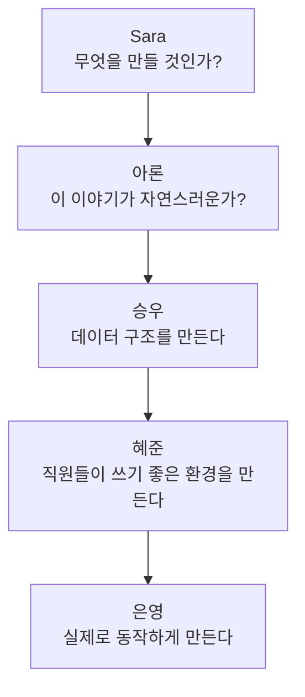
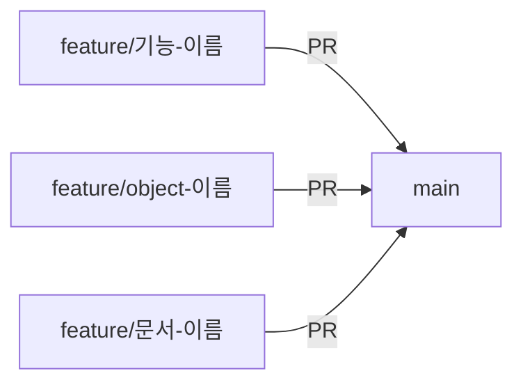
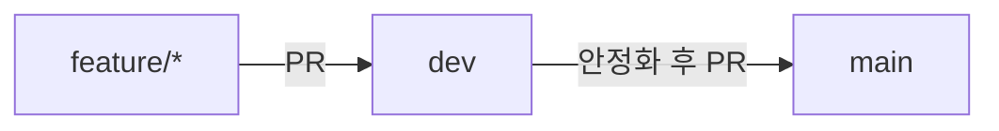
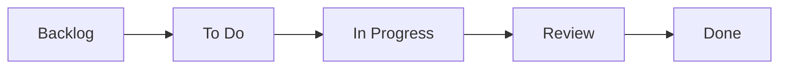

# 02_TEAM_GUIDE.md — Cellsforce 팀 운영 가이드

> 이 문서는 팀 운영 방식, GitHub Projects 활용법, Git/Slack Convention, 팀원 역할 정의를
> 다룬다. **팀원 역할 정의의 유일한 진실(Single Source of Truth)은 이 문서다** —
> `docs/members/*.md`(개인 온보딩 문서)는 이 문서가 정한 역할을 개인 관점에서 풀어
> 설명할 뿐이며, 역할이 바뀌면 이 문서를 먼저 고친 뒤 개인 문서를 맞춘다.
>
> Task, Sprint, 진행 상황, Bug는 문서가 아니라 **GitHub Projects**에서 관리한다
> (CLAUDE.md §7).

---

## 0. Team Mission

Cellsforce는 Cloud Alpacas(가상 구단)의 Fan Relationship Management(FRM) Team이
되어 Salesforce Customer 360을 만든다. Phase 1에서는 신규 팬을 이해하고 충성
팬으로 성장시키는 B2C Fan 360을, Phase 2에서는 그 Fan 360 데이터를 구단의 B2B
Sales(Sponsorship Sales Pipeline) 의사결정에 활용하는 것까지 확장한다
(`CLAUDE.md` §1~§2).

## 0-1. Project Phase

| Phase | 내용 | 상태 |
|---|---|---|
| Phase 1 | B2C Fan 360 MVP | [P1] 완료(~2026-08-14) |
| Phase 2 | B2C 고도화 + B2B Sales(Sponsorship) Expansion | [P2] 진행 중(2026-08-15~) |

자세한 범위는 `CLAUDE.md` §5(Source of Truth)를 따른다 — 이 문서에서 반복하지
않는다. 아래 §1~§2는 Phase 1 당시 확정한 역할 배정(History)이고, **현재 역할은
문서 말미의 §10~§17([P2])을 따른다.**

---

## 1. [P1] 팀원과 역할 (Phase 1 History)

| 담당자 | 역할 | 온보딩 문서 |
|---|---|---|
| Sara | PM / Solution Architect / Product Designer | [`members/00_SARA.md`](./members/00_SARA.md) |
| 승우 | Salesforce Builder | [`members/01_SEUNGWOO.md`](./members/01_SEUNGWOO.md) |
| 은영 | Developer Lead / Team Lead | [`members/02_EUNYEONG.md`](./members/02_EUNYEONG.md) |
| 혜준 | Salesforce Experience Lead / QA Lead | [`members/03_HYEJUNE.md`](./members/03_HYEJUNE.md) |
| 아론 | Business Analyst / Demo Experience Lead | [`members/04_AARON.md`](./members/04_AARON.md) |

각 역할이 프로젝트 전체에서 어떤 영역을 책임지는지는 아래와 같다. **구체적으로 어떤
Object/Flow/화면을 담당하는지**는 각자의 온보딩 문서(`docs/members/*.md`)에서 개인
관점으로 더 자세히 풀어 설명한다 — 아직 개인 문서가 작성되지 않았다면(CLAUDE.md §8
"이번 마지막 단계"), 이 표의 역할 정의를 기준으로 작성한다.

| 역할 | Mission | 책임 영역 |
|---|---|---|
| PM / Solution Architect / Product Designer | 어떤 자동차를 만들지 결정한다 | Business Goal·Persona·Domain Model 정의(00~01_PROJECT.md), Salesforce Object 설계 전체 방향(03_SYSTEM.md), 화면 UX, 프로젝트 문서(Source of Truth) 관리 |
| Business Analyst / Demo Experience Lead | 고객이 정말 원하는 자동차인지, 운전 경험이 자연스러운지 설계한다 | Happy Path 설계, Business Story 보완, Business Flow 검토, Demo Story(04_DEMO.md) 작성, Demo Experience 설계, Sample/Dummy Data 기획 |
| Salesforce Builder | 자동차의 프레임과 엔진을 만든다 | Object/Field/Relationship/Record Type/Validation Rule 설계, 핵심 Business Flow 구축, 실제 Org에 Metadata 구현 |
| Salesforce Experience Lead / QA Lead | 운전하기 편하도록 내부를 완성하고, 품질을 확인한다 | Permission Set·Sharing·Lightning App·Navigation·Dynamic Page·Report·Dashboard 구성(Platform), QA·UAT·배포 검증(Admin 운영) |
| Developer Lead / Team Lead | 자동차에 실제 기능을 넣는다 | Demo Fan App(`cloudalpacas-fan-app`) 개발, LWC/Apex 커스텀 개발(표준으로 안 될 때만), Salesforce API·Slack 연동 아키텍처, 팀 개발 일정 조율. Agentforce는 🔵 Future Scope(Decision 008) |

> **왜 Business Analyst를 "검증하는 사람"으로 설명하지 않나?** 아론은 완성된 결과를
> 검사하는 사람이 아니라, Sara·전체 팀과 함께 Customer Journey를 설계하고 Business
> Story를 다듬으며, Demo가 가장 자연스럽게 전달되도록 만드는 사람이다. Object나 Field를
> 먼저 찾지 않고 **Business Story를 먼저 만들고, 그 Story에 필요한 Object를 함께
> 찾는다** — 이 순서 자체가 CLAUDE.md §3 Business First 철학과 정확히 맞닿아 있다.

> **왜 혜준을 "Platform Lead"가 아니라 "Salesforce Experience Lead"로 부르나?** 혜준의
> 역할은 "Org 환경을 관리하는 사람"에 머무르지 않는다 — **완성된 Customer 360을 김매니저
> 같은 실제 직원이 편하게 쓸 수 있도록 만드는 사람**이다. 혜준은 Salesforce Admin
> 자격증을 보유하고 있어, 화면·권한 설계(Platform)뿐 아니라 QA·배포 같은 운영(Admin)
> 영역도 함께 담당한다.

> **왜 은영을 "연동 담당"이 아니라 "Developer Lead"로 다시 설명하나?** 은영의 역할을
> "Fan App 개발과 Salesforce 연동"으로만 설명하면, Developer Lead가 필요한 진짜 이유
> (표준 기능만으로 안 되는 부분을 코드로 만드는 것)가 가려진다. LWC·Apex·연동
> 아키텍처까지가 은영의 책임 범위다 — 다만 원칙은 항상 같다: **"Salesforce 표준
> 기능을 먼저 쓰고, 표준으로 안 될 때만 개발한다."** Decision 003이 Object에 적용한
> 원칙을 코드 레벨까지 확장한 것뿐이다(Decision 008). Agentforce는 CLAUDE.md §5에
> 따라 이번 MVP 범위 밖(🔵 Future Scope)이라, 은영의 장기 역할에는 포함하되 지금
> 만들지는 않는다.

---

## 1-1. [P1] 자동차 비유로 보는 팀 역할 (Phase 1 History)

Salesforce를 처음 접하는 사람도 한 번에 이해할 수 있도록, Cloud Alpacas라는 "자동차"를
함께 만든다고 생각해보자.

| 담당자 | 자동차 비유 | 실제 역할 |
|---|---|---|
| Sara | **어떤 자동차를 만들지 결정하는 사람** | PM / Solution Architect |
| 아론 | **고객이 정말 원하는 자동차인지, 운전 경험이 자연스러운지 설계하는 사람** | Business Analyst / Demo Experience Lead |
| 승우 | **자동차의 프레임과 엔진을 만드는 사람** | Salesforce Builder |
| 혜준 | **운전하기 편하도록 내부를 완성하고, 품질을 확인하는 사람** | Salesforce Experience Lead / QA |
| 은영 | **자동차에 실제 기능을 넣는 사람** | Developer |

---

## 1-2. [P1] 만드는 순서 — 이 흐름이 곧 Business First다 (Phase 1 History)

다섯 역할은 순서 없이 각자 흩어져 일하는 것이 아니라, 아래 순서로 서로 연결된다. 내
작업이 앞사람의 무엇을 이어받고, 뒷사람에게 무엇을 넘겨주는지 알면 "내 일이 왜
필요한지"가 훨씬 분명해진다.



> **왜 이 순서인가?** Salesforce 기능부터 만들면 나중에 "왜 이 Object가 필요한지"
> 설명할 수 없다(CLAUDE.md §3 Business First). 그래서 Business(Sara)와 Story(아론)가
> 먼저 확정되고, 그다음 그 Story에 필요한 데이터 구조(승우)가 만들어지고, 그 구조를
> 직원이 실제로 쓸 수 있는 화면·권한(혜준)으로 다듬고, 마지막으로 그 화면에 흘러들어갈
> 실제 이벤트 데이터를 은영이 Fan App으로 만들어낸다. 화살표가 거꾸로 가는 일(예: 승우가
> 먼저 Object를 만들고 나중에 왜 필요한지 찾는 것)은 이 프로젝트에서 지양한다.

---

## 2. [P1] Object / Flow / Screen 담당 (Phase 1 History)

> **이 표는 Phase 1 History다.** 03_SYSTEM.md의 Phase 1 Object 설계가 끝난 뒤, 각자의
> 역할에 맞춰 Claude가 제안했던 배정이며 Phase 1 MVP 구축에 실제로 쓰였다. **Phase 2
> 현재 배정은 §11을 따른다.**

| Object / Flow / Screen | 구축 담당 | 함께 하는 사람 |
|---|---|---|
| Person Account(Fan), Contact(Player), Product2, PricebookEntry | 승우 (Salesforce Builder) | Sara (설계 검토) |
| Order / OrderItem, Case | 승우 | — |
| `Game__c`, `Admission__c`, `Benefit__c` | 승우 | 은영 (Fan App에서 Admission 생성 연동) |
| `Notification_Log__c` | 승우 (구축) | 아론 (발송 콘텐츠 기획) |
| `Engagement_Signal__c` | 승우 (구축) | 은영 (Fan App 연동) |
| `Attendance_Record__c`, `Fan_Activity_Pattern__c` | 승우 (구축) | 혜준 (데이터 정합성 QA) |
| `Fan_Segment_History__c`, `Recommendation__c` | 승우 (구축) | 아론 (추천 로직·문구 기획) |
| Flow 전체(Welcome Campaign, VIP 후보 감지 등 — 03_SYSTEM.md §4) | 승우 | Sara (로직 설계), 아론 (NBA 문구) |
| Fan 360 Dashboard, Fan Profile, Fan Timeline, Recommendation Panel (화면) | Sara (UX 설계) | 혜준 (Lightning Page/Dynamic Page 구현 · QA), 승우 (Object/Field 데이터 연동 지원) |
| Slack 연동 아키텍처(App/Webhook/Payload) | 은영 (Decision 008) | 승우 (Flow에서 호출) |
| LWC(표준 컴포넌트로 부족할 때만) | 은영 (구현) | 혜준 (화면 레이아웃에 조립) |
| Apex(Flow로 안 될 때만 — 03_SYSTEM.md §4.6) | 은영 (구현) | 승우 (Flow와의 경계 판단) |
| Demo Fan App (`cloudalpacas-fan-app`) | 은영 | 아론 (Demo 시나리오 요구사항 전달) |
| Sample/Dummy Data (`docs/data/`) | 아론 | 혜준 (데이터 검증) |
| Sandbox/배포 환경 관리, QA | 혜준 | 승우 |

---

## 3. Repository 구조

Cloud Alpacas는 **역할이 다른 두 개의 Repository**를 쓴다.

| Repository | 담당 내용 |
|---|---|
| `CloudAlpacas` (이 저장소) | 프로젝트 문서(`docs/`), Salesforce Org Metadata(`force-app/`) |
| `cloudalpacas-fan-app` | Demo용 Fan App. Salesforce의 일부가 아니라, 티켓 구매·체크인·굿즈 구매 같은 이벤트를 만들어 Salesforce에 전달하는 **독립적인 Demo 채널**(CLAUDE.md §5)이다. API 또는 Dummy Data로 Salesforce와 연동한다. |

> **왜 저장소를 나누나?** Fan App은 이번 프로젝트의 주인공이 아니라 "데이터를 만들어주는
> 도구"다(CLAUDE.md §5). Salesforce Org(핵심 결과물)와 성격이 다른 코드를 한 저장소에
> 섞으면, 나중에 "이게 Customer 360의 일부인지 Demo 도구인지" 헷갈리기 쉽다.

---

## 4. 브랜치 전략

Baby Team이 처음부터 복잡한 Git Flow를 쓰기보다, **프로젝트 단계에 맞춰 전략도 함께
성장**시킨다.

### Phase 1 — MVP 개발 (~2026-08-14)



- `main`: 항상 발표 가능한 상태를 유지한다.
- `feature/*`: 기능·문서·Object·Flow 단위로 브랜치를 만든다 (예: `feature/fan-360-dashboard`,
  `feature/03-system-doc`).
- Pull Request를 통해서만 `main`으로 병합한다.

### Phase 2 — 고도화 (2026-08-15 ~)



- `main`: Demo·발표용 안정 버전만 유지한다.
- `dev`: 통합 개발·테스트 브랜치. 여러 `feature/*`가 먼저 여기로 모인다.
- `feature/*`: 개별 기능 개발은 Phase 1과 동일하게 유지한다.

> **왜 단계를 나누나?** MVP 단계에서는 팀 전체가 Git과 Salesforce가 처음이라, 브랜치가
> 많아지면 오히려 실수(잘못된 브랜치에 병합 등)가 늘어난다. MVP가 안정된 뒤에만 `dev`를
> 추가해 "발표용 안정판"과 "한창 개발 중인 것"을 분리한다.

---

## 5. 커밋 메시지 컨벤션

**Conventional Commits**를 따른다.

| 타입 | 의미 | 예시 |
|---|---|---|
| `feat` | 새 기능·Object·Flow 추가 | `feat: Fan Segment History Object 추가` |
| `fix` | 버그 수정 | `fix: Membership Enrollment Order Type 오류 수정` |
| `docs` | 문서 작성·수정 | `docs: 03_SYSTEM.md ERD 추가` |
| `chore` | 빌드/설정 등 그 외 잡일 | `chore: .gitignore 정리` |
| `refactor` | 동작 변화 없는 구조 개선 | `refactor: Flow 이름 규칙 통일` |

---

## 6. GitHub Projects 활용법

Task, Sprint, 진행 상황, Bug는 **모두 GitHub Projects에서** 관리한다 — 문서에는 적지
않는다(CLAUDE.md §7, `docs/members/README.md`).

**보드 구조 — 단순한 Kanban 하나만 쓴다.**



- 컬럼(Status)은 이 5단계만 쓴다 — `Blocked`, `Testing` 같은 컬럼을 추가로 만들지 않는다.
- 대신 **Label**과 **Custom Field**(Track, Sprint, Priority, Owner)로 세부 정보를 관리한다.
- 같은 데이터를 Sprint별/Owner별/Track별 **View**로 나눠서 여러 관점으로 확인한다.

> **왜 컬럼을 늘리지 않나?** 컬럼이 늘어날수록 "이 카드를 어느 컬럼에 둬야 하나"
> 판단이 어려워진다. Board는 "지금 어느 단계인지"만 보여주고, "누가·언제·얼마나
> 중요한지"는 Label/Field로 분리하는 것이 Baby Team에게 더 단순하다.

---

## 7. Slack 커뮤니케이션

Cloud Alpacas 팀은 **채널을 나누지 않고 하나의 Slack 채널**에서 공지·개발·질문·리뷰를
모두 진행한다 — 팀 규모가 작기 때문이다.

이 채널은 팀원 간 대화뿐 아니라, **Salesforce Flow가 보내는 내부 업무 알림**(VIP
Candidate, Next Best Action 등 — 03_SYSTEM.md §4.3 참고)도 함께 수신한다. Demo
시나리오에서 김매니저가 이 알림을 보고 액션을 취하는 장면이 이 채널을 통해 재현된다.

> **Future Scope**: 팀 규모가 커지면 `#general`/`#dev`/`#design`처럼 채널을 분리한다.

---

## 8. Milestone 개요

| 시기 | 단계 | 목표 |
|---|---|---|
| ~ 2026-08-14 | Phase 1 — MVP 개발 | CLAUDE.md §5 MVP 범위(Customer 360, Fan 360 Dashboard, Fan Profile/Timeline/Segmentation, Recommendation, Flow, Slack Notification, Demo Fan App)를 발표 가능한 상태로 완성 |
| 2026-08-15 ~ | Phase 2 — 고도화 | MVP 안정화 이후 세부 기능 보완. `dev` 브랜치 도입 |

각 팀원의 `docs/members/*.md`에 있는 **Weekly Guide**는 이 Milestone을 기준으로,
"이번 주가 끝났을 때 무엇이 완성되어 있어야 하는가"를 더 구체적으로 안내한다.

---

## 9. Future Scope

- Slack 채널 세분화(`#general`/`#dev`/`#design` 등) — 팀 규모가 커질 때.
- GitHub Projects 컬럼 세분화(`Blocked`, `Testing` 등) — 워크플로우가 복잡해질 때.
- §2 Object/Flow/Screen 담당은 "제안(Proposed)" 상태다 — 팀 논의 후 실제 배정으로
  확정되면 이 표를 갱신하고 "제안" 표시를 지운다.

---

## 10. [P2] Team Operating Model — Baby PM + Feature Owner

Phase 2는 "PM이 모든 것을 대신 만드는 구조"가 아니다. **사라가 Baby PM으로서
전체 Business Story·Scope·공용 Data 기준·Integration/QA 흐름을 연결**하고,
**나머지 4명(Feature Owner, "Puppy")이 자신의 Feature 영역을 직접 설계·구현·
책임지는 구조**다.

- **사라(Baby PM)**: 전체 Story/Scope 정합성, 공용 Data 기준(§13), Integration/
  QA 흐름(§15) 연결. 동시에 Fan 360 고도화라는 자신의 Feature도 담당한다(§11).
- **나머지 4명(Feature Owner)**: 자신이 맡은 B2B Pipeline 구간을 하나의 작은
  Salesforce 프로젝트처럼 Requirement부터 QA까지 완성한다(§12).

---

## 11. [P2] Phase 2 Team Roles

| 담당 | [P2] 역할 | 주요 영역 | 주요 Dummy Data |
|---|---|---|---|
| 사라 | 🦙 Fan 360 고도화 + B2B 연결 | Fan / Fan Insight / Fan Grouping / B2C↔B2B 연결 | Fan, Segment, Engagement, Fan Value |
| 혜준 | 🔎 Collab360 + Lead | Partner Candidate / Lead | Partner Candidate, Lead |
| 아론 | 🏢 Account + Contact | Partner Account / Partner Contact | Account, Contact |
| 은영 | 💼 Opportunity | Sponsorship Opportunity | Opportunity, Stage, Benefit |
| 승우 | 🎁 Product + Quote + Campaign | Sponsorship Package / Quote / Campaign | Product, Quote, Campaign |

> ✅ 위 역할 배정 자체(누가 무엇을 담당하는가)은 바뀌지 않았다. 2026-08-18
> Technical Decision 회의(`03_SYSTEM.md §7`, `05_DECISIONS.md` Decision
> 017·018)에서 **Partner Candidate → Lead 흡수, AI Matching/Segment
> Match/Recommendation Reason = Agentforce, Quote = Standard Quote,
> Campaign vs Collaboration = Campaign Record Type, Lead Score =
> `Lead_Score__c`, Expected Benefit = 필드 3개, Target Segment = Picklist,
> Fan Insight = Report/Dashboard**가 확정됐다 — 각 담당자 문서
> (`docs/members/`)도 이 결과에 맞춰 갱신했다. **Account 집계 필드만 여전히
> On Hold(TBD)**다(§7 K). 이 표는 §17의 Phase 1→Phase 2 변화 요약과 함께 읽는다.
>
> ✅ **같은 날 이후 멘토링으로 Business 방향이 추가 갱신됐다**(`05_DECISIONS.md`
> Decision 019): Phase 2의 중심축이 "Collaboration"에서 **"Sponsorship
> Sales/Pipeline"**으로 이동했고, 대표 시나리오가 Sanrio → **d'Alba(달바)**로
> 바뀌었다. 위 역할 배정(누가 무엇을 담당하는가)은 이번에도 바뀌지 않는다 —
> 바뀐 것은 각자가 다루는 Business 시나리오의 내용이다. 또한 **Agentforce
> Fit/Recommendation Score와 Lead Score는 서로 다른 개념**이라는 점이 명확해졌다
> (혜준 담당 영역, `docs/members/03_HYEJUNE.md` 참고).

---

## 12. [P2] End-to-End Ownership

각 담당자는 "Object 하나만 담당"하지 않고, 가능한 범위에서 아래 흐름을 자신의
Feature 영역 안에서 직접 경험한다.

> Requirement → Business/Domain 이해 → Salesforce Object/Field → Admin → Demo
> Data → Flow/Automation → (필요 시) Dev → 화면 → QA

단, **Standard First**(`05_DECISIONS.md` Decision 003) 원칙은 그대로 유지한다 —
Standard 기능으로 해결 가능한 것은 불필요하게 Apex/LWC를 만들지 않는다. Custom
개발은 Standard로 해결 안 되는 요구사항이 명확해졌을 때만 검토한다.

---

## 13. [P2] Shared Data / Scenario Rule

Phase 2는 각자 따로 만드는 프로젝트가 아니라, 하나의 Shared Scenario(예:
`SCN-B2B-001`)로 연결된다.

> Fan Insight → DART Open API(Primary Data Source, External Input/Data Source) →
> 약 100개 기업 데이터 조회 → Agentforce Matching → Top 10 Recommendation →
> 담당자가 기업 선택 → (선택된 기업만) Outbound Lead → Lead Qualification →
> Account/Contact → Opportunity → Sponsorship Package/Quote → Campaign(Collaboration
> Record Type, 필요 시) → Pipeline/Revenue Dashboard
>
> (2026-08-18 멘토링으로 갱신 — `05_DECISIONS.md` Decision 019. 대표 시나리오는
> d'Alba(달바)다. 기업 DB/Top 10 Recommendation이 Salesforce Object가 아니라는 점,
> Primary Data Source가 DART Open API(CSV는 개발/테스트용 Optional)라는 점은
> 2026-08-19 Decision 020으로 확정됐다.)

예: 혜준이 만든 Lead가 → 아론의 Account/Contact로 이어지고 → 은영의 Opportunity가
되고 → 승우의 Product/Campaign과 연결되고 → 사라의 Fan Insight와 연결되어야 한다.

각 담당자는 자신의 Dummy Data가 다른 담당자의 Feature와 연결되는 데 필요한 최소
정보(Naming Rule, Related Record, Owner, Dependency, QA)를 함께 정의한다 — 공용
기준은 `docs/data/DEMO_DATA_STANDARD.md`를 따른다(CLAUDE.md §7 중복 방지, 이
문서에서 반복하지 않는다).

---

## 14. [P2] Shared Object Change Rule

Person Account, Fan 관련 구조, `Season__c`, `Game__c`, Product2 등 여러
Feature가 공유하는 Object는 담당자가 단독으로 구조를 변경하지 않는다. 새
Field/Object가 필요하면 아래 형식으로 제안하고, 팀 Decision(`05_DECISIONS.md`)을
거친 뒤 반영한다.

```
[P2 Proposal] {Object}에 {Field/변경 내용} 필요
이유:
사용하는 Feature:
관련 Scenario:
영향 범위:
```

---

## 15. [P2] Integration / QA

```
Feature QA → Integration QA → End-to-End Demo QA
```

- **Feature QA**: 각 담당자가 자기 영역(예: Lead)이 단독으로 정확히 동작하는지 확인
- **Integration QA**: 앞뒤 담당자와 Record가 실제로 연결되는지 확인(예: 혜준의
  Lead → 아론의 Account 전환이 끊기지 않는지)
- **End-to-End Demo QA**: `SCN-B2B-001` 전체가 `04_DEMO.md §9`의 Scene 순서대로
  끊기지 않고 재현되는지 확인

---

## 16. [P2] Decision / TBD

기술 항목(A~K)은 2026-08-18 회의에서 K를 제외하고 모두 확정됐다
(`05_DECISIONS.md` Decision 017·018). 각 항목의 배경·Option 비교는
`docs/decision_sheet/P2_TECHNICAL_DECISION_SHEET.md`(회의 전 Working
Document)에서 계속 참고할 수 있다(중복 방지, 이 문서에는 결과가 각 역할에
주는 영향만 정리한다).

| Decision | 영향받는 역할 |
|---|---|
| A. Partner Candidate | 혜준 |
| B. AI Matching | 혜준 |
| C. Quote | 승우 |
| D. Campaign vs Collaboration | 승우 |
| E. Lead Score | 혜준 |
| F. Expected Benefit | 은영 |
| G. Target Segment | 사라, 혜준 |
| H. Segment Match | 혜준 |
| I. Recommendation Reason | 혜준 |
| J. Fan Insight 화면 | 사라 |
| K. Account 집계 필드 | 아론 |

결정된 항목은 회의 후 `05_DECISIONS.md`에 공식 기록하고, 필요한 경우
`01_PROJECT.md`/`03_SYSTEM.md`/`docs/members/*.md`에 반영한다(반영 순서는
Decision Sheet 하단 규칙과 동일).

---

## 17. [P2] Role Change Summary

| Member | [P1] Phase 1 | [P2] Phase 2 | Main Ownership |
|---|---|---|---|
| 사라 | PM / Solution Architect / Product Designer | Fan 360 고도화 + B2B 연결 | Fan Insight / Grouping |
| 혜준 | Salesforce Experience Lead / QA Lead | Collab360 + Lead | Partner Candidate / Lead |
| 아론 | Business Analyst / Demo Experience Lead | Account + Contact | Partner Account / Contact |
| 은영 | Developer Lead / Team Lead | Opportunity | B2B Sales Pipeline |
| 승우 | Salesforce Builder | Product + Quote + Campaign | Sponsorship Package/Quote/Campaign |

> [P1] 열은 §1(Phase 1 History) 표를 그대로 옮긴 것이다 — Phase 1 역할이 사라진
> 것이 아니라 History로 보존되고, 그 위에 Phase 2 역할이 새로 정의된 것이다.
