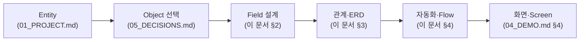
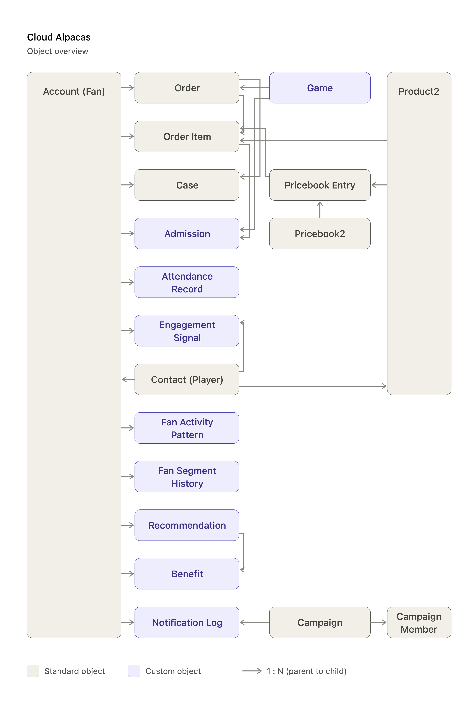
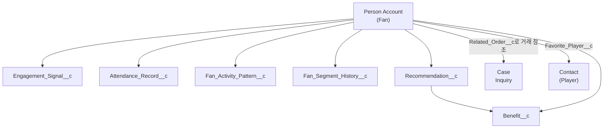
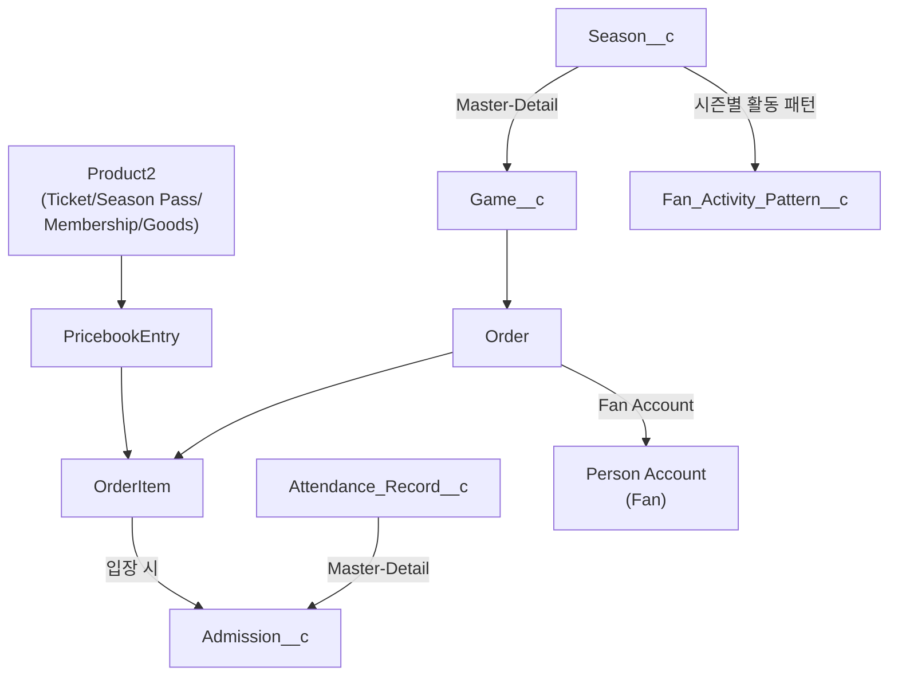
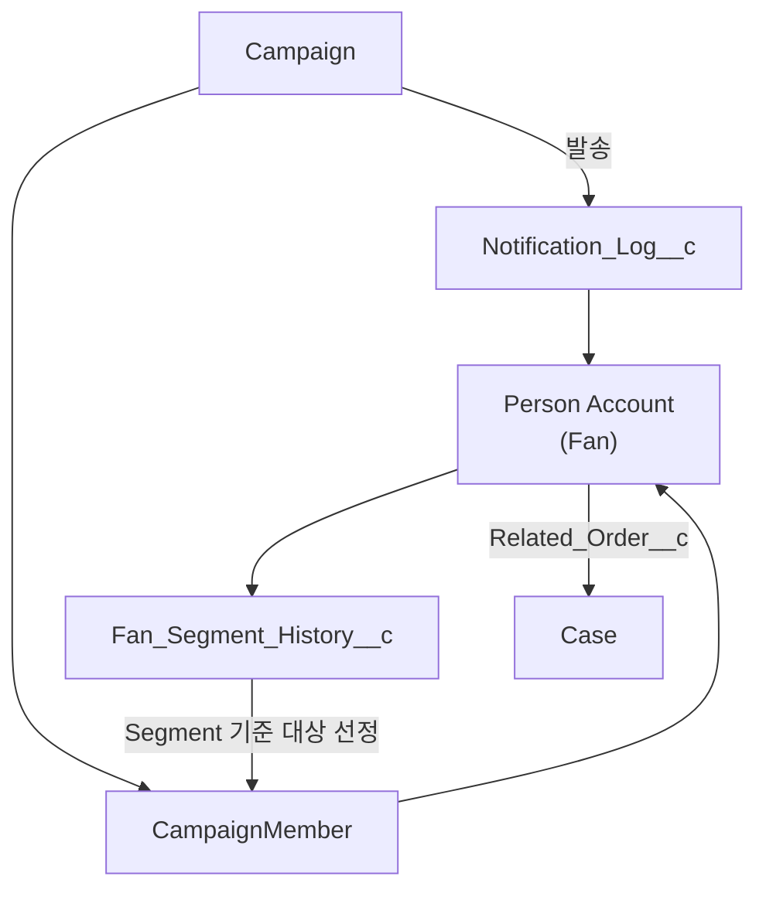
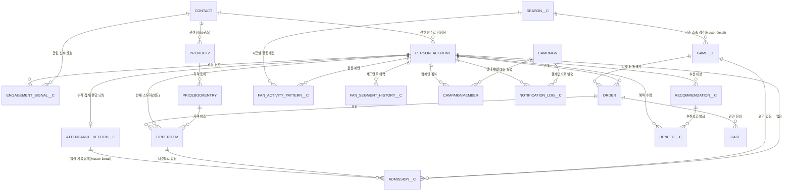
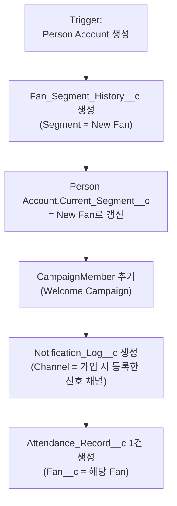
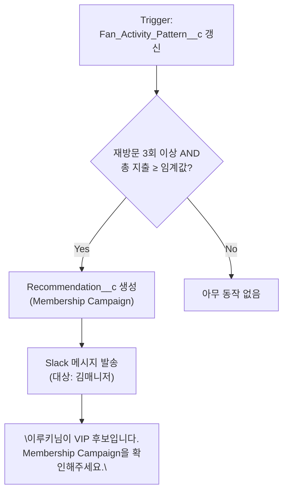

# 03_SYSTEM.md — Cloud Alpacas Salesforce Object / Data Model / Architecture

> 이 문서는 Salesforce Object, Data Model, Architecture, ERD, Flow를 다룬다.
> "어떤 Object를 만들지"에 대한 결정 근거는 `05_DECISIONS.md`(Decision 003~006)에 이미
> 기록되어 있다 — 이 문서는 그 결정을 실제 Object/Field 수준으로 구체화한다.
> Task, Sprint, Bug 같은 진행 상황은 문서가 아니라 GitHub Projects에서 관리한다(CLAUDE.md §7).

---

## 0. 이 문서를 읽는 법

01_PROJECT.md가 "이 세계에 어떤 명사(Entity)가 필요한가"를 정했다면, 이 문서는 그 명사를
**Salesforce 화면과 데이터로 실제로 어떻게 만들 것인가**를 정한다.

이 문서에 나오는 모든 Object 선택은 이미 팀과 함께 확정한 결정이며(05_DECISIONS.md
Decision 003~006), 여기서는 "왜 그렇게 정했는지"를 반복하지 않고 "그래서 Field는
무엇인지"에 집중한다.

---

## 0-1. MVP Implementation Matrix

> **"이 Entity는 이번에 구현하나요?"** 팀원이 이 질문을 할 때 가장 먼저 펼쳐봐야 하는
> 표다. 01_PROJECT.md §4의 Business Entity 전체를 기준으로, MVP 포함 여부와 최종
> 구현 방식을 한 페이지로 요약한다. 이유(Why)는 `05_DECISIONS.md`의 결정을 한 줄로
> 압축한 것이며, 자세한 배경은 표에 적힌 Decision 번호로 `05_DECISIONS.md`에서 찾아
> 읽는다(CLAUDE.md §7 중복 방지 — 이 표는 `05_DECISIONS.md`를 대체하지 않고 요약만
> 한다).
>
> **범례** — MVP: ✅ 포함 / ⛔ 제외(Future Scope) / 🔸 해당 없음(레코드 불필요).
> 구현 방식: `표준 Object` · `Custom Object` · `Field` · `Flow 로직` · `Report/Dashboard` ·
> `Future Scope`.

### 👤 Person

| Business Entity | MVP | 구현 방식 | Why |
|---|---|---|---|
| Fan | ✅ | 표준 Object — Person Account | B2C 개인 고객이 직접 구매·이용의 주체(Decision 004) |
| Player | ✅ | 표준 Object — Contact (RecordType=Player) | 표준 기능으로 충분(01_PROJECT.md §6.1) |
| Staff | ✅ | 표준 Object — User | 별도 설계 불필요 |
| Partner Contact | ⛔ | Future Scope | Sponsorship/Partnership Domain 전체 제외(Decision 005) |

### 🏢 Organization

| Business Entity | MVP | 구현 방식 | Why |
|---|---|---|---|
| Cloud Alpacas | 🔸 | 해당 없음 | 내부 조직 자체는 레코드로 만들지 않음 |
| Sponsor | ⛔ | Future Scope | Decision 005 |
| Partner | ⛔ | Future Scope | Decision 005 |

### 🎫 Product

| Business Entity | MVP | 구현 방식 | Why |
|---|---|---|---|
| Ticket / Season Pass / Membership / Goods | ✅ | 표준 Object — Product2 (RecordType) | 표준 판매 구조가 이미 검증되어 있음(Decision 003) |
| Collaboration Item | ⛔ | Future Scope | Partnership Domain 제외(Decision 005) |
| Benefit | ✅ | Custom Object — `Benefit__c` | 마케팅/멤버십/굿즈 공통 혜택, Recommendation의 결과물(Decision 006) |

### ⚙️ Policy & Eligibility

| Business Entity | MVP | 구현 방식 | Why |
|---|---|---|---|
| Ticket Policy | ✅ | 표준 Object — Price Book Entry | 좌석 등급별 Product2 + 표준 가격 기능으로 충분(Decision 003) |
| Membership Tier | ✅ | Field — Product2.`Tier__c` + Price Book Entry | 등급도 Product2 RecordType 안에서 표현(Decision 003, 03_SYSTEM.md §2.3) |
| Sponsorship Package | ⛔ | Future Scope | Decision 005 |
| Eligibility Rule | ✅ | Flow 로직 (Object 없음) | 규칙 종류가 적고 자주 안 바뀜(Decision 004) |

### ⚾ Event

| Business Entity | MVP | 구현 방식 | Why |
|---|---|---|---|
| Season | ✅ | Custom Object — `Season__c` | 시즌별 경기 수·관람률 집계 기준, Game__c의 부모(Master)로 필요(Decision 011) |
| Game | ✅ | Custom Object — `Game__c` | 표준 Object 없음(03_SYSTEM.md §1.2) |
| Campaign | ✅ | 표준 Object — Campaign/CampaignMember | Marketing 관점에서 그대로 재사용(01_PROJECT.md §6.1) |
| Fan Meeting | ✅ | 표준 Object — Campaign 재사용 (별도 구현 없음) | 01_PROJECT.md §6.1 제안대로 Campaign으로 흡수. **주의**: 04_DEMO.md에 아직 별도 Scene이 없다 — 실제로 쓰일지 팀 확인 필요 |

### 💰 Transaction

| Business Entity | MVP | 구현 방식 | Why |
|---|---|---|---|
| Ticket Purchase / Goods Purchase / Membership Enrollment | ✅ | 표준 Object — Order/OrderItem (`Order_Type__c`로 구분) | 셀프서비스형 거래에 적합(Decision 003) |
| Ticket Transfer | ✅ | Field — OrderItem.`Current_Owner__c`/`Transfer_Status__c` | 양도가 핵심 비즈니스가 아니고 이력 추적이 이번 범위 밖(Decision 004) |
| Admission | ✅ | Custom Object — `Admission__c` | "몇 번 왔는가"와 "언제 왔는가"를 구분해야 함(01_PROJECT.md §3.1) |
| Shipment | ⛔ | Future Scope | 이 프로젝트의 목적은 물류가 아니라 Customer 360(Decision 006) |
| Return | ⛔ | Future Scope | Decision 006 |
| Benefit Redemption | ⛔ | Future Scope (Field로 대체) | `Benefit__c.Status__c`(Issued/Used/Expired)로 충분(Decision 006) |
| Renewal | ⛔ | Future Scope (Field로 대체) | Order.`Membership_Status__c`/`Coverage_End_Date__c` 상태 전이로 충분(Decision 004, 필드명은 Decision 013으로 갱신) |
| Proposal / Sponsor Contract / Settlement | ⛔ | Future Scope | Sponsorship/Partnership Domain 제외(Decision 005) |

### 📍 Location

| Business Entity | MVP | 구현 방식 | Why |
|---|---|---|---|
| Ballpark | ⛔ | Future Scope | 단일 홈구장 MVP — 별도 Object 불필요(Decision 006) |
| Section / Seat | ✅ | Field — OrderItem.`Section__c`/`Row__c`/`Seat_Number__c` | 구매 시점 정보이며 필드만으로 충분(Decision 006) |
| Gate | ✅ | Field — `Admission__c.Gate__c` | 입장 시점 정보(Decision 006) |
| Partner Store | ⛔ | Future Scope | Partnership Domain 제외(Decision 005) |

### 💬 Service

| Business Entity | MVP | 구현 방식 | Why |
|---|---|---|---|
| Inquiry | ✅ | 표준 Object — Case | 표준 문의 처리 기능으로 충분(01_PROJECT.md §6.1) |
| Notification | ✅ | Custom Object — `Notification_Log__c` | Fan Timeline의 핵심 데이터, 발송 이력이 남아야 함(Decision 006) |
| Marketing Consent | ✅ | Field — Person Account.`Email/SMS/Push/Kakao_Opt_In__c` | 감사(Audit) 목적 이력 추적이 이번 범위 밖(Decision 004) |

### 📊 Analytics

| Business Entity | MVP | 구현 방식 | Why |
|---|---|---|---|
| Attendance Record | ✅ | Custom Object — `Attendance_Record__c` | Admission 여러 건을 집계한 분석 결과, 자동화 트리거로 필요(Decision 003). Admission과 Master-Detail로 연결해 Roll-Up Summary로 자동 집계한다(Decision 012) |
| Engagement Signal | ✅ | Custom Object — `Engagement_Signal__c` | 구매 이전 관심 신호를 기록(Decision 003) |
| Fan Activity Pattern | ✅ | Custom Object — `Fan_Activity_Pattern__c` | VIP 후보 감지 Flow의 트리거 근거(Decision 003) |
| Fan Segment (Current Segment/Life Cycle 축만 — Decision 009) | ✅ | Custom Object — `Fan_Segment_History__c` + Field(`Current_Segment__c` 캐시). Engagement Level/Fan Value 두 축은 §2.1의 `Engagement_Level__c`/`Engagement_Score__c`/`Fan_Value_Tier__c` Field로 별도 관리 | "언제 상태가 바뀌었는지"가 자동화의 근거(Decision 003) |
| Recommendation | ✅ | Custom Object — `Recommendation__c` | 시스템이 생성한 Next Best Action 결과물(01_PROJECT.md §3.1) |
| Campaign Performance | ✅ | Report/Dashboard (Object 없음) | Marketing 관점 집계만 필요, 별도 저장 불필요(01_PROJECT.md §6.1) |
| Sponsor Performance | ⛔ | Future Scope | Partnership Domain 제외(Decision 005) |

---

## 1. Object 전체 지도

### 1.1 표준 Object를 그대로 쓰는 것

| Object | 표현하는 것 | 비고 |
|---|---|---|
| Person Account | Fan | Decision 003 |
| Contact | Player (RecordType = Player) | 01_PROJECT.md §6.1 |
| User | Staff | 별도 설계 불필요 |
| Product2 | Ticket / Season Pass / Membership / Goods | Decision 003 |
| Price Book / Price Book Entry | Ticket Policy / Membership Tier의 가격 | Decision 003 |
| Order / OrderItem | Ticket Purchase / Goods Purchase / Membership Enrollment | Decision 003 |
| Campaign / CampaignMember | 마케팅 캠페인, 발송 대상 | 01_PROJECT.md §6.1 |
| Case | Inquiry (팬 문의) | 01_PROJECT.md §6.1 |

### 1.2 새로 만드는 Custom Object

| Object (API Name) | 표현하는 것 | 왜 Custom Object가 필요한가 |
|---|---|---|
| `Season__c` | 시즌 | 시즌 전체 경기 수·실제 진행 경기 수를 집계하는 기준. `Game__c`의 Master-Detail 부모(Decision 011). |
| `Game__c` | 경기 | 표준 Object가 없다. |
| `Admission__c` | 게이트 통과 1건(개별 입장 사건) | "몇 번 왔는가"와 "언제 왔는가"를 구분해야 한다(01_PROJECT.md §3.1). |
| `Benefit__c` | 팬이 받은 쿠폰·할인·선예매권 | Recommendation의 결과로 발급되는 혜택. 사용 여부는 Status 필드로 관리(Decision 006). |
| `Notification_Log__c` | 팬에게 보낸 개인화 안내 이력 | Fan Timeline의 핵심 데이터(Decision 006). |
| `Attendance_Record__c` | 팬의 누적 관람 이력 | Admission 여러 건을 집계한 분석 결과(Decision 003). |
| `Engagement_Signal__c` | SNS 반응 등 관심 신호 | 이루키가 SNS에서 문선수 영상을 본 것처럼, 구매 이전의 관심 신호를 기록(Decision 003). |
| `Fan_Activity_Pattern__c` | 팬의 시즌별 활동 패턴 | 여러 활동을 묶어 분석한 결과(Decision 003). |
| `Fan_Segment_History__c` | 팬의 Segment(상태) 변화 이력 | "언제 어떤 상태였는지" 시점을 남겨야 자동화의 근거가 된다(Decision 003). |
| `Recommendation__c` | 팬별 Next Best Action 추천 결과 | 시스템(구단)이 생성한 결과물(01_PROJECT.md §3.1). |

### 1.3 이번에 만들지 않는 것 (Future Scope)

Ballpark/Section/Seat/Gate 개별 Object, Benefit Redemption, Shipment, Return,
Eligibility Rule Object, Ticket Transfer 이력 Object, Marketing Consent 이력 Object,
Renewal Object, 그리고 Sponsor/Partner 계열 전체(Decision 005) — 이유와 확장 조건은
`05_DECISIONS.md`와 이 문서 §5 Future Scope에 정리했다.

---

## 2. Object 상세 (Field 정의)

### 2.1 Person Account — Fan

Fan은 표준 Person Account 필드(이름, 이메일, 휴대폰 등)에 아래 필드를 추가한다.

| Field (API Name) | 타입 | 설명 |
|---|---|---|
| `Favorite_Player__c` | Lookup(Contact) | 최애 선수. Favorite Player Campaign, 개인화 굿즈 추천에 사용. |
| **[P2] Gender__c** | Picklist (남/여) | Phase 2 Fan Insight/Fan Grouping의 인구통계 기준. 연령은 신규 필드 없이 표준 `Birthdate` 필드를 원천으로 분석한다(`05_DECISIONS.md` Decision 015). |
| `Acquisition_Channel__c` | Picklist (SNS/지인 추천/검색/오프라인 등) | 이루키처럼 "SNS에서 처음 알게 됨"을 기록 — Pain Point 1(팬 정보 흩어짐) 해결. **Org 연결 후 Final Verification**: Fan App QA에서 Multi-Select Picklist 변경 요구가 있었으나, 실제 Org의 현재 Data Type을 확인하기 전까지는 단일 Picklist로 유지한다(§6). |
| `Current_Segment__c` | Picklist (New Fan/Active Fan/At-Risk Fan/Dormant Fan/Churned Fan/Unreachable Fan) | 00_STORY.md §6 Current Segment(Life Cycle) — "지금 이 팬이 활동 주기의 어디에 있는가". `Fan_Segment_History__c`의 최신 값을 캐시. |
| `Segment_Updated_Date__c` | Date | 현재 Segment(Life Cycle)로 바뀐 날짜. |
| `Engagement_Level__c` | Picklist (가입 팬/관심 팬/활동 팬/충성 팬/멤버십 팬/핵심 팬) | "이 팬이 우리와 얼마나 깊게 관계를 맺고 있는가" — Current Segment와는 다른 축(Decision 009·010). |
| `Engagement_Score__c` | Number | Engagement Level을 산출하는 근거 점수. **필드는 이번 MVP에 포함하되, 점수 계산 공식과 자동 계산 방식(Flow/Apex 등)은 아직 미확정(TBD)** — 임의의 배점(예: 관람 30점 + 구매 40점 + 활동 30점)을 지금 확정하지 않는다. §5 Future Scope 참고(Decision 010). |
| `Fan_Value_Tier__c` | Picklist (일반/우수/VIP) | "이 팬이 우리에게 얼마나 가치 있는 고객인가" — Current Segment·Engagement Level과는 다른 축(Decision 009·010). **VIP는 이 필드의 값이며, Product2.`Tier__c`의 "VIP" 멤버십 등급과는 다른 개념**이다. Flow/Demo의 "VIP 후보"는 이 필드가 VIP로 바뀔 가능성이 높다는 뜻이지, 자동으로 VIP를 확정하는 것이 아니다(§4.5 참고). |
| `Email_Opt_In__c` / `SMS_Opt_In__c` / `Push_Opt_In__c` / `Kakao_Opt_In__c` | Checkbox | 채널별 마케팅 수신 동의(Decision 004 — Marketing Consent를 필드로 관리). |
| `Consent_Updated_Date__c` | Date | 동의 값이 마지막으로 바뀐 날짜. |

> **[P2] Fan Grouping은 어떻게 하나?** 별도의 `Fan Segment` Custom Object를 새로
> 만들지 않는다(`05_DECISIONS.md` Decision 015 — Fan Segment 3축 유지 원칙과 동일선상).
> `Gender__c`/`Birthdate`(인구통계) + `Current_Segment__c`/`Engagement_Level__c`/
> `Fan_Value_Tier__c`(3축) + `Fan_Activity_Pattern__c`/`Engagement_Signal__c`(행동·관심사)를
> Person Account 기준 **Report/Report Type**으로 조회·집계해 "팬층 특성"을 확인한다 —
> 이 결과가 Phase 2 **Fan Insight**의 실체다(`01_PROJECT.md` §2.7·§8, 신규 Object 없음).

> **왜 Current_Segment__c와 Fan_Segment_History__c를 둘 다 두나?** Fan 목록 화면에서
> 매번 "이 팬의 최신 상태"를 계산하면 느리다. 그래서 최신 값은 Fan 레코드에 캐시해두고
> (`Current_Segment__c`), "언제 어떻게 바뀌었는지"는 별도 이력 Object에 남긴다. 냉장고
> 문에 "오늘 할 일"을 붙여두고, 지난 할 일들은 수첩에 기록해두는 것과 같다.
>
> **`Engagement_Level__c`/`Engagement_Score__c`/`Fan_Value_Tier__c`에는 왜 이력
> Object가 없나?** Fan 분류 3축(Decision 009) 중 Current Segment만
> `Fan_Segment_History__c`라는 이력 Object를 갖고, 나머지 두 축(Engagement Level·Fan
> Value)은 이번 MVP에서 Person Account의 캐시 필드로만 관리한다 — Object 개수를 필요한
> 만큼만 늘리는 원칙(Decision 006) 때문이다. **`Fan_Segment_History__c`는 Current
> Segment(Life Cycle) 변경 이력 전용이며, Engagement Level이나 Fan Value 변경까지 이
> Object 하나로 함께 기록하도록 확장하지 않는다(Decision 010)** — 세 축을 혼용하지
> 않는다는 원칙을 이력 Object 구조에도 그대로 적용한 것이다. "언제 Engagement
> Level/Fan Value가 바뀌었는지"를 자동화 트리거 근거로 남겨야 할 정도로 중요해지면,
> `Fan_Segment_History__c`와 같은 패턴의 별도 이력 Object를 추가한다(§5 Future Scope).

> **Owner(표준 `OwnerId`)는 이 3축과 완전히 별개다(Decision 009)**. `OwnerId`(담당
> 직원)는 표준 필드로 자동 존재하며 별도 설계가 필요 없다 — 예를 들어 김매니저가
> `OwnerId`인 Fan이 동시에 `Fan_Value_Tier__c` = VIP이면서 `Current_Segment__c` =
> At-Risk Fan일 수 있다. 현재는 김매니저 1명뿐이라 OWD/Sharing Rule/Role 기반 접근
> 제한은 구현하지 않는다(OWD를 Private으로 바꾸거나 VIP 담당자별 Sharing Rule을
> 새로 만들지 않는다) — Staff가 늘어나면 §5 Future Scope에서 다시 결정한다.

### 2.2 Contact — Player

RecordType = `Player`로 구분한다.

| Field (API Name) | 타입 | 설명 |
|---|---|---|
| `Position__c` | Picklist | 포지션. |
| `Uniform_Number__c` | Number | 등번호. |

### 2.3 Product2 — Ticket / Season Pass / Membership / Goods

RecordType으로 4종을 구분한다. 공통 필드(Name, ProductCode, IsActive, Description)는
표준 그대로 쓴다.

| Field (API Name) | 타입 | 어느 RecordType에서 쓰나 | 설명 |
|---|---|---|---|
| `Tier__c` | Picklist (Standard/Premium/VIP 등) | Membership | Membership Tier. 등급마다 별도 Product2 레코드로 만들고, 가격은 Price Book Entry로 매긴다. |
| `Category__c` | Picklist (Uniform/Cheering Item/Plush/Photo Card/Living Goods/Accessory/Other) | Goods | 굿즈 카테고리(01_PROJECT.md §3.4 — 지금은 필드, 나중에 분석이 중요해지면 Object 승격 가능). 값 목록은 팀 논의로 확장됨(2026-08). |
| `Related_Player__c` | Lookup(Contact) | Goods | 이 굿즈가 특정 선수 관련 상품인지(예: "문선수 유니폼"). Favorite Player Campaign 추천 근거. |

가격(Ticket Policy/Membership Tier의 가격)은 **Price Book Entry**로 관리한다 — 좌석 등급별
가격이 다르면, 좌석 등급별로 별도 Product2를 만들고(예: "Ticket - 1루 응원석", "Ticket -
외야석") 각각 Price Book Entry를 매긴다.

### 2.4 Order / OrderItem — Ticket Purchase / Goods Purchase / Membership Enrollment

| Field (API Name) | Object | 타입 | 설명 |
|---|---|---|---|
| `Order_Type__c` | Order | Picklist (Ticket Purchase/Goods Purchase/Membership Enrollment) | 세 가지 거래를 구분. |
| `Purchase_Channel__c` | Order | Picklist (온라인/구장 굿즈샵) | 온라인 구매인지 구장 현장(굿즈샵) 구매인지 구분. Fan Journey/Fan Profile/Dashboard/Recommendation에서 채널별로 활용(Decision 009). |
| `Game__c` | Order | Lookup(`Game__c`) | Ticket Purchase 전용 — 어느 경기 티켓인지. |
| `Membership_Status__c` | Order | Picklist (Active/Expired/Cancelled) | Membership Enrollment 전용. Renewal은 이 값의 상태 전이로 처리(Decision 004). |
| `Coverage_Start_Date__c` / `Coverage_End_Date__c` | Order | Date | Membership Enrollment/Season Pass 공통 — 적용 기간. 기존 `Membership_End_Date__c`를 대체·통합(Decision 013). |
| `Payment_Status__c` | Order | Picklist (Paid/Cancelled/Refunded) | 결제/환불 상태. 표준 `Status`(Draft/Activated)와는 **다른 축**이다(Decision 013). |
| **[P2] Payment_Method__c** | Order | Picklist (카드/간편결제/계좌이체) | 결제 수단. Fan App에서 이미 사용 중인 필드로 확인되어 문서에 반영했다 — **"Fan App에서 사용한다" ≠ "Org에 이미 구현되어 있다"**(§6). 실제 Org 존재 여부는 Org 연결 후 검증한다. |
| `Refund_Date__c` | Order | Date | 환불 처리일. |
| `Refund_Reason__c` | Order | Picklist (단순변심/상품불량/경기취소/일정변경) | 환불 사유. MVP는 Order 전체 단위 환불만 지원하며, 부분 환불(OrderItem 단위)은 Future Scope다(Decision 013, §5). |
| `Section__c` / `Row__c` / `Seat_Number__c` | OrderItem | Picklist/Text/Text | Ticket Purchase 전용 — 구매 시점에 정해지는 좌석 정보(Decision 006). |
| **[P2] Size__c** | OrderItem | Picklist | Goods Purchase 전용 — 굿즈 사이즈. Fan App에서 사용하는 데이터로 확인되어 필드는 반영하되, **실제 Picklist 값은 아직 확정하지 않았다(TBD)** — Org 연결 후 검증한다(§6). |
| `Current_Owner__c` | OrderItem | Lookup(Person Account) | 기본값은 구매자. 선물·양도 시 실제 입장자로 변경(Ticket Transfer, Decision 004). |
| `Transfer_Status__c` | OrderItem | Picklist (Not Transferred/Transferred) | 양도 여부. |

> **환불 문의는 어떻게 연결하나?** `Case.Related_Order__c`(§2.9)가 이미 있으므로 새
> 필드를 만들지 않는다 — 환불 문의 Case를 이 필드로 Order와 연결하면, 담당자가 그
> Order의 `Payment_Status__c`를 바로 확인할 수 있다(Decision 013).

> **왜 좌석 정보는 OrderItem에, 게이트 정보는 Admission에 있나?** 좌석은 "표를 살 때"
> 정해지고, 게이트는 "실제로 입장할 때" 결정된다 — 서로 다른 시점의 정보라 다른
> Object에 둔다(05_DECISIONS.md Decision 006 영향 참고).

### 2.5 Season__c

시즌별 경기 수·관람률 집계 기준이다(Decision 011).

| Field (API Name) | 타입 | 설명 |
|---|---|---|
| Name | Text | 예: "2026 시즌". |
| `Total_Games__c` | Number | 시즌 전체 경기 수(취소 포함, 수동 입력). |
| `Played_Games__c` | Roll-Up Summary (COUNT, `Game__c.Status__c = Played`) | 실제 진행 경기 수 — 관람률 계산의 분모. `Game__c`가 Master-Detail 자식이라 자동 집계된다. |

### 2.6 Game__c

`Season__c`의 Master-Detail 자식이다(Decision 011) — Master-Detail로 설계해야
`Season__c.Played_Games__c`를 Roll-Up으로 자동 집계할 수 있다.

| Field (API Name) | 타입 | 설명 |
|---|---|---|
| `Game_Date__c` | DateTime | 경기 일시. |
| `Opponent__c` | Text | 상대팀. |
| `Result__c` | Picklist (Win/Loss/Draw) | 경기 결과(선택). |
| `Season__c` | Master-Detail(`Season__c`) | 어느 시즌 소속 경기인가(Decision 011). |
| `Home_Away__c` | Picklist (Home/Away) | 홈/원정 구분. |
| `Status__c` | Picklist (Scheduled/Played/Cancelled) | 경기 상태. 관람률 계산 시 `Cancelled`는 분모에서 제외한다(Decision 011). |

### 2.7 Admission__c

`Attendance_Record__c`의 Master-Detail 자식이다(Decision 012).

| Field (API Name) | 타입 | 설명 |
|---|---|---|
| `Fan__c` | Lookup(Person Account) | 누가 입장했나. |
| `Game__c` | Lookup(`Game__c`) | 어느 경기인가. |
| `Order_Item__c` | Lookup(OrderItem) | 어떤 티켓으로 입장했나. |
| `Admission_Time__c` | DateTime | 입장 시각. |
| `Gate__c` | Picklist (Gate 1~4) | 통과한 게이트(Decision 006). |
| `Attendance_Record__c` | Master-Detail(`Attendance_Record__c`) | 이 입장 기록이 어느 팬의 누적 관람 이력에 집계되는가. Master(`Attendance_Record__c`)가 먼저 있어야 이 레코드를 만들 수 있다(Decision 012, §4.4 참고). |

### 2.8 Benefit__c

| Field (API Name) | 타입 | 설명 |
|---|---|---|
| `Fan__c` | Lookup(Person Account) | 누구에게 발급됐나. |
| `Benefit_Type__c` | Picklist (Coupon/Discount/Early Access/Membership Day Invite) | 혜택 종류. |
| `Recommendation__c` | Lookup(`Recommendation__c`) | 이 혜택을 발급하게 만든 추천(있는 경우). |
| `Status__c` | Picklist (Issued/Used/Expired) | 발급/사용/만료(Decision 006 — Redemption Object 대신 상태 필드로 관리). |
| `Issued_Date__c` / `Used_Date__c` / `Expiration_Date__c` | Date | 발급·사용·만료 일자. |

### 2.9 Case — Inquiry

| Field (API Name) | 타입 | 설명 |
|---|---|---|
| `Related_Order__c` | Lookup(Order) | 이 문의가 어떤 Ticket/Goods/Membership 거래에 대한 것인지(01_PROJECT.md §5). 환불 문의도 이 필드로 연결한다(Decision 013). |

Subject/Description/Status/Origin 등은 표준 필드를 그대로 쓴다.

### 2.10 Notification_Log__c

| Field (API Name) | 타입 | 설명 |
|---|---|---|
| `Fan__c` | Lookup(Person Account) | 누구에게 보냈나. |
| `Campaign__c` | Lookup(Campaign) | 어떤 캠페인으로 보냈나. |
| `Channel__c` | Picklist (Email/SMS/Push/Kakao AlimTalk) | 발송 채널 — 팬에게 보내는 채널이며, 김매니저가 받는 Slack과는 다른 목적이다(§4.3 참고). |
| `Content__c` | Long Text Area | 발송 내용. |
| `Sent_Date__c` | DateTime | 발송 시각. |

### 2.11 Attendance_Record__c

`Admission__c`의 Master-Detail 부모다(Decision 012) — 팬 1명이 입장할 때마다
`Admission__c`가 이 레코드 아래 쌓이고, 아래 3개 필드는 Roll-Up Summary로 자동
집계된다. **별도의 집계 Flow는 만들지 않는다.**

| Field (API Name) | 타입 | 설명 |
|---|---|---|
| `Fan__c` | Lookup(Person Account), 팬당 1건 | 누구의 기록인가. Duplicate Rule로 팬당 1건만 허용한다(§2.17). |
| `Total_Admissions__c` | Roll-Up Summary (COUNT, `Admission__c`) | 누적 관람 횟수. |
| `First_Admission_Date__c` | Roll-Up Summary (MIN, `Admission__c.Admission_Time__c`) | 첫 관람일. |
| `Last_Admission_Date__c` | Roll-Up Summary (MAX, `Admission__c.Admission_Time__c`) | 최근 관람일. |

### 2.12 Engagement_Signal__c

| Field (API Name) | 타입 | 설명 |
|---|---|---|
| `Fan__c` | Lookup(Person Account) | 누구의 신호인가. |
| `Signal_Type__c` | Picklist (SNS Click/Video View/App Open) | 신호 종류. |
| `Source__c` | Text | 예: Instagram, YouTube. |
| `Player__c` | Lookup(Contact) | 어떤 선수와 관련된 신호인지(선택 — "문선수 영상"처럼). |
| `Signal_Date__c` | DateTime | 발생 시각. |

### 2.13 Fan_Activity_Pattern__c

**한 Fan은 시즌별로 하나의 Activity Pattern을 가진다**(Fan + Season = 1 Pattern
원칙, Decision 011). 기존 `Period__c`(Text)를 `Season__c`(Lookup)로 대체했다. 월별/
분기별 Pattern은 Future Scope다(§5).

| Field (API Name) | 타입 | 설명 |
|---|---|---|
| `Fan__c` | Lookup(Person Account) | 누구의 패턴인가. |
| `Season__c` | Lookup(`Season__c`) | 어느 시즌의 패턴인가. `Fan__c` + `Season__c` 조합으로 Duplicate Rule을 건다(§2.17). |
| `Attendance_Rate__c` | Formula(Percent), 저장 안 함 | `Games_Attended__c ÷ Season__r.Played_Games__c × 100`. `Season__c.Played_Games__c`가 이미 `Cancelled` 경기를 제외하고 집계되므로 별도 보정이 필요 없다(Decision 011). |
| `Games_Attended__c` | Number | 이 시즌 관람 횟수. |
| `Goods_Purchases__c` | Number | 이 시즌 굿즈 구매 횟수. |
| `Total_Spend__c` | Currency | 이 시즌 총 지출. `Order.Payment_Status__c` = Refunded/Cancelled인 Order는 집계에서 제외한다(Decision 013). **계산을 누가/언제(Flow 또는 Apex) 수행하는지는 아직 미정(TBD)** — §4.6 참고. |
| `Analyzed_Date__c` | Date | 분석이 실행된 날짜. |

### 2.14 Fan_Segment_History__c

| Field (API Name) | 타입 | 설명 |
|---|---|---|
| `Fan__c` | Lookup(Person Account) | 누구의 이력인가. |
| `Segment__c` | Picklist (00_STORY.md §6과 동일한 6개 값) | 그 시점의 Current Segment(Life Cycle). |
| `Changed_Date__c` | DateTime | Current Segment(Life Cycle)가 바뀐 시각. |
| `Reason__c` | Text | 예: "최초 가입", "90일 무활동". |

### 2.15 Recommendation__c

| Field (API Name) | 타입 | 설명 |
|---|---|---|
| `Fan__c` | Lookup(Person Account) | 누구를 위한 추천인가. |
| `Recommended_Action__c` | Picklist (00_STORY.md §7 NBA 6종) | 무엇을 추천하나. |
| `Reason__c` | Text | 왜 이 추천이 나왔나(예: "3경기 연속 관람, 굿즈 미구매"). |
| `Status__c` | Picklist (Pending/Executed/Dismissed) | 김매니저가 이 추천을 실행했는지. |

### 2.16 Fan Profile 설계 원칙 — 원천 데이터 비복제 (Decision 014)

Fan Profile 화면은 아래 항목을 Account(Person Account) 필드로 복제하지 않는다.
**각 항목의 원본이 이미 다른 Object에 있으므로, 화면은 그 원본을 Related
List/Lightning Component로 그대로 참조**한다 — 원본이 바뀔 때마다 Account 필드를
동기화하는 불필요한 자동화를 피하기 위해서다.

| 표시 항목 | 원천 Object | 원천 필드 | 표시 방식 |
|---|---|---|---|
| 최근 관람일 / 총 관람 횟수 | `Attendance_Record__c` | `Last_Admission_Date__c` / `Total_Admissions__c` | Related List(팬당 1건이라 단순 참조 가능) |
| 총 구매금액 | `Fan_Activity_Pattern__c` | `Total_Spend__c` | Related List / Component |
| 구매 빈도 | `Order` | (Fan 기준 Order 건수) | Related List 건수 또는 Report |
| 최근 활동일 | `Engagement_Signal__c` | `Signal_Date__c`(최신 1건) | Related List, `Signal_Date__c` 내림차순 정렬 |

반면 `Current_Segment__c`/`Engagement_Level__c`/`Engagement_Score__c`/
`Fan_Value_Tier__c`(§2.1)는 여러 원천을 종합한 **Fan 자체의 상태값**이므로 원본
복제가 아니라 원래 자리인 Account에 직접 저장한다(Decision 009·010, 변경 없음).

### 2.17 Duplicate Rule

| Object | 기준 | 규칙 |
|---|---|---|
| `Attendance_Record__c` | `Fan__c` | Matching Rule(Exact) + Duplicate Rule — 팬당 1건만 허용, Action on Create = Block(Decision 012). |
| `Fan_Activity_Pattern__c` | `Fan__c` + `Season__c` | Matching Rule(두 필드 모두 Exact) + Duplicate Rule — 팬은 시즌당 1건만 허용, Action on Create = Block(Decision 011). |

---

## 3. ERD — Object 간 관계

**Visual ERD — 전체 Object 구조 (참고 이미지)**

아래 이미지는 Cloud Alpacas의 전체 Object 구조와 관계를 한눈에 이해하기 위한 시각적
참고 자료다 — Workshop(`workshop/03_ERD.md`)에서 쓰는 것과 동일한 파일이다.

> 이 이미지는 전체 구조를 빠르게 이해하기 위한 참고 자료이며, **실제 Object 관계의
> 공식 기준은 아래 §3.1~§3.4의 Mermaid ERD**(특히 §3.4 Relationship Summary)다.
> 관계가 바뀌면 Mermaid 코드를 먼저 고치는 것이 기준이며, 이 PNG는 정적 이미지라
> 자동으로 갱신되지 않는다.

---

### 3.1 Fan 축 — 팬이 누구고, 무엇을 하고 있는가

### 3.2 Operations 축 — 구단이 파는 것

### 3.3 Marketing/Service 축 — 알리고, 대응하는 것

### 3.4 Relationship Summary — 전체 관계 표 (공식 버전)

§3.1~3.3의 3개 다이어그램에 흩어진 관계를 하나도 빠짐없이 모은 표준 `erDiagram`이다.
Baby Team 워크숍(`workshop/`)에서 그림으로 먼저 논의한 뒤, 이 블록으로 옮겨 공식화한
것이다 — 이후 관계가 바뀌면 이 코드를 고치고 아래 표도 함께 갱신한다.

> 이 Mermaid `erDiagram`이 Object 관계의 공식 기준이다 — 이 문서 §3 상단의 Visual ERD
> (참고 이미지)와 역할이 다르다는 점은 그쪽 설명을 참고한다.

MVP 범위에 포함되지 않은 Object(Sponsor/Partner 계열, Ballpark/Section/Seat/Gate,
Shipment/Return, Benefit Redemption 등 — §5 Future Scope)는 아래 `erDiagram`에 포함하지
않는다. Future Scope Object가 확정되어 이번 MVP로 편입되면, 그때 이 다이어그램에 추가한다.

| Parent | Child | Cardinality | Meaning |
|---|---|---|---|
| Contact (Player) | Person Account (Fan) | 1:N | 한 선수는 여러 팬의 "최애 선수"가 될 수 있다 |
| Contact (Player) | Product2 (Goods) | 1:N | 한 선수는 여러 굿즈에 연결될 수 있다 |
| Contact (Player) | `Engagement_Signal__c` | 1:N | 한 선수는 여러 관심 신호에 등장할 수 있다 |
| Product2 | PricebookEntry | 1:N | 한 상품은 여러 가격(좌석 등급별 등)을 가질 수 있다 |
| PricebookEntry | OrderItem | 1:N | 한 가격 기준이 여러 주문 항목에 적용된다 |
| Person Account (Fan) | Order | 1:N | 한 팬은 여러 번 구매한다 |
| Person Account (Fan) | OrderItem | 1:N | 팬은 (양도로) 다른 팬 티켓의 현재 소유자가 될 수 있다 |
| `Season__c` | `Game__c` | 1:N | Master-Detail — 한 시즌에 여러 경기가 속한다(Decision 011) |
| `Game__c` | Order | 1:N | 한 경기에 여러 티켓 주문이 발생한다 |
| Order | OrderItem | 1:N | 표준 Master-Detail |
| Person Account (Fan) | `Admission__c` | 1:N | 한 팬은 여러 번 입장한다 |
| `Game__c` | `Admission__c` | 1:N | 한 경기에 여러 입장 기록이 쌓인다 |
| OrderItem | `Admission__c` | 1:N | 티켓 1건으로 입장 기록이 생긴다 |
| Person Account (Fan) | `Attendance_Record__c` | 1:1 | 팬당 누적 집계 레코드는 1건 |
| `Attendance_Record__c` | `Admission__c` | 1:N | Master-Detail — 한 팬의 누적 집계 레코드 아래 여러 입장 기록이 쌓이고, 이 관계로 Roll-Up Summary(§2.11)를 계산한다(Decision 012) |
| Person Account (Fan) | `Recommendation__c` | 1:N | 한 팬에게 여러 추천이 쌓인다 |
| `Recommendation__c` | `Benefit__c` | 1:N | 추천 하나가 혜택 발급으로 이어질 수 있다 |
| Person Account (Fan) | `Benefit__c` | 1:N | 한 팬은 여러 혜택을 받을 수 있다 |
| Person Account (Fan) | `Fan_Activity_Pattern__c` | 1:N | 시즌별로 여러 건 쌓일 수 있다 |
| `Season__c` | `Fan_Activity_Pattern__c` | 1:N | 한 시즌에 여러 팬의 Activity Pattern이 쌓인다(Decision 011) |
| Person Account (Fan) | `Fan_Segment_History__c` | 1:N | Segment가 바뀔 때마다 이력이 쌓인다 |
| Person Account (Fan) | `Engagement_Signal__c` | 1:N | 관심 신호가 여러 번 기록된다 |
| Campaign | CampaignMember | 1:N | 표준 발송 대상 목록 |
| Person Account (Fan) | CampaignMember | 1:N | 한 팬이 여러 캠페인에 속할 수 있다 |
| Campaign | `Notification_Log__c` | 1:N | 캠페인 하나로 여러 건이 발송된다 |
| Person Account (Fan) | `Notification_Log__c` | 1:N | 한 팬에게 여러 안내가 쌓인다(Fan Timeline) |
| Order | Case | 1:N | 한 거래에 여러 문의가 달릴 수 있다 |

> Campaign이 Fan Meeting(01_PROJECT.md §6.1 제안)까지 표현할지는 아직 팀 결정이
> 없어 이 표에 넣지 않았다 — 확정되면 이 표와 위 erDiagram에 한 줄을 추가한다.

---

## 4. Flow 설계

### 4.1 왜 Flow가 필요한가

00_STORY.md §7(FRM Team의 Next Best Action)은 "팬의 상태"와 "그에 맞는 행동"을 표로
정리했다. 이 표를 사람이 매번 엑셀을 보고 판단하면 Pain Point 4("VIP가 될 가능성이 높은
팬도 엑셀을 정리한 후에야 발견한다")가 그대로 반복된다. Salesforce Flow는 이 판단을
**자동으로, 그 즉시** 실행해주는 도구다.

### 4.2 Trigger → Action 매핑 (00_STORY.md §7 기반)

| 팬의 상태 (Trigger) | Flow가 하는 일 | 김매니저에게 Slack 알림? |
|---|---|---|
| Person Account 신규 생성 | `Fan_Segment_History__c`(New Fan) 생성, Welcome Campaign `CampaignMember` 추가, `Notification_Log__c` 생성(Welcome 안내 발송), **`Attendance_Record__c` 1건 생성**(Decision 012 — Admission의 Master-Detail 부모를 미리 만들어둠) | 아니오 (일상적 신규가입은 자동 처리) |
| 가입 후 7일간 Ticket Purchase 없음 | First Ticket Campaign `CampaignMember` 추가, `Notification_Log__c` 생성 | 아니오 |
| `Attendance_Record__c.Total_Admissions__c`(Roll-Up) = 1 (최초 관람) | Segment를 Active Fan으로 변경(`Fan_Segment_History__c` 추가), First Visit Guide 발송 | 아니오 |
| 관람은 했지만 Goods Purchase 없음(Ticket Only Fan) | First Merchandise Campaign 추천(`Recommendation__c` 생성), `Benefit__c`(할인 쿠폰) 발급 | 아니오 |
| 첫 Goods Purchase 완료 | Favorite Player Campaign 추천(`Recommendation__c` 생성) | 아니오 |
| `Fan_Activity_Pattern__c`가 "재방문 3회 이상 + 총 지출 임계값 이상" 조건 충족 (VIP/멤버십 후보) | Membership Campaign 추천(`Recommendation__c` 생성) | **예 — "VIP 후보 발견" 알림** |
| `Fan_Segment_History__c`가 At-Risk Fan으로 전환 | Win-back Campaign 추천 *(향후)* | **예 — "이탈 위험 팬" 알림** |

> 표의 마지막 두 줄처럼 **"놓치면 아까운 타이밍"**만 Slack으로 김매니저에게 알린다.
> 나머지는 시스템이 조용히 자동으로 처리한다 — 모든 이벤트를 다 알리면 진짜 중요한
> 알림이 묻히기 때문이다.

### 4.3 Notification_Log__c와 Slack 알림의 차이

이 프로젝트에는 "알림"이 두 종류 있다. 서로 받는 사람도, 목적도 다르다.

| | Notification_Log__c | Slack 알림 |
|---|---|---|
| 받는 사람 | 팬 (이루키) | 김매니저 (FRM 담당자) |
| 채널 | Email/SMS/Push/카카오 알림톡 | Slack |
| 목적 | 팬에게 정보·혜택을 안내 | 김매니저가 놓치면 안 되는 팬 상태 변화를 알림 |
| 어디서 보이나 | Fan Timeline (팬의 이력) | Slack 채널 (김매니저의 업무 도구) |

> **비유**: Notification_Log__c는 "가게가 손님에게 보내는 문자"이고, Slack 알림은
> "매니저 휴대폰에 뜨는 사내 업무 알림"입니다. 같은 사건(예: 이루키가 VIP 후보가 됨)이
> 두 가지 다른 알림을 만들어낼 수 있습니다 — 이루키에게는 "특별한 혜택을 준비했어요"
> 안내가, 김매니저에게는 "이루키님을 확인해보세요"라는 업무 알림이 갑니다.

### 4.4 대표 Flow 예시 ① — Welcome Campaign Flow

> **왜 이 Flow에 `Attendance_Record__c` 생성이 포함되나?** `Admission__c`가
> `Attendance_Record__c`의 Master-Detail 자식이 되면서(Decision 012), 부모 레코드가
> 먼저 있어야 자식(입장 기록)을 만들 수 있다. 별도 Flow로 분리하면 같은 트리거(Account
> 생성)에 Flow가 2개 걸려 실행 순서를 신경 써야 하므로, Welcome Campaign Flow에
> 통합했다. `Total_Admissions__c`는 Roll-Up이라 생성 직후 자동으로 0이다.

### 4.5 대표 Flow 예시 ② — VIP 후보 감지 Flow

> **용어 확인(Decision 009·010)**: 이 Flow가 감지하는 "VIP 후보"는 **Fan Value가
> VIP로 바뀔 가능성이 높은 팬**(Recommendation/판단 대상)을 뜻하며, `Fan_Value_Tier__c`
> 값 자체가 아니다. 흐름은 항상 다음 순서를 따른다:
>
> `Fan_Activity_Pattern__c`(행동 데이터) 기준 VIP 조건 충족 감지 → `Recommendation__c`
> 생성 → 김매니저(담당자)에게 Slack 알림 → **김매니저가 확인** → 필요 시 김매니저가
> 직접 Person Account.`Fan_Value_Tier__c`를 VIP로 변경(수동).
>
> 이 Flow는 `Recommendation__c`를 만들고 김매니저에게 알릴 뿐, `Fan_Value_Tier__c`를
> 자동으로 VIP로 확정하지 않는다 — "VIP 후보 감지" ≠ "Fan Value = VIP 자동 변경".

### 4.6 아직 정의되지 않은 Trigger — 구현 전 확정 필요

§4.2 표의 Flow 중 "경과 시간"이나 "누적값"을 조건으로 삼는 Flow는, **그 값을 누가
언제 계산해서 채워 넣는지**가 아직 정의되어 있지 않다. Record-Triggered Flow는
레코드가 생성·수정될 때만 실행되는데, "가입 후 7일 경과"나 "무활동 90일" 같은
조건은 아무 레코드 변경 없이도 시간이 지나면 참이 되기 때문이다.

| Flow | 빠진 부분 |
|---|---|
| First Ticket Campaign (2번) | "가입 후 7일 경과"를 누가 매일 검사하는가 |
| First Merchandise Campaign (4번) | "관람했지만 굿즈 미구매" 상태를 언제 검사하는가 |
| VIP 후보 감지 (6번) | 트리거 조건인 `Fan_Activity_Pattern__c` 자체를 **누가 갱신하는가** — 이 계산 Flow가 없다 |
| Win-back Campaign (7번) | "무활동 90일"을 누가 매일 검사하는가 |
| `Fan_Activity_Pattern__c.Total_Spend__c` 재계산 | Refunded/Cancelled Order를 제외하고 집계하는 로직을 Flow로 할지 Apex로 할지, 언제 재계산할지 **미정(TBD, Decision 013)** — 위 `Fan_Activity_Pattern__c` 재계산 Flow와 같은 그룹으로 함께 결정하는 것을 추천한다 |

**구현 전 결정할 것**: 매일 정해진 시간에 도는 Scheduled-Triggered Flow(가칭
"Daily Fan Analytics Refresh") 1개를 새로 설계해, `Fan_Activity_Pattern__c` 재계산과
위 4개 Flow의 조건 검사를 여기서 함께 처리할지 팀이 확정한다. 이 Flow의 실행
시각에 맞춰 `04_DEMO.md` §5 Sample Data의 날짜도 역산해서 만들어야 한다.

---

## 5. Future Scope

`05_DECISIONS.md`에서 이미 기록한 확장 지점을 한곳에 모았다 — 새 결정이 아니라 참조용
요약이며(CLAUDE.md §7 중복 방지 원칙), 자세한 배경은 각 Decision을 참고한다.

| 지금은 없음 | 나중에 필요해지면 | 근거 |
|---|---|---|
| Ballpark/Section/Seat/Gate Object | 다구장 운영, 좌석 상태 관리 | Decision 006 |
| Benefit Redemption Object | 혜택 사용 이력 분석·정산 | Decision 006 |
| Shipment / Return Object | 배송 추적, 교환·반품 처리 | Decision 006 |
| Eligibility Rule Object | 자격 규칙이 많아지고 자주 바뀔 때 | Decision 004 |
| Ticket Transfer 이력 Object | 양도 CS 문의가 잦아질 때 | Decision 004 |
| Marketing Consent 이력 Object | Marketing Cloud 도입, 감사 요구 | Decision 004 |
| Renewal Object | 갱신 임박 자동 알림·캠페인 | Decision 004 |
| Sponsor/Partner 전체 Object군 | 스폰서십·파트너십 관리 기능 확장 | Decision 005 |
| 월별/분기별 `Fan_Activity_Pattern__c` | 시즌 단위보다 더 세밀한 기간별 분석이 필요해지면 | Decision 011 |
| 부분 환불 (OrderItem 단위 `Payment_Status__c`) | 한 Order 안 일부 상품만 환불하는 케이스가 늘어나면 | Decision 013 |
| Apex (Batch/Scheduled) | `Fan_Activity_Pattern__c` 재계산 등이 Flow로 감당하기 느려질 만큼 팬 수가 늘어날 때 | §4.6 |
| Apex (Recommendation 우선순위 로직) | 여러 NBA 조건이 동시에 겹쳐 Flow Decision으로는 정리가 안 될 때 | §4.6 |
| `Engagement_Score__c` 계산 공식 확정 | 어떤 활동에 몇 점을 주고, 어느 점수 구간이 어느 `Engagement_Level__c`인지 확정되면 — 필드/값 목록은 이미 있음(§2.1), 공식은 미확정(TBD) | Decision 009, 010 |
| `Engagement_Score__c` 자동 계산 방식(Flow/Apex 등) | 계산 공식이 확정된 뒤, 무엇을 근거로 언제 재계산할지 결정되면 | Decision 010 |
| `Engagement_Level__c`/`Fan_Value_Tier__c` 이력 Object(`Engagement_Level_History__c` 등) | 두 축의 변경 시점을 자동화 트리거 근거로 남겨야 할 만큼 중요해지면 | Decision 009 |
| OWD/Sharing Rule/Role Hierarchy/Queue 기반 접근 제한 | Staff(담당 직원)가 김매니저 1명에서 여러 명으로 늘어날 때 | Decision 009 |
| Marketing Cloud Next 확장 파이프라인(Sales Cloud Fan Data → Data Cloud → Segment Builder → Marketing Cloud Next → Campaign/Journey/Personalization → 성과 분석) | 실제 Org 구현 이후 고도화 필요성이 확인되면 — 현재 MVP Object를 Marketing Cloud 전용 구조로 미리 재설계하지 않음 | Decision 009, CLAUDE.md §5 |
| 실제 SNS Click 외부 연동(Data Cloud/외부 API로 SNS 반응을 실시간 수집) | 현재는 `Engagement_Signal__c`에 Dummy Data로 SNS 반응을 표현할 뿐, 실제 소스 연동은 미구현 — 연동 필요성이 확인되면 | CLAUDE.md §5, `data/P2_DUMMY_DATA_MASTER.md` §2.3 |
| 과거 Campaign Performance 데이터 축적·분석(신규 Collaboration 방향 결정에 참고) | `00_STORY.md` §8.3의 Story는 있으나 실제 축적·분석 기능은 미구현 | `04_DEMO.md` §12 |

---

## 6. [P2] Org 연결 후 Final Verification

이번 Phase 2 문서 설계는 실제 Salesforce Org 연결 없이 진행했다. Fan App에서 이미 쓰고
있는 필드는 "Fan App에서 사용한다"는 근거로 문서에 반영했지만, **"Fan App에서
사용한다" ≠ "현재 Salesforce Org에 이미 구현되어 있다"**다 — 이 둘을 구분한다. Org
연결 전에는 아래 항목의 실제 존재 여부를 근거로 문서의 Field를 삭제·수정하지 않는다.

Org 연결 후 아래 10개 항목을 최종 대조한다.

1. Object 존재 여부
2. Field 존재 여부
3. Field API Name
4. Data Type
5. Picklist Value
6. Lookup / Master-Detail 관계
7. Record Type
8. Fan App → Salesforce 데이터 매핑
9. 문서에만 존재하는 Field
10. Org에만 존재하는 Field

**우선 검증 대상**:

| 항목 | 현재 상태 |
|---|---|
| Person Account `Gender__c` | 이번에 문서 반영(Picklist, 남/여) — Org 존재 여부 미확인 |
| Order `Payment_Method__c` | 이번에 문서 반영(Picklist, 카드/간편결제/계좌이체) — Org 존재 여부 미확인 |
| OrderItem `Size__c` | 이번에 문서 반영(Picklist) — **Picklist 값 자체가 미확정**, Org 확인 후 채운다 |
| OrderItem `Marking_Player__c` | 문서 미반영 — Lookup(Contact) vs Text, `Product2.Related_Player__c`와의 관계 모두 TBD |
| Benefit__c `Discount_Percent__c` | 문서 미반영 — Org 존재 확인 후 없으면 추가 설계 |
| Person Account 이용약관 동의 / 개인정보 수집·이용 동의 | 문서 미반영 — 기존 마케팅 수신 동의(`Email/SMS/Push/Kakao_Opt_In__c`)와는 별개 개념. Field Label/API Name 모두 TBD |
| `Acquisition_Channel__c` Data Type | 문서상 현재 단일 Picklist 유지(§2.1) — Multi-Select 변경 여부 Org 확인 필요. 변경이 확인되면 `00_STORY.md`/`01_PROJECT.md`/`03_SYSTEM.md` 전체 동기화 여부를 그때 판단한다 |
| `Game__c` Venue(구장) Field | 문서 미반영 — 단순 Field(경기별 구장 표시)인지 별도 Stadium Object가 필요한 상황인지부터 판단 필요. Decision 006("단일 홈구장이라 별도 Object 불필요")과 충돌하지 않는 선에서 검토한다 |

---

## 7. [P2] Phase 2 B2B Architecture Draft — Team Review Required

> ## ⚠️ Phase 2 Draft — Team Review Required
>
> 이 문서는 2026-08-15 현재 Wireframe과 Business 분석을 바탕으로 작성한
> Phase 2 Salesforce Architecture Draft입니다.
>
> Phase 2의 Business/UX 방향은 확인되었지만,
> 일부 Salesforce Object / Field / Automation / UI 구현 방식은 아직 확정되지 않았습니다.
>
> ⭐️ 표시가 있는 항목은 화요일 팀 회의에서 논의 후 Technical Decision으로 확정합니다.
>
> **Draft → Team Discussion → Decision Record → Final Architecture**
>
> 따라서 이 문서의 ⭐️ 항목은 현재 구현 지시사항이 아닙니다.
>
> ---
>
> **✅ 2026-08-18 Update**: 화요일 Technical Decision 회의에서 아래 A~K 중 **K(Account 집계)를 제외한 전부**가 확정되었다(`05_DECISIONS.md` Decision 017·018). 각 항목 하단의 "**Status**" 줄에 결정 결과를 반영했다 — Option 설명 자체(장단점 비교)는 회의 배경으로 남겨두기 위해 그대로 두었다. **B(AI Matching)는 Draft 단계의 추천(A/B)이 아니라 Agentforce(Option C)로 결정**되었고, 이는 CLAUDE.md §5 Future Scope의 좁은 범위 예외다(Decision 017 참고). 상세 구현 방식(Agentforce 설정, Status Label, API Name 등)은 여전히 추가 설계가 필요한 부분과 이미 확정된 방향을 구분해 각 항목에 표시했다.
>
> **✅ 2026-08-18 멘토링 Update (같은 날 이후 세션)**: 같은 날 진행된 멘토링에서 Phase 2
> B2B의 Business 방향이 "Collaboration 중심"에서 **"Sponsorship Sales/Pipeline
> 중심"**으로 크게 갱신됐다(`05_DECISIONS.md` Decision 019, `00_STORY.md` §8). 위
> A~K의 **기술 선택(Object/Field) 자체는 바뀌지 않는다** — Lead=Standard Lead,
> Quote=Standard Quote, Campaign=Collaboration Record Type, `Lead_Score__c`
> 모두 그대로 유효하다. 바뀐 것은 **이 기술 요소들이 표현하는 Business 흐름의
> 중심**이다: 대표 시나리오가 Sanrio → **d'Alba**로, 흐름의 종착점이
> "Collaboration 진행 중"이 아니라 **Sponsorship Opportunity/Contract/
> Pipeline**으로 이동했다. 또한 **Agentforce Fit/Recommendation Score와
> `Lead_Score__c`는 서로 다른 개념**이라는 점이 이번에 명확히 구분됐다 — §B, §E,
> §H, §I에 반영했다.

### 7.1 [P2] ✅ CONFIRMED

Business/UX와 Technical Decision(Standard First, Decision 003)이 이미 충분히 확정된 것.

- **Lead** — Standard Lead 사용, Convert 시 Account/Contact/Opportunity 표준 전환 흐름 재사용
- **Account / Contact** — Standard 재사용, Sponsor/Partner는 Account(RecordType), Partner Contact는 Contact(RecordType) — Player와 동일 패턴
- **Opportunity** — Standard 재사용, Stage는 Kanban(표준 List View 기능)으로 표현
- **Product2 / PricebookEntry** — Sponsorship Package 표현에 재사용(Ticket/Membership/Goods와 동일 패턴)
- **Campaign(Object 자체)** — 신규 Object 없이 기존 Campaign 재사용(§3.3 기존 결정과 일치). 단, RecordType 여부는 아래 §7.2 D 참고
- **Performance/Evaluation(방향)** — Custom Object를 만들지 않고 Report/Dashboard로 접근하는 방향 자체는 확정(세부 리포트 설계는 §7.2 참고)
- **Standard First 원칙 재확인** — 이번 검토에서 유일한 Custom Object 후보였던 `Partner_Candidate__c`도 2026-08-18 회의에서 **Lead로 흡수하기로 결정**되어(§7.2 A, Decision 018-A), Phase 2 B2B 영역에 신규 Custom Object는 만들지 않는다(Decision 003·006과 일치)

### 7.2 [P2] ⭐️ DRAFT / TEAM DISCUSSION REQUIRED

#### A. Partner Candidate

> ⭐️ **TEAM DISCUSSION REQUIRED**
>
> Wireframe(Collab360 화면)에는 Partner Candidate / Candidate Score / Status /
> Recommendation Reason 등의 개념이 실제 화면 요소로 존재한다. 하지만
> `01_PROJECT.md` §2.7은 "Candidate Discovery는 새 저장 Entity가 아니라 기존 Fan
> Analytics를 활용하는 분석 과정"이라고 명시하고 있어 — **직접 충돌**한다. 이번
> Draft에서는 어느 쪽도 임의로 확정하지 않는다.
>
> **Option A — Custom Object (`Partner_Candidate__c`)**
> - 무엇을 의미하는지: 아직 Lead가 되지는 않았지만, 우리 구단과 잘 맞는 기업 후보를
>   따로 관리하는 것. 쉽게 말하면 "아직 연락하지 않은, AI(또는 담당자)가 추천한
>   후보 명단"을 별도 서랍에 보관하는 것이다.
> - Salesforce 구현: 신규 Custom Object. `Candidate_Score__c`, `Segment_Match__c`,
>   `Recommendation_Reason__c`, `Status__c`(New/Held/Approved/Rejected) 등을 보유.
>   승인 시 Flow/Apex로 Lead 레코드를 생성.
> - 장점: 후보 단계의 점수·근거·보류 이력을 Lead와 완전히 분리해서 관리할 수 있다.
> - 단점: Object가 하나 늘어난다(Decision 006 원칙과 긴장 관계). Lead와 필드가
>   중복될 수 있고, Candidate→Lead 전환은 표준 Lead Conversion이 아니라 별도
>   자동화(Flow/Apex)가 필요하다.
>
> **Option B — Lead로 흡수**
> - 무엇을 의미하는지: 기업 후보를 처음부터 Standard Lead로 관리하고, 초기
>   Status(예: "New")와 관련 필드로 "아직 후보 단계"임을 표현하는 것.
> - Salesforce 구현: Lead에 Candidate 관련 필드를 추가(§7.2 E `Lead_Score__c`
>   포함)하고, Status 값으로 후보/컨택/자격확인 단계를 구분.
> - 장점: Standard Object 그대로 활용(Object 수 유지). 이후 Account/Contact/
>   Opportunity 전환이 표준 Convert 기능으로 자연스럽게 이어진다.
> - 단점: 아직 실제 영업 대상이 아닌 "분석상 후보"까지 Lead로 관리하게 되어,
>   Lead 목록에 "진짜 영업 중인 것"과 "그냥 후보"가 섞일 수 있다.
>
> **현재 추천**: Standard First 원칙(Decision 003)에 따라 Option B를 우선
> 검토한다. 단, Candidate가 Lead와 다른 생명주기(예: "보류"가 Lead Status로
> 표현하기 어려운 별도 상태)나 독립적인 분석 이력을 가져야 한다면 Option A를
> 다시 검토한다.
>
> **화요일 결정 질문**: "Partner Candidate는 실제 영업 관리 대상인가, 아니면
> Fan 데이터를 분석해서 발견한(아직 영업 전 단계의) 후보 기업인가?"
>
> **✅ 결정 (2026-08-18)**: **Option B — Lead로 흡수한다.** 별도 `Partner_Candidate__c`
> Custom Object는 만들지 않는다. 대신 **Lead의 Status를 세분화해 Candidate 단계까지
> 관리한다** — Candidate(분석상 후보) → Lead(접촉 시작) → Qualified/후속 단계 →
> Conversion(Account/Contact/Opportunity 전환)이라는 하나의 흐름을 Lead Status
> 값만으로 표현한다.
>
> **정확한 Status Picklist Label은 이번 회의에서 확정하지 않았다(TBD)** — 표준
> Lead.Status의 기본값(Open - Not Contacted 등)을 그대로 쓸지, Candidate 단계를
> 표현할 값을 추가할지는 Org 반영 시 별도로 확정한다. 임의의 Label을 지금 문서에
> 확정 값으로 적지 않는다.
>
> **Status: ✅ CONFIRMED — Option B (05_DECISIONS.md Decision 018-A)**

#### B. AI Matching

> ⭐️ **TEAM DISCUSSION REQUIRED**
>
> Wireframe에는 AI Matching / Segment Match / Lead Score / Recommendation
> Reason이 등장하지만, 실제 계산 방식은 어느 공식 문서에도 확정되어 있지 않다.
> "AI 기능을 구현한다"고 지금 확정하지 않는다 — 이 결정은 §A(Partner
> Candidate), §7.2 H(Segment Match), §7.2 I(Recommendation Reason)와도 직결된다.
>
> **Option A — Rule-based Matching**
> - 무엇을 의미하는지: 쉽게 말하면 "Cloud Alpacas 팬층과 기업의 조건을 우리가
>   정한 규칙으로 비교한다" — VIP 후보 감지 Flow(`03_SYSTEM.md §4.5`)와 같은
>   패턴이다.
> - Salesforce 구현: Flow/Formula/Apex로 Fan 360 데이터(Segment/Engagement/
>   Fan Value 등)와 후보 기업의 카테고리를 비교해 점수를 계산.
> - 장점: 결과를 설명하기 쉽다("왜 94점인지" 추적 가능). MVP에서 구현 가능한
>   범위. 기존 VIP 감지 Flow 패턴을 재사용할 수 있어 Baby Team에게 익숙하다.
> - 단점: 진짜 AI라기보다는 규칙 기반 Scoring이다 — "AI 매칭"이라는 이름과 실제
>   구현 사이에 기대치 차이가 생길 수 있다.
>
> **Option B — Demo Sample Score**
> - 무엇을 의미하는지: 쉽게 말하면 "지금은 실제로 계산하지 않고, Demo에 보여줄
>   숫자를 미리 정해서 넣어둔다."
> - Salesforce 구현: 실제 자동화 없이 Sample/Dummy Data로 점수·근거 텍스트를
>   직접 입력.
> - 장점: Phase 2 MVP 범위를 크게 늘리지 않는다. 실제 계산 로직(Architecture)은
>   나중에 결정할 수 있다.
> - 단점: 실제 자동화된 Matching 기능이 아니다 — Demo 이후 실사용 단계에서는
>   다시 설계해야 한다.
>
> **Option C — Agentforce / AI 기반 Matching**
> - 무엇을 의미하는지: 실제 AI가 Fan Segment와 Partner 정보를 분석해 Match
>   Score와 Recommendation Reason을 직접 생성하는 것.
> - Salesforce 구현: Agentforce 등 AI 기능 활용.
> - 장점: 향후 AI 기반 B2B 전략과 연결할 수 있다.
> - 단점: **CLAUDE.md §5가 Agentforce를 Future Scope로 이미 못박아뒀다** — 현재
>   Phase 2 범위를 크게 벗어난다. 데이터/프롬프트/평가 기준 설계가 추가로
>   필요하다.
>
> **현재 추천(Draft 시점)**: Option A 또는 B로 Phase 2 MVP를 검토한다. Option C(실제
> Agentforce 기반 AI Matching)는 별도 Decision 없이는 지금 구현하지 않는다 —
> CLAUDE.md의 기존 Future Scope 원칙을 그대로 따른다.
>
> **화요일 결정 질문**: "우리가 화요일 이후 만들려는 것은 실제 Matching
> Engine인가, 아니면 먼저 B2B 업무 흐름을 증명하는 Prototype인가?"
>
> **✅ 결정 (2026-08-18)**: **Option C — Agentforce를 사용한다.** Draft 시점의
> 추천(Option A/B)과 다른 방향으로 결정됐다 — CLAUDE.md §5는 원래 Agentforce를
> Phase 2에서도 Future Scope로 못박아뒀지만, 이번 회의에서 **AI Matching(및 아래
> §H Segment Match·§I Recommendation Reason)에 한해 예외적으로 Phase 2 범위에
> 포함**하기로 했다 — CLAUDE.md §5도 이 예외를 반영해 함께 갱신했다
> (`05_DECISIONS.md` Decision 017, Business Decision).
>
> AI Matching 자동화 구현은 혜준 파트가 담당한다. **"Agentforce를 실제로 어떤
> 방식으로 구성하는가"(프롬프트, 데이터 소스, 평가 기준 등)의 상세 기술 설계는
> 이번 회의에서 확정하지 않았다(TBD)** — 이 Draft 문서의 Option C 설명(장단점)은
> 여전히 유효한 참고 자료이지만, 실제 구성 방식은 추가 설계가 필요하다. Demo에서
> d'Alba(달바)가 자연스럽게 후보로 도출되려면 Scenario/Dummy Data가 Fan Insight와
> 팬덤 광고 가치 가설(`00_STORY.md` §8.3)을 충분히 뒷받침해야 한다.
>
> **✅ 2026-08-18 멘토링 추가 (Decision 019)**: Agentforce Matching의 입력은
> **기업 DB(약 100개, 실제 기업 정보 기반)**다 — 가상 기업만 생성하지 않고
> 실제 기업 데이터를 활용한다. Agentforce는 이 기업 DB와 Fan 360 Insight를
> 매칭해 **Top 10을 추천**하고, 추천마다 Recommendation Reason을 생성한다.
>
> **✅ 2026-08-19 확정 (Decision 020)**: 이 기업 DB(약 100개)는 **Salesforce
> Object가 아니다** — Lead Status=Candidate로 표현하는 방식도 채택하지 않는다.
> Agentforce Matching의 **External Input / Data Source**로만 취급하며,
> Salesforce에 100개 전체를 저장하지 않는다. **Primary Data Source는 DART Open
> API로 확정한다** — CSV를 기본 저장/확보 방식으로 삼지 않으며, CSV는 필요할 때만
> 쓰는 개발/테스트용 대체 입력(Optional)일 뿐이다. Agentforce의 출력인 **Top 10
> Recommendation** 역시 그 자체로 Salesforce Object가 아니고 **반드시 DB에
> 저장해야 하는 레코드로 정의하지 않으며**, 아직 Lead가 아니다 — 이 중 담당자가
> 실제 영업 대상으로 **선택한 기업만** Standard Lead로 등록한다.
> 흐름은 다음과 같다: DART Open API → 약 100개 기업 데이터 조회 → Agentforce
> Matching → Top 10 Recommendation → 담당자가 기업 선택 → (선택된 기업만) Lead.
> 남은 TBD는 **DART Open API의 실제 Salesforce/Agentforce 연동 기술 방식(커넥터,
> Apex 콜아웃, External Object 등)뿐**이다 — 임의로 새 Custom Object/Field는
> 만들지 않는다.
>
> **⚠️ 중요 — Agentforce Fit/Recommendation Score ≠ Lead Score**: Agentforce가
> 산출하는 값(§H Segment Match, §I Recommendation Reason)은 "팬덤과 기업의
> Fit"을 나타내고, `Lead_Score__c`(§E)는 "실제 영업/계약 가능성"을 나타낸다 —
> 완전히 다른 축이다. §E에서 자세히 다룬다.
>
> **Status: ✅ CONFIRMED — Option C, Agentforce (05_DECISIONS.md Decision 017) — 상세 구현 TBD**

#### C. Quote

> ⭐️ **TEAM DISCUSSION REQUIRED**
>
> Wireframe의 Opportunity Detail 화면에 Quote Related List(`Sanrio
> Collaboration Proposal Q1`)가 실제로 존재한다. 지난 분석에서 "Quote는 근거
> 없음"이라고 판단했던 것은 이 Wireframe을 근거로 재검토가 필요하다 — Business
> 개념의 존재는 인정하되, 구현 방식은 Draft로 남긴다.
>
> **Option A — Standard Quote (Quote + QuoteLineItem)**
> - 무엇을 의미하는지: 쉽게 말하면 "제안서/견적서를 Salesforce 표준 양식으로
>   만들어서 PDF로 뽑고 이력으로 관리한다."
> - Salesforce 구현: Opportunity 하위에 표준 Quote 생성, QuoteLineItem으로
>   Sponsorship Package(Product2) 라인업과 가격을 담는다.
> - 장점: 표준 PDF 생성/발송 기능, Product2/PriceBook과 자동 연결, 여러 버전의
>   제안서(Q1/Q2 등)를 이력으로 남길 수 있다.
> - 단점: Quote 설정(Template, Sync 설정)이 추가로 필요해 Baby Team에게는 설정
>   부담이 있을 수 있다. **Sponsorship Package가 Product2로 확정되지 않으면
>   Quote도 의미가 없어진다(선결 조건)**.
>
> **Option B — Opportunity 필드/활동으로 대체 (Quote 없음)**
> - 무엇을 의미하는지: 쉽게 말하면 "별도 견적서 기능 없이, 제안 내용을
>   Opportunity의 설명·첨부파일·활동 기록으로만 남긴다."
> - Salesforce 구현: Opportunity의 Description, Notes & Attachments, Activity
>   Log만 사용. 별도 기능 활성화 없음.
> - 장점: 설정이 훨씬 단순하다. Decision 015가 "Proposal은 Opportunity 단계
>   산출물"이라 규정한 것과 최소한으로 일치한다.
> - 단점: 여러 버전의 제안 내용을 구조화된 이력으로 관리하기 어렵다. Wireframe이
>   보여준 "Quote (Related List)" UI를 그대로 구현할 수 없다.
>
> **현재 추천**: Wireframe이 이미 Quote를 구체적 화면 요소로 보여준 만큼 Option
> A 쪽에 무게가 실리지만, Sponsorship Package(Product2) 확정이 선행돼야 하므로
> 두 Decision을 묶어서 논의하는 것을 추천한다.
>
> **화요일 결정 질문**: "제안서를 표준 문서(PDF)로 만들어 이력 관리할 필요가
> 실제로 있는가, 아니면 Opportunity 안에서 텍스트로 관리해도 충분한가?"
>
> **✅ 결정 (2026-08-18)**: **Option A — Standard Quote(Quote + QuoteLineItem)를
> 사용한다.** Custom Object로 만들지 않는다. §7.1에서 이미 확정된 "Product2/
> PricebookEntry = Sponsorship Package 재사용" 방향이 선결 조건을 충족하므로
> 그대로 진행한다.
>
> **Status: ✅ CONFIRMED — Option A, Standard Quote (05_DECISIONS.md Decision 018-C)**

#### D. Campaign vs Collaboration

> ⭐️ **TEAM DISCUSSION REQUIRED**
>
> Wireframe에서는 Collaboration과 Campaign의 관계가 나타나지만, RecordType을
> 쓸지 Lookup Field를 쓸지는 확정하지 않는다.
>
> **Option A — Campaign Record Type**
> - 무엇을 의미하는지: 쉽게 말하면 "Campaign이라는 같은 서랍 안에서 '마케팅용
>   칸'과 'B2B 협업용 칸'을 나눠서 관리한다."
> - Salesforce 구현: Campaign에 RecordType(예: B2C Marketing / B2B
>   Collaboration) 추가, RecordType별로 다른 화면 레이아웃 구성 가능.
> - 장점: List View/Report에서 RecordType으로 손쉽게 필터링. B2B에 맞는 레이아웃
>   구성 가능(불필요한 B2C 필드 숨기기).
> - 단점: RecordType 설정이라는 Admin 작업이 추가된다. 기존 §3.3 결정
>   (Collaboration Campaign→Campaign 통합)이 RecordType까지 논의한 것은 아니라
>   재확인이 필요하다.
>
> **Option B — 단순 Lookup/관계 필드(`Collaboration__c`)**
> - 무엇을 의미하는지: 쉽게 말하면 "Campaign은 그대로 두고, '이 Campaign이 어떤
>   B2B 협업(Opportunity)과 연결되는지'만 필드 하나로 표시한다."
> - Salesforce 구현: Campaign에 `Collaboration__c`(Lookup to Opportunity 또는
>   Checkbox) 필드만 추가. RecordType 변경 없음.
> - 장점: 설정이 가장 단순하다(Wireframe의 Object Map이 실제로 이 방식을 보여준다).
>   기존 B2C Campaign 구조를 전혀 건드리지 않는다.
> - 단점: RecordType 기반 필터링/레이아웃 분리가 안 되어, Campaign이 많아지면
>   B2C/B2B가 섞여 보일 수 있다.
>
> **현재 추천(Draft 시점)**: Wireframe 자체가 Option B(단순 필드) 형태로 그려져 있고,
> Decision 006의 "필요한 만큼만" 원칙에도 더 맞아 Option B를 우선 검토
> 추천한다. RecordType은 Campaign 수가 실제로 많아졌을 때 재검토한다.
>
> **화요일 결정 질문**: "지금 시점에 Campaign을 B2C/B2B로 화면·리스트에서
> 분리해서 봐야 할 만큼 수가 많아질 것으로 예상되는가?"
>
> **✅ 결정 (2026-08-18)**: **Option A — Campaign Record Type으로 구현한다.**
> Draft 시점의 추천(Option B)과 다른 방향으로 결정됐다 — 별도 `Collaboration__c`
> Custom Object나 단순 Lookup 필드가 아니라, Campaign에 RecordType(B2B
> Collaboration)을 추가해 표현한다. Collaboration은 Campaign의 Record Type
> 그 자체이며, 별도 Object가 아니다.
>
> **Status: ✅ CONFIRMED — Option A, Campaign Record Type (05_DECISIONS.md Decision 018-D)**

#### E. Lead Score

> ⭐️ **TEAM DISCUSSION REQUIRED**
>
> Wireframe에는 94/92/85 같은 정량적인 Score가 등장한다. Standard Lead의
> `Rating`은 Hot/Warm/Cold 같은 정성적 분류이므로 숫자 Score와 성격이 다르다는
> 점을 먼저 짚어둔다.
>
> **Option A — Standard `Rating` 재사용**
> - 무엇을 의미하는지: 쉽게 말하면 "이미 있는 '온도계'(Hot/Warm/Cold) 필드에
>   숫자 점수를 억지로 끼워 넣는다."
> - Salesforce 구현: `Rating`의 Picklist 값을 숫자처럼 보이게 바꾸거나 그대로
>   둔 채 별도 관리.
> - 장점: 새 필드를 안 만들어도 된다.
> - 단점: `Rating`은 원래 정성적 값이 표준이라, 94/92/85 같은 정량 점수와
>   성격이 맞지 않는다 — 나중에 표준 Rating 관련 기능(리포트 등)과 충돌할 수
>   있다.
>
> **Option B — 신규 `Lead_Score__c`(Number) 필드**
> - 무엇을 의미하는지: 쉽게 말하면 "점수 전용 필드를 새로 하나 만든다."
> - Salesforce 구현: Lead에 Number(0~100) 필드 추가.
> - 장점: Wireframe에 나온 정량 점수를 정확히 표현. 표준 `Rating`은 원래 목적
>   (Hot/Warm/Cold)대로 그대로 남길 수 있다.
> - 단점: 필드가 하나 늘어난다(다만 Custom Object가 아니라 Field 하나라 영향은
>   작다).
>
> **현재 추천**: Option B. 정량 점수와 정성 Rating은 성격이 다른 축이라 —
> Decision 009가 Current Segment/Engagement/Fan Value를 섞지 말라고 했던
> 것과 같은 이유로 — 섞지 않는 것을 추천한다.
>
> **화요일 결정 질문**: "Lead Score를 실제 숫자로 계산/표시할 것인가, 아니면
> Hot/Warm/Cold 같은 단순 등급으로 충분한가?"
>
> **✅ 결정 (2026-08-18)**: **Option B — 신규 `Lead_Score__c`(Number) 필드를
> 사용한다.** 표준 `Rating`은 원래 목적(Hot/Warm/Cold)대로 그대로 남긴다.
> 실제 Field Type(정확히 Number인지 Percent인지 등)/값 범위/계산 방식은
> 기존 문서·Org 상태를 확인한 뒤 반영한다 — 이번 회의는 "숫자 전용 필드를
> 새로 만든다"는 방향만 확정했다(P2_B2B_ORG_BASELINE.md 기준 Org에는 아직
> 이 필드가 존재하지 않는다).
>
> **⚠️ 2026-08-18 멘토링 명확화 (Decision 019) — `Lead_Score__c` ≠ Agentforce Fit/Recommendation Score**:
> 이 둘을 같은 의미로 혼용한 표현이 이전 문서에 있었다면 모두 이 정의로 대체한다.
>
> | | Agentforce Fit/Recommendation Score(§B, §H, §I) | `Lead_Score__c`(이 섹션) |
> |---|---|---|
> | 질문 | 우리 팬덤과 이 기업이 잘 맞는가? | 이 Lead가 실제 계약까지 이어질 가능성이 높은가? |
> | 근거 | Fan 360 데이터, Target Segment, Segment Match | 담당자의 의사결정 권한, 직무/역할, 접촉 이력, 메시지/미팅 반응, 예산/구매 가능성 등 |
> | 산출 주체 | Agentforce가 2단계(기업 DB 추천)에서 자동 산출 | 이 매니저/영업 담당자가 실제 영업 활동을 거쳐 판단 |
> | 산출 시점 | Lead가 되기 전(추천 단계) | Lead가 된 이후(Qualification 단계) |
>
> Fit이 높다고 곧바로 `Lead_Score__c`가 높은 것은 아니다 — 두 값 모두 Lead
> 레코드와 관련될 수 있지만 별개 필드/별개 축이며, 하나로 통합하지 않는다.
>
> **Status: ✅ CONFIRMED — Option B, `Lead_Score__c` (05_DECISIONS.md Decision 018-E, Decision 019)**

#### F. Expected Benefit (단기/중기/장기)

> ⭐️ **TEAM DISCUSSION REQUIRED**
>
> **Option A — 개별 필드 3개(Short/Mid/Long-term Benefit)**
> - 무엇을 의미하는지: 쉽게 말하면 "기대 효과를 '지금 당장', '몇 달 뒤', '오래
>   뒤' 3칸으로 나눠 적는다."
> - Salesforce 구현: Opportunity에 Text 필드 3개 추가(예: `Short_Term_Benefit__c`
>   등).
> - 장점: Wireframe 화면 그대로 구현 가능, 구조가 명확하다.
> - 단점: 필드 3개가 늘어난다. 값이 자유 텍스트라 나중에 집계·분석은 어렵다.
>
> **Option B — Long Text 필드 1개로 통합**
> - 무엇을 의미하는지: 쉽게 말하면 "기대 효과를 한 칸에 자유롭게 적는다."
> - Salesforce 구현: Opportunity에 Long Text Area 필드 1개.
> - 장점: 필드 수 최소화.
> - 단점: 화면에서 단기/중기/장기를 구분해서 보여주기 어려워 Wireframe UI와
>   차이가 생긴다.
>
> **현재 추천**: Wireframe이 3단 구조를 명확히 보여주므로 Option A에 무게가
> 실리지만, 실제 Business 활용도(정말 3개 다 채워질지)를 보고 최종 판단한다.
>
> **화요일 결정 질문**: "기대 효과를 단기/중기/장기로 항상 구분해서 관리할
> 것인가, 자유 서술로 충분한가?"
>
> **✅ 결정 (2026-08-18)**: **Option A — 개별 필드 3개(단기/중기/장기)로
> 분리한다.** 담당자가 각각을 직접 작성하는 구조다. 위 Option A 설명에 예시로
> 든 `Short_Term_Benefit__c` 등은 **아직 확정된 API Name이 아니라 예시일
> 뿐이다** — Org에는 이 필드들이 존재하지 않으므로(P2_B2B_ORG_BASELINE.md
> 기준), 실제 API Name은 반영 시점에 확정한다. 이미 정의된 API Name이
> 없다면 임의로 새 이름을 확정 값처럼 기록하지 않는다.
>
> **Status: ✅ CONFIRMED — Option A, 필드 3개 (05_DECISIONS.md Decision 018-F) — 정확한 API Name TBD**

#### G. Target Segment

> ⭐️ **TEAM DISCUSSION REQUIRED**
>
> **Option A — Picklist(사전 정의된 세그먼트 목록)**
> - 무엇을 의미하는지: 쉽게 말하면 "미리 정해둔 팬 그룹 이름(예: 10-30대 여성
>   팬) 중에서 골라 쓴다."
> - Salesforce 구현: Opportunity/Lead/Partner Candidate에 Picklist 필드.
> - 장점: 값이 통일되어 리포트·집계가 쉽다.
> - 단점: 새로운 세그먼트 조합이 필요할 때마다 Picklist 값을 계속 추가해야
>   한다.
>
> **Option B — Text(자유 입력) 또는 Report 결과 요약**
> - 무엇을 의미하는지: 쉽게 말하면 "Fan Insight 화면에서 뽑은 조건을 그대로
>   텍스트로 옮겨 적는다."
> - Salesforce 구현: Text 필드에 담당자가 직접 요약해서 입력.
> - 장점: 유연하다, Picklist 관리 부담이 없다.
> - 단점: 같은 세그먼트를 표현하는 방식이 사람마다 달라질 수 있어 나중에
>   집계가 어렵다.
>
> **현재 추천**: 초기엔 Picklist(Option A)로 시작하되 값 목록은 최소한으로
> 유지한다. Fan Grouping 조건 자체가 자유로워질 필요가 생기면 Option B와
> 혼합한다.
>
> **화요일 결정 질문**: "Target Segment 값을 몇 가지로 미리 정해둘 수 있는가,
> 아니면 매번 새로운 조합이 나올 것인가?"
>
> **✅ 결정 (2026-08-18)**: **Option A — Picklist로 구현한다.** 실제 Picklist
> 값 목록은 이번 회의에서 확정되지 않았다(TBD) — "10~30대 여성 팬"처럼
> `00_STORY.md`/Dummy Data에 예시로 등장한 표현은 아직 공식 Picklist 값으로
> 확정된 것이 아니다. 기존 결정·문서에 정의된 값이 없으므로, 값 목록은 Org
> 반영 시 팀이 최소한으로 정한다(새 값을 지금 임의로 추가하지 않는다).
>
> **Status: ✅ CONFIRMED — Option A, Picklist (05_DECISIONS.md Decision 018-G) — Picklist 값 TBD**

#### H. Segment Match

> ⭐️ **TEAM DISCUSSION REQUIRED**
>
> **Option A — Number/Percent 필드(수동 입력)**
> - 무엇을 의미하는지: 쉽게 말하면 "담당자가 판단한 일치도(%)를 직접 적어
>   넣는다."
> - Salesforce 구현: Partner Candidate 또는 Lead에 Percent 필드.
> - 장점: 계산 로직 없이 바로 시작 가능하다.
> - 단점: "왜 94%인지" 근거가 자동으로 남지 않고, 사람마다 기준이 다를 수 있다.
>
> **Option B — Flow/Formula로 자동 계산**
> - 무엇을 의미하는지: 쉽게 말하면 "정해진 규칙(예: 연령대 일치 몇 %, 관심사
>   일치 몇 %)으로 시스템이 계산한다."
> - Salesforce 구현: Flow 또는 Formula 필드로 Fan 360 데이터 기반 계산.
> - 장점: 일관된 기준, VIP 후보 감지 Flow와 같은 패턴이라 팀에게 익숙하다.
> - 단점: 계산 규칙을 먼저 합의해야 한다 — `Engagement_Score__c` 계산 공식이
>   아직 TBD인 것과 같은 이유로 시간이 걸릴 수 있다.
>
> **현재 추천(Draft 시점)**: §B(AI Matching)의 결정과 세트로 묶어서 판단한다 —
> Rule-based로 간다면 Segment Match도 Formula/Flow로, Sample Data로 간다면
> 당분간 수동 입력으로 시작한다.
>
> **화요일 결정 질문**: "Segment Match를 지금 규칙으로 계산할 수 있는가, 아니면
> 아직 기준이 정해지지 않았는가?"
>
> **✅ 결정 (2026-08-18)**: **Agentforce Matching으로 구현한다.** §B(AI
> Matching)가 Agentforce로 결정됨에 따라 세트로 묶여 결정됐다 — Option A(수동
> 입력)도 Option B(Flow/Formula)도 아니라, §B의 Agentforce가 Segment Match
> 값을 함께 산출하는 구조다. 실제 계산 로직/구성 방식은 §B와 동일하게 TBD다.
>
> **⚠️ Segment Match(이 필드) ≠ `Lead_Score__c`(§E)** — Segment Match는 Agentforce가
> 산출하는 "팬덤-기업 Fit" 값이고, `Lead_Score__c`는 실제 영업 담당자가 판단하는
> "계약 가능성" 값이다. 자세한 구분표는 §E 참고.
>
> **Status: ✅ CONFIRMED — Agentforce Matching (05_DECISIONS.md Decision 018-H, §B와 연동) — 상세 구현 TBD**

#### I. Recommendation Reason

> ⭐️ **TEAM DISCUSSION REQUIRED**
>
> **Option A — Long Text(자동 생성 텍스트)**
> - 무엇을 의미하는지: 쉽게 말하면 "왜 이 후보를 추천했는지 시스템이 문장으로
>   설명해준다."
> - Salesforce 구현: Flow/Apex가 조건에 따라 문장을 조합해 채워 넣는다(예:
>   "디저트류 판매 31% 증가 + 타겟 세그먼트 일치").
> - 장점: Wireframe UI와 정확히 일치한다.
> - 단점: 문장 생성 로직 설계가 필요하다 — §B(AI Matching)이 Rule-based로
>   정해져야 가능하다.
>
> **Option B — Long Text(수동 입력)**
> - 무엇을 의미하는지: 쉽게 말하면 "담당자가 왜 추천했는지 직접 적는다."
> - Salesforce 구현: 단순 Text 필드, 사람이 채운다.
> - 장점: 즉시 시작 가능, 별도 로직이 불필요하다.
> - 단점: 담당자마다 품질이 다를 수 있다.
>
> **현재 추천(Draft 시점)**: AI Matching(§B)이 Option B(Demo Sample)로 결정된다면
> Recommendation Reason도 Option B(수동)로 시작하는 것이 자연스럽다 — 두
> 결정을 같이 묶어서 판단한다.
>
> **화요일 결정 질문**: §B(AI Matching)와 동일.
>
> **✅ 결정 (2026-08-18)**: **Option A — 자동 생성 Long Text로 구현한다.** §B의
> Agentforce Matching 결과를 근거로 Recommendation Reason 문장을 자동으로
> 채운다. 문장 생성 로직의 상세 설계는 §B와 마찬가지로 TBD다.
>
> **Status: ✅ CONFIRMED — Option A, 자동 생성 Long Text (05_DECISIONS.md Decision 018-I, §B와 연동) — 상세 구현 TBD**

#### J. Fan Insight / Fan Grouping — 화면 구현 방식

> ⭐️ **TEAM DISCUSSION REQUIRED**
>
> 별도 `Fan Segment` Object를 만들지 않는다는 방향(§2.1 [P2] 안내)은 유지한다.
> 이번에 논의가 필요한 것은 **그 데이터를 보여주는 화면**이다.
>
> **Option A — Standard Report + Report Type + Dashboard**
> - 무엇을 의미하는지: 쉽게 말하면 "이미 있는 팬 데이터를 표준 '보고서' 기능
>   으로 조회한다."
> - Salesforce 구현: Person Account 기준 Report/Custom Report Type, Dashboard로
>   시각화.
> - 장점: 추가 개발 없이 표준 기능만으로 가능(Decision 003과 정확히 일치).
>   Object도 만들지 않는다(Decision 009 원칙 유지).
> - 단점: Wireframe처럼 탭 전환, 카드형 후보 리스트, 버튼(상세검토/보류) 같은
>   인터랙션은 표준 Report만으로는 어렵다 — 화면이 Wireframe보다 단순해진다.
>
> **Option B — Custom Lightning App Page / LWC**
> - 무엇을 의미하는지: 쉽게 말하면 "Wireframe에 나온 것과 똑같이 생긴 화면을
>   직접 만든다."
> - Salesforce 구현: LWC로 Collab360 화면 제작, 내부적으로는 Report/Apex를
>   호출해 데이터 표시.
> - 장점: Wireframe UI를 그대로 구현할 수 있다.
> - 단점: LWC 개발이 필요하다(Decision 008 "표준으로 안 될 때만 개발" 원칙과
>   함께 검토 필요) — Phase 2 MVP 범위가 커진다.
>
> **현재 추천**: 처음엔 Option A(Report/Dashboard)로 데이터 흐름을 검증하고,
> 실제로 Wireframe 수준의 화면이 꼭 필요하다고 판단되면 Option B로 확장한다 —
> Decision 008의 "표준 우선, 필요할 때만 개발" 원칙 그대로 적용한다.
>
> **화요일 결정 질문**: "화요일 이후 Demo에서 Wireframe과 똑같은 화면이 꼭
> 필요한가, 아니면 표준 Report로 데이터 흐름만 증명해도 충분한가?"
>
> **✅ 결정 (2026-08-18)**: **Option A — 기존 추천대로 진행한다.** 별도 Fan
> Insight Custom Object를 만들지 않고, Standard Report + Report Type +
> Dashboard로 구현한다. Wireframe 수준의 화면(Option B)이 꼭 필요하다고
> 판단되면 그때 다시 검토한다(Decision 008 "표준 우선, 필요할 때만 개발"
> 원칙 유지).
>
> **Status: ✅ CONFIRMED — Option A, Report/Dashboard (05_DECISIONS.md Decision 018-J)**

#### K. Account `Active Collaboration` / `Total Collaboration Value`

> ⭐️ **TEAM DISCUSSION REQUIRED**
>
> **✅ 2026-08-18 멘토링 참고**: Phase 2가 Sponsorship Sales/Pipeline 중심으로
> 재정의되면서(Decision 019), 이 필드명(`Active Collaboration`/`Total
> Collaboration Value`)도 실제로 만들 때는 `Active Sponsorship`/`Total
> Sponsorship Value` 등으로 바뀔 가능성이 있다 — 다만 K 자체가 여전히 On Hold이므로
> 지금 필드명을 확정하지 않는다. Option 설명은 원래 이름을 그대로 보존한다.
>
> **Option A — Roll-up Summary / Formula**
> - 무엇을 의미하는지: 쉽게 말하면 "Account 밑에 달린 Opportunity들을
>   자동으로 합산해서 보여준다."
> - Salesforce 구현: Account에 Roll-up Summary(Opportunity 합계) 또는 Formula
>   필드.
> - 장점: 자동 갱신, 별도 관리가 불필요하다. `Attendance_Record__c`의 Roll-up
>   패턴(Decision 012)과 같은 방식이라 팀에게 익숙하다.
> - 단점: **Opportunity-Account는 기본적으로 표준 Lookup 관계라, 표준 Roll-up
>   Summary가 안 될 수 있다** — 이 경우 Formula나 Report로 대체해야 한다(추가
>   기술 확인 필요).
>
> **Option B — Report/Dashboard로 대체(필드 없음)**
> - 무엇을 의미하는지: 쉽게 말하면 "Account 화면에 필드로 안 두고, 별도
>   리포트에서 확인한다."
> - Salesforce 구현: Account 관련 Opportunity Report.
> - 장점: 필드 추가가 없다.
> - 단점: Wireframe처럼 Account List View에서 바로 보이지 않는다.
>
> **현재 추천**: Opportunity-Account 관계의 Roll-up 가능 여부를 먼저 기술
> 확인한 뒤 Option A/B를 결정한다 — 이번 Draft에서는 어느 쪽도 확정하지
> 않는다.
>
> **화요일 결정 질문**: "이 두 숫자를 Account 화면에 실시간 필드로 꼭 보여줘야
> 하는가, 아니면 별도 리포트에서 확인해도 되는가?"
>
> **⏸ 결정 (2026-08-18)**: **보류(On Hold).** Option A/B 어느 쪽도 확정하지
> 않는다 — Opportunity-Account Roll-up 가능 여부에 대한 기술 확인이 아직
> 남아 있다. 다음 회의에서 다시 다룬다.
>
> **Status: ⏸ ON HOLD / TBD — 미확정 (05_DECISIONS.md Decision 018-K)**

### 7.3 [P2] 🔵 FUTURE SCOPE

현재 Phase 2에서 구현하지 않는 것. 기존 `CLAUDE.md` §5가 이미 Future Scope로
지정한 항목을 Draft 기능으로 슬쩍 끌어오지 않는다.

> **✅ 2026-08-18 Update**: §7.2 B(AI Matching)는 Draft 시점에는 Future Scope
> 항목이었지만, 2026-08-18 회의에서 **AI Matching·Segment Match·Recommendation
> Reason에 한해** Phase 2 범위로 승격됐다(`05_DECISIONS.md` Decision 017,
> CLAUDE.md §5 갱신). 아래 목록은 이 예외를 반영해 갱신한 것이다 — Agentforce의
> 다른 활용(Fan Summary 등, Decision 008)은 여전히 Future Scope다.

- **Agentforce의 AI Matching/Segment Match/Recommendation Reason 외 활용**
  (예: Fan Summary, Next Best Action 설명 — Decision 008) — CLAUDE.md §5
  Future Scope
- Marketing Cloud / Data Cloud 활용
- 실제 외부 API / AWS 기반 실시간 데이터 연동(Candidate Discovery의 외부 기업
  데이터 조회 포함)
- 위 항목은 2026-08-18 회의에서도 "지금 구현할지"를 논의하지 않았다 — 여전히
  CLAUDE.md에서 확정된 범위 밖이다
