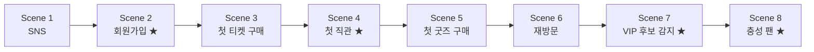

# 04_DEMO.md — Cloud Alpacas Demo Story & 발표 시나리오 [DRAFT — Phase 2 포함]

> **Status: DRAFT.** 이 문서는 원래 8/14 Phase 1 B2C Demo 계획이었다(§1~§6, 완료·보존).
> 현재는 그 다음 단계 — **B2C Fan 360 고도화 + Phase 2 B2B Collaboration/Sponsorship
> Expansion까지 구현한 뒤, 실제 Business Story와 End-to-End Workflow가 처음부터
> 끝까지 제대로 이어지는지 검증하기 위한 Demo Plan**으로 §7부터 재정의한다.
> **9/4 발표를 위한 계획이 아니다** — 발표 일정이 확정되면 그때 별도로 기록한다.
> §7 이후는 `03_SYSTEM.md §7`의 Technical Decision(A~K)이 2026-08-18 회의로
> **K(Account 집계)를 제외하고 확정된 상태**를 전제로 갱신했다(`05_DECISIONS.md`
> Decision 017·018). 여전히 DRAFT인 이유는 발표 일정·8/21 이후 실제 Org 구현
> 검증이 아직 남아 있기 때문이다.

> 이 문서는 Demo Story, Screen, 발표 시나리오를 다룬다. Persona(김매니저·이루키)와
> Customer Journey의 근거는 `00_STORY.md`, 화면에 나오는 Object/Field 근거는
> `03_SYSTEM.md`다 — 이 문서는 그 둘을 **발표에서 보여줄 순서**로 엮는다.
> Sample Data의 실제 값(이름, 날짜, 수치)은 이 문서가 아니라 `docs/data/`에서
> 관리한다(CLAUDE.md §7 중복 방지) — 이 문서에는 "어떤 데이터가 필요한가"만 적는다.

---

## 1. Demo 방식 — Hybrid Demo

Cloud Alpacas Demo는 두 부분을 섞는다.

| 파트 | 방식 | 이유 |
|---|---|---|
| 이루키의 행동 (로그인, 티켓 구매, 체크인, 굿즈 구매) | **짧은 영상** | Fan App은 이번 프로젝트의 주인공이 아니라 Demo용 데이터 생성 채널이다(CLAUDE.md §5). 영상으로 빠르게 맥락만 보여준다. |
| 김매니저의 화면 (Dashboard, Fan 360, Recommendation, Flow) | **실제 Salesforce Org 라이브 클릭** | Demo의 핵심은 Salesforce Customer 360이다. 실제로 동작하는 것을 보여줘야 설득력이 있다. |

**백업 계획**: 네트워크·환경 문제에 대비해 동일한 시나리오의 라이브 클릭 부분도
녹화 영상으로 미리 준비해둔다.

---

## 2. Scene 구조 — 모듈형 설계

Demo 발표 시간이 아직 확정되지 않았기 때문에, Demo Story를 **독립적인 Scene 단위**로
쪼갠다. 발표 시간에 맞춰 Scene을 빼거나 더할 수 있다.

| 시간 | 구성 |
|---|---|
| 5분 Demo | **Core** 표시된 4개 Scene만 |
| 10분 Demo | 전체 8개 Scene (Fan Journey 전체) |

★ = Core Scene (5분 Demo에 포함)

---

## 3. Scene 상세

### Scene 1 — SNS (Extended)

- **Fan App 파트**: 이루키가 SNS에서 문선수의 하이라이트 영상을 보고 관심을 갖는 장면(영상).
- **Salesforce 파트**: 없음 (아직 Fan 레코드가 없다 — Pain Point: 팬이 되기 전 단계는
  아직 우리 시스템 밖의 일이다).
- **멘트 포인트**: "이루키는 아직 우리 데이터에 없습니다. 하지만 다음 장면에서 가입하는
  순간, 우리는 이루키가 SNS를 통해 왔다는 것도 함께 기록합니다."

### Scene 2 — 회원가입 (Core ★)

- **Fan App 파트**: 이루키가 Fan App에 가입하는 장면(영상). 가입 채널로 "SNS" 선택.
- **Salesforce 파트(라이브)**:
  1. Fan 360 Dashboard에서 신규 Fan(이루키) 레코드 확인 — `Acquisition_Channel__c` =
     SNS, `Current_Segment__c` = New Fan.
  2. Flow(03_SYSTEM.md §4.4 Welcome Campaign Flow)가 이미 실행되어 `Notification_Log__c`에
     Welcome 안내가 기록된 것을 Fan Timeline에서 확인.
- **멘트 포인트**: "가입하자마자 시스템이 자동으로 이루키를 New Fan으로 분류하고, Welcome
  안내를 보냈습니다 — 사람이 엑셀을 정리할 필요가 없습니다."

### Scene 3 — 첫 티켓 구매 (Extended)

- **Fan App 파트**: 이루키가 친구와 함께 볼 경기 티켓을 구매하는 장면(영상).
- **Salesforce 파트 (라이브)**: Order(Ticket Purchase) 레코드와 OrderItem의 좌석 정보를
  Fan Timeline에서 확인.
- **멘트 포인트**: "티켓, 좌석, 경기 정보가 모두 이루키 레코드 하나에 연결됩니다."

### Scene 4 — 첫 직관 (Core ★)

- **Fan App 파트**: 경기장 게이트에서 체크인하는 장면(영상).
- **Salesforce 파트 (라이브)**:
  1. `Admission__c` 레코드 생성 확인.
  2. `Current_Segment__c`가 New Fan → **Active Fan**으로 바뀐 것을 Fan 360 Dashboard에서
     확인 — `Fan_Segment_History__c`에 전환 이력이 남아있음을 함께 보여준다.
- **멘트 포인트**: "실제로 경기장에 온 순간, 이루키는 '활동하는 팬'으로 자동 전환됩니다."

### Scene 5 — 첫 굿즈 구매 (Extended)

- **Fan App 파트**: 이루키가 문선수 유니폼을 구매하는 장면(영상).
- **Salesforce 파트 (라이브)**: Order(Goods Purchase) 확인, Recommendation Panel에서
  Favorite Player Campaign 추천이 생성된 것을 확인 — `Favorite_Player__c` = 문선수와
  연결됨.
- **멘트 포인트**: "이루키가 문선수 유니폼을 산 것을 시스템이 인식하고, 최애 선수 기반
  추천을 자동으로 만듭니다."

### Scene 6 — 재방문 (Extended)

- **Fan App 파트**: 이루키가 몇 차례 더 경기장을 찾는 장면(영상, 여러 Admission을 빠르게
  몽타주로).
- **Salesforce 파트 (라이브)**: `Fan_Activity_Pattern__c`가 갱신되어 재방문 횟수·누적
  지출이 쌓이는 것을 확인.
- **멘트 포인트**: "한 번의 방문이 아니라, 누적된 패턴을 시스템이 계속 지켜보고 있습니다."

### Scene 7 — VIP 후보 감지 (Core ★)

- **Fan App 파트**: 없음 (이 장면은 순수하게 Salesforce의 자동화를 보여주는 장면).
- **Salesforce 파트 (라이브)**:
  1. `Fan_Activity_Pattern__c`가 조건(재방문 3회 이상 + 누적 지출 임계값)을 충족하는
     순간, VIP 후보 감지 Flow(03_SYSTEM.md §4.5)가 실행된다.
  2. `Recommendation__c`(Membership Campaign)이 생성된 것을 확인.
  3. **Slack 채널**에 "이루키님이 VIP 후보입니다" 알림이 도착한 것을 실시간으로 보여준다.
- **멘트 포인트**: "Pain Point 4번, 기억하시나요 — VIP가 될 가능성이 높은 팬을 엑셀
  정리 후에야 발견하던 문제. 지금은 그 순간 김매니저의 Slack으로 알림이 옵니다."
  *(이 Scene이 Demo 전체에서 가장 중요한 "Aha 모먼트"다.)*

### Scene 8 — 충성 팬 (Core ★)

- **Fan App 파트**: 이루키가 멤버십에 가입하는 장면(영상).
- **Salesforce 파트 (라이브)**:
  1. Order(Membership Enrollment) 생성 확인.
  2. Fan 360 Dashboard에서 이루키의 전체 여정(가입 → 티켓 → 직관 → 굿즈 → 재방문 →
     멤버십)이 Fan Timeline 하나에 모두 연결되어 보이는 최종 화면을 보여준다.
- **멘트 포인트**: "SNS에서 시작한 관심이, 충성 팬이 되기까지의 전 과정이 하나의 화면에
  담겨 있습니다 — 이게 저희가 만든 Customer 360입니다."

---

## 4. 화면(Screen) 목록

Demo에서 실제로 열어 보여줄 화면. 근거 Object는 `03_SYSTEM.md`를 참고한다.

| 화면 | 등장 Scene | 보여주는 것 |
|---|---|---|
| Fan 360 Dashboard | 2, 4, 8 | Fan 목록, Current Segment(Life Cycle) 현황, 오늘의 Recommendation |
| Fan Profile | 2, 5, 8 | 이루키 개인 정보(`Favorite_Player__c`, `Acquisition_Channel__c`, Consent 필드) + Fan을 이해하기 위한 핵심 현재값/요약값(`05_DECISIONS.md` Decision 009·010) — **원본은 각 Object에서 조회/집계하고, Person Account에 중복 저장하지 않는다**: 최근 관람일·총 관람 횟수(`Attendance_Record__c` 집계), 총 구매금액/구매 빈도(Order/OrderItem 집계), 최근 활동일(Engagement Signal/Order/Admission 중 최신 — Fan Timeline 최상단), Membership 가입 여부(Order, `Order_Type__c` = Membership Enrollment), Engagement Level(`Engagement_Level__c`), Engagement Score(`Engagement_Score__c` — 계산 공식 TBD), Fan Value(`Fan_Value_Tier__c`), Current Segment(`Current_Segment__c`) |
| Fan Timeline | 2, 3, 4, 8 | Admission·Order·Notification Log 등 이력을 시간순으로 |
| Recommendation Panel | 5, 7 | `Recommendation__c` 목록과 상태(Pending/Executed) |
| Slack 채널 | 7 | Flow가 보낸 내부 업무 알림 |

---

## 5. Sample Data 요구사항

Demo가 자연스럽게 이어지려면 아래 데이터가 **미리 준비**되어 있어야 한다. 실제 값(정확한
날짜, 이름 등)은 `docs/data/SAMPLE_DATA.md`, `docs/data/DEMO_DATASETS.md`에서 관리한다.

- 이루키 Fan 레코드 1건 (Acquisition_Channel__c = SNS, Favorite_Player__c = 문선수)
- 문선수 Player(Contact) 레코드 1건, 문선수 관련 Goods(Product2) 1건 이상
- Ticket Purchase(Order) 1건 이상, 관련 Game__c 레코드
- Admission__c 3건 이상 (Scene 6 "재방문"이 자연스럽도록 — 날짜를 분산)
- Goods Purchase(Order) 1건
- Fan_Activity_Pattern__c가 VIP 후보 조건을 충족하도록 누적된 수치
- Membership Enrollment(Order) 1건 (Scene 8 결과로 생성되거나, 미리 준비 후 라이브로 트리거)

---

## 6. Future Scope

- Demo 시간이 확정되면, 이 문서에 실제 발표 시간(예: "10분 확정")과 최종 Scene 조합을
  추가로 기록한다.
- 리허설 후 대사(멘트)는 실제 발표에 맞게 다듬는다 — 이 문서의 멘트 포인트는 초안이다.

---

## 7. [P2] DRAFT — Post Phase 1 / Phase 2 Demo 개요

Phase 1 Demo와 현재 Demo는 목적이 다르다. Phase 1 Demo(§1~§6)는 그대로 보존하고,
아래는 별도의 새 Demo Plan이다.

| | Phase 1 Demo (§1~§6, 완료) | 현재 Demo (§7~) |
|---|---|---|
| 목적 | B2C Fan 360 MVP를 8/14에 발표 | B2C 고도화 + B2B Sponsorship Sales가 실제로 하나의 Story로 이어지는지 검증 |
| Persona | 김매니저 · 이루키 | 김매니저(B2C) + **이 매니저**(B2B) |
| 흐름 | Fan App Event → Salesforce Customer 360 → Fan Profile/Timeline → Recommendation → Flow/Slack | B2C Fan 360 고도화 → Fan Insight → 기업 DB/Agentforce Matching → Outbound Lead → Lead Qualification → Account/Contact → Opportunity → Sponsorship Package/Quote → Pipeline/Revenue 확인까지 (§8.1 참고) |
| 기술 상태 | 확정(Decision 001~014) | **K(Account 집계)를 제외하고 확정**(`03_SYSTEM.md §7` A~K, 2026-08-18 회의 — `05_DECISIONS.md` Decision 017·018), Business 방향은 같은 날 멘토링으로 Sponsorship Sales 중심으로 갱신(Decision 019) |

> **✅ 2026-08-18 멘토링 Update**: 대표 시나리오가 Sanrio → **d'Alba(달바)**로 바뀌었고,
> Demo Scope의 End Point가 "Collaboration 진행 중"에서 **"Sponsorship Package/Quote →
> Pipeline/Revenue Dashboard 확인"**으로 이동했다(`00_STORY.md` §7, `05_DECISIONS.md`
> Decision 019). 아래 §8~§9를 이 방향으로 갱신했다.

> **Scope**: 구현하는 범위는 "Fan 360에서 발견한 신호를 실제 Sales Pipeline으로 연결하고, Sponsorship Package/Quote까지 제안한 뒤 Pipeline/Revenue Dashboard에서 계약 가능성을 확인하는 과정"이다 — Fan Insight → 기업 DB/Agentforce Matching → Outbound Lead → Lead Qualification → Account/Contact → Opportunity → Sponsorship Package/Quote/Negotiation → Closed Won/Contract → **Pipeline/Revenue Dashboard 확인**까지가 End Point다. 계약 이후 실제 성과 분석, 성과가 낮은 Sponsorship 재검토, 장기 재계약 판단은 Future Scope다(§12).

---

## 8. [P2] Core End-to-End Scenario

Demo는 "화면을 다 보여주는 것"이 아니라, **하나의 Business Story가 처음부터 끝까지
끊기지 않고 이어지는지**를 검증한다.

**B2C**: 김매니저가 Fan 360에서 팬을 이해한다 → Fan의 행동/Engagement/Fan Value를
확인한다 → Fan Grouping/Fan Insight를 확인한다.

**B2B (구현 범위)**: 이 매니저가 Fan Insight를 확인한다 → 팬덤의 광고 가치(예: 뷰티/
라이프스타일/F&B 관심)를 발견한다 → 기업 DB(약 100개)와 Agentforce Matching으로 Top 10
추천을 받는다(대표 예시: **d'Alba**) → 실제 Outbound 영업 대상을 Lead로 등록한다(Status로
후보/접촉/검토/Qualified 표현) → Lead Qualification을 거쳐 Lead Score를 평가한다(Agentforce
Fit Score와는 별개) → Account/Contact로 전환한다 → Opportunity를 만든다 → Sponsorship
Package/Quote를 제안하고 Negotiation을 진행한다 → Closed Won되면 Contract/Sponsorship
Revenue로 기록한다 → **Pipeline/Revenue Dashboard에서 목표 대비 현황을 확인한다 —
여기까지가 End Point다.**

**B2B (Future Scope)**: 계약 이후 실제 광고 효과·팬 반응을 분석한다 → 성과가 낮으면
재검토하거나 관계를 종료한다 → 장기 재계약/Partnership으로 발전시킬지 판단한다. 이
구간은 이번 구현 범위에 포함하지 않는다(`00_STORY.md` §8.4).

---

## 9. [P2] Scene 상세

각 화면을 "보여주는 것"이 아니라 **이 사람이 이 질문을 가지고 이 화면에 들어갔을 때,
무엇을 보고, 무슨 판단을 하고, 다음 Action으로 넘어가는가**를 기준으로 정리한다.
⭐️ 표시는 `03_SYSTEM.md §7`에서 아직 Technical Decision이 확정되지 않은 부분이다
(K/Account 집계 관련 항목에만 남는다). 🔵 표시는 구현 범위 밖(Future Scope)인 Scene이다.

| Scene | Persona | Business Question | Action | Salesforce Result | 화면에서 확인할 것 | Required Data |
|---|---|---|---|---|---|---|
| B2C-1. 팬 전체 조망 | 김매니저 | 우리 팬은 지금 어떤 상태인가? | Fan 360 Dashboard 조회 | Person Account 필드 기반 분포 | Current Segment/Engagement Level/Fan Value 분포 | 여러 세그먼트에 걸친 Fan 다수(§10 참고) |
| B2C-2. Fan Insight/Grouping | 김매니저 → 이 매니저 | 특정 팬층이 뚜렷한 특징을 보이는가? | Report/Report Type 조회(연령대×성별×관심사×Engagement) | 그룹별 집계 결과 | "○○명, 최근 3개월 증가율, 선호 카테고리(뷰티/라이프스타일/F&B 등)" 같은 요약 | `Gender__c`/`Birthdate`/`Favorite_Player__c`/`Engagement_Signal__c` 채워진 Fan 다수 — 화면 구현은 Report/Dashboard로 확정(`03_SYSTEM.md §7 J`) |
| B2B-1. 기업 DB/Agentforce Matching | 이 매니저 | 이 팬덤과 광고 가치가 높은 기업은? | Fan Insight 확인 → Agentforce Matching(기업 DB 약 100개 대상, Segment Match·Recommendation Reason 자동 생성) | 없음(Agentforce가 Top 10 + 근거 문장 생성, 상세 구현 TBD) | Top 10 추천 기업 목록(대표 예시: d'Alba) + 추천 근거 | B2C-2의 Fan Insight 결과, 기업 DB(약 100개, DART Open API가 Primary Data Source — 연동 기술은 TBD), `03_SYSTEM.md §7 B/H/I` |
| B2B-2. Outbound Lead 등록 | 이 매니저 | 이 추천 후보 중 실제로 영업을 시작할 곳은? | Lead 생성(Status로 후보/접촉/검토/Qualified 표현) | Lead 레코드 | Lead List/Detail | 추천 기업 정보 — 별도 Partner Candidate Object 없음(Lead로 흡수, `§7 A`). **추천 자체가 Lead가 아니다** — Outbound 대상 선정 시에만 Lead가 된다 |
| B2B-3. Lead Qualification | 이 매니저 | 이 Lead가 실제로 계약까지 이어질 가능성이 높은가? | 접촉·미팅 진행, Lead Score 평가 | Lead Score(`Lead_Score__c`, `§7 E`) 갱신 | Lead Detail의 `Lead_Score__c` — **Agentforce Fit Score(B2B-1)와는 다른 값** | 접촉 이력, 담당자 반응 등(Dummy Data로 표현) |
| B2B-4. Account/Contact 전환 | 이 매니저 | 누구와 논의를 이어가는가? | Convert Lead | Account+Contact(+Opportunity) 생성 | Account Detail, Related Contacts | Qualified된 Lead |
| B2B-5. Opportunity | 이 매니저 | 이 스폰서십을 추진할 것인가? | Stage 변경(Kanban) | Opportunity Stage 진행(예: Advertising Sponsorship), Expected Benefit(단기/중기/장기, `§7 F`)·Target Segment(Picklist, `§7 G`) | Stage Kanban, Amount, Probability | Opportunity, Product(Sponsorship Package) |
| B2B-6. Sponsorship Package/Quote/Negotiation | 이 매니저 | 무엇을, 얼마에 제안하는가? | 라인업 확정(구장 광고/전광판/SNS 노출/Brand Day 등), Standard Quote 생성, 협상 | Product 연결 + Quote/QuoteLineItem | Products Related List, Quote Related List | Sponsorship Package(Product2) — Quote 사용 확정(`§7 C`) |
| B2B-7. Closed Won/Contract | 이 매니저 | 계약이 성사됐는가? | Opportunity Closed Won 처리 | Contract/Sponsorship Revenue 기록 | Opportunity Stage=Closed Won, Amount | 협상 완료된 Opportunity |
| B2B-8. Pipeline/Revenue Dashboard | 이 매니저 | 목표 매출 대비 얼마나 부족한가? | Report/Dashboard 조회 | Pipeline 지표(Opportunity 수, Stage별 분포, Pipeline Amount 등) | 목표 매출 대비 부족 금액 등 — **구체적 지표/계산식은 TBD**(`03_SYSTEM.md §7`) | Opportunity/Contract 데이터 — **End Point** |
| 🔵 B2B-9. 계약 이후 Performance *(Future Scope)* | 이 매니저 | 실제 광고 효과가 있었는가? | Report/Dashboard 조회 | 성과 지표 | 팬 반응/참여 지표 | 계약 이후 성과 데이터 — 범위 밖(§12) |
| 🔵 B2B-10. 재검토/장기 재계약 판단 *(Future Scope)* | 이 매니저 | 관계를 지속·확대할 것인가? | 성과 분석 → 재검토/종료 또는 장기 재계약 검토 | Account 상태 변화 | Account Detail, Sponsor Contract(TBD) | 성과 데이터 — 범위 밖(§12) |

> Account의 `Active Collaboration`/`Total Collaboration Value` 집계 필드(`§7 K`)는 여전히 On Hold다 — 위 Scene 중 이 집계에 의존하는 화면은 없다. Collaboration(Campaign Record Type)은 Opportunity Won 이후 필요하면 실행 수단으로 쓰일 수 있지만, 위 표에서 별도 필수 Scene으로 두지 않는다(`00_STORY.md` §8.3).

---

## 10. [P2] Demo Data 규모 검토

### 현재 상태

Org에는 Fan이 약 20명 있고, `docs/data/SAMPLE_DATA_v2_1.md`에 상세히 정의된 것은
5명(이루키·박서연·김도현·최민재·정하윤)이다. 이 5명은 **"Picklist 값이 최소 1번씩
동작하는지" 검증용**으로 설계되어 있다 — Current Segment 5종, Fan Value 3종,
Engagement Level 5종이 각각 1명씩만 배정되어 있다.

### 무엇이 부족한지

- **`Gender__c`/`Birthdate` 값 자체가 어떤 샘플에도 채워져 있지 않다** — Fan
  Grouping/Insight를 성별·연령으로 보여주는 Demo는 지금 데이터로는 아예 불가능하다.
- 조합마다 사람이 1명뿐이라 "그룹"이라는 표현이 성립하지 않는다 — 예를 들어 지금
  구조로는 "20~30대 여성 팬 2,140명" 같은 화면을 만들 수 없고, "20~30대 여성 팬
  1명"만 보여줄 수 있다.
- `Engagement_Signal__c`가 팬당 1~2건뿐이라, "선호 굿즈 카테고리"·"관심사" 같은
  집계형 분석에는 근거가 부족하다.
- 시간에 따른 변화(예: "최근 3개월 관람 증가율")를 보여주려면 여러 달에 걸쳐
  분산된 이벤트 데이터가 필요한데, 현재는 특정 시즌 한 시점에 몰려 있다.

### 규모 제안 (단계적 검증 — 최종 목표는 확정됨)

| 단계 | 목적 | 규모 | 상태 |
|---|---|---|---|
| **Minimum** | 화면/Flow가 깨지지 않고 동작하는지 검증 | 현재 수준(5~10명, Picklist 값 1회 이상) | ✅ 이미 갖춰짐 — "그룹"을 보여줄 수는 없음 |
| **소규모 QA** | Fan Grouping/Insight가 "의미 있는 그룹"으로 보임 | 약 30~35명(`P2_DUMMY_DATA_MASTER.md`) | ✅ 존재함 — 삭제하지 않고 QA용으로 유지 |
| **최종 Target Demo Scale** | Fan Segment/기업 Matching/Scoring의 분포가 설득력 있게 드러남 | **최소 5,000 Fans** | ✅ **헤드카운트 충족** — Org에 5,024건 존재 확인(읽기 전용 조회). Field/Distribution QA는 별도 대상, 아직 미검증 |

> **✅ Org Insert 완료 확인**: `CloudAlpacasProd`에 Fan(Person Account) **5,024건**이
> 존재함을 읽기 전용 조회로 확인했다 — 목표(최소 5,000명) 충족을 헤드카운트
> 기준으로 확인한 것이며, `data/DEMO_DATA_STANDARD.md §6.4.2`가 요구하는
> 분포/필수 Field 충족 여부는 **별도 QA 대상**으로 남는다(아직 검증 안 함).
>
> **✅ 2026-08-18 멘토링 갱신**: 기존 "약 1,000 Fans" 목표를 **최소 5,000명**으로 상향했다
> (`data/DEMO_DATA_STANDARD.md` §6.4.1, `05_DECISIONS.md` Decision 019) — 100명 이하
> 소규모 데이터로는 Fan Segment/기업 Matching/Scoring의 분포를 설득력 있게 보여주기
> 어렵다는 멘토 피드백을 반영했다. 소규모 QA 데이터(30~35명)에서 바로 최종 목표로
> 스케일업하며, 그 분포 기준은 `data/DEMO_DATA_STANDARD.md` §6.4.2에서 정의한다.
> **"목표 데이터 규모"와 "구현 완료 여부"는 구분한다** — 실제 5,000명 CSV 생성/Org
> Insert는 별도 Data 작업이며, 이번 갱신은 목표와 분포 기준만 정의한다.

Fan 수뿐 아니라 관련 Record도 함께 늘어나야 한다: Order/OrderItem, Admission,
Attendance_Record, Fan_Activity_Pattern, Engagement_Signal, Recommendation,
Benefit, Campaign/CampaignMember — Fan 1명이 늘면 이 Record들도 비례해서 늘어야
"팬 하나의 여정"이 아니라 "팬층의 패턴"이 보인다. 정확한 배율은 팀 확인 필요
(TBD) — 실제 값과 비율은 `data/DEMO_DATA_STANDARD.md` §6.4에서 관리한다.

---

## 11. [P2] 공용 Dummy Data 기준

팀 전체가 같은 규칙으로 Demo Data를 만들기 위한 공용 기준(Naming Rule, Fan 분포,
Cross-Object 일관성, 담당자, Freeze 절차)은 `docs/data/DEMO_DATA_STANDARD.md`에서
관리한다(CLAUDE.md §7 중복 방지 — 이 문서에는 반복하지 않는다).

---

## 12. [P2] Future Scope / 미확정 사항

**2026-08-18 Technical Decision 회의로 확정된 것** (`03_SYSTEM.md §7`·`05_DECISIONS.md` Decision 017/018 참고):
Partner Candidate → Lead 흡수, AI Matching/Segment Match/Recommendation Reason = Agentforce,
Standard Quote 사용, Collaboration = Campaign Record Type, Lead Score(`Lead_Score__c`),
Expected Benefit 3분할, Target Segment Picklist, Fan Insight = Report/Dashboard.

**같은 날 멘토링으로 확정된 것**(`05_DECISIONS.md` Decision 019):
Business Story 중심축 = Sponsorship Sales/Pipeline(Collaboration 아님), 대표 시나리오 =
d'Alba(Sanrio 아님), 기업 DB(약 100개, Agentforce Top 10 추천), Fan Fit/Recommendation
Score ≠ Lead Score, Fan Dummy Data 최종 목표 = 최소 5,000명.

**2026-08-19 추가로 확정된 것**(`05_DECISIONS.md` Decision 020): 기업 DB(약 100개)는
**Salesforce Object가 아니다** — Agentforce Matching의 External Input/Data Source로만
쓰이며, 100개 전체를 Lead로 만들지 않는다. **Primary Data Source는 DART Open API**로
확정한다 — CSV는 기본 저장 방식이 아니라 필요할 때만 쓰는 개발/테스트용 대체 입력
(Optional)일 뿐이다. Agentforce 출력인 Top 10 Recommendation도 Object가 아니고 반드시
DB에 저장해야 하는 레코드로 정의하지 않으며, 아직 Lead가 아니다 — 이 중 담당자가
선택한 기업만 Lead가 된다(DART Open API → 약 100개 기업 조회 → Agentforce Matching →
Top 10 Recommendation → 담당자가 기업 선택 → 선택된 기업만 Lead).

**구현 범위 밖 — Future Scope (§7, §8)**:

- **계약 이후 실제 성과 분석** — 광고 효과·팬 반응 데이터를 근거로 한 성과 분석
- **성공/실패 KPI 판단 기준** — Sponsorship의 성공 기준 자체가 아직 정의되지 않음(TBD)
- **성과가 좋지 않을 때의 재검토/관계 종료** — 판단 절차·기준 모두 TBD
- **장기 재계약/Partnership 전환** — Sponsor Contract 갱신 등 후속 Object/Field 설계 포함
- **과거 Campaign Performance를 활용한 고도화** — 새 Sponsorship 방향을 과거 Campaign
  성과 데이터로 참고한다는 Story(`00_STORY.md` §8.3)는 있지만, 실제 Campaign Performance
  데이터의 축적·분석 기능은 구현하지 않는다 — Demo에서 필요하면 Dummy Data로만 표현한다
- **실제 SNS/외부 데이터 소스 연동** — SNS 반응은 현재 `Engagement_Signal__c`의 Dummy
  Data로만 표현한다. Data Cloud 등을 통한 실시간 SNS Click 수집은 미구현이며, 연동
  가능 여부는 별도 Technical TBD로 남긴다(`03_SYSTEM.md §5`, `data/P2_DUMMY_DATA_MASTER.md §2.3`)
- **기업 DB(약 100개)의 실제 외부 데이터 연동** — DART Open API를 Primary Data Source로
  확정했으나(Decision 020), 실제 Salesforce/Agentforce 연동 기술(커넥터/Apex/External
  Object 등)은 아직 구현되지 않았다. 실제 기업 정보 수집/갱신 자동화는 Future Scope다

**여전히 미확정인 것**:

- Account `Active Collaboration`/`Total Collaboration Value` 집계 필드(`03_SYSTEM.md §7 K`) — On Hold
- Lead Status의 정확한 Picklist Label(후보/접촉/검토/Qualified 단계 표현 방식)
- Expected Benefit 필드의 정확한 API Name
- Target Segment Picklist의 실제 값 목록
- Agentforce AI Matching/Segment Match/Recommendation Reason의 상세 기술 구성(프롬프트·데이터 소스 등)
- DART Open API의 실제 Salesforce/Agentforce 연동 기술 방식(커넥터/Apex/External Object 등) — Primary Data Source는 Decision 020으로 확정(Object 아님, DART Open API 우선, §7 B 참고). CSV는 필요 시 개발/테스트용 대체 입력으로만 검토
- Pipeline/Revenue Dashboard의 구체적인 지표·계산식(목표 매출, 필요 신규 스폰서 수 등)
- 발표 일정·시간은 아직 확정되지 않았다.
- **5,000 Fan Data의 Field/Distribution QA** — 헤드카운트(Org 5,024건)는 확인됐지만,
  `data/DEMO_DATA_STANDARD.md` §6.4.2가 요구하는 분포 비율·필수 Field
  (`Gender__c`/`Birthdate` 등) 충족 여부는 아직 검증하지 않았다(§10 참고).
