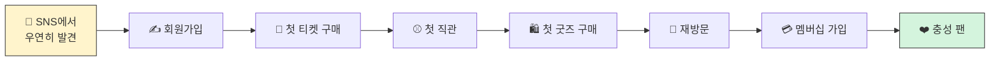

# 01. Customer Journey

**이 페이지가 답하는 질문**: 이 고객 여정이 말이 되나요? (Does this customer
journey make sense?)

---

## Diagram

## Table

| 단계 | 이루키의 행동 | 김매니저의 Action |
|---|---|---|
| SNS | 문선수 영상을 보고 관심을 가짐 | (관찰만) |
| 회원가입 | 가입 완료 | Welcome Campaign |
| 첫 티켓 구매 | 구매 안 하고 있음 | First Ticket Campaign |
| 첫 직관 | 게이트 통과 | First Visit Guide |
| 첫 굿즈 구매 | 아직 안 삼 | 쿠폰 발급 |
| 재방문 | 반복 관람 | Membership Campaign 제안 |
| 멤버십 가입 | 가입 완료 | — |
| 충성 팬 | ? | ? |

## Team Discussion

- 이 8단계 순서가 자연스러운가요? 빠진 단계가 있나요?
- "충성 팬" 다음 — 시즌권 구매까지 넣을까요, 오늘은 여기까지만 그릴까요?
- "재방문"은 몇 번부터인가요? (숫자를 오늘 정한다)

| 제안자 | 내용 |
|---|---|
| | |
| | |
