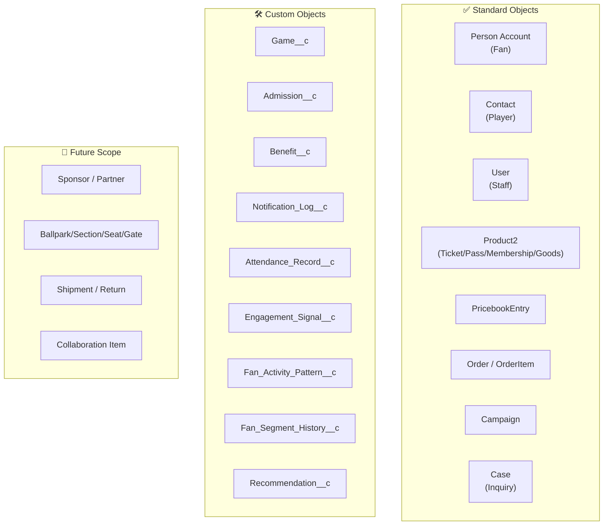

# 02. Objects

**이 페이지가 답하는 질문**: 우리에게 어떤 Object가 필요한가요? (What objects do
we need?)

---

## Diagram

## Table

| Object | 무엇인가 | 왜 필요한가 |
|---|---|---|
| Person Account | 팬(이루키)을 표현한다 | 팬이 직접 구매·이용하는 B2C 고객이라 |
| Contact (Player) | 선수를 표현한다 | 팬의 최애 선수를 지정하고 추천에 쓴다 |
| User | 직원(김매니저)을 표현한다 | Salesforce 기본 계정이다 |
| Product2 | 티켓/시즌권/멤버십/굿즈를 표현한다 | 검증된 표준 판매 구조를 그대로 쓴다 |
| PricebookEntry | 상품 가격을 표현한다 | 등급별 가격을 표준 기능으로 관리한다 |
| Order / OrderItem | 팬의 구매를 표현한다 | 팬이 즉시 결제하는 셀프서비스 거래다 |
| Campaign | 마케팅 캠페인을 표현한다 | 표준 기능으로 충분하다 |
| Case | 팬 문의를 표현한다 | 표준 기능으로 충분하다 |
| `Game__c` | 경기를 표현한다 | 표준 Object가 없다 |
| `Admission__c` | 입장 1건을 표현한다 | "몇 번"과 "언제"를 구분해야 한다 |
| `Benefit__c` | 팬이 받은 혜택을 표현한다 | 마케팅·멤버십·굿즈가 공통으로 쓴다 |
| `Notification_Log__c` | 발송 이력을 표현한다 | Fan Timeline의 핵심 데이터다 |
| `Attendance_Record__c` | 누적 관람 이력을 표현한다 | 입장 기록을 팬 단위로 집계해야 한다 |
| `Engagement_Signal__c` | 관심 신호를 표현한다 | 구매 전 관심도도 팬 이해에 필요하다 |
| `Fan_Activity_Pattern__c` | 시즌별 활동 패턴을 표현한다 | VIP 후보 감지의 근거가 된다 |
| `Fan_Segment_History__c` | 팬 상태 변화 이력을 표현한다 | 언제 바뀌었는지가 자동화의 근거다 |
| `Recommendation__c` | 다음 행동 제안을 표현한다 | 이 프로젝트의 핵심 목표 그 자체다 |
| Sponsor / Partner 🔵 | 스폰서·협업사 관계를 표현한다(예정) | 이번 Demo는 팬 개인 여정에만 집중한다 |
| Ballpark 구조 🔵 | 경기장 구조를 표현한다(예정) | 지금은 단일 홈구장이라 필드로 충분하다 |
| Shipment/Return 🔵 | 배송·반품을 표현한다(예정) | 이 프로젝트의 목적은 물류가 아니다 |

## Team Discussion

- 17개 Object 중 아직 확신이 안 서는 게 있나요?
- Future Scope 중 지금 당장 필요해 보이는 게 있나요?
- 오늘 여기서 답을 못 찾은 Object가 있다면 무엇인가요?

| 제안자 | 내용 |
|---|---|
| | |
| | |
