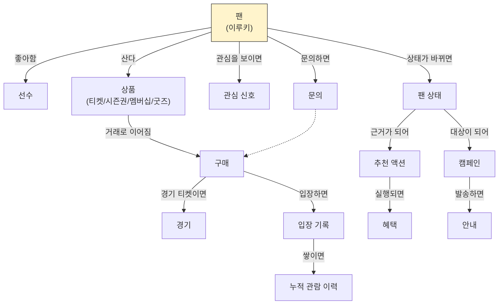
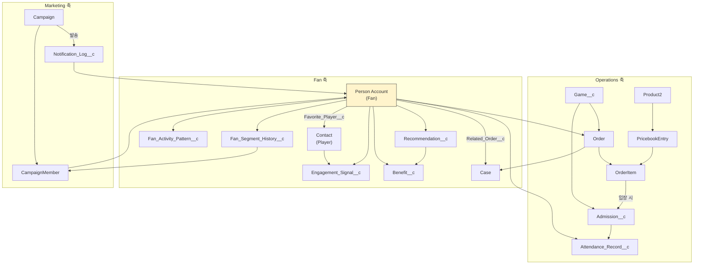

# 03. ERD

**이 페이지가 답하는 질문**: Object들이 서로 어떻게 연결되나요?

> 오늘 가장 중요한 페이지입니다. A3로 인쇄해서 손으로 관계를 더 그려도 됩니다.

---

## ① Business ERD

---

## ② Salesforce ERD

---

## ③ 전체 Object Map (참고 이미지)

> 이 이미지는 **Workshop/팀 논의용 시각적 참고 자료**다 — Standard Object/Custom
> Object를 한눈에 보여준다. **공식 Object 관계 정의는 `docs/03_SYSTEM.md` §3.4
> Relationship Summary의 Mermaid `erDiagram`**이며, 관계가 바뀌면 그 문서를 먼저
> 고친다 — 이 이미지는 정적 파일이라 자동으로 갱신되지 않는다.
