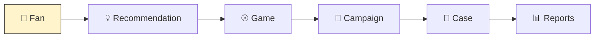

# 04. Tabs

**이 페이지가 답하는 질문**: 김매니저가 실제로 무엇을 보게 되나요? (What will
Kim Manager actually see?)

---

## Diagram

## Table

| Tab | 김매니저가 여기서 하는 일 |
|---|---|
| Fan | 팬을 검색하고 360° 프로필을 본다 |
| Recommendation | 오늘 처리할 Next Best Action을 확인한다 |
| Game | 경기 일정을 확인한다 |
| Campaign | 진행 중인 캠페인을 확인한다 |
| Case | 팬 문의에 대응한다 |
| Reports | 성과를 확인한다 |

## Team Discussion

- 이 6개면 충분한가요? 매일 쓸 화면이 빠졌나요?
- 순서가 이 순서(로그인 후 가장 먼저 보는 것부터)가 맞나요?

| 제안자 | 내용 |
|---|---|
| | |
