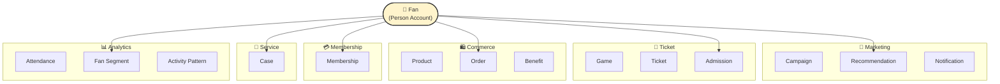
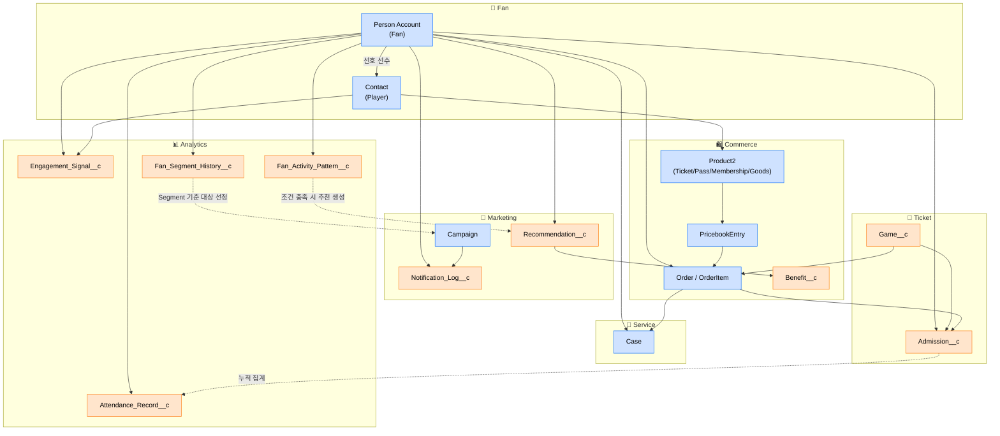
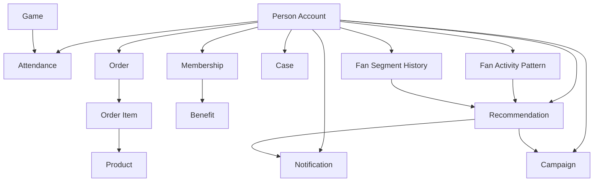
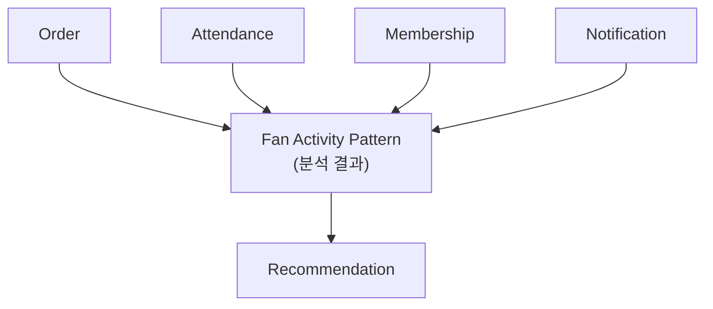
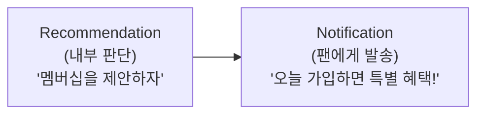

# 05. Object Map — Cloud Alpacas Domain Overview

**이 페이지가 답하는 질문**: Cloud Alpacas 전체 Object가 도메인별로 어떻게
연결되어 있나요? (5분 안에 전체 그림 이해하기)

> **이건 ERD가 아니다.** Cardinality도, Field도 없다. Salesforce의 Industry
> Overview 다이어그램(예: Automotive Cloud Overview)처럼, **어떤 Object가 어느
> 업무 영역에 속하고 서로 어떻게 이어지는지**를 한 장으로 보여주는 지도다.
> - "이 Object가 필요한가?"는 [`02_Objects.md`](./02_Objects.md)에서 결정한다.
> - "정확한 관계·Cardinality"는 [`03_ERD.md`](./03_ERD.md)에서 본다.
> - 이 페이지는 **처음 온 사람이 전체 그림을 잡는 용도**다.

---

## Objects by Domain

| 도메인 | Object |
|---|---|
| **Fan** | Person Account, Contact(Player) |
| **Marketing** | Campaign, `Recommendation__c`, `Notification_Log__c` |
| **Ticket** | `Game__c`, Ticket(Product2 Record Type), `Admission__c` |
| **Commerce** | Product2, PricebookEntry, Order/OrderItem, `Benefit__c` |
| **Membership** | Membership(Product2 Record Type) |
| **Service** | Case |
| **Analytics** | `Attendance_Record__c`, `Engagement_Signal__c`, `Fan_Activity_Pattern__c`, `Fan_Segment_History__c` |

> Ticket/Season Pass/Membership/Goods는 서로 다른 Object가 아니라 **Product2 하나를
> Record Type으로 구분**한 것이다 — 그래서 Ticket 도메인과 Membership 도메인에
> "별도 Object"처럼 보이지만 실제로는 Commerce의 Product2와 같은 테이블이다.

---

## Diagram ① — 한눈에 보기 (5분 버전 · 인쇄용)

Business 이름만 쓴, 가장 단순한 버전이다. 정확한 Object 이름은 위 표와 Diagram
②를 본다.

---

## Diagram ② — 상세 연결 지도 (공식 Mermaid 버전)

실제 Object 이름, Standard/Custom 색 구분, 관계 종류(실선/점선)까지 담은 버전이다.
이후 코드만 보고도 이 그림을 다시 그릴 수 있다.

---

## How to read this map

- 🔵 **파란색** = Standard Object (Salesforce 기본 제공)
- 🟠 **주황색** = Custom Object (Cloud Alpacas가 새로 만든 것)
- **실선(──)** = 실제 관계(Lookup/Master-Detail로 연결되어 있음)
- **점선(┄┄)** = Business Reference — 필드로 직접 연결된 건 아니지만, 업무상
  중요한 관계(예: `Fan_Activity_Pattern__c`가 조건을 만족하면 Flow가
  `Recommendation__c`를 만든다 — 자세한 내용은 `03_SYSTEM.md` §4.6)

**이번엔 안 그림**: Sponsor/Partner 관련 Object는 이번 MVP 범위 밖(Decision 005)이라
이 지도에 넣지 않았다.

---

## 2. Object Relationship (Mermaid)

위 Diagram ①·②는 워크숍 토론용이다. 이 섹션은 **문서용 공식 버전**이다 — 도메인
그룹핑이나 색 구분 없이, 관계만 가장 단순하게 남겨서 이후 AI나 다른 개발자가
코드만 보고도 그대로 다시 그릴 수 있게 했다.

### Relationship Summary

| Object | Connected To | Why |
|---|---|---|
| Person Account | Attendance | 팬이 몇 번, 언제 왔는지 알아야 한다 |
| Person Account | Order | 팬이 무엇을 샀는지 알아야 한다 |
| Person Account | Membership | 팬이 멤버십에 가입했는지 알아야 한다 |
| Person Account | Recommendation | 팬에게 어떤 다음 행동을 제안했는지 알아야 한다 |
| Person Account | Notification | 팬에게 어떤 안내를 보냈는지 알아야 한다 |
| Person Account | Campaign | 팬이 어떤 캠페인 대상인지 알아야 한다 |
| Person Account | Case | 팬이 어떤 문의를 남겼는지 알아야 한다 |
| Person Account | Fan Activity Pattern | 팬의 활동 패턴을 분석해야 한다 |
| Person Account | Fan Segment History | 팬 상태가 언제 바뀌었는지 이력이 남아야 한다 |
| Game | Attendance | 어느 경기에 왔는지 알아야 한다 |
| Order | Order Item | 주문 하나에 어떤 항목들이 담겼는지 알아야 한다 |
| Order Item | Product | 실제로 무엇을 주문했는지 알아야 한다 |
| Membership | Benefit | 멤버십 가입자에게 어떤 혜택을 주는지 알아야 한다 |
| Recommendation | Notification | 추천이 실행되면 팬에게 안내가 나간다 |
| Recommendation | Campaign | 추천이 어떤 캠페인으로 이어지는지 알아야 한다 |
| Fan Activity Pattern | Recommendation | 활동 패턴이 추천의 근거가 된다 |
| Fan Segment History | Recommendation | 팬 상태 변화가 추천의 근거가 된다 |

---

## 🤔 자주 묻는 질문 (FAQ)

> 아래는 그림만 보고 헷갈리기 쉬운 4가지를 빠르게 짚은 것이다. **"왜 이렇게
> 설계했는지" 전체 이유(대안 비교 포함)**는 [`06_RELATIONSHIP_GUIDE.md`](./06_RELATIONSHIP_GUIDE.md)에
> 모아뒀다.

### Fan Activity Pattern은 왜 Order Item과 연결되어 있지 않나요?

Fan Activity Pattern은 거래 기록이 아니라, 여러 팬 활동을 모아 집계한
**분석 결과**다.

### Product2와 Order Item은 뭐가 다른가요?

| | Product2 | Order Item |
|---|---|---|
| 질문 | "우리가 팔 수 있는 게 뭔가?" | "이 팬이 실제로 뭘 샀나?" |
| 존재 조건 | 구매 여부와 무관하게 존재 | **구매가 일어난 뒤에만** 존재 |

### Recommendation은 왜 Notification과 연결되어 있나요?

Recommendation은 **내부 판단**이고, Notification은 **팬에게 실제로 나가는
메시지**다.

### Admission은 왜 Order와 분리되어 있나요?

Order는 "구매했다"는 뜻이고, Admission은 "실제로 왔다"는 뜻이다 — 팬은 티켓을
사고도 경기장에 오지 않을 수 있다.

| | Order | Admission |
|---|---|---|
| 뜻 | 구매함 | 실제로 옴(게이트 통과) |
| 항상 같이 일어나나? | 아니오 — 사고 안 올 수도 있다 | |
