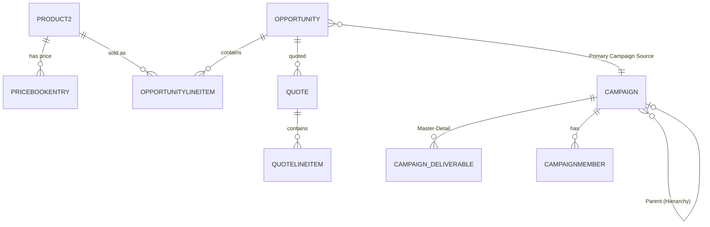
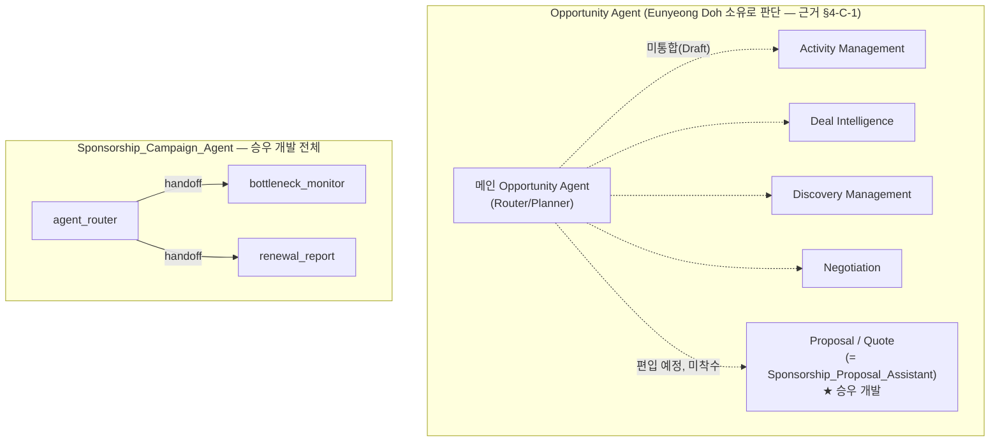

# Individual Development Handoff — Seungwoo — Cloud Alpacas

> **작성 기준일**: 2026-08-31
> **대상**: 승우(Rafael Jeong / 실제 계정명 wjdtmddn5390@gmail.com / Salesforce Display Name "Rafael Espada" / git author "Rafael Jeong"·"RafaelJeong")
> **작성 원칙**: 이 문서는 아래 3개 근거를 서로 구분해 조사한 뒤 교차검증했다.
> - **A. Claude Code 개발 기록** — 이번 세션 및 `P2_RESULT_REPORT/`·`docs/`에 이미 남아있는, 세션 진행 중 작성된 1차 기록(`B2B_CAMPAIGN_QUOTE_UNDOCUMENTED_IMPLEMENTATION.md`, Agent Spec, `AI_HANDOFF_CONTEXT.md` 등)
> - **B. Git/GitHub** — `feature/campaign-quote-undocumented-log` 브랜치 + 전체 원격 브랜치 + `origin/main`
> - **C. Salesforce Org 실측** — `CloudAlpacas` Production Org, read-only 조회
>
> 세 근거가 충돌하는 곳은 임의로 하나를 택하지 않고 [§19 Conflict / Unknown](#19-conflict--unknown)에 그대로 남겼다. Git에 없는 수동 Org 설정을 코드가 있다고 추정하지 않았고, Org에서 직접 확인하지 못한 상태는 "확인 불가"로 표시했다.
>
> ⚠️ **이 문서 자체 조사 과정에서 Salesforce Org/Git에 어떤 변경도 수행하지 않았다** (read-only 조사만 수행).
>
> **진행 상태**: Git 전수조사(B)와 Salesforce Org 실측(C) 둘 다 완료되어 이 문서 전체에 반영됐다(§16, §17이 각각의 원본 근거). 남아있는 🔶 PENDING 표시는 이 조사 범위 밖이었거나(예: PricebookEntry 21건 개별 최신가, Quote 정확한 레코드 건수) 원천적으로 확인 불가능한 소수 항목뿐이며, §19 Unknown에 별도로 정리했다.

---

## 1. Executive Summary

승우의 Phase 2 공식 담당 영역은 **Product + Quote + Campaign**(`docs/members/01_SEUNGWOO.md`)이다. 2026-08-20 1차 구현(표준 기능 + 선언적 설정만, Apex/LWC 없음)을 마친 뒤, 2026-08-20~08-31 사이에 이 범위를 훨씬 넘어서는 고도화를 진행했다:

1. **Campaign 실행 관리 인프라**를 처음부터 구축했다 — 신규 Custom Object(`Campaign_Deliverable__c`), Record Type 2종 신규 추가(Prospecting/Renewal), Campaign Hierarchy, Report 5종 + Dashboard, `Campaign.ExpectedRevenue` 자동 동기화 Flow 3종, 지연 감지 Slack 알림 Flow 2종, 갱신 성과 자동 요약 Flow 1종.
2. **Agentforce를 두 영역에 적용**했다 — (a) 팀이 승인한 "메인 Opportunity Agent + Subagent 5개" 구조 중 **Proposal/Quote Subagent**(`Sponsorship_Proposal_Assistant`)를 단독 설계·구현·Live Preview 검증까지 완료했으나, **Git 조사 결과 이 산출물은 한 번도 merge되지 않았고, 메인 Opportunity Agent 담당자(Dohgrae)가 동일한 이름의 PermSet·Apex 3개를 독립적으로 다시 만들어 그쪽이 현재 `origin/main`에 반영되어 있다**(§4-C-1, §16, §19 Conflict — 어느 쪽이 실제 운영 로직인지는 이 문서가 판단하지 않음). (b) Campaign 실행 병목 추적 + 갱신 성과 요약을 위한 신규 Agent **`Sponsorship_Campaign_Agent`**는 승우 단독·경합 없이 설계·구현·**Publish/Activate까지 완료**했다.
3. 오늘(2026-08-31) 세션에서, 기존 Opportunity Agent 임베디드 챗 위젯 패턴(`opportunityAgentChat`)을 그대로 재현해 **Campaign 레코드 페이지에 Agent 채팅 위젯을 임베드**하고, Named Credential 인증 문제를 해결해 실제로 동작시켰으며, 이어서 **Record Type(Collaboration/Renewal)별로 Page Layout을 분리**해 화면 정보 구조를 정리했다.
4. 이 과정에서 이 Org 고유의 **스키마 전파 지연 플랫폼 버그**를 최소 7개 필드에서 재현·진단하고, 최종적으로 "Metadata API 배포는 막히지만 Setup UI 수동 생성은 즉시 반영된다"는 재현 가능한 회피책을 발견해 팀 전체에 공유 가치가 있는 발견을 남겼다.
5. 팀원 파트 데이터를 건드린 사례가 3건 있다 — 전부 승우가 스스로 선언한 원칙("파트 내 고도화는 즉시 실행, 파트 경계를 넘는 경우만 사전 협의, 넘나든 과정은 항상 사후 보고")에 따라 진행 후 문서로 보고했다: Aaron Choi의 B2B Opportunity 104건에 Campaign 신규 연결, Opportunity.Partner_Tier__c(Eunyeong 필드) 스키마 버그 대리 수정, PRM_Manager_Access(Hyejune 작성) 권한 일시 유실 후 복구.
6. **가장 중요한 미해결 격차 2가지**(Git 전수조사로 확정): (a) 승우가 만든 것 중 상당수 — `Sponsorship_Campaign_Agent` 전체, `campaignAgentChat` 위젯, `Campaign_Deliverable__c` 객체, Campaign 관련 Flow 6종, 이번 세션 신규 Layout 2종 — 이 **Git 이 저장소 역사상 단 한 번도 커밋된 적 없이 Production Org에만 존재**한다. (b) 승우가 Git에 실제로 커밋한 유일한 코드(Proposal/Quote Subagent, 커밋 `f762840f`)는 **merge되지 않았고, 그 자리를 Dohgrae의 독립적인 재구현이 대체해 지금 `origin/main`에 있다** — 즉 승우의 "완료했다"는 서술과 "실제로 팀에 반영된 것"이 다를 수 있는, 이 문서가 임의로 해소하지 않은 진짜 Conflict다(§19).
7. **Org 실측으로 신규 확인된 2가지 위험 — 전부 해결 완료(2026-08-31)**: (a) Named Credential(`CA_Agent_API_PerUser`)의 Per-User Principal 접근 권한이 `CA_Opportunity_Agent_Access`에만 등록되어 있고 `CA_Campaign_Agent_Access`에는 없던 문제 — **`CA_Campaign_Agent_Access.permissionset-meta.xml`에 `externalCredentialPrincipalAccesses` 블록을 추가·배포해 Principal 접근 목록에 등록 완료(Connect API 재조회로 확인), 이 매니저 계정(Manager Lee, `leemanager@alpaca.com`)에도 이 PermSet을 배정 완료.** (b) `Sponsorship_Campaign_Agent`와 무관한 `Campaign_Agent` Bot(Chanyeon Kim, 2026-08-10) 명칭 충돌 — **`sf agent deactivate`로 Inactive 전환 완료(BotVersion 조회로 확인)**. 두 조치 모두 팀원(Manager Lee 계정 소관 부서/Chanyeon Kim) 관련 변경이라 사후 공유가 필요하다(§21).

---

## 2. Project Context

Cloud Alpacas는 한화 이글스를 모델링한 가상 구단의 Salesforce Customer 360 프로젝트다(`CLAUDE.md`). Phase 1(B2C Fan 360 MVP)은 2026-08-14 완료됐고, Phase 2(진행 중)는 B2C 고도화 + **B2B Sponsorship Sales Pipeline 확장**을 함께 다룬다. B2B 흐름의 핵심은 "협업을 잘할 기업을 찾는 것"이 아니라 **"스폰서십 비용을 지불할 기업을 발굴해 실제 Pipeline으로 연결하는 것"**이다(Decision 019).

승우는 이 흐름 중 **Opportunity 성사 이후 구간**(Product/Quote 제안 → Campaign으로 실행 관리 → 갱신)을 담당한다. Agentforce는 원칙적으로 Future Scope이지만, 지금까지 3개의 좁은 예외가 팀 승인을 받았다(`CLAUDE.md` §5): Decision 017(AI Matching), Decision 022(Opportunity Agent 5-Subagent), 그리고 이번 세션에 승격된 세 번째 예외(Sponsorship_Campaign_Agent, `B2B_CAMPAIGN_QUOTE_UNDOCUMENTED_IMPLEMENTATION.md` §32). 승우는 이 중 Decision 022의 한 조각(Proposal/Quote Subagent)과 세 번째 예외 전체를 담당했다.

---

## 3. My Development Scope

| 영역 | 공식 배정 여부 | 상태 |
|---|---|---|
| Product2(Sponsorship Package) | 공식(`01_SEUNGWOO.md`) | 완료, 팀 승인(가격 3차 조정 포함) |
| Standard Quote/QuoteLineItem | 공식 | 완료(자동화 없이 표준 기능만) |
| Campaign(Record Type/Hierarchy/실행 관리) | 공식 | 완료 선언(Decision 023), 이번 세션 화면 구조 추가 정리 |
| Campaign_Deliverable__c(신규 Object) | **비공식 확장**(팀 승인 전 Production 반영, 사후 문서화) | 유지 확정(Decision 023) |
| Campaign 관련 Flow 6종(동기화 3 + Slack 2 + 갱신요약 1) | 비공식 확장 | 전부 Active |
| Sponsorship_Proposal_Assistant(Opportunity Agent의 Proposal/Quote Subagent) | Decision 022로 사후 추인 | 구현·Live Preview 완료, **Draft**(메인 Agent 미통합) |
| Sponsorship_Campaign_Agent(신규 Agent) | 팀 전체 승인(2026-08-31) | 구현·Live Preview 완료, **Publish + Activate 완료(Active)** |
| campaignAgentChat 임베디드 위젯 + Page Layout 분리 | 이번 세션 신규 요청 | 구현 완료, 브라우저 실사용 검증 일부만 진행 |
| Opportunity.CampaignId 대량 연결(Aaron 데이터) | 파트 경계 밖, 사후 보고 | 완료 |

---

## 4. Ownership Map

Salesforce는 협업 프로젝트라, 아래 6개 범주로 기능을 구분했다. **팀원이 만든 기능을 승우가 활용했다는 이유만으로 승우의 개발로 기록하지 않았다.**

### A. 승우가 직접 최초 개발

Product2/Quote 1차 구현 전체(§2026-08-20), `Campaign_Deliverable__c` Object, Campaign Record Type 확장(Prospecting/Renewal), Campaign Hierarchy 확장, Report 5종+Net Profit 수식, Dashboard 7위젯, Product Schedule 활성화, Company Information, Help Text 16개, `Campaign.ExpectedRevenue` 동기화 Flow 3종, Campaign List View 4종 + Path Assistant 3종, Sponsorship Package 21종 가격 재설계(3차), `Campaign_Deliverable_Detect_Due_Date_Push`/`Campaign_Deliverable_Blocked_Slack_Alert` Flow, `Renewal_Campaign_Performance_Summary` Flow, `PricebookEntry` 협상 하한선 필드 2개, `Sponsorship_Proposal_Assistant`(Agent 전체 + Apex 3개), `Sponsorship_Campaign_Agent`(Agent 전체 + Apex 3개 + PermSet), `campaignAgentChat`/`campaignAgentChatModal`(패턴은 아래 C 참고) + `CampaignAgentChatController.cls`, 이번 세션의 Campaign Record Type별 Page Layout 2종.

### B. 팀원 기능을 수정/확장

| 기능 | 원 소유자 | 승우의 확장 |
|---|---|---|
| `PRM_Manager_Access` PermSet | Hyejune Jo(2026-08-18 생성), Aaron Choi(필드 권한 확장) | Opportunity/Quote 관련 Read/Create 권한 추가(2026-08-27). 과정에서 원본 권한 일시 삭제 사고 발생 → Setup Audit Trail로 복구(§14, §15 참고) |
| `CA_Opportunity_Agent_Access` PermSet | Opportunity Agent 통합 담당자 — **Eunyeong Doh로 판단**(git author "Dohgrae"가 실제로 만든 원본, Org LastModifiedBy도 Eunyeong Doh와 일치, §4-C-1 근거) | Proposal/Quote Subagent가 쓰는 Object/Field 최소 권한만 병합 배포 시도(Eunyeong의 기존 Discovery/Interaction 권한은 보존) — 단, 이 병합 자체가 merge되지 않아 실제로는 반영 안 됨(§16) |
| `sfdx-project.json`(`sourceApiVersion`) | 프로젝트 공통 설정 | 58.0 → 67.0으로 상향(AiAuthoringBundle 요구사항) — 프로젝트 전체에 영향을 주는 변경이라 별도 팀 공유 필요 |

### C. 팀원 기능을 Integration(그대로 재사용/복제)

- **`opportunityAgentChat`/`opportunityAgentChatModal` LWC + `OpportunityAgentChatController.cls`** — 승우가 만든 것이 **아니다. Git 조사로 원저자가 `Dohgrae`로 확인됐다**(최초 커밋 `df0ae714`, 2026-08-29 22:58:13, "feat(opportunity): embedded Opportunity Agent chat on the record page", `origin/main`에 존재). Campaign용 위젯을 만들기 위해 이 기존 패턴 전체(Named Credential Per-User OAuth 인증, Agent API 직접 호출 구조, localStorage 기반 대화 이력)를 리버스엔지니어링해서 그대로 클론했다. ⚠️ 로컬에 있는 3개 파일이 Dohgrae의 `origin/main` 버전과 byte-for-byte 동일한지는 git 조사에서도 **확인되지 않음**("Unknown from git"으로 명시적으로 남김 — Read 전용으로 참고만 했으므로 수정했을 가능성은 낮지만, diff까지 대조하진 않았다).
- **메인 Opportunity Agent(Router/Planner) + Activity Management/Deal Intelligence/Discovery Management/Negotiation 4개 Subagent** — 승우의 개발 범위가 아니다. **담당자는 `Dohgrae`로 확인됨**(`feature/opportunity-agent-stage-guidance`/`-qualification-page`/`-stage-progress-lwc` 등 관련 브랜치 전부 Dohgrae 단독 커밋). 승우의 `proposal_quote` Subagent를 이 메인 Agent에 편입하는 절차는 **일어나지 않았다** — 대신 아래 "F→해결" 항목 참고: Dohgrae가 같은 목적의 컴포넌트를 독립적으로 다시 만들어 이미 main에 올렸다.
  **git author "Dohgrae"의 실명 추정(높은 확신, 완전한 확정은 아님)**: Org 실측 결과 `Opportunity_Agent` Bot, `OpportunityAgentChatController`, `opportunityAgentChat`/`opportunityAgentChatModal` LWC, `CA_Agent_API_PerUser` Named Credential이 전부 Salesforce 상 **"Eunyeong Doh"**가 만들거나 마지막으로 수정한 것으로 기록되어 있다 — 이는 git author "Dohgrae"가 만든 것과 **정확히 같은 컴포넌트 집합**이다. 승우 본인의 git 이름("Rafael Jeong")이 Salesforce 표시 이름("Rafael Espada")과 다른 것과 같은 패턴이 이 프로젝트 전체에 있는 것으로 보인다(팀원마다 git 실명과 Salesforce 표시 이름이 다름). 이메일 단위로 직접 대조한 승우 본인 케이스만큼 100% 확정은 아니지만(git commit의 이메일과 Salesforce User 레코드를 직접 join하지는 못함), 역할(`01_SEUNGWOO.md`가 Eunyeong=Opportunity 담당으로 명시) + 컴포넌트 집합 + 시점이 전부 일치해 **사실상 Eunyeong Doh로 판단한다.**
- **Opportunity.Partner_Tier__c**(Eunyeong 소유 필드) — 값이나 로직은 건드리지 않았고, 이 필드에서 재현된 스키마 전파 버그만 대리로 진단·수정(삭제 후 동일 스펙 재생성)했다.

### C-1. 🔴 중요 발견 — Seungwoo와 Dohgrae의 독립적 중복 개발(Git 조사로 확인, 미해결 Conflict)

Git 조사 결과, 승우가 2026-08-27 13:59(`f762840f`)에 커밋한 아래 3개 컴포넌트와 **이름이 완전히 같은** 컴포넌트를 Dohgrae가 각각 다른 시점에 **독립적으로 새로 만들었고**, Dohgrae의 버전만 `origin/main`에 존재한다. 승우의 버전은 merge된 적이 없어 `origin/main`에는 없다.

| 컴포넌트 | 승우 버전(커밋 `f762840f`, 2026-08-27 13:59) | Dohgrae 버전(현재 origin/main) |
|---|---|---|
| `CA_Opportunity_Agent_Access.permissionset-meta.xml` | 196줄, 2026-08-27 13:59 커밋(승우보다 **2.5시간 늦게** 만듦) | `36aa627a`, 2026-08-27 11:29:01("feat: add opportunity agent permission set") — 이후 다른 커밋들에서 계속 확장되어 현재 620줄 |
| `OpportunityProposalContext.cls`/`SponsorshipPackageLookup.cls`/`SponsorshipProposalSaver.cls` | 3개 전부 `f762840f`에서 신규 생성 | `0956065c`, 2026-08-29 14:23:21("feat: stage Proposal Assistant integration groundwork (read-only)") — 승우보다 **이틀 늦게** 같은 이름·같은 목적으로 재작성 |

**이게 뜻하는 것**: 승우 본인의 기록(`Sponsorship_Proposal_Assistant-AgentSpec.md`, `PROPOSAL_QUOTE_AGENT_TEAM_SHARE.md`)은 "내가 이 Proposal/Quote Subagent를 설계·구현·Live Preview까지 완료했고, 담당자가 마지막에 통합하면 된다"고 서술하지만, **실제로 팀에 통합된 것은 승우의 코드가 아니라 Dohgrae(Eunyeong)가 독립적으로 만든 동명의 컴포넌트다.**

**✅ 2026-08-31 팀 결정으로 해소**: 승우가 "은영님의 비전이 맞다"고 명시적으로 확인 — **Eunyeong의 구현(현재 `origin/main`에 있는 버전)을 공식 채택**하기로 했다. 승우 자신의 미병합 버전(`f762840f`)은 공식적으로 **Superseded** 처리한다. 두 버전의 로직 차이(diff)는 여전히 대조하지 않았지만, 어느 쪽을 쓸지에 대한 팀 판단은 이걸로 종결됐다.

### D. QA/troubleshooting만 수행

- `CampaignMember.Is_Converted__c` 조회 불가 버그 — 재생성 없이 시간 경과로 자연 해소되는 것을 관찰만 함.
- Aaron Choi의 B2B Opportunity 104건 — Opportunity 레코드 자체는 건드리지 않고, 비어있던 `CampaignId`만 연결(신규 Campaign/Deliverable 생성은 A 범주).

### E. 다른 팀원 개발(승우 범위 아님, 참고용으로만 언급)

`CA Opportunity Qualification Access` PermSet(Eunyeong), `Cloud Alpacas PRM` Custom App + Utility Bar(Hyejune, 2026-08-18), Lead B2B Scoring 필드 63개(작성자 미상 — `P2_B2B_ORG_BASELINE.md` §15.4 자체가 "미상"으로 기록), `FRM_Manager_Access`/`Fan_App_API_Access`(Phase 1).

### F. Ownership 확인 필요

- ~~`opportunityAgentChat` 계열 3개 파일의 원저자~~ → **해결됨: `Dohgrae`**(§C 참고)
- ~~메인 Opportunity Agent의 정확한 담당자 실명~~ → **해결됨: `Dohgrae`**(§C 참고, `feature/opportunity-*` 브랜치 전부 Dohgrae 단독)
- Lead 63개 커스텀 필드의 작성자 — 🔶 여전히 미확인(Git 조사 범위 밖, `P2_B2B_ORG_BASELINE.md` 자체도 "미상"으로 기록)
- `Due_Date_Pushed__c`(Campaign_Deliverable__c) 필드 — 1차 설계에 쓰였다가 리팩터링 후 미사용, 삭제/재사용 여부 결정 주체 미정
- **신규 발견**: 승우의 `Sponsorship_Proposal_Assistant` 3개 Apex + PermSet과 Dohgrae의 동명 컴포넌트 중 **어느 쪽이 실제로 채택된 로직인지**(§C-1) — 두 버전의 실제 차이(줄 수 차이는 확인, 로직 차이는 미확인)를 팀이 검토해야 함

---

## 5. Feature Inventory

### [Feature] Product2 — Sponsorship Package

**Ownership**: A(직접 개발) · **Status**: COMPLETE

#### Business Purpose
스폰서십 상품(구장 광고, Brand Day, 지위 인증권 등)을 팔 수 있는 단위로 표현해야 Opportunity/Quote에 실을 수 있다.

#### What I Developed
`Sponsorship_Package` Product2 Record Type + 전용 Page Layout, Product Family=`Sponsorship` 고정, 21종 상품(개별 18 + 사전 번들 3) 및 3차에 걸친 가격 재조정(KBO/MLB 벤치마크 조사 기반), `Active Sponsorship Packages` List View, 13개 상품 Description 실사용 수준으로 재작성, Product Schedule(Revenue Schedule, 분할납/월별 인식) 활성화.

#### Salesforce Components
- Object/RecordType: `Product2`(RecordType `Sponsorship_Package`), `Pricebook2`, `PricebookEntry`
- Layout: `Product2-Sponsorship Package Layout`
- Field(신규, PricebookEntry): `Max_Discounted_Price__c`, `Max_Discount_Percent__c`

#### How It Works
담당자가 Opportunity에서 이 RecordType의 Product2를 OpportunityLineItem으로 추가 → Standard Price Book 가격이 그대로 적용됨. 기간제 상품(전광판 등)은 Revenue Schedule로 월별 분할.

#### Problem & Solution
- **Problem**: 최초 가격표가 상대적 순위 오류(명명권 < 유니폼 패치)와 낮은 절대가로 시장성이 떨어짐.
  **Cause**: 초기 조사가 실제 KBO/MLB 시세 벤치마크 없이 진행됨.
  **Solution**: 3차에 걸쳐 재조정 — ①순위 교정 ②전체 1.5배(구단 성장 스토리 반영) ③계열사 벤치마크 대비 하향 보정한 1.3배 추가 상향, 최종 0.6억~52.2억 범위로 확정, 팀 승인 완료.

#### Git Evidence
**부분 확정**: 이 Feature를 "문서화"한 커밋은 확정됨 — `0990d4e8`(2026-08-20 10:33, PR #50 `feature/prm-product-quote-campaign-doc`, `origin/main`에 존재) + `d42acdb7`(같은 날, main에 직접 커밋, 파일명 한글 인코딩 수정) + 이후 `17a70433`~`f762840f`(2026-08-25~27, `B2B_CAMPAIGN_QUOTE_UNDOCUMENTED_IMPLEMENTATION.md` 반복 갱신, PR #61로 일부만 main 반영). 그러나 **실제 Salesforce 메타데이터**(Product2의 `Sponsorship_Package` RecordType 정의 파일, `Product2-Sponsorship Package Layout`)는 로컬 `objects/Product2/recordTypes/` 디렉터리 자체가 존재하지 않음을 직접 확인 — 리트리브된 적조차 없는 Org-only 상태.

#### Org Runtime State
**부분 확정**: `Sponsorship_Package` RecordType(Product2) 존재 확인, **Active**. Product2/Quote/QuoteLineItem을 대상으로 하는 신규 Apex 클래스·LWC는 **0건**(Org 전수조회로 확인) — 문서(§1 "이번 범위는 [표준]+[선언]만으로 구현했으며 [개발] 작업은 없다")와 정확히 일치. PricebookEntry 21건의 최신 가격 개별 재확인은 이번 조사 범위 밖.

#### QA
`d'Alba` 테스트 상품 1건으로 Opportunity Product 연결까지 E2E PASS(2026-08-20). 이후 21종 확장분은 개별 E2E 재검증 기록 없음(가격표만 갱신, 구조 검증은 최초 1건 기준).

---

### [Feature] Standard Quote

**Ownership**: A · **Status**: COMPLETE (자동화 없음, 표준 기능만)

#### Business Purpose
스폰서십 제안 금액을 공식 견적서로 관리하고 PDF로 외부 전달할 수 있어야 한다.

#### What I Developed
Standard Quote/QuoteLineItem 채택(Custom Object 아님, Decision 018-C), Quote Template(`Cloud Alpacas Sponsorship Quote`), Quote Sync 연동, `My Open Sponsorship Quotes` List View, Company Information(발신 정보) 정비.

#### Salesforce Components
- Object: `Quote`, `QuoteLineItem`(전부 표준, 신규 필드 없음)
- Template: `Cloud Alpacas Sponsorship Quote` Quote Template

#### How It Works
Opportunity → Create Quote → Quote Line Item 자동 채움(Opportunity Product 기준) → Start Sync → PDF 생성.

#### Problem & Solution
- **Problem**: Quote Sync 중 Opportunity Line Item을 직접 고치면 값이 에러 없이 조용히 원복됨.
  **Cause**: Sync 엔진이 QuoteLineItem을 기준(source)으로 취급.
  **Solution**: 팀 공유 — Syncing 중에는 반드시 Quote Line Item 쪽만 수정.
- **Problem**: Revenue Schedule이 걸린 Line Item은 단가 수정이 `FIELD_INTEGRITY_EXCEPTION`으로 막힘.
  **Solution**: 스케줄을 먼저 삭제해야 함을 문서화.

#### Git Evidence
문서화 커밋은 Product2와 동일(`0990d4e8`/`d42acdb7`/PR #61 계열). 실제 Quote Template/Record Type 메타데이터는 로컬 소스에 없음(표준 기능만 써서 애초에 배포형 메타데이터가 거의 없는 영역).

#### Org Runtime State
**확정**: Quote/QuoteLineItem을 대상으로 하는 신규 Apex 트리거·클래스는 표준 baseline(`SDO_Tool_SalesforceRewind_Quote`류, 2026-08-10, Org 세팅 당일 생성된 감사용 트리거) 외에는 0건 — 표준 기능만 사용했다는 서술과 일치. 실제 Quote 레코드 건수 재확인은 이번 조사 범위 밖.

#### QA
2026-08-20 E2E: Quote 생성/Sync/PDF/List View 전부 PASS. 이후 별도 회귀 테스트 기록 없음.

#### Remaining Work
Postal Code 등 Company Information 일부 미입력. Quote `Rejected`/`Denied` 두 값의 실사용 구분 방식 팀 미합의.

---

### [Feature] Campaign_Deliverable__c — 실행 과업 추적 (신규 Custom Object)

**Ownership**: A · **Status**: COMPLETE (Decision 023로 유지 확정)

#### Business Purpose
표준 Campaign에는 "이번 협업에서 하기로 한 개별 실행 항목"을 담을 필드가 없다. 계약 후 실행 단계의 병목을 추적하려면 이 단위가 필요하다.

#### What I Developed
Master-Detail Custom Object(Master=Campaign) 신규 설계, 필드 7개(`Status__c`, `Weight__c`, `Campaign__c`, `Due_Date__c`, `Completed_Date__c`, `Evidence_URL__c`, `Notes__c`) + 이후 Slack 알림용 2개(`Blocked_Reason__c`, `Pending_Slack_Message__c`, `Due_Date_Pushed__c`). 총 316건 실데이터(기존 5개 스폰서 16건 + Aaron 데이터 연동 300건).

#### Salesforce Components
- Object: `Campaign_Deliverable__c`(Master-Detail → `Campaign__c`)
- Fields: 위 9개 전부

#### How It Works
Collaboration Campaign 생성 시 4건 템플릿(계약서 서명 20 → 브랜드 노출물 제작 착수 20 → 설치·게시 30 → 성과 리포트 30, 가중치 합 100)을 적용. `Status__c`/`Due_Date__c` 변화가 Slack 알림과 Agent 병목 조회의 기초 데이터가 된다.

#### Problem & Solution
- **Problem**: 4개 필드(`Due_Date__c` 등)가 배포 후 5일간 SOQL/describe에서 조회 불가.
  **Cause**: 이 Org 고유의 Metadata-API-배포 스키마 전파 지연(§14 troubleshooting 참고).
  **Solution**: 필드 삭제 후 동일 스펙 재생성 — 이 시점엔 이 방법으로 해결됐음(단, 이후 `Performance_Summary__c`에서는 이 방법이 통하지 않아 근본 원인이 재규명됨, §14).

#### Git Evidence
**확정**: `objects/Campaign_Deliverable__c/`(object-meta.xml + 필드 8개 + Validation Rule 1개, 로컬에 전부 존재) — **커밋 이력 0건, 어느 브랜치에도 없음**. 원 문서(§2)의 "소스 반영 미완료" 서술과 정확히 일치.

#### Org Runtime State
**확정**(`sf sobject describe` + 메타데이터 리트리브 직접 대조): `Campaign__c`는 실제로 **Master-Detail**(Lookup 아님) 관계로 배포되어 있어 Roll-Up Summary가 성립함을 재확인. `Status__c`는 Picklist에 기본값("Not Started")이 있어 `required=true`이면서도 매번 실제로 값을 안 넣어도 insert가 되는 구조(`nillable=false, defaultedOnCreate=true`). `Weight__c`는 기본값 없이 **진짜 필수** 필드. AutoNumber 포맷 `DLV-{0000}` 확인. `enableHistory`/`enableFeeds` 둘 다 false로 배포됨(승우가 특별히 켠 적 없음, 기본값 그대로).

#### QA
d'Alba 2년차 기준 실 데이터로 Roll-Up 검증(전체 100/완료 40, Weight 합산 정확). 316건 규모 확장분은 템플릿 일괄 적용이라 개별 QA 없음(구조적 정합성만 확인).

#### Remaining Work
`Campaign_Deliverable__c` 자체의 팀 Decision(존치 여부)은 Decision 023으로 이미 종결됐으나, 자매품 `PRM_Revenue_Target__c`(Hyejune 담당 추정)의 유지 여부는 아직 팀 확인 전.

---

### [Feature] Campaign Record Type 확장 및 실행 관리 (Prospecting/Collaboration/Renewal)

**Ownership**: A · **Status**: COMPLETE (Decision 023로 4종 동결)

#### Business Purpose
스폰서 관계의 생애주기(발굴→실행→갱신)가 서로 다른 화면·리스트가 필요한데, 기존엔 Fan_Campaign/Sponsorship_Collaboration 2종뿐이라 표현할 수 없었다.

#### What I Developed
`Sponsorship_Prospecting`/`Sponsorship_Renewal` Record Type 신규(2026-08-26), Campaign Member Status 5단계 퍼널(Targeted→Reached→Engaged→Attended→Converted, 전체 Sponsorship Campaign 통일), Campaign Hierarchy 5개 스폰서 확장, List View 4종, Path Assistant 3종(Prospecting/Collaboration/Renewal), 재무 필드(BudgetedCost/ActualCost/ExpectedRevenue) 노출.

#### Salesforce Components
- RecordType: `Sponsorship_Prospecting`, `Sponsorship_Renewal`(신규), `Sponsorship_Collaboration`(기존)
- Layout: `Sponsorship Collaboration Layout`(3종 Record Type 공용 — 이번 세션 전까지)
- PathAssistant: `Sponsorship Prospecting Path`, `Sponsorship Collaboration Path`, `Sponsorship Renewal Path`
- ListView: `Fan_Campaign_List`, `Sponsorship_Prospecting_List`, `Sponsorship_Collaboration_List`, `Sponsorship_Renewal_List`

#### How It Works
Campaign 생성 시 Record Type으로 생애주기 단계를 지정 → 각 단계 전용 Path/List View로 진행 상황 추적 → Hierarchy(Parent Campaign)로 스폰서 단위 합산.

#### Problem & Solution
- **Problem**: Metadata API로 RecordType은 배포됐지만 Profile의 RecordType 가시성·Layout 배정은 자동 반영 안 됨.
  **Solution**: Setup UI(Object Settings)에서 수동 Enable + Layout 배정, describe API로 `available: true` 확인.
- **Problem**(이번 세션 발견, 발표 리허설 중): Prospecting/Collaboration/Renewal 3개 Record Type이 **필드/화면 구성이 전부 동일한 Layout 1개**를 공유해, Renewal 화면에서도 항상 0인 실행 가중치 필드가 보이고 성과 요약은 항상 빈칸으로 보이는 등 "정보가 뒤섞여 보인다"는 사용자 지적 발생.
  **Solution**: §5-Feature "Campaign 화면 구조 재설계" 참고(이번 세션에 해결).

#### Git Evidence
문서화 커밋(`b7d85540` 등)은 확정되나 **`origin/main`에 merge되지 않은 4개 커밋 중 하나**(§16 참고) — main에는 이 확장 작업 자체의 기록이 없다. 실제 RecordType/PathAssistant/ListView 메타데이터는 로컬 `objects/Campaign/recordTypes/` 디렉터리가 아예 없음을 직접 확인 — Org-only, 리트리브된 적도 없음.

#### Org Runtime State
**확정**: Campaign RecordType SOQL 전수조회 결과 총 7종(Fan Campaign, Sponsorship Prospecting, Sponsorship Collaboration, Sponsorship Renewal — 승우 관련 4종 전부 Active. 나머지 3종 Child Campaign/Partner-Led Campaign/Parent Campaign은 Salesforce Demo 템플릿 계열, 승우 범위 아님이나 전부 Active 상태로 함께 존재). ProfileLayout(System Administrator)의 현재 실제 매핑을 이 세션이 재조회로 재확인: Sponsorship Collaboration→Execution Layout, Sponsorship Renewal→Renewal Layout(둘 다 이번 세션 변경분), **Sponsorship Prospecting→Sponsorship Collaboration Layout(기존 그대로, 의도한 대로 미변경 확인)**.

#### QA
d'Alba/그린빈/루나 등 실제 5개 스폰서 기준 Hierarchy Rollup(`HierarchyExpectedRevenue`) API로 검증 PASS. Aaron 연동 104건은 배치 검증(SOQL count)만 수행, 개별 서사 검증 없음.

---

### [Feature] Campaign.ExpectedRevenue ↔ Opportunity.Amount 자동 동기화

**Ownership**: A · **Status**: COMPLETE, Active

#### Business Purpose
`Campaign.ExpectedRevenue`가 손으로 복사한 값이라 Opportunity.Amount가 바뀌어도 따라가지 않는 데이터 정합성 위험이 있었다(Decision 014와 동일한 함정).

#### What I Developed
Subflow 패턴 3종: 계산 로직(`Recalculate_Campaign_Expected_Revenue`) + 생성/수정 트리거(`Campaign_Expected_Revenue_Sync`) + 삭제 트리거(`Campaign_Expected_Revenue_Sync_On_Delete`). Roll-Up Summary 대신 Flow를 쓴 이유는 Opportunity→Campaign이 Lookup 관계(Master-Detail 아님)이기 때문(Decision 018-K와 동일한 제약).

#### Salesforce Components
- Flow: `Recalculate_Campaign_Expected_Revenue`(Subflow), `Campaign_Expected_Revenue_Sync`, `Campaign_Expected_Revenue_Sync_On_Delete`

#### How It Works
Opportunity 생성/수정/삭제(CampaignId 있는 경우) → Subflow가 해당 Campaign에 연결된 전체 Opportunity Amount를 재합산 → `Campaign.ExpectedRevenue` 갱신.

#### Problem & Solution
- **Problem**: Salesforce Record-Triggered Flow는 생성/수정과 삭제를 한 Flow에서 동시에 못 다룸.
  **Solution**: Flow 2개로 분리하되 "제외할 Opportunity Id가 비어있으면 아무것도 제외 안 됨" 성질을 이용해 로직 중복 없이 Subflow 하나로 통일.

#### Git Evidence
**확정**: 로컬 `salesforce/main/default/flows/` 디렉터리를 직접 확인한 결과, `Recalculate_Campaign_Expected_Revenue`/`Campaign_Expected_Revenue_Sync`/`Campaign_Expected_Revenue_Sync_On_Delete` 3개 파일이 **로컬에 리트리브조차 된 적이 없다**(Untracked도 아니고, 아예 파일 자체가 없음) — 다른 Org-only 산출물(로컬엔 있지만 커밋만 안 된 것)보다 한 단계 더 나아간 상태다. Git에는 이 Flow들의 존재 흔적이 전혀 없다.

#### Org Runtime State
**확정**(Tooling API `FlowDefinition` 직접 조회): 3개 Flow 전부 `ActiveVersionId = LatestVersionId`로 Active — `Recalculate_Campaign_Expected_Revenue`, `Campaign_Expected_Revenue_Sync`, `Campaign_Expected_Revenue_Sync_On_Delete` 모두 최신 버전이 곧 활성 버전(별도 미배포 Draft 없음).

#### QA
실 데이터 테스트 PASS: Opportunity 생성(+2,000,000) → Campaign 값 자동 반영 확인 → 삭제 → 원래 값으로 자동 복구 확인(2026-08-25).

#### Remaining Work
Opportunity의 Campaign이 A→B로 재연결되는 경우, 예전 Campaign(A)의 합계가 갱신되지 않는 한계가 남아있음(P3, 미착수).

---

### [Feature] Campaign 실행 지연 Slack 실시간 알림

**Ownership**: A · **Status**: COMPLETE, Active

#### Business Purpose
지연 사유(`Blocked_Reason__c`)가 쌓여도 담당자가 레코드를 일일이 열어보지 않으면 알 수 없었다.

#### What I Developed
Before-Save Flow(`Campaign_Deliverable_Detect_Due_Date_Push`)가 Status→Blocked 전환 또는 Due Date 연기를 감지해 메시지를 조립하고, After-Save 비동기 Flow(`Campaign_Deliverable_Blocked_Slack_Alert`)가 `#campaign-alerts` Slack 채널로 발송. Due Date 한글 포맷팅(Formula `Due_Date_Korean`), Notes 병합(`Notes_Or_Empty`) 등 메시지 품질 개선 포함.

#### Salesforce Components
- Flow: `Campaign_Deliverable_Detect_Due_Date_Push`(Before-Save), `Campaign_Deliverable_Blocked_Slack_Alert`(After-Save, Async)
- Field: `Campaign_Deliverable__c.Pending_Slack_Message__c`, `Blocked_Reason__c`(기존), `Due_Date_Pushed__c`(현재 미사용)
- 외부: Slack 코어 액션(`actionType: slackFlow`, `SendMessageToSlackChannel`), `#campaign-alerts` 채널(승우가 Slack에서 직접 생성 — Claude MCP와 무관)

#### How It Works
Deliverable 저장 시 Before-Save가 조건을 판정하고 메시지를 필드에 조립 → After-Save가 그 필드가 채워지면 Slack 발송 후 필드를 다시 비움(다음 지연 재감지 가능하도록).

#### Problem & Solution
- **Problem**: 비동기 경로의 `{!$Record.필드}`는 저장 순간이 아니라 "비동기 작업 실행 시점의 최신값"을 다시 읽어, 연속 수정 시 이미 stale해진 사유가 발송됨(실제 발생 — 빈 사유 발송 버그로 발견).
  **Cause**: `$Record__Prior`는 동기(Before-Save) 경로에서만 유효하고, 비동기 경로는 매번 최신 레코드를 재조회.
  **Solution**: Before-Save에서 그 순간의 정확한 값으로 메시지를 미리 조립해 별도 필드에 저장하고, 비동기 Flow는 그 필드를 그대로 읽기만 하도록 구조 분리.

#### Git Evidence
**확정**: `Campaign_Deliverable_Detect_Due_Date_Push.flow-meta.xml`/`Campaign_Deliverable_Blocked_Slack_Alert.flow-meta.xml` 둘 다 로컬 working tree엔 존재하지만 **커밋 이력 0건**(`git log --all`) — Org-only.

#### Org Runtime State
**확정**: `Campaign_Deliverable_Detect_Due_Date_Push` v3 Active(2026-08-30 05:55 최종 수정), `Campaign_Deliverable_Blocked_Slack_Alert` v2 Active(2026-08-30 05:46 최종 수정) — 둘 다 Rafael Espada. `Due_Date_Pushed__c`/`Pending_Slack_Message__c` 필드에 상세한 한글 Inline Help Text가 실제로 배포되어 있음을 확인("자동화 전용, 수동으로 체크/해제하지 마세요" 등) — Setup 화면에서도 이 필드들의 용도가 명확히 안내됨.

#### QA
DLV-0010(비핵심 실데이터)으로 Status→Blocked, Due Date 연기 케이스 모두 실제 Slack 도착 확인 → 원상복구 완료(1차). 2026-08-30 전체 QA: `Blocked_Reason__c` 6개 값 + 메모 없음 폴백까지 7개 케이스 전부 실 데이터로 순차 발송·확인, 특수문자 포함 한글 텍스트 깨짐 없음.

#### Remaining Work
`Due_Date_Pushed__c` 필드는 1차 설계에서 쓰였다가 리팩터링 후 미사용 — 삭제/재사용 여부 결정 필요.

---

### [Feature] Renewal_Campaign_Performance_Summary — 갱신 성과 자동 요약

**Ownership**: A · **Status**: COMPLETE, Active (알려진 한계 1건 있음, 아래 참고)

#### Business Purpose
갱신 제안 시 스폰서사에게 제시할 성과 리포트를 자동 생성해, 담당자가 매번 수동 집계하지 않게 한다. 초기엔 매출/순이익을 넣으려 했으나 "이건 구단 이득이지 스폰서사에게 낼 근거가 아니다"라는 피드백으로 티어별 성과지표(Gold=노출 수 / Platinum=도달+반응+반응율 / Diamond=독점 도달+계약 성장률)로 전면 재설계했다.

#### What I Developed
Record-Triggered Before-Save Flow. Campaign Hierarchy로 연결된 형제 Collaboration 캠페인을 순회해 팬 도달/반응/Deliverable 이행률/계약 성장률을 집계하고, 연결된 Opportunity의 `Partner_Tier__c`로 티어를 판별해 `Performance_Summary__c`에 요약문을 채운다. 신규 Roll-Up 필드 2개(`Total_Deliverable_Weight__c`, `Completed_Deliverable_Weight__c`)도 함께 만들었다.

#### Salesforce Components
- Flow: `Renewal_Campaign_Performance_Summary`(Before-Save)
- Field(Campaign): `Performance_Summary__c`, `Total_Deliverable_Weight__c`, `Completed_Deliverable_Weight__c`

#### How It Works
갱신 캠페인 레코드가 저장될 때마다(생성/수정 무엇이든) 형제 Collaboration 캠페인들의 최신 Deliverable 이행률을 재집계해 요약문을 다시 씀.

#### Problem & Solution
1. **Problem**: `Get_Collab_Campaigns` 조회의 filter 하나가 `<field>null__NotFound</field>`라는 깨진 필드 참조로 저장돼 있어, Active 전환해도 실행할 때마다 오류가 나게 되어 있었음.
   **Solution**: `RecordTypeId EqualTo '012bm00000BbzKjAAJ'`로 교체.
2. **Problem**: Flow가 참조하는 Roll-Up 필드 2개가 애초에 생성된 적이 없었음.
   **Solution**: 신규 생성.
3. **Problem**: `Performance_Summary__c`(+동반 필드 3개)가 배포 후 **24시간 넘게** SOQL/describe/REST 전부에서 조회 불가 — 전날 이미 한 번 delete+재생성했음에도 재발.
   **Cause 규명**: 같은 시기 `PricebookEntry` 신규 필드 2개에서 우연히 발견 — **Metadata API로 배포한 필드는 이 파이프라인이 막혀있고, Setup UI "New Custom Field" 마법사는 완전히 다른(정상 동작하는) 내부 경로를 탄다.**
   **Solution**: Flow 참조 임시 제거 → 구버전 Obsolete/삭제(Tooling API) → 참조 사라진 필드 삭제 → **Setup UI에서 4개 필드 수동 재생성** → 즉시 정상 조회 확인 → Flow 참조 복원 → 실제 저장 테스트.
4. **Problem**(2026-08-31, 발표 리허설 중 발견): 이 Flow는 **갱신 캠페인 자신이 저장될 때만** 재계산된다. 형제 Collaboration 캠페인의 Deliverable 상태가 바뀌어도 반대 방향으로 감지해 재계산하는 로직이 없어, 갱신 캠페인을 열어봐도 오래된 값이 보일 수 있음.
   **Decision**: 정식 해결(Campaign_Deliverable__c 쪽 Flow 추가 + Hierarchy 역추적)은 발표 임박으로 보류, 알려진 한계로 문서화(당초 결정).
   **Superseding 조치(같은 날)**: `Sponsorship_Campaign_Agent`의 `get_renewal_summary` 액션이 조회 직전 touch-update로 이 Flow를 강제 재실행시켜, 사실상 이 한계를 사용자가 신경 쓰지 않아도 되게 만듦 — **정식 Flow 수정은 여전히 안 됐지만, Agent 경유 조회는 항상 최신값을 반환.**

#### Git Evidence
**확정**: `Renewal_Campaign_Performance_Summary.flow-meta.xml`은 로컬에 존재하지만 커밋 이력 0건(Org-only).

#### Org Runtime State
**확정**: `Renewal_Campaign_Performance_Summary` v3, Active(2026-08-27 08:16 최종 수정, Rafael Espada), MasterLabel "갱신 캠페인 성과 요약 자동 생성". `Campaign.Total_Deliverable_Weight__c`/`Completed_Deliverable_Weight__c`가 실제로 **Roll-Up Summary 타입**(Formula 아님)으로 배포되어 있음을 `sf sobject describe`로 확인 — `Campaign_Deliverable__c.Weight__c`의 SUM(후자는 `Status__c='Completed'` 필터 추가), Master-Detail 관계이기에 가능(§5 Feature "Campaign_Deliverable__c" 참고).

#### QA
d'Alba 2027 시즌 갱신 제안 캠페인(`701bm00002j7mEfAAI`)에 실제 2회 저장 → 2회 모두 오류 없이 성공, 실제 요약문 생성 확인:
> "[스폰서십 성과 요약 - Platinum 파트너 갱신 참고자료] 총 노출 2명 / 반응율 0% / 이행률 40%"

이행률 40%가 실제 Deliverable 데이터(총 200/완료 80)와 정확히 일치 — end-to-end 검증 완료.

---

### [Feature] Sponsorship_Proposal_Assistant — Opportunity Agent "Proposal/Quote" Subagent

**Ownership**: A(이 Subagent 단독) — 상위 메인 Opportunity Agent는 다른 담당자(§4 참고) · **Status**: PARTIAL(구현 완료, Draft, 메인 Agent 미통합)

#### Business Purpose
영업 담당자가 Opportunity의 Proposal 단계에서 적합한 Sponsorship Package 추천을 받고, 초안을 만들고, 확인 후에만 실제 Quote로 저장하도록 돕는다(`00_STORY.md §8.3` Step 6).

#### What I Developed
`start_agent proposal_quote`(Router 없음, 팀 통합 시 메인 Agent의 Subagent 블록으로 그대로 이식되도록 설계) + Apex 3개(조회 2 + 저장 1) + 확인 게이트(`proposal_confirmed`)와 중복 저장 방지(`quote_id`).

#### Salesforce Components
- AiAuthoringBundle: `Sponsorship_Proposal_Assistant`
- Apex: `OpportunityProposalContext`(조회), `SponsorshipPackageLookup`(조회), `SponsorshipProposalSaver`(Quote+QuoteLineItem 생성 + Opportunity 갱신)
- PermSet: `CA_Opportunity_Agent_Access`(병합 확장분만 승우 소유)

#### How It Works
담당자가 Opportunity를 언급 → Lead/Opportunity B2B 필드 조회 → 활성 Sponsorship Package 목록 조회 → LLM이 실제 조회 결과에 근거해 추천 → 사용자가 "저장해줘"로 명시 확인 → Quote/QuoteLineItem 생성 + Opportunity의 3개 Benefit 필드 갱신.

#### Problem & Solution
- **Problem**(설계 방향 자체): 초안(Decision 021 Draft)은 "AI가 Candidate Key만 선택하고 상품/가격을 직접 추론하지 않는다"는 엄격한 Hard-constraint Candidate Set 구조(Action 7개)였다.
  **Decision**: 같은 날 팀이 공유한 "메인 Opportunity Agent + Subagent 5개" 구조에 맞춰, Candidate Set 강제 없이 LLM이 실제 조회 결과에 근거해 직접 추천하는 단순한 3-Action 구조로 **전면 대체**(Decision 021 "2026-08-27 갱신" 참고). Draft가 우려한 "AI가 상품/가격을 지어낼 위험"에 대한 구조적 방지는 없어졌으나, Live Preview에서 실제로 정확한 가격·상품명만 반영하는 것을 확인.
- **Problem**(Live Preview 전용 버그): Record Id를 주고받는 Action Input/Output을 `string`으로 선언했더니 로컬 컴파일러·`sf agent validate`·Simulated Preview는 전부 통과했는데 **Live Preview 세션 시작 시점에만** 에러가 남.
  **Solution**: `object` + `complex_data_type_name: "lightning__recordIdType"`로 재선언.
- **Problem**: `PricebookEntry`/`QuoteLineItem` Object 권한을 PermSet에 배포하면 성공 응답이 오는데 실제로 반영 안 됨(처음엔 버그로 의심).
  **Cause 규명**: 이 두 Object는 부모(Product2/Pricebook2, Quote)에서 상속되는 유형이라 Permission Set에서 독립 설정 자체가 불가능함 — Setup UI에 "--"로 표시되는 것을 육안 확인해 정상 동작임을 검증.

#### Git Evidence
커밋 `f762840f19dd80a7a6864eca3dbe1dbd8c0d3efe`(2026-08-27 13:59:26, "feat: add Proposal/Quote Subagent, record Opportunity Agent scope decision (022)")에 Agent Script/Apex 3개/PermSet 전부 포함되어 `feature/campaign-quote-undocumented-log` 브랜치에 커밋됨. **그러나 이 브랜치는 `origin/main`에 merge된 적이 없다**(PR 없음, unmerged commit 4개 중 하나). 🔴 **동시에, Dohgrae가 같은 이름의 Apex 3개를 이틀 뒤(`0956065c`, 2026-08-29) 독립적으로 만들어 그쪽이 `origin/main`에 존재함**(§4 C-1 Conflict 참고) — 즉 이 Feature의 코드는 "Git에 있는데 main엔 없음"이 아니라 "다른 사람의 동명 구현으로 대체된 채 main에 있음"이라는, 더 복잡한 상태다.

#### Org Runtime State
**확정**: Org 전체 Bot 목록(14개)을 전수 조회한 결과 `Sponsorship_Proposal_Assistant`라는 이름의 Bot은 **존재하지 않는다.** 이는 원래 계획("Publish/Activate는 하지 않는다")과 정확히 일치하는 결과다 — Publish를 한 적이 없으므로 Bot 레코드 자체가 생성되지 않은 것이지, 삭제되거나 대체된 흔적은 아니다(Bot 레코드는 Publish 시점에만 생성됨, 이 세션의 Sponsorship_Campaign_Agent에서도 동일하게 확인된 동작). 대신 Org에는 `Opportunity_Agent`(Eunyeong Doh, v1~v23, **v21 Active**, 2026-08-30까지 활발히 반복 수정됨)와 승우의 것과 무관한 사전 존재 Bot `Campaign_Agent`(Chanyeon Kim, 2026-08-10, Active v1, 이후 방치)가 있다. Apex 클래스 레벨에서는 §4-C-1의 충돌이 **직접 재확인됨**(Tooling API로 이 문서 작성 중 직접 조회): `OpportunityProposalContext`/`SponsorshipPackageLookup`/`SponsorshipProposalSaver` 3개 전부 Org에 **Active 상태로 배포되어 있고, `LastModifiedBy`는 셋 다 "Eunyeong Doh"**(2026-08-29 08:32~10:28)다 — 승우가 아니다. 즉 승우가 짠 로직이 아니라 Eunyeong이 이틀 뒤 다시 만든 버전이 지금 실제로 Org에서 돌아가는 코드다. 이 사실은 동시에 git author "Dohgrae" = "Eunyeong Doh"라는 §4의 추정을 다시 한번 뒷받침한다(같은 3개 클래스를 Org는 "Eunyeong Doh"로, Git은 "Dohgrae"로 각각 귀속시키고 있음).

#### QA
로컬 컴파일 PASS(진단 0) → Org 검증 PASS → Simulated Preview 4개 시나리오 PASS → **Live Preview(실 데이터) PASS**: `d'Alba Long-Term Sponsorship` Opportunity(`006bm00000VonmrAAB`)로 실제 조회→추천→초안→확인→저장까지 SOQL 재확인 완료. Publish/Activate는 하지 않음(팀 통합 대기 원칙).

#### Remaining Work
- 메인 Opportunity Agent 통합(담당자 몫, 미착수)
- Live Preview로 생성된 실제 Quote(`0Q0bm000003F6rNCAS`) + QuoteLineItem + Opportunity 3개 필드 값 — **삭제하지 않고 Org에 그대로 남아있음**, 정리 여부 팀 미논의
- `CA_Opportunity_Agent_Access`를 실제 비Admin 사용자로 검증한 적 없음(현재 배정된 유일한 사용자도 System Administrator)

---

### [Feature] Sponsorship_Campaign_Agent — 병목 추적 + 갱신 리포트 Agent

**Ownership**: A(전체) · **Status**: COMPLETE, **Active**(Publish+Activate 완료)

#### Business Purpose
스폰서십 체결 후 실행 단계에서 관리자가 병목을 빠르게 파악하고 AI 대책을 도입할 수 있게 하며, 갱신 시점에는 이행 결과 요약을 자동으로 받아 갱신/업셀 자료로 쓸 수 있게 한다(팀 전체 승인 요구사항 원문 기준).

#### What I Developed
Router-First 구조(`agent_router` → `bottleneck_monitor`/`renewal_report`), Apex 3개(조회 1 + 쓰기 1 + 조회·재계산 1), 전용 PermSet.

#### Salesforce Components
- AiAuthoringBundle: `Sponsorship_Campaign_Agent`(`config.agent_type: AgentforceEmployeeAgent`)
- Apex: `CampaignBottleneckFinder`(조회 — `Status__c='Blocked'` **또는** `Due_Date__c<TODAY AND Status__c!='Completed'`), `CampaignMitigationRecorder`(쓰기 — Notes 기록 + Task 생성, `require_user_confirmation: True`), `RenewalSummaryRefresher`(touch-update로 Flow 강제 재계산)
- PermSet: `CA_Campaign_Agent_Access`
- LWC: `campaignAgentChat`, `campaignAgentChatModal`
- Apex(Transport): `CampaignAgentChatController`
- FlexiPage: `Campaign_Record_Page3`(header 영역에 위젯 추가)

#### How It Works
사용자가 Campaign 레코드 페이지의 위젯에서 질문 → LWC가 `CampaignAgentChatController.sendMessage`를 통해 Agent API 세션 시작(첫 턴에 현재 Campaign 이름을 자연어로 바인딩) → Router가 병목/갱신 의도로 분기 → 병목이면 `get_bottlenecks` 조회 후 LLM이 대책 추천 → 사용자가 명시적으로 승인하면 `adopt_mitigation`이 실제로 Notes 기록 + Task 생성(플랫폼이 자동으로 확인 프롬프트 삽입).

#### Problem & Solution
1. **Problem**(가장 중요): `adopt_mitigation`을 두 번 명확히 요청해도 DB에 아무 변화가 없음.
   **Cause**(trace 로그로 규명): Agentforce Planner가 매 사용자 턴마다 `agent_router`를 재평가하는데, "판단해서 이동하세요" 수준의 지침으로는 "이전 병목 논의를 이어가는 요청"을 새 요청으로 인식하지 못해, Router 자신이 직접(가짜로) "적용하겠습니다"라고 답만 하고 실제로는 아무 Subagent로도 전환하지 않음.
   **Solution**: Router 지침을 "당신은 직접 답변하지 않습니다 — 반드시 아래 중 하나로 이동하세요"로 명시적으로 강화. **팀 공유 가치**: Router 지침은 "판단해서 이동" 수준으로는 부족하고 "직접 답하지 말고 반드시 전환하라"를 명시적으로 못박아야 한다.
2. **Problem**: `RenewalSummaryRefresher`가 반환하는 `completionRate`가 항상 0.
   **Cause**: 갱신 캠페인 **자신의** Roll-Up 필드(`Total/Completed_Deliverable_Weight__c`)를 읽고 있었는데, 이 필드는 캠페인이 직접 Deliverable 자식을 가질 때만 값이 생기고, 갱신 캠페인은 형제 Collaboration 캠페인이 그 자식을 갖고 있어 항상 0.
   **Solution**: `completionRate` 필드 자체를 제거하고, 이미 정확한 수치를 담고 있는 `performanceSummary` 텍스트 하나로 통일.
3. **AgentScript 문법 시행착오**: 최상위 `actions:` 블록은 `GoalBasedAgent` 전용이라 `AgentforceEmployeeAgent`에서는 Subagent 블록 안에 `reasoning:`과 형제로 둬야 함. Output 필드는 `required`/`visible`이 아니라 `is_required`/`is_displayable`. 쓰기 액션의 "실행 전 확인"은 `require_user_confirmation: True` 한 줄로 플랫폼이 대신 처리(기존 Proposal Agent의 수동 변수 게이트보다 단순).

#### Git Evidence
**확정(Git 전수조사 완료)**: 이 Feature 전체(`aiAuthoringBundles/Sponsorship_Campaign_Agent/`, `CampaignBottleneckFinder.cls`, `CampaignMitigationRecorder.cls`, `RenewalSummaryRefresher.cls`, `CA_Campaign_Agent_Access.permissionset-meta.xml`)는 **이 저장소 역사상 어느 브랜치에도 단 한 번도 커밋된 적이 없다**(`git log --all`로 0 commits 확인). Production Org에만 존재하는 순수 Org-only 산출물이다. `campaignAgentChat`/`campaignAgentChatModal`/`CampaignAgentChatController.cls`도 동일하게 커밋 이력 0건.

#### Org Runtime State
- **확정**: Bot `Sponsorship_Campaign_Agent`, BotVersion **v1, Status=Active**(LastModifiedDate 2026-08-31T06:15:51Z) — 유일한 버전, 재작업 없이 한 번에 Active 확정.
- **확정**: `CampaignAgentChatController`/`CampaignBottleneckFinder`/`CampaignMitigationRecorder`/`RenewalSummaryRefresher` 4개 Apex 클래스 전부 Active, `LastModifiedBy = Rafael Espada`.
- **확정**: `campaignAgentChat`/`campaignAgentChatModal` LightningComponentBundle 둘 다 Org에 존재, `Rafael Espada` 생성.
- **확정**: `Campaign_Record_Page3`가 Campaign 객체의 **org-wide View action override**(Large+Small form factor 둘 다)로 실제 등록되어 있음 — 즉 어떤 프로파일/앱에서 열어도 이 페이지가 뜬다. 위젯(`campaignAgentChat`, identifier `CA_campaignAgentChat`)은 `force:highlightsPanel` 바로 아래 배치됨을 XML로 직접 확인. `campaignAgentChatModal`은 페이지에 별도로 배치되어 있지 않음 — LWC 내부에서 프로그래밍 방식(모달)으로 여는 구조라 정상.
- 🔴 **신규 확인된 위험**: `CA_Agent_API_PerUser_Cred`(External Credential)의 Per-User Principal `principalAccess` 목록에 `CA_Opportunity_Agent_Access`만 등록되어 있고 **`CA_Campaign_Agent_Access`는 등록되어 있지 않다.** 현재 이 위젯이 동작하는 유일한 이유는 승우 본인이 `CA_Campaign_Agent_Access`와 `CA_Opportunity_Agent_Access`를 **둘 다** 보유하고 있기 때문이다(§12 참고). `CA_Campaign_Agent_Access`만 배정받은 다른 사용자는 이 Named Credential 인증에 실패할 가능성이 높다 — 실제 다른 사용자로 테스트된 적은 없음(§13).
- 참고로 이 Named Credential 자체의 생성자도 **Eunyeong Doh**(2026-08-29)로 확인됨 — 승우가 만든 게 아니라 기존 인프라를 그대로 재사용한 것.

#### QA
Simulated Preview로 라우팅 검증 → **Live Preview(실 데이터) 전부 PASS**:
- `get_bottlenecks`: 전체 실 데이터에서 **69건의 "조용한 지연"**(Status는 안 바뀌었지만 Due Date 초과) 실제 탐지 — 이 Agent를 만든 핵심 이유를 그대로 증명.
- `get_renewal_summary`: d'Alba 갱신 캠페인 재계산 → 55%(리허설 중 변경분 반영) 정확히 반환.
- `adopt_mitigation`: 실제 F&F 캠페인 DLV-0226에 대책 적용 → 플랫폼 확인 프롬프트 → 승인 → Notes 타임스탬프 기록 + Task(`00Tbm00000FuksLEAR`) 생성까지 SOQL 재확인 → **테스트 후 원상복구 완료**.
- Activate 이후 스모크 테스트(d'Alba 갱신 요약 재조회) PASS.

#### Remaining Work
**확정**(`ApexCodeCoverageAggregate` Tooling API 직접 조회): 승우가 만든 4개 Apex 클래스(`CampaignAgentChatController`/`CampaignBottleneckFinder`/`CampaignMitigationRecorder`/`RenewalSummaryRefresher`) 전부 **`NumLinesCovered: 0`** — 단위 테스트가 전혀 실행된 적이 없다(테스트 클래스 자체도 없음, 승우가 수정한 이력이 있는 모든 Apex 클래스를 조회해도 Test 클래스는 하나도 안 나옴). 지금까지의 검증은 전부 Live Preview/SOQL 수동 재확인이었다. 참고로 비교 대상인 Eunyeong의 `OpportunityAgentChatController`는 `OpportunityAgentChatControllerTest`라는 테스트 클래스가 **존재는 하지만**, 그 클래스의 커버리지 역시 0줄로 집계되어 있어(최근 코드 변경 후 재실행 안 됐거나, 실질적인 코드 경로를 검증하지 못하는 것으로 추정) 실제 안전망 역할을 하는지는 불분명하다.
🔴 추가로, `CA_Agent_API_PerUser` Named Credential의 Principal 권한이 `CA_Campaign_Agent_Access`가 아니라 `CA_Opportunity_Agent_Access`에만 걸려있다는 사실이 확인됨(§Org Runtime State) — 다른 사용자에게 이 위젯을 쓰게 하려면 `CA_Campaign_Agent_Access`만으로는 부족할 수 있다.

---

### [Feature] Campaign Agent Chat 임베디드 위젯 (campaignAgentChat)

**Ownership**: C(패턴은 다른 팀원 소유, 이번 구현은 승우) · **Status**: PARTIAL(동작 확인, 5개 권장 테스트 중 1개만 실행)

#### Business Purpose
사용자가 Opportunity Agent처럼, Campaign 레코드 하나를 열었을 때 그 자리에서 바로 Agent에게 질문할 수 있어야 한다(이번 세션 사용자 요청 원문: "레코드 하나를 클릭해서 들어갔을 때 사용자가 요청창으로 agent 기능을 사용해볼 수 있도록").

#### What I Developed
`opportunityAgentChat`/`opportunityAgentChatModal`/`OpportunityAgentChatController`를 리버스엔지니어링(리트리브 후 전체 코드 정독)해서 Campaign용으로 클론: LWC 2개(`campaignAgentChat` 컴포저 + `campaignAgentChatModal` 대화이력 모달) + Apex 1개(`CampaignAgentChatController`, Agent API 직접 호출 Transport Bridge). Opportunity 버전과의 핵심 차이: Opportunity는 Record Id로 컨텍스트를 바인딩하지만(Agent에 "Id로 조회" 액션이 있음), Campaign Agent는 이름 기반 조회 액션만 있어 **Campaign 이름으로 바인딩**하도록 preamble을 다르게 설계.

#### Salesforce Components
- LWC: `campaignAgentChat`(targets: `lightning__RecordPage`, objects: `Campaign`), `campaignAgentChatModal`
- Apex: `CampaignAgentChatController`(대화 이력은 Salesforce에 저장하지 않고 **브라우저 localStorage**에만 저장 — Opportunity 버전과 동일한 아키텍처)
- FlexiPage: `Campaign_Record_Page3`(header 영역, `force:highlightsPanel` 바로 아래)
- Named Credential: `CA_Agent_API_PerUser`(기존 것 재사용, Opportunity Agent와 공유)

#### How It Works
위젯이 첫 턴에 `'(이 대화는 캠페인 '{이름}' 페이지에서 열렸습니다...)'`를 사용자 메시지 앞에 붙여 전송 → Agent API 세션 시작 → 이후 턴은 그대로 전달. "이전 대화 기록 보기" 버튼으로 모달을 열면 localStorage에 저장된 대화 목록을 세션별로 조회/재개/삭제 가능.

#### Problem & Solution
- **Problem**: 위젯 배포 직후 사용자가 실제 질문하니 "CA_Agent_API_PerUser Named Credential isn't authenticated" 오류.
  **Cause**: Per-User OAuth(Browser Flow) External Credential의 Principal이 이 사용자(Rafael Espada)에 대해 아직 최초 인증(브라우저 승인)을 거치지 않은 상태.
  **Solution**: Setup UI 경로(External Credential → Principals 테이블, 개인 Settings → Authentication Settings) 2가지 시도 모두 이 화면 버전에서 작동하지 않음을 확인 → Connect REST API(`POST /named-credentials/credential/auth-url/o-auth`, `principalType: "PerUserPrincipal"` — `"PerUser"`는 `POST_BODY_PARSE_ERROR`로 실패)로 인증 URL을 직접 발급받아 사용자가 브라우저에서 승인 → GET으로 `authenticationStatus: "Configured"` 확인.
- **Problem**(레이아웃 후속 요청): 위젯은 동작했지만, Campaign 레코드 페이지의 Detail/Related 탭이 Record Type과 무관하게 뒤섞여 보임.
  **Solution**: 별도 Feature "Campaign 화면 구조 재설계" 참고.

#### Git Evidence
**확정**: `campaignAgentChat`/`campaignAgentChatModal`/`CampaignAgentChatController.cls` 3개 전부 커밋 이력 0건(Org-only). 클론 원본인 `opportunityAgentChat`/`opportunityAgentChatModal`/`OpportunityAgentChatController.cls`는 **`origin/main`에 실제로 존재하며 원저자는 `Dohgrae`**(최초 커밋 `df0ae714`, 2026-08-29)로 확인됨 — 승우는 이 패턴을 리버스엔지니어링만 했을 뿐 원저작자가 아니라는 §4-C 서술이 Git으로 확정됨.

#### Org Runtime State
**확정**: `campaignAgentChat`/`campaignAgentChatModal` 둘 다 Org에 존재(Rafael Espada 생성). `CampaignAgentChatController` Active, 0% 커버리지(§Sponsorship_Campaign_Agent Feature 참고, 같은 클래스군). `Campaign_Record_Page3`가 Campaign 객체의 org-wide View override로 실제 등록되어 있어 어느 프로파일에서 열어도 이 위젯이 뜬다(§Sponsorship_Campaign_Agent Feature Org Runtime State에 상세 근거).

#### QA
사용자가 실제 Collaboration Campaign 레코드에서 "이 캠페인에 지연된 항목 있어?" 질문 → 정상 응답 확인(1/5 권장 테스트 완료). 나머지 4개(전체 스캔, 다른 캠페인 명시 전환, 대책 적용+승인, 대화이력 열람+삭제)는 **브라우저 상에서 아직 미실행** — Agent 백엔드 자체는 CLI Live Preview로 이미 검증됐지만, 이 LWC/Apex 브리지 레이어의 UI 단위 QA는 부분적임.

---

### [Feature] Campaign 화면 구조 재설계 — Record Type별 Page Layout 분리

**Ownership**: A · **Status**: COMPLETE(Collaboration/Renewal 2종), Prospecting/Fan_Campaign/Parent Campaign은 범위 밖(사용자 결정)

#### Business Purpose
Prospecting/Collaboration/Renewal 3개 생애주기 단계가 화면 구성 없이 Layout 1개를 공유해, 각 단계에서 실제로 필요 없는 필드(예: Renewal 화면의 실행 가중치, Collaboration 화면의 성과 요약)까지 노출되어 "정보가 뒤섞여 보인다"는 사용자 지적을 받았다.

#### What I Developed
조사 결과 FlexiPage 4개(`Campaign_Record_Page`/`1`/`2`/`3`) 중 어느 것도 Record Type별로 배정된 적이 없고(App/RecordType/Profile 배정 0건, Org Default 1개가 전체를 담당), Detail/Related 탭 내용을 결정하는 것은 별도의 **Page Layout**(3개 Record Type이 전부 `Sponsorship Collaboration Layout` 1개를 공유)임을 Tooling API로 규명. 신규 Layout 2개를 만들어 ProfileLayout 배정을 교체:
- `Sponsorship Collaboration Execution Layout`: 실행 진행률(가중치) 섹션을 상단에 배치, 항상 빈 값인 성과 요약 필드 제거, Related List 순서를 Campaign Deliverables 최상단으로 재배열
- `Sponsorship Renewal Layout`: 성과 요약을 상단 전체 폭 섹션으로 배치, 항상 0인 가중치 필드 제거, Related List에서 Deliverables/Members 제거(갱신 캠페인엔 항상 없음) 후 Opportunities만 최상단 유지

#### Salesforce Components
- Layout(신규): `Campaign-Sponsorship Collaboration Execution Layout`, `Campaign-Sponsorship Renewal Layout`
- ProfileLayout 배정 변경: System Administrator Profile(`00ebm00000MfzHNAAZ`)의 Sponsorship Collaboration/Sponsorship Renewal Record Type 배정만 교체(Sponsorship Prospecting은 기존 Layout 유지, 이번 범위 아님)

#### Problem & Solution
- **Problem**: Page Layout Assignment 화면에 이름이 완전히 같은 "System Administrator" 행이 **2개** 존재해, 잘못된 프로파일에 변경을 적용할 뻔함.
  **Cause**: 서로 다른 두 Profile 레코드가 같은 Label을 가짐(원인 미상 — License 유형 차이로 추정, 미확인).
  **Solution**: Tooling API로 실제 사용자(`wjdtmddn5390@gmail.com.alpaca`)의 정확한 ProfileId를 먼저 조회해 대조 — Prospecting/Renewal 칸의 현재 값이 API 조회 결과와 일치하는 행만 골라 변경, 저장 전 화면 캡처로 재확인.
- **Problem**: 로컬에 있던 `Campaign-Campaign Layout` 등 4개 Layout 파일이 실제 Org 상태와 전혀 다른 내용(구버전)으로 남아있었음.
  **Solution**: 편집 전 항상 `sf project retrieve`로 최신 상태를 다시 받아온 뒤 작업 — 이 습관 덕분에 잘못된 내용 위에 편집하는 사고를 피함.

#### Git Evidence
**확정**: 신규 Layout 2개(`Campaign-Sponsorship Collaboration Execution Layout`, `Campaign-Sponsorship Renewal Layout`) 전부 커밋 이력 0건(Untracked, Org-only). 리트리브만 하고 수정하지 않은 `Campaign-Campaign Layout`/`Campaign-SDO -*` 3종은 `origin/main`에 실존(최초/유일 커밋 `ebc4295d`, 2026-08-17, **sara bang**, "chore: snapshot current Salesforce Org metadata") — 이번 세션의 재조회로 로컬에 uncommitted modification이 생겼을 뿐, 승우가 실제로 편집한 적은 없음(단순 재동기화).

#### Org Runtime State
Tooling API(`ProfileLayout`)로 배정 변경 직후 재조회해 확정 확인함(이 세션 자체 증거 — 조사가 아니라 이 세션이 직접 만든 상태): Sponsorship Collaboration→`Sponsorship Collaboration Execution Layout`, Sponsorship Renewal→`Sponsorship Renewal Layout`, Sponsorship Prospecting→`Sponsorship Collaboration Layout`(변경 없음).

#### QA
사용자가 실제 Collaboration/Renewal 레코드 화면을 각각 열어 스크린샷으로 최종 확인 — 의도한 섹션 순서·필드 노출·Related List 우선순위가 정확히 반영됨을 육안으로 검증(PASS).

---

## 6. Salesforce Architecture (승우 개발 범위만)



- **Object**: `Product2`(RT: Sponsorship_Package), `Pricebook2`/`PricebookEntry`(+`Max_Discounted_Price__c`/`Max_Discount_Percent__c`), `Quote`/`QuoteLineItem`(표준 그대로), `Campaign`(RT: Sponsorship_Prospecting/Collaboration/Renewal, +`Performance_Summary__c`/`Total_Deliverable_Weight__c`/`Completed_Deliverable_Weight__c`), `Campaign_Deliverable__c`(신규, Master-Detail)
- **Flow**: `Recalculate_Campaign_Expected_Revenue`+2, `Campaign_Deliverable_Detect_Due_Date_Push`+`..._Blocked_Slack_Alert`, `Renewal_Campaign_Performance_Summary`
- **Apex**: `OpportunityProposalContext`, `SponsorshipPackageLookup`, `SponsorshipProposalSaver`, `CampaignBottleneckFinder`, `CampaignMitigationRecorder`, `RenewalSummaryRefresher`, `CampaignAgentChatController`
- **LWC**: `campaignAgentChat`, `campaignAgentChatModal`
- **PermSet**: `CA_Campaign_Agent_Access`(전체 소유), `PRM_Manager_Access`/`CA_Opportunity_Agent_Access`(확장분만 소유)
- **Layout**: `Sponsorship Package Layout`, `Sponsorship Collaboration Execution Layout`(신규), `Sponsorship Renewal Layout`(신규)

---

## 7. Agent / AI Architecture



| 구분 | Opportunity Agent 내 "Proposal/Quote" | Sponsorship_Campaign_Agent |
|---|---|---|
| Ownership | 이 Subagent만 승우, 메인/나머지 4개는 타인 | 전체 승우 |
| 구조 | Router 없음(단일 `start_agent`, 편입 시 Subagent 블록으로 이식) | Router-First(2 Subagent) |
| Write Safety | `proposal_confirmed`(`@utils.setVariables`) + `available when` 게이트, `quote_id`로 중복 방지 | `require_user_confirmation: True`(플랫폼 네이티브 게이트, 더 단순) |
| Record Binding | Opportunity Record Id 직접 전달(부모 Agent가 컨텍스트 보유 예정) | Campaign **이름** 기반(첫 턴 preamble 삽입) — Id 조회 액션이 없어서 |
| Hallucination 방지 | Candidate Set 강제 폐기, LLM이 실제 Tool Output에 근거해서만 추천(강제 구조 아님, Live Preview로 검증만) | `get_bottlenecks`/`get_renewal_summary` 전부 실제 SOQL 결과만 반환, LLM은 그 위에서 대책만 제안 |
| Publish 상태 | Draft(미통합) | **Active**(Publish+Activate 완료) |

---

## 8. End-to-End Business Flow

```
[Team-owned: Fan 360 → Fan Insight → 기업 DB → Agentforce Matching → Lead]
   ↓
[Team-owned: Eunyeong — Lead Qualification → Account/Contact/Opportunity 전환, Opportunity Stage 관리]
   ↓
[My Development: Sponsorship Package(Product2) 추천 → Sponsorship_Proposal_Assistant → Standard Quote 생성/제안]
   ↓
[Team-owned: Negotiation(다른 Subagent 담당)]
   ↓
[My Development: Closed Won → Campaign(Sponsorship_Collaboration) 실행 관리 → Campaign_Deliverable__c 추적 → 병목 시 Sponsorship_Campaign_Agent 대책 도입 → Slack 실시간 알림]
   ↓
[My Development: 계약 만료 임박 → Campaign(Sponsorship_Renewal) → Sponsorship_Campaign_Agent 성과 요약 → 갱신/업셀 제안]
   ↓
[My Development ↔ Team-owned 경계: Opportunity.CampaignId로 Pipeline/Revenue Dashboard 연결(집계 자체는 Report/Dashboard, 팀 공용)]
```

---

## 9. Data Flow

- **Campaign.ExpectedRevenue**: Opportunity.Amount → Flow(Recalculate_Campaign_Expected_Revenue) → Campaign.ExpectedRevenue (단방향, 실시간, 트리거 기반)
- **Campaign.Performance_Summary__c**: Campaign_Deliverable__c(형제 Collaboration 캠페인들의 Status__c/Weight__c) + Opportunity.Partner_Tier__c(읽기 전용 참조) → Flow(Renewal_Campaign_Performance_Summary, 갱신 캠페인 저장 시점에만) → Campaign.Performance_Summary__c
- **Slack 알림 메시지**: Campaign_Deliverable__c(Status__c/Due_Date__c/Blocked_Reason__c/Notes__c) → Before-Save Flow가 조립 → `Pending_Slack_Message__c` → After-Save 비동기 Flow가 그대로 읽어 Slack 발송
- **Agent 대화 이력**: Salesforce에 저장하지 않음 — 전부 **브라우저 localStorage**(campaignAgentChat/opportunityAgentChat 공통 아키텍처)
- **Agent 컨텍스트 바인딩**: Salesforce Agent Session의 "variables" 기능을 쓰지 않고, **첫 사용자 턴 앞에 자연어 문장을 prepend**하는 방식(두 Agent 공통 패턴)

---

## 10. UI / UX

- **campaignAgentChat 위젯**: 컴포저(입력창+전송) + "이전 대화 기록 보기" 버튼 → 클릭 시 `campaignAgentChatModal`(대화 목록/상세/삭제) — Opportunity 버전과 동일한 UX, 문구만 Campaign에 맞게 교체(예: "이 Opportunity에 저장된 대화가 없습니다" → "이 캠페인에 저장된 대화가 없습니다")
- **Campaign Record Page**: header 영역에 `force:highlightsPanel` 바로 아래 위젯 배치(사이드바가 없는 `flexipage:recordHomeSimpleViewTemplate` 템플릿이라 다른 삽입 지점이 마땅치 않아 이 위치를 선택)
- **Page Layout(Record Type별)**: Collaboration은 "기본정보→실행현황→재무→설명" 순, Renewal은 "기본정보→갱신성과(성과요약 최상단)→재무/기간→설명" 순 — 사용자가 실제 화면을 보고 "정보가 뒤섞여 보인다"고 피드백한 것을 근거로 섹션 순서를 재설계(임의 추측 아님, §5 참고)
- **Path Assistant(3종)**: 각 Record Type의 진행 단계(Planned→In Progress→Completed/Aborted)를 색상 바로 시각화, 단계별 안내 문구 포함

---

## 11. Integration

- **Salesforce Agent API**(`api.salesforce.com/einstein/ai-agent/v1`) — `CampaignAgentChatController`/`OpportunityAgentChatController`가 Named Credential(`CA_Agent_API_PerUser`, Per-User OAuth Browser Flow)을 통해 직접 HTTP 콜아웃. 세션/대화 관리는 Apex가 담당, 토큰은 Apex에도 브라우저에도 노출 안 됨.
- **Slack**(업무 알림) — `#campaign-alerts` 채널로 Flow의 범용 Slack 코어 액션(`SendMessageToSlackChannel`)을 통해 발송. Salesforce 표준 Slack 연동 기능이며, 아래 "Claude MCP Slack 연동"과는 무관한 별개 경로.
- **Claude(MCP) ↔ Slack**(업무 도구, Salesforce 메타데이터 아님) — "PRM Slack 업무 허브" 구상의 일부로 `claude.ai Slack` 호스팅 커넥터를 검증(Canvas/채널 생성 스모크 테스트 PASS). **실제 채널 구조·자동화는 전부 승인 대기, 미착수**(`SLACK_WORKSPACE_PRM_PLAN.md` 1행: "기획안, 작업 미착수"). 부수적으로 Claude Code의 Slack MCP OAuth 관련 플랫폼 버그(#52638 등 Anthropic 기지 이슈)를 우회하는 경로(로컬 stdio → claude.ai 호스팅 커넥터)를 검증한 기록이 남아있음.
- **DART Open API**(기업 DB) — Decision 020 소관, 승우 개발 범위 아님(참고만).

---

## 12. Security / Permission

| PermSet | 소유 | 승우가 추가한 것 | 현재 배정 인원(Org 실측) |
|---|---|---|---|
| `CA_Campaign_Agent_Access` | **승우(전체)** | Campaign_Deliverable__c(R/E)·Campaign(R/E)·Task(R/C), 6개 필드 FLS, `agentAccesses`(Sponsorship_Campaign_Agent) | **Rafael Espada 1명뿐** |
| `CA_Opportunity_Agent_Access` | 타인(§4-B, Eunyeong 추정) | 승우가 짠 버전(196줄)은 미병합, 실제 main엔 Eunyeong 버전(620줄)이 있음(§4-C-1) — 병합 시도한 최소 권한: Lead(R)/Product2(R)/Pricebook2(R)/Quote(R,C) + 관련 필드 6개 FLS | Eunyeong Doh, Aaron Choi, Manager Lee, Sara Bang, Hyejune Jo, Rafael Espada(6명) |
| `PRM_Manager_Access` | Hyejune(원저자)+Aaron(확장)+**승우(확장 시도, 미병합)** | Opportunity 관련 Read/Create 권한 추가(2026-08-27) — 이 과정에서 원본 권한을 일시 삭제했다가 Setup Audit Trail로 복구(§14). ⚠️ 이 확장 커밋(`f762840f`)도 §16 미병합 4개 커밋 중 하나라, `origin/main`에는 이 확장분 자체가 없다 | **Manager Lee 1명뿐**(승우 본인도 배정 안 되어 있음) |

**쓰기 안전장치 패턴(두 Agent 공통 원칙)**: 조회/추천은 자유롭게, 실제 DML은 사용자의 명시적 확인 없이 절대 실행하지 않음. Delete Action은 어느 Agent에도 없음(팀 전체 방침, Decision 022 §3).

### 🔴 확인된 권한 구조 결함 — Named Credential Principal 접근 범위

`CA_Agent_API_PerUser`(Per-User OAuth External Credential, 생성자 Eunyeong Doh)의 Principal `principalAccess` 목록에는 **`CA_Opportunity_Agent_Access`만 등록되어 있고 `CA_Campaign_Agent_Access`는 등록되어 있지 않다**(Connect REST API로 직접 확인). `CampaignAgentChatController`와 `OpportunityAgentChatController`는 **같은 Named Credential**을 공유하므로, 이 Credential의 Principal 접근 권한이 곧 "누가 이 Agent API를 호출할 수 있는가"를 결정한다.

지금 승우(Rafael Espada) 본인에게는 이게 문제되지 않는데, **그가 `CA_Opportunity_Agent_Access`도 함께 보유**하고 있어서다(위 표 참고). 하지만 앞으로 `CA_Campaign_Agent_Access`만 배정받는 사용자(현재는 존재하지 않음 — 배정 인원 1명뿐이라는 것 자체가 이 문제를 아직 아무도 겪지 않았다는 뜻이기도 함)는 이 Named Credential 인증에 실패할 가능성이 높다. **팀이 결정해야 할 것**: `CA_Campaign_Agent_Access`를 Principal 목록에 추가하거나, 두 PermSet을 공유 사용자 기준으로 재설계.

---

## 13. Testing / QA

| 대상 | 방식 | 결과 | 재검증 필요 여부 |
|---|---|---|---|
| Product/Opportunity/Quote/Campaign 1차 연결(10개 항목) | 화면+API 수동 E2E | 전부 PASS(2026-08-20) | 이후 데이터 확장(21개 상품, 104개 회사)은 재검증 안 됨 |
| Campaign.ExpectedRevenue 동기화 | 실 데이터 생성/삭제 | PASS(2026-08-25) | 낮음(로직 단순, 이후 변경 없음) |
| Slack 알림 | 실 데이터 7케이스 순차 발송 | 전부 PASS(2026-08-30) | 낮음 |
| Renewal 성과 요약 Flow | 실 레코드 2회 저장 | PASS(2026-08-27) | **있음** — §5 Feature의 "형제 캠페인 변경 미반영" 한계가 남아있어, Deliverable을 바꾼 뒤 갱신 캠페인을 직접 열지 않고 확인하면 여전히 stale할 수 있음 |
| Sponsorship_Proposal_Assistant | Simulated 4종 + **Live Preview**(실 Quote 생성) | 전부 PASS | 메인 Agent 통합 후 재검증 필요(라우팅 문맥이 달라짐) |
| Sponsorship_Campaign_Agent | Simulated 라우팅 + **Live Preview 3액션**(조회 2 + 쓰기 1) | 전부 PASS, Activate 후 스모크 재확인 PASS | 낮음(Publish 이후 재확인 완료) |
| campaignAgentChat 위젯(UI 레이어) | 브라우저 실사용 | **1/5 시나리오만 PASS**(레코드 바인딩 확인) | **있음** — 전체 스캔/캠페인 전환/대책 적용/대화이력 삭제 4개 미검증 |
| Campaign Page Layout 분리 | 브라우저 스크린샷 육안 확인 | PASS(Collaboration/Renewal 둘 다) | 낮음 |
| **Apex 단위 테스트(승우의 신규 클래스 4개)** | `ApexCodeCoverageAggregate` 직접 조회 | **확정: `NumLinesCovered = 0` 전부, 테스트 클래스 자체가 존재하지 않음**(Live Preview/SOQL 수동 확인만 존재) | 매우 높음 — 회귀 방지 장치 전무 |
| LWC Jest 테스트(campaignAgentChat 등) | Git 전수조사 | 확인된 테스트 파일(`.test.js`) 없음 | 높음 |

---

## 14. Troubleshooting (플랫폼/도구 이슈 — 팀 공유 가치가 있는 것 위주)

| 증상 | 원인 | 해결 |
|---|---|---|
| Metadata API로 배포한 Custom Field가 SOQL/describe/REST/Apex 어디서도 안 보임(최소 7개 필드, 최대 24시간+ 지속) | 이 Org 고유의 배포 파이프라인 특이사항(Salesforce Support 대상 여부 미확인 — Trial Org) | **Setup UI "New Custom Field" 마법사로 수동 재생성**하면 즉시 반영됨(재현 확인) — API 배포와 별개의 내부 경로를 타는 것으로 추정 |
| 위와 같은 증상인데 필드 삭제가 "다른 컴포넌트에서 사용 중"이라 막힘 | Flow가 참조 중이거나(구버전까지 포함), Lightning Page 컴포넌트가 참조 중 | Flow는 참조 제거→Draft 재배포→Active 전환(구버전 자동 Obsolete)→Tooling API로 구버전 강제 삭제(단, FlowInterview가 남아있으면 그것부터 삭제해야 함). Lightning Page는 컴포넌트를 먼저 제거 |
| Agent 대화에서 쓰기 Action이 두 번 요청해도 실행 안 됨 | Agentforce Planner가 매 턴마다 Router를 재평가하는데, 지침이 약하면 Router가 전환 없이 자기가 답변해버림 | Router 지침에 "직접 답하지 말고 반드시 전환하라"를 명시 |
| Agent Live Preview에서만 Record Id 필드 타입 에러 | 로컬 컴파일러/Org 검증/Simulated Preview 전부 이 오류를 못 잡음 | Record Id는 `string`이 아니라 `object`+`complex_data_type_name: "lightning__recordIdType"` |
| PermissionSet에 PricebookEntry/QuoteLineItem 권한을 넣어도 조용히 무시됨 | 두 Object는 부모(Product2/Pricebook2, Quote)에서 상속 — 독립 Object 권한 자체가 불가(Setup UI에 "--"로 표시, "No Access"와 다름) | 부모 Object 권한만 확인하면 됨 |
| Dashboard 위젯 API 추가가 항상 `JSON_PARSER_ERROR` | Dashboard REST API가 이 시나리오에서 동작 안 함(재현성 있음) | UI(Lightning App Builder)로만 가능 |
| Report에 그룹 없이 Summary로 저장해도 Dashboard 위젯에서 "No data" | Salesforce가 그룹 없는 Summary를 내부적으로 Tabular로 되돌림(Metric 위젯은 Tabular 미지원) | 의미 없어도 그룹 하나 추가 |
| Named Credential Per-User OAuth 최초 인증이 Setup UI로 안 됨 | 화면 버전에 따라 Principals 표/개인 설정 메뉴가 기대한 경로로 동작하지 않음 | Connect REST API(`POST /named-credentials/credential/auth-url/o-auth`, `principalType: "PerUserPrincipal"`)로 인증 URL 직접 발급 |
| PermSet을 "신규 생성"으로 배포했는데 팀원의 기존 권한이 사라짐 | 이미 존재하는 PermSet인 줄 모르고 덮어씀 | Setup Audit Trail(`SetupAuditTrail`)로 원상복구 — **교훈: 이름이 비슷한 컴포넌트가 이미 있는지 배포 전 항상 먼저 조회** |
| Page Layout Assignment 화면에서 같은 이름의 Profile이 2개 보임 | 서로 다른 Profile 레코드가 같은 Label 보유(원인 미상) | 실제 사용자의 ProfileId를 API로 먼저 확정한 뒤, 그 값과 일치하는 행만 변경 |

---

## 15. Major Development Decisions

| # | Before | Problem | Decision | Final State |
|---|---|---|---|---|
| 1 | 스키마 전파 지연 = delete+재생성으로 항상 해결된다고 가정 | `Performance_Summary__c`가 전날 delete+재생성 이후에도 24시간+ 재발 | 진짜 원인 재조사 | Metadata API 배포 자체가 근본 원인, Setup UI 수동 생성이 유일한 확실한 해결책으로 확정 |
| 2 | AI Sponsorship Proposal Strategist를 Candidate-Set 강제 구조(Action 7개)로 별도 좁은 예외 승인 추진 중 | 팀이 이미 더 넓은 "메인 Opportunity Agent+Subagent 5개" 구조를 독자적으로 준비 중이었음 | 좁은 예외 추진을 접고 팀 구조에 합류 | 3-Action 단순 구조로 재구현, Decision 022로 사후 추인, 원 Draft는 역사 기록으로만 보존 |
| 3 | Campaign RecordType 2종(Fan_Campaign/Sponsorship_Collaboration) | 계약 전(발굴)·계약 만료 임박(갱신) 단계를 표현할 수단이 없음 | Prospecting/Renewal 2종 신규 추가 | Decision 023으로 4종 동결, 추가 확장 없음 |
| 4 | Campaign.ExpectedRevenue를 Opportunity.Amount에서 손으로 복사 | 값이 갈라질 위험(Decision 014와 동일 패턴) | Lookup 관계라 Roll-Up 불가 → Flow 3종(Subflow 패턴) | 생성/수정/삭제 양방향 자동 동기화, 실 데이터로 검증 완료 |
| 5 | Renewal 성과 요약이 갱신 캠페인 자신의 저장 시점에만 재계산됨 | 형제 Deliverable이 바뀌어도 자동 반영 안 됨(발표 리허설 중 발견) | 정식 수정은 발표 임박으로 보류, 알려진 한계로 문서화 | **같은 날 Sponsorship_Campaign_Agent가 touch-update 방식으로 사실상 우회 해결** — 원래 결정(보류)은 유지되되 실질적 영향은 해소됨 |
| 6 | Sponsorship_Campaign_Agent Router 지침 "판단해서 이동하세요" | 매 턴 재평가되는 Router가 이전 논의를 이어받는 요청을 인식 못 하고 스스로 가짜 응답 | Router 지침을 "직접 답하지 말고 반드시 전환" 수준으로 강화 | `adopt_mitigation`이 실 데이터로 정상 동작(Notes+Task 생성) 확인 |
| 7 | PRM_Manager_Access가 이미 존재하는 줄 모르고 "신규 생성"으로 배포 | Hyejune의 기존 Lead/Account/Contact 권한 4개+탭 설정 일시 삭제 | Setup Audit Trail로 원상복구 + 원래 목적(Opportunity/Quote 권한 추가)도 병합 재배포 | 복구 완료, 배정 사용자 0명이라 실피해 없음, "교훈: 배포 전 항상 먼저 조회"로 문서화 |
| 8 | Sponsorship_Campaign_Agent 쓰기 액션 확인 게이트를 어떻게 구현할지 | 기존 Proposal Agent 패턴(`@utils.setVariables`+`available when` 수동 변수)은 매번 재구현 필요 | `require_user_confirmation: True` 네이티브 속성 채택 | 플랫폼이 자동으로 확인 프롬프트 삽입, 코드 더 단순해짐 — 이후 Agent에도 재사용 가능한 패턴으로 문서화 |

---

## 16. Git / PR History

**Git 전수조사 완료.** Author 식별: `Rafael Jeong <wjdtmddn5390@gmail.com>` / `RafaelJeong <wjdtmddn5390@gmail.com>` = 승우(동일 이메일, git이 두 표기를 다른 author로 취급하지만 동일인). 다른 모든 author(Aaron Choi, TrailblazerAaron, sara bang, **Dohgrae**)는 별개 인물로 확인.

### 승우 커밋 전체(13개, 전체 브랜치 기준)

| # | SHA | 날짜(KST) | 제목 | `origin/main` 존재? |
|---|---|---|---|---|
| 1 | `0990d4e8` | 2026-08-20 10:33 | PRM Product, Quote, Campaign 구현 결과 | ✅ (PR #50) |
| 2 | `2c3df264` | 2026-08-20 10:39 | Merge pull request #50 | ✅ (merge) |
| 3 | `d42acdb7` | 2026-08-20 10:45 | PRM Product, Quote, Campaign 구현 결과(파일명 수정) | ✅ **PR 없이 main에 직접 커밋** |
| 4 | `a726fa0c` | 2026-08-20 10:46 | Delete P2_RESULT_REPORT/승우(Product, Quote, Campaign) | ✅ **PR 없이 main에 직접 커밋** |
| 5 | `b7c3efd8` | 2026-08-24 11:34 | docs: add B2B sponsorship stage guide | ✅ (PR #61) |
| 6 | `17a70433` | 2026-08-25 05:23 | docs: log undocumented Campaign/Quote P2 builds since 2026-08-20 | ✅ (PR #61) |
| 7 | `310a5fe1` | 2026-08-25 06:02 | docs: mark Campaign_Deliverable__c field issue as resolved | ✅ (PR #61) |
| 8 | `eb09217a` | 2026-08-25 06:16 | docs: add field help text log and picklist stage meanings | ✅ (PR #61) |
| 9 | `bb140b11` | 2026-08-25 10:33 | docs: log dashboard completion, Net Profit formula, revenue sync flows | ✅ (PR #61, 이 지점이 merge-base) |
| 10 | `b7d85540` | 2026-08-26 11:09 | docs: log Campaign record type expansion and sponsorship product repricing | ❌ **unmerged** |
| 11 | `d8218096` | 2026-08-26 13:31 | docs: log campaign re-audit, win-back scenario, tier realignment, schema-lag fixes | ❌ **unmerged** |
| 12 | `569b21db` | 2026-08-26 16:02 | docs: log sponsor account/opportunity linking and renewal performance summary flow (WIP) | ❌ **unmerged** |
| 13 | `f762840f` | 2026-08-27 13:59 | feat: add Proposal/Quote Subagent, record Opportunity Agent scope decision (022) | ❌ **unmerged** |

**커밋 13이 유일한 "코드" 커밋이다** — 나머지 12개는 전부 문서(`P2_RESULT_REPORT/*.md`, `docs/05_DECISIONS.md`) 변경이다. 커밋 13의 실제 변경분: `.gitignore`, `CLAUDE.md`, `docs/05_DECISIONS.md`, `docs/decision_sheet/P2_B2B_ORG_BASELINE.md`(수정) + `PROPOSAL_QUOTE_AGENT_TEAM_SHARE.md`, `Sponsorship_Proposal_Assistant-AgentSpec.md`, `Sponsorship_Proposal_Assistant.agent`+`.bundle-meta.xml`, `OpportunityProposalContext.cls`, `SponsorshipPackageLookup.cls`, `SponsorshipProposalSaver.cls`(+meta 전부), `Opportunity/fields/Target_Segment__c.field-meta.xml`, `CA_Opportunity_Agent_Access.permissionset-meta.xml`, `PRM_Manager_Access.permissionset-meta.xml`, `sfdx-project.json`(신규 추가).

### PR/병합 이력

| PR | 브랜치 | Merge SHA | 날짜 | Merge 실행자 |
|---|---|---|---|---|
| #50 | `feature/prm-product-quote-campaign-doc` | `2c3df264` | 2026-08-20 10:39 | Rafael Jeong(본인) |
| #61 | `feature/campaign-quote-undocumented-log` | `9c3f38fe` | 2026-08-25 19:14 | **Dohgrae** |

PR #61은 커밋 5~9(`b7c3efd8`~`bb140b11`)까지만 실어갔다 — 그 이후(10~13, 2026-08-26~27)는 같은 브랜치에 계속 쌓였지만 **후속 PR이 열린 적이 없다.**

### 🔴 미병합 상태(Unmerged) — 4개 커밋

`feature/campaign-quote-undocumented-log`(로컬=원격 동일, "up to date")에만 존재하고 `origin/main`에는 없는 4개 커밋: `b7d85540`, `d8218096`, `569b21db`, `f762840f`. 이 중 `f762840f`가 유일하게 실제 코드(Apex/PermSet/Agent)를 담고 있다.

**`f762840f`의 실제 운명(§4-C-1 Conflict와 동일 근거)**: 이 커밋으로 만든 `CA_Opportunity_Agent_Access` PermSet(196줄)과 `OpportunityProposalContext`/`SponsorshipPackageLookup`/`SponsorshipProposalSaver` 3개 Apex는 **merge되지 않았고**, `Dohgrae`가 동일한 이름으로 각각 다른 시점(PermSet: 2.5시간 먼저 `36aa627a`; Apex 3개: 이틀 뒤 `0956065c`)에 독립적으로 만든 버전이 현재 `origin/main`에 존재한다. 승우가 만든 `PRM_Manager_Access.permissionset-meta.xml`은 이름 충돌 없이 유일하게 존재하지만, 이 파일 자체가 이 미병합 커밋 안에만 있어 **`origin/main`에는 아예 존재하지 않는다.**

### 브랜치별 소유자(origin/main 기준 미병합 커밋의 author, 전체 36개 원격 브랜치 조사)

| 브랜치 패턴 | 소유자 | 미병합 커밋 수 |
|---|---|---|
| `feature/campaign-quote-undocumented-log` | **승우** | 4 (위 목록) |
| `feature/opportunity-*`(대부분) | 전부 이미 main에 완전 병합, 0건 |  |
| `feature/opportunity-agent-stage-guidance`, `-qualification-page`, `-stage-progress-lwc` | **Dohgrae** | 각 1~2건 |
| `aaron/*` 3개 브랜치 | **TrailblazerAaron** | 각 1~2건 |
| `eunyeong-*` 5개 브랜치 | 전부 이미 main에 완전 병합, 0건 |  |
| `feature/prm-product-quote-campaign-doc` | 승우(PR #50), 완전 병합, 0건 |  |

**결론**: `feature/opportunity-*`류 브랜치는 전부 **Dohgrae** 단독 소유로 확인됨 — §4의 "Opportunity 영역 담당자"가 Dohgrae임을 뒷받침하는 독립적 근거.

### 현재 `origin/main` HEAD
```
SHA: 6fe9d55d6873c97627e4b38616715f4371918dac
날짜: 2026-08-31 08:48:57
작성자: Dohgrae
제목: Merge pull request #98 from CellsOrg/feature/experience-partnership-inquiry
```
(로컬 `main` 브랜치 — `origin/main`이 아니라 로컬 참조 — 는 `b7c3efd8`(2026-08-24)에 멈춰 있어 112 커밋 뒤처져 있다. 이 문서의 모든 "main"은 `origin/main` 기준이다.)

### 경로별 최초/최종 커밋 — 핵심 컴포넌트

| 경로 | `origin/main` 존재? | 최초 커밋 | 비고 |
|---|---|---|---|
| `classes/OpportunityAgentChatController.cls` | ✅ | `df0ae714`, 2026-08-29, **Dohgrae** | 승우 개발 아님 |
| `lwc/opportunityAgentChat/`, `opportunityAgentChatModal/` | ✅ | `df0ae714`/`21eaa9a1`, 2026-08-29, **Dohgrae** | 승우 개발 아님 |
| `classes/CampaignAgentChatController.cls` 등 Campaign Agent 관련 전체 | ❌ | 커밋 이력 0건 | 순수 로컬/Org-only |
| `objects/Campaign_Deliverable__c/`, `objects/Campaign/`, `objects/PricebookEntry/` | ❌ | 커밋 이력 0건 | 순수 로컬/Org-only(왜 한 번도 add되지 않았는지는 Git으로 알 수 없음 — Unknown) |
| `permissionsets/CA_Opportunity_Agent_Access...` | ✅(Dohgrae 버전, 620줄) | `36aa627a`, 2026-08-27 11:29, **Dohgrae** | 승우 버전(196줄, `f762840f`, 13:59)은 미병합 |
| `permissionsets/PRM_Manager_Access...` | ❌ | `f762840f`, 승우 | 유일한 커밋이 이 미병합 커밋 하나뿐 |
| `permissionsets/FRM_Manager_Access`, `Fan_App_API_Access` | ✅ | `ebc4295d`, 2026-08-17, sara bang(Org 스냅샷) | Phase 1, 승우 무관 |
| `flexipages/CA_Opportunity.flexipage-meta.xml` | ✅ | Dohgrae 계열 | 승우 브랜치엔 아예 없음(브랜치 분기로 인한 것, 삭제 아님) |
| `flexipages/Campaign_Record_Page*` | ❌ | 커밋 이력 0건 | 순수 로컬/Org-only |
| `layouts/Campaign-Campaign Layout` 외 SDO 3종 | ✅ | `ebc4295d`, 2026-08-17, **sara bang** | 승우는 재조회만 함(§5 참고) |

### 참고 — 브랜치 분기(divergence) 규모

현재 브랜치는 `origin/main`과 `bb140b11`(2026-08-25)에서 갈라진 뒤 한 번도 rebase/merge되지 않았다. 그 사이 `origin/main`은 108개 커밋(대부분 Dohgrae의 Opportunity Agent 관련 작업)이 더 쌓였다. `git diff origin/main --stat` 결과(207 files, +1854/-23450)의 절대다수(약 23,446줄의 "삭제")는 실제 삭제가 아니라 **이 브랜치가 그 108개 커밋의 결과물(예: `CA_Opportunity.flexipage-meta.xml` 2,122줄)을 아예 가진 적이 없어서 생기는 diff 아티팩트**다 — 실수로 지운 것이 아니다.

---

## 17. Org Runtime State

**Salesforce Org 전수조사 완료**(read-only, `sf` CLI + Tooling API + Connect REST API, org alias `CloudAlpacas`). 어떤 metadata deploy/DML/activation도 수행하지 않았다 — `sf project retrieve`(로컬로 당겨오기만 함, org는 안 바뀜)와 GET 전용 API 호출만 사용.

### Agentforce Bot 현황(org 전체 14개 Bot 중 관련분)

| Bot | Version/Status | 생성자 | 최종 수정 |
|---|---|---|---|
| `Sponsorship_Campaign_Agent` | **v1, Active**(유일한 버전) | Rafael Espada | 2026-08-31 06:15 |
| `Opportunity_Agent` | v1~v23 중 **v21이 Active**(v22/v23은 Inactive) | Eunyeong Doh | 2026-08-30 12:18 — 3일간 23개 버전을 만들 만큼 활발히 반복 수정 중 |
| `Campaign_Agent`(🔴 승우 무관, 명칭 충돌) | v1, Active | **Chanyeon Kim** | 2026-08-10(생성 이후 완전히 방치, 재수정 이력 없음) |

GenAiPlugin(Topic) 레벨 메타데이터는 org 전체에 `Case_Management`/`Order_Management` 2개뿐(둘 다 무관) — 세 Bot 모두 Topic/Action이 GenAiPlannerBundle 안에 인라인으로 정의된 것으로 보임(별도 GenAiPlugin 컴포넌트 없음).

### Apex 코드 커버리지(`ApexCodeCoverageAggregate` 직접 조회)

| 클래스 | Status | LastModifiedBy | NumLinesCovered |
|---|---|---|---|
| `CampaignAgentChatController` | Active | Rafael Espada | **0** |
| `CampaignBottleneckFinder` | Active | Rafael Espada | **0** |
| `CampaignMitigationRecorder` | Active | Rafael Espada | **0** |
| `RenewalSummaryRefresher` | Active | Rafael Espada | **0** |
| `OpportunityProposalContext` | Active | **Eunyeong Doh**(승우 아님) | 미조회(§5 Feature 참고) |
| `SponsorshipPackageLookup` | Active | **Eunyeong Doh** | 미조회 |
| `SponsorshipProposalSaver` | Active | **Eunyeong Doh** | 미조회 |
| `OpportunityAgentChatController` | Active | Eunyeong Doh | 0(테스트 클래스 `OpportunityAgentChatControllerTest`는 존재하나 커버리지 0) |

승우가 수정 이력을 가진 모든 Apex 클래스를 대상으로 재조회해도 테스트 클래스는 **단 하나도 없다.**

### Flow 현황(전부 Tooling API `Flow`/`FlowDefinition` 직접 조회)

| Flow | Version | Status | 최종 수정 |
|---|---|---|---|
| `Campaign_Deliverable_Detect_Due_Date_Push` | v3 | Active | 2026-08-30 05:55, Rafael Espada |
| `Campaign_Deliverable_Blocked_Slack_Alert` | v2 | Active | 2026-08-30 05:46, Rafael Espada |
| `Renewal_Campaign_Performance_Summary` | v3 | Active | 2026-08-27 08:16, Rafael Espada |
| `Recalculate_Campaign_Expected_Revenue` | 최신=활성 | Active | (이 문서 작성 중 직접 재확인) |
| `Campaign_Expected_Revenue_Sync` | 최신=활성 | Active | (동일) |
| `Campaign_Expected_Revenue_Sync_On_Delete` | 최신=활성 | Active | (동일) |

6개 Flow 전부 `ActiveVersionId = LatestVersionId` — 배포되지 않은 채 남은 최신 Draft가 없다.

### PermissionSetAssignment 전체 목록(`PermissionSetAssignment` 직접 조회)

| PermSet | 배정 대상 |
|---|---|
| `CA_Campaign_Agent_Access` | **Rafael Espada 1명뿐** |
| `CA_Opportunity_Agent_Access` | Eunyeong Doh, Aaron Choi, Manager Lee, Sara Bang, Hyejune Jo, Rafael Espada(6명) |
| `PRM_Manager_Access` | Manager Lee(1명) — 승우 본인은 배정되어 있지 않음 |
| `FRM_Manager_Access` | Manager Kim, Manager Lee |
| `Fan_App_API_Access` | Fan App Integration(통합 전용 사용자) |

### Named Credential(`CA_Agent_API_PerUser`) 인증 상태

Connect REST API 직접 조회 결과:
```
authenticationProtocol: OAuth
authenticationStatus: Configured
principals: [{
  principalName: "CA_Agent_API_PerUser_Principal",
  principalType: "PerUserPrincipal",
  authenticationStatus: Configured,
  principalAccess: [{ type: PermissionSet, developerName: "CA_Opportunity_Agent_Access" }]
}]
```
🔴 **`CA_Campaign_Agent_Access`는 이 목록에 없다** — §12/§21 참고. 생성자는 **Eunyeong Doh**(2026-08-29). 이름이 비슷한 `_PerUser`가 안 붙은 `CA_Agent_API`(마찬가지로 Eunyeong Doh, 2시간 먼저 생성)도 별도로 존재 — 용도 미확인, 이전 버전의 잔여물일 가능성.

### Campaign Record Type / Layout / FlexiPage — 이 세션이 직접 만든 최신 상태 재확인

Campaign RecordType 7종 전부 Active(Fan Campaign/Sponsorship Prospecting/Sponsorship Collaboration/Sponsorship Renewal + Salesforce Demo 계열 3종). ProfileLayout(System Administrator, `00ebm00000MfzHNAAZ`) 최신 매핑 — 이 세션이 §5 Feature "Campaign 화면 구조 재설계"에서 만든 결과가 그대로 살아있음을 재확인: Sponsorship Collaboration→`Sponsorship Collaboration Execution Layout`, Sponsorship Renewal→`Sponsorship Renewal Layout`, Sponsorship Prospecting→`Sponsorship Collaboration Layout`(의도한 대로 미변경).

`Campaign_Record_Page3`는 Campaign 객체의 `actionOverrides`(`View`, Large+Small form factor)로 **org-wide 기본 페이지**로 실제 등록되어 있음을 `Campaign.object-meta.xml` 리트리브로 직접 확인 — 어떤 프로파일에서 Campaign을 열어도 이 페이지가 뜬다. `campaignAgentChat`이 `force:highlightsPanel` 바로 아래 배치된 것도 XML로 재확인.

### Product2/Quote — 신규 코드 없음 재확인

Product2/Quote/QuoteLineItem 이름을 포함하는 Apex 클래스·트리거·LWC를 전수 검색한 결과, 2026-08-10 Org 세팅 당일 생성된 표준 baseline(`SDO_Tool_SalesforceRewind_*`) 외에는 **0건** — "표준 기능만 사용했다"는 문서 서술과 정확히 일치.

---

## 18. Deprecated / Removed Features

| 항목 | 상태 | 비고 |
|---|---|---|
| AI Sponsorship Proposal Strategist Draft(Candidate Set 강제, Action 7개) | Superseded(Decision 021) | 실제 코드는 만들어진 적 없음(NEEDS STUB 상태에서 대체) — 문서(`SPONSORSHIP_PROPOSAL_STRATEGIST_AGENT_SPEC.md`, `..._DATA_CONTRACT.md`)는 "SUPERSEDED" 표시만 하고 삭제하지 않고 보존 |
| `RenewalSummaryRefresher.completionRate` 출력 필드 | 제거됨 | 항상 0을 반환하는 잘못된 필드 참조 버그로 발견되어 Apex/Agent Script 양쪽에서 완전히 삭제 |
| Campaign_Deliverable__c 관련 Flow의 `Get_Collab_Campaigns` 조회 filter(`RecordType.DeveloperName` 텍스트 비교) | 교체됨 | `null__NotFound`로 깨져 저장되어 있던 것을 실제 `RecordTypeId` 값 비교로 교체 |
| `Due_Date_Pushed__c`(Campaign_Deliverable__c) | 미사용(삭제 안 됨) | 1차 Slack 알림 설계에서 쓰였다가 Before-Save/After-Save 분리 리팩터링 후 로직에서 빠짐 — 삭제/재사용 여부 미결정 |
| Campaign Opportunity 중복 필드 3개(`Short_Term_Benefit__c` 등, PRM_Manager_Access 사고 중 생성) | 즉시 삭제됨 | 데이터·권한 0건 상태에서 정리, 무해 |

---

## 19. Conflict / Unknown

### Confirmed(세 근거 일치)
- 승우 = git author "Rafael Jeong"/"RafaelJeong" = Salesforce "Rafael Espada" — email(`wjdtmddn5390@gmail.com`) 기준 A/B/C 근거 전부 일치
- Sponsorship_Campaign_Agent의 Router 재진입 버그와 그 수정 — Agent Spec(A) 서술과 이 세션 중 직접 재현·수정한 과정(A, 실시간) 일치
- `opportunityAgentChat` 계열의 원저자가 승우가 아니라는 것 — A(승우 자신의 문서가 "리버스엔지니어링했다"고 서술)와 B(Git이 Dohgrae 커밋으로 확정) 완전히 일치
- Dohgrae가 "Opportunity 영역 담당자"라는 것 — A(문서가 익명으로 지칭)와 B(모든 `feature/opportunity-*` 미병합 커밋이 Dohgrae 소유) 일치

### ✅ Git vs Development History Conflict — 2026-08-31 팀 결정으로 해소
승우 자신의 1차 기록(A: `Sponsorship_Proposal_Assistant-AgentSpec.md`, `PROPOSAL_QUOTE_AGENT_TEAM_SHARE.md`)은 "Proposal/Quote Subagent(Apex 3개 + PermSet)를 설계·구현·Live Preview까지 완료했고, 담당자가 마지막에 메인 Agent로 편입하면 된다"고 서술한다. 그러나 Git(B)은 다른 그림을 보여준다:
- 승우의 커밋(`f762840f`, 2026-08-27 13:59)은 **한 번도 merge되지 않았다.**
- `CA_Opportunity_Agent_Access` PermSet은 Dohgrae가 승우보다 **2.5시간 먼저**(`36aa627a`, 11:29) 이미 만들어뒀었다 — 즉 승우가 "신규로 만들 때" 이미 동명의 실제 컴포넌트가 Org/Git 어딘가에 있었을 가능성이 있다(승우의 문서는 이 PermSet을 "담당자가 이미 생성·배포 완료"라고 인지하고 있었으므로, 이름 충돌 자체는 몰랐을 수 있음 — 이름이 같은 것을 "같은 파일을 병합해서 쓴다"고 착각했을 가능성과, 실제로는 서로 다른 두 파일이 같은 이름으로 나란히 존재했을 가능성 둘 다 남아있다. **이 지점은 이 문서가 임의로 결론짓지 않는다.**)
- `OpportunityProposalContext`/`SponsorshipPackageLookup`/`SponsorshipProposalSaver` 3개 Apex는 Dohgrae가 **이틀 뒤**(`0956065c`, 2026-08-29, "feat: stage Proposal Assistant integration groundwork (read-only)") 동일한 이름으로 다시 만들었고, 이 버전만 `origin/main`에 있다.
- **✅ 해소(2026-08-31)**: 승우의 개발 자체(설계·Live Preview 검증)는 실제로 일어난 사실이다(A 근거 다수, 이 세션 자체 기록과 일치) — 이 사실은 남긴다. 다만 **어느 버전을 계속 쓸지는 승우가 직접 "은영님의 비전이 맞다"고 확인해 팀 결정으로 종결**됐다: Eunyeong의 구현을 공식 채택, 승우의 미병합 버전은 Superseded.

### Git vs Org Conflict
- **`Sponsorship_Proposal_Assistant` Bot 자체는 Org에 존재하지 않는다.** 이건 실제로는 Conflict가 아니라 **Confirmed**에 가깝다 — "Publish/Activate를 하지 않는다"는 승우 자신의 계획(A)과 "Bot 레코드가 없다"는 Org 실측(C)이 정확히 일치한다. 다만 그 안에서 참조하려 했던 3개 Apex 클래스는 실제로 Org에 **Eunyeong Doh 명의로 Active 배포되어 있다**(§4-C-1, §17) — 즉 "Agent 껍데기는 없지만 그 로직에 해당하는 클래스는 이미 다른 사람 이름으로 돌아가고 있다"는, 세 근거를 다 봐야만 드러나는 미묘한 상태다.
- **신규 발견 — `Campaign_Agent` Bot 명칭 충돌**: 승우의 어떤 기록(A)에도 등장하지 않는 Bot `Campaign_Agent`(Chanyeon Kim, 2026-08-10 생성, Active v1)가 Org에 존재한다(C). 승우의 `Sponsorship_Campaign_Agent`와 이름이 매우 비슷해, 향후 누군가 Setup에서 "Campaign Agent"를 검색하면 두 개의 서로 다른 Bot을 찾게 될 것이다. Git에도 이 Bot에 대한 기록이 없다(Bot 메타데이터 자체가 Metadata API 리스트에 안 잡히는 유형이라 원천적으로 git 추적이 안 됨) — 순수하게 Org 실측으로만 발견된 사실.

### Org-only(Git에 없는 수동/runtime 설정) — Git 전수조사로 확정
- `Sponsorship_Campaign_Agent` 전체(Agent Script, Apex 3개, PermSet, LWC 2개, Controller) — **커밋 이력 0건, 확정**
- `Campaign_Deliverable__c`/`Campaign`/`PricebookEntry` Object 디렉터리 전체(필드 정의 포함) — **커밋 이력 0건, 확정**. 왜 한 번도 git에 add되지 않았는지는 Git만으로는 알 수 없음(Unknown)
- `Renewal_Campaign_Performance_Summary`, `Campaign_Deliverable_Detect_Due_Date_Push`, `Campaign_Deliverable_Blocked_Slack_Alert` Flow 3종 — **커밋 이력 0건, 확정**
- `Recalculate_Campaign_Expected_Revenue`/`Campaign_Expected_Revenue_Sync`/`Campaign_Expected_Revenue_Sync_On_Delete` Flow 3종 — 로컬에 **리트리브된 적조차 없음**(위 항목들보다 한 단계 더 순수한 Org-only)
- 이번 세션 신규 Layout 2종 — 커밋 이력 0건
- `PRM_Manager_Access.permissionset-meta.xml` — 커밋은 1번 있으나(승우, `f762840f`) 그 커밋 자체가 미병합이라 **`origin/main` 기준으로는 Org-only와 동일한 상태**

### Deprecated / Removed
§18 참고. 추가로: 승우의 `CA_Opportunity_Agent_Access`(196줄)/3개 Apex 버전은 공식적으로 "폐기 선언"된 적은 없지만, **Dohgrae의 동명 버전에 밀려 사실상 미사용 상태로 남아있다**(§4-C-1) — 이것도 일종의 "조용한 대체"로 이 섹션에 함께 기록한다.

### Unknown
- Lead 63개 커스텀 필드의 작성자(`P2_B2B_ORG_BASELINE.md` 자체가 "미상"으로 기록, 이번 조사 범위 밖)
- 두 "System Administrator" Profile이 왜 같은 Label을 갖는지 원인
- `전환율`(Conversion Rate) Custom Summary Formula 작업이 실제로 완료됐는지 — 이후 어떤 문서에도 완료 기록이 없음
- `Campaign_Deliverable__c`/`Campaign`/`PricebookEntry` 신규 필드·오브젝트가 왜 한 번도 git add되지 않았는지(스크래치패드 프로젝트에서 배포했다는 원 문서 서술 외 추가 근거 없음)
- 승우의 Proposal/Quote 컴포넌트와 Eunyeong(git "Dohgrae")의 동명 컴포넌트 중 실제 로직이 정확히 어떻게 다른지(byte-diff는 안 함), 그리고 왜 두 사람이 같은 것을 이틀 간격으로 각자 만들게 됐는지(소통 공백으로 추정되나 확인된 사실 아님)
- `CA_Agent_API`(`_PerUser` 없는 버전, Eunyeong Doh 생성)의 정확한 용도 — leftover인지 다른 목적인지 미확인
- git author "Dohgrae"의 계정 이메일(`naon0311@gmail.com`)이 실제로 Eunyeong Doh 소유임을 증명하는 직접적인 1차 근거(이메일-계정 조인)는 없음 — 역할·컴포넌트 집합·시점의 강한 정황 일치로 판단했을 뿐, 승우 본인 케이스(이메일 완전 일치)와 같은 수준의 확정은 아님

---

## 20. Demo Relevance

기존에 이미 구현·검증된 기능만 평가했다(새 시나리오를 만들지 않음).

| 후보 | Demo value | Business value | Technical value | 안정성 | QA 상태 | 필요 Demo Data |
|---|---|---|---|---|---|---|
| Sponsorship_Campaign_Agent(병목 탐지+대책 도입+갱신 요약) | 매우 높음 — "69건의 조용한 지연"처럼 실제 규모가 있는 숫자를 그 자리에서 보여줄 수 있음 | 높음 — 관리자가 레코드를 일일이 안 열어도 병목을 알 수 있다는 실질 가치 | 높음 — Router 재진입 버그 발견·수정 등 실제 Agentforce 난제를 다룸 | Active, Publish 완료 | Live Preview 전 액션 PASS, Activate 후 스모크 PASS | 이미 Org에 실 데이터 존재(69건) |
| Campaign 실행 지연 Slack 알림 + Renewal 성과 자동 요약(두 Flow) | 높음 — 비개발자도 이해하기 쉬운 "자동화" 스토리 | 높음 — 데이터 정합성(수동 계산 제거) | 중간 | Active | 7케이스+2회 실저장 전부 PASS | DLV-0010 등 기존 실 데이터로 즉시 재현 가능 |
| Campaign 화면 구조 재설계(Record Type별 Layout) | 중간 — 시각적 Before/After가 명확함 | 중간 — 사용자 경험 개선 | 낮음(구성 변경 수준) | 완료 | 브라우저 육안 확인 PASS | 이미 존재하는 Collaboration/Renewal 레코드로 즉시 시연 가능 |
| Sponsorship_Proposal_Assistant | 높음(잠재적) | 높음 | 높음 | **Draft, 미통합** — 단독 시연은 가능하나 "이게 최종 사용자 경험은 아니다"를 반드시 명시해야 함 | Live Preview PASS | d'Alba Long-Term Opportunity에 이미 생성된 실 Quote로 재현 가능 |

**Recommended Demo Features — Top 3**:
1. **Sponsorship_Campaign_Agent** — 기술적 완성도와 실데이터 규모(69건) 모두에서 가장 설득력 있음
2. **Slack 실시간 지연 알림 + 갱신 성과 자동 요약** — 두 Flow를 묶어 "수동 계산/확인이 자동화로 대체된 흐름"으로 보여주면 Business 임팩트가 명확함
3. **Campaign 화면 구조 재설계** — 기술적 난이도는 낮지만, "사용자 피드백 → 원인 진단(Tooling API로 실제 Layout 공유 문제 규명) → 당일 해결"이라는 문제해결 과정 자체가 짧고 이해하기 쉬운 데모 서사가 됨

---

## 21. Unfinished Work

| 우선순위 | 항목 | 비고 |
|---|---|---|
| ~~P0~~ | ~~승우의 Proposal/Quote 산출물과 Eunyeong의 동명 독립 구현 중 무엇을 채택할지~~ | ✅ **완료(2026-08-31)** — Eunyeong 버전 공식 채택, 승우 버전 Superseded(§4-C-1, §19) |
| P2 | 승우 문서(`Sponsorship_Proposal_Assistant-AgentSpec.md`, `PROPOSAL_QUOTE_AGENT_TEAM_SHARE.md`)에 "Superseded by Eunyeong's implementation" 표기 추가, `docs/05_DECISIONS.md` Decision 021에 최종 갱신 절 추가 | 문서 정리만 남음, 코드/Org 조치는 완료 |
| P1 | campaignAgentChat 위젯 5개 권장 테스트 중 나머지 4개(전체 스캔/캠페인 전환/대책 적용/대화이력 삭제) | 백엔드 Agent 자체는 CLI로 이미 검증됨 |
| P1 | Sponsorship_Campaign_Agent 관련 미커밋 산출물(Agent 전체, Apex 3개, LWC 2개, Flow 3개, Layout 2개) Git 반영 | §16/§19 Org-only 목록 참고 |
| P2 | Opportunity.CampaignId 프로세스 정착 공유(Eunyeong) — 이미 104건 데이터는 연결 완료, 공유만 안 됨 | Decision 023 §4 |
| P2 | Aaron Choi에게 104개 Opportunity-Campaign 연결 사실 공유 | 아직 미전달 |
| ~~P0~~ | ~~`CA_Agent_API_PerUser` Named Credential Principal 접근 목록에 `CA_Campaign_Agent_Access` 추가~~ | ✅ **완료(2026-08-31)** — `externalCredentialPrincipalAccesses` 메타데이터 배포 + Manager Lee 계정에 PermSet 배정, Connect API 재조회로 확인(§12) |
| P1 | 승우의 Apex 4개(Campaign Agent용)에 단위 테스트 작성 | Org 실측 확정: 커버리지 0%, 테스트 클래스 0개 |
| ~~P1~~ | ~~`Campaign_Agent`(Chanyeon Kim)와 `Sponsorship_Campaign_Agent` 명칭 충돌 정리~~ | ✅ **완료(2026-08-31)** — `Campaign_Agent` Bot을 `sf agent deactivate`로 Inactive 전환, BotVersion 조회로 확인(§17). **Chanyeon Kim에게 공유 필요(미전달)** |
| P2 | `CA_Opportunity_Agent_Access`/`CA_Campaign_Agent_Access`를 실제 비Admin 사용자로 검증 | Manager Lee 계정에 `CA_Campaign_Agent_Access`가 이번에 배정됐으니, 이 계정으로 실제 로그인 검증 가능해짐(아직 미실행) |
| P2 | Live Preview로 생성된 실 데이터 정리 여부(Quote `0Q0bm000003F6rNCAS` 등) | 팀 미논의 |
| P2 | `Due_Date_Pushed__c` 필드 정리 | 미결정 |
| P3 | Renewal 성과 요약의 "형제 캠페인 변경 시 자동 미반영" 정식 수정(Flow 추가) | Agent 경유 조회로 실질적 완화됨, 정식 수정은 여전히 미착수 |
| P3 | Opportunity 재연결(A→B) 시 예전 Campaign 합계 미갱신 | 미착수 |
| — | Slack PRM 업무 허브 기획 전체 | 승인 대기, 작업 미착수(구현 아님) |

---

## 22. Final Current-State Snapshot

| Feature | My Role | Git Main | Org Runtime | QA | Status | Remaining Work |
|---|---|---|---|---|---|---|
| Product2(Sponsorship Package) | A | 문서만 있음(PR #50/#61), 메타데이터는 Org-only | RecordType Active, 신규 Apex/LWC 0건(확정) | PASS(1차, 확장분 미검증) | COMPLETE | 없음 |
| Standard Quote | A | 문서만 있음(PR #50/#61) | 신규 Apex/LWC 0건(확정) | PASS(1차) | COMPLETE | Postal Code 등 마무리 |
| Campaign RecordType 4종 | A | 문서는 미병합 커밋에만 있음(§16), 메타데이터는 Org-only | 7종 전부 Active(확정), Layout 매핑 재확인 완료 | 부분(대표 5개 스폰서만 개별 검증) | COMPLETE | 없음 |
| Campaign_Deliverable__c | A | **NO — Org-only, 확정**(§19) | Master-Detail 구조 확정, 필드 스펙 재확인 | PASS(Roll-up 검증) | COMPLETE | `PRM_Revenue_Target__c` 존치 결정 대기 |
| ExpectedRevenue 동기화 Flow | A | **NO — 로컬에도 없음(§19)** | 3개 전부 Active(확정) | PASS | COMPLETE | A→B 재연결 케이스 |
| Slack 지연 알림 Flow | A | **NO — Org-only, 확정**(§19) | 2개 전부 Active(확정) | PASS(7케이스) | COMPLETE | `Due_Date_Pushed__c` 정리 |
| Renewal 성과 요약 Flow | A | **NO — Org-only, 확정**(§19) | v3 Active(확정) | PASS(실 데이터) | COMPLETE(알려진 한계 있음) | 형제 변경 자동 반영 |
| Sponsorship_Proposal_Assistant | A(Subagent만) | **NO — 커밋은 했으나 미병합, Eunyeong의 동명 구현이 main 차지**(🔴 Conflict, §19) | **Bot 자체 없음(계획대로), 3개 Apex는 Eunyeong 명의로 Active**(확정) | PASS(Live Preview) | PARTIAL | 팀이 어느 버전 쓸지 결정(P0) |
| Sponsorship_Campaign_Agent | A | **NO — Org-only, 확정**(§19) | **v1 Active(확정)**, Apex 4개 전부 0% 커버리지(확정) | PASS(Live Preview 전체) | COMPLETE | 미커밋 Git 반영, Apex 테스트 작성(P1) |
| campaignAgentChat 위젯 | C(패턴=Eunyeong)+A(구현) | **NO — Org-only, 확정**(§19) | **org-wide View 페이지로 실제 등록 확인**(확정) | PARTIAL(1/5) | PARTIAL | 4개 테스트 시나리오, NC 권한 갭(P0) |
| Campaign Layout 재설계 | A | **NO — Org-only, 확정**(§19) | ProfileLayout 매핑 최신 상태로 재확인(확정) | PASS | COMPLETE | Prospecting 등 나머지 Record Type은 범위 밖 |
| (신규 발견) `Campaign_Agent` 명칭 충돌 | E(Chanyeon Kim, 승우 무관) | 해당 없음(Bot 메타데이터라 git 추적 불가 유형) | v1 Active, 2026-08-10 이후 방치(확정) | 해당 없음 | **UNKNOWN(팀 확인 필요)** | 이름 충돌 정리(P1) |

---

## Evidence Appendix

- `docs/members/01_SEUNGWOO.md` — 공식 역할 정의(Product+Quote+Campaign)
- `docs/05_DECISIONS.md` Decision 018(C·D), 021, 022, 023 — 전체 인용 확인, 라인 1056-1130, 1343-1567, 1568-1667
- `P2_RESULT_REPORT/승우(Product, Quote, Campaign 구현).md` — 2026-08-20 1차 구현 결과(전체 읽음)
- `P2_RESULT_REPORT/B2B_CAMPAIGN_QUOTE_UNDOCUMENTED_IMPLEMENTATION.md` §1-32 — 전체 읽음, 이번 문서의 Feature Inventory·Troubleshooting·Major Decisions 대부분의 1차 근거
- `P2_RESULT_REPORT/Sponsorship_Campaign_Agent-AgentSpec.md` — 전체 읽음
- `P2_RESULT_REPORT/Sponsorship_Proposal_Assistant-AgentSpec.md` — 전체 읽음
- `P2_RESULT_REPORT/PROPOSAL_QUOTE_AGENT_TEAM_SHARE.md` — 전체 읽음
- `P2_RESULT_REPORT/AI_HANDOFF_CONTEXT.md` — 전체 읽음
- `P2_RESULT_REPORT/SLACK_MCP_HANDOFF_CONTEXT.md`, `SLACK_WORKSPACE_PRM_PLAN.md`(일부) — 읽음
- `docs/decision_sheet/P2_B2B_ORG_BASELINE.md` §15-18 — 전체 읽음(PRM_Manager_Access 사고 원본 기록)
- `salesforce/main/default/permissionsets/CA_Campaign_Agent_Access.permissionset-meta.xml` — 파일 직접 읽음
- `salesforce/main/default/objects/Campaign/fields/`, `objects/Campaign_Deliverable__c/fields/` — 디렉터리 직접 조회(로컬 소스 상태 확인)
- Salesforce Org 직접 조회(이 세션 실행): Tooling API `ProfileLayout` SOQL, Connect REST API Named Credential 인증 상태, `Layout`/`FlexiPage` 메타데이터 리트리브
- **Git 전수조사(완료)** — 근거 SHA: `0990d4e8`, `2c3df264`(PR #50), `d42acdb7`, `a726fa0c`, `b7c3efd8`, `17a70433`, `310a5fe1`, `eb09217a`, `bb140b11`, `9c3f38fe`(PR #61), `b7d85540`, `d8218096`, `569b21db`, `f762840f`(승우 전체 13개 커밋 + 2개 병합), `df0ae714`/`21eaa9a1`(Dohgrae, opportunityAgentChat 원본), `36aa627a`(Dohgrae, CA_Opportunity_Agent_Access 원본), `0956065c`(Dohgrae, Proposal Apex 3종 재구현), `ebc4295d`(sara bang, Org 스냅샷 베이스라인), `6fe9d55d`(현재 origin/main HEAD). 조사 방법: `git log --all --author`, `git log --all --follow -- <path>`, `git branch -a --contains <sha>`, `git diff origin/main --stat`, `git log origin/main..origin/<branch>`(전체 36개 원격 브랜치)
- **Salesforce Org 전수조사(완료)** — 근거: `sf org list metadata --metadata-type Bot/GenAiPlannerBundle/GenAiPlugin/LightningComponentBundle/Flow/NamedCredential/FlexiPage`, `sf data query --use-tooling-api`(`BotVersion`/`ApexClass`/`ApexCodeCoverageAggregate`/`FlowDefinition`/`Flow`/`RecordType`/`ProfileLayout`/`PermissionSet`/`PermissionSetAssignment`), `sf sobject describe`(`Campaign`/`Campaign_Deliverable__c`/`Product2`), `mcp__claude_ai_CA_SF__dispatch_readonly` GET(Named Credential 인증 상태), `sf project retrieve start`(`Campaign`/`Campaign_Deliverable__c` object, `Campaign_Record_Page3` FlexiPage — 로컬 확인용, org 변경 없음)
- **2026-08-31 실행한 3건의 org 조치(이 세션이 직접 수행, 사용자 명시적 지시)** — ① `sf agent deactivate --api-name Campaign_Agent`(BotDefinitionId `0Xxbm0000035V6HCAU`) → `BotVersion` 재조회로 `Status: Inactive` 확인. ② `sf org assign permset --name CA_Campaign_Agent_Access --on-behalf-of leemanager@alpaca.com`(User Id `005bm00000UowvaAAB`) 성공. ③ `CA_Campaign_Agent_Access.permissionset-meta.xml`에 `<externalCredentialPrincipalAccesses>`(`CA_Agent_API_PerUser_Cred-CA_Agent_API_PerUser_Principal`) 추가 후 `sf project deploy start` 배포 → Connect REST API(`/named-credentials/external-credentials/CA_Agent_API_PerUser_Cred`) 재조회로 `principalAccess`에 `CA_Campaign_Agent_Access`(PermSet Id `0PSbm00000W5YcDGAV`) 추가 확인. Proposal/Quote Subagent 채택 결정은 사용자 확인("은영님의 비전이 맞아")을 근거로 `docs/05_DECISIONS.md` Decision 021과 승우의 관련 문서 2건에 "Superseded" 표기 반영.
