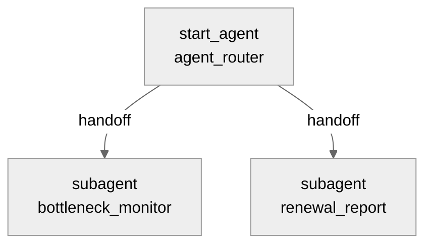

# Agent Spec: Sponsorship_Campaign_Agent

> **2026-08-31 구현 완료 (Simulated + Live Preview까지 검증됨).** 팀 승인으로 Future Scope → 실제
> 구현 단계로 승격 → Agent Script 작성 → 로컬 컴파일 통과(에러 0, 정보성 메시지 3건만) → Org 검증
> 통과 → Apex 액션 3개 + PermSet(`CA_Campaign_Agent_Access`) 배포 → AiAuthoringBundle 배포 →
> Simulated Preview로 라우팅(병목/갱신 분기) 확인 → **Live Preview로 실 데이터 검증 완료.**
>
> **Live Preview 결과**:
> - `get_renewal_summary`("d'Alba 갱신 캠페인 성과 요약 보여줘"): 실제 `d'Alba 2027 시즌 스폰서십
>   갱신 제안 캠페인`을 찾아 touch-update로 재계산 트리거 → 55%로 갱신된 최신 성과 요약 텍스트
>   정확히 반환(리허설 중 DLV-0002를 Completed로 바꾼 게 그대로 반영됨 — 재계산 메커니즘 실증).
> - `get_bottlenecks`("전체 스폰서십 캠페인 중에 지연된 항목 있어?"): **실 데이터에서 총 69건의
>   "조용한 지연"(Status는 안 바뀌었지만 Due Date가 지난 항목) 발견** — 이 Agent를 만든 핵심 이유였던,
>   기존 Blocked_Reason Slack 알림의 사각지대를 실제로 증명함. AI가 캠페인별 대표 사례를 요약하고
>   실질적 대책(일정 재조정, 후속 Task 생성, 주간 리포트 공유)을 제안.
> - `adopt_mitigation`(쓰기 액션, `require_user_confirmation: True`)도 **확인→실행 왕복까지 실 데이터로
>   검증 완료**(2026-08-31). 실제 F&F(디스커버리) 캠페인의 DLV-0226에 대책을 적용 → 플랫폼이 자동으로
>   "진행해도 괜찮으시면 네라고 답해주세요" 확인을 요구 → 승인 후 Notes에 타임스탬프 포함 기록 +
>   Task(Id `00Tbm00000FuksLEAR`, Subject/Description/ActivityDate 전부 정확) 생성까지 SOQL로
>   직접 재확인. 테스트 후 원상복구(Notes 되돌림, Task 삭제) 완료.
>
> **구현 중 발견한 버그 2건**:
> 1. **Router 재진입 문제(가장 중요)**: 매 사용자 턴마다 `agent_router`가 다시 평가되는데, 최초
>    Router 지침("판단해서 이동하세요")이 "이전 병목 논의를 이어가는 요청"(예: "그 대책 적용해줘")을
>    새 요청으로 오인하지 못하고 **Router 자신이 직접(가짜로) "적용하겠습니다"라고 답해버리고
>    실제로는 `bottleneck_monitor`로 이동도, `adopt_mitigation` 호출도 안 하는 현상**을 발견(trace
>    로그로 확인 — `adopt_mitigation`을 두 번 명확히 요청해도 DB에 아무 변화 없음). Router 지침에
>    "당신은 직접 답변하지 않습니다. 이전 병목 논의를 이어가는 모든 요청도 포함해서 반드시
>    이동하세요"를 명시해 해결. **팀 공유 포인트**: Router 지침은 "판단해서 이동" 수준으로는
>    부족하고, "직접 답하지 말고 반드시 전환하라"를 명시적으로 못박아야 한다.
> 2. `RenewalSummaryRefresher`의 최초 설계에 `completionRate` 필드가
> 있었으나, 이게 갱신 캠페인 **자신의** 롤업 필드(`Total/Completed_Deliverable_Weight__c`, 항상
> 0 — 캠페인 자신은 Deliverable을 안 가지고 형제 캠페인들이 가짐)를 읽고 있어 요약 텍스트의 실제
> 수치(55%)와 안 맞는 걸 Live Preview에서 발견. 필드 자체를 제거하고 `performanceSummary` 텍스트
> 하나로 통일 — 원인이 다른 두 숫자를 억지로 나란히 보여주면 혼란만 커진다고 판단.
>
> **Publish/Activate는 아직 안 함**(초안 유지 원칙). 배포된 산출물:
> `salesforce/main/default/aiAuthoringBundles/Sponsorship_Campaign_Agent/`,
> `salesforce/main/default/classes/{CampaignBottleneckFinder,CampaignMitigationRecorder,RenewalSummaryRefresher}.cls`,
> `salesforce/main/default/permissionsets/CA_Campaign_Agent_Access.permissionset-meta.xml`.
>
> **`agentAccesses` 관련**: `BotDefinition` 조회로 직접 확인한 결과, Bot 레코드는 Publish 전엔
> 정말로 존재하지 않음(추정이 아니라 확인된 사실). 다만 **이 권한 없이도 조회 2건 + 쓰기 1건 전부
> 실 데이터로 정상 동작 확인**했으므로 기능적 문제는 없음 — 순수히 "누가 Published Agent에 접근
> 가능한가"를 위한 접근 제어 항목이라 Publish 이후에 추가하면 됨.
>
> **오늘 세션 검증 상태: 3개 액션(get_bottlenecks/get_renewal_summary/adopt_mitigation) 전부
> 실 데이터로 end-to-end 검증 완료.**
>
> **2026-08-31 Publish + Activate 완료.** `sf agent publish authoring-bundle` → `sf agent
> activate`(version 1) 성공 → Bot 레코드 생성 확인 → `CA_Campaign_Agent_Access`에
> `agentAccesses` 추가 배포 완료 → Activate 이후 실 데이터로 재확인(스모크 테스트, d'Alba 갱신
> 요약 정상 반환, 그라운딩 지침 개선 덕분에 요약/바꿔쓰기 없이 원문 그대로 전달됨). 이제 실제
> Draft 아닌 **Active 상태**로 운영 가능.

## Purpose & Scope

스폰서십 계약 체결 이후 실행 단계를 담당하는 담당자가 (1) 계약 기간 동안 약속한 실행 항목(Campaign_Deliverable__c)이 잘 이행되고 있는지 추적하고, 병목이 발생하면 그 원인에 맞는 대책을 추천받으며, (2) 계약 만료가 다가오는 갱신 대상 캠페인에 대해 최신 이행 결과 요약을 즉시 받아 갱신/업셀(상위 티어 제안, 추가 상품 영업) 제안 자료로 활용하도록 돕는다.

## 기존 구현 활용 조사 결과

**중요한 제약 발견**: 기존에 만든 자동화 3개(`Campaign_Deliverable_Detect_Due_Date_Push`, `Campaign_Deliverable_Blocked_Slack_Alert`, `Renewal_Campaign_Performance_Summary`)는 전부 **Record-Triggered Flow**(`triggerType: RecordBeforeSave`/`RecordAfterSave`)라서, Agentforce Action은 **Autolaunched Flow나 Invocable Apex만** 연결 가능하다는 제약에 걸려 **직접 재사용 불가능**하다.

대신 그 자동화들이 **관리해온 데이터(필드)는 그대로 재사용**한다:
- `Campaign_Deliverable__c`: `Status__c`, `Blocked_Reason__c`, `Notes__c`, `Due_Date__c`, `Weight__c`
- `Campaign`: `Performance_Summary__c`, `Total_Deliverable_Weight__c`, `Completed_Deliverable_Weight__c`(Renewal Flow가 이미 계산해둔 값)

**부수 발견 — 이 Agent가 기존 알려진 한계 2개를 자연스럽게 해결함**:
1. "조용한 지연"(Status도 안 바꾸고 Due Date도 안 건드린 채 방치되는 케이스, PQ-3-7/8 Future Scope로 기록됨) — 기존 Blocked_Reason 자동화는 이 케이스를 못 잡지만, 이 Agent의 `get_bottlenecks` 액션은 **PULL 방식 조회**라 Status와 무관하게 `Due_Date__c < 오늘 AND Status__c != 'Completed'`인 항목을 전부 찾아낼 수 있다.
2. "갱신 성과 요약이 자동 반영 안 됨"(발표 리허설 중 발견, §31 기록됨) — 이 Agent의 `get_renewal_summary` 액션이 조회 직전 대상 Campaign을 **직접 재저장(touch update)**해서 Before-Save Flow를 강제로 재실행시키므로, 사용자가 "Edit→Save"를 수동으로 안 해도 항상 최신값을 받는다.

## Behavioral Intent

- **확정: "대책 도입"은 실제 레코드 변경까지 포함한다** (2026-08-31 확인). `bottleneck_monitor`는 조회+추천에 더해, 사용자가 명시적으로 승인한 대책을 (1) `Campaign_Deliverable__c.Notes__c`에 기록하고 (2) 후속조치 `Task`를 생성하는 쓰기 액션을 갖는다. 이 쓰기는 **사용자의 명시적 확인 없이는 절대 실행하지 않는다** — 기존 Proposal Agent(`save_proposal`)와 동일한 원칙.
- `renewal_report`는 읽기 전용을 유지한다. `get_renewal_summary`의 touch-update는 "재계산을 위한 재저장"이라는 내부 구현 디테일이며, 사용자가 요청한 실제 데이터 변경이 아니다.
- 병목 원인별 대책 추천은 **LLM 추론(agentic)**으로 수행한다 — 별도 Apex 룰 테이블 없이, `Blocked_Reason__c`(6종 카테고리)와 `Notes__c`(자유 서술)를 grounding 데이터로 제공하면 LLM이 충분히 실질적인 대책을 제안할 수 있다고 판단.
- 액션 구현 타입: Invocable Apex 3개(신규). 표준 Action 재사용은 이번에도 검토 필요(아래 각 Action의 "표준 Action 검토" 참고, Setup UI 재확인 권장).
- **확정: "조용한 지연"(Status 안 바꾸고 방치된 overdue 건)도 병목으로 포착한다** (2026-08-31 확인) — 기존 Slack 알림이 못 잡던 케이스를 이 Agent가 보완.
- 가드레일: 이 Agent는 Campaign_Deliverable__c/Campaign 조회·기록으로 범위를 한정한다. Product/Quote/Opportunity 영역은 다른 Subagent(Proposal/Quote)의 몫. Delete 액션 없음(팀 전체 표준 방침).
- 결정적 로직이 반드시 소비해야 하는 값: `mitigation_confirmed`(사용자의 명시적 대책 승인 여부).

## Subagent Posture

| Subagent | Posture | Why | Deterministic Controls |
|---|---|---|---|
| `bottleneck_monitor` | mixed | 조회+추천은 agentic(LLM 판단), 실제 기록(Notes/Task 생성)만 결정적 게이트로 보호 | `adopt_mitigation`은 `mitigation_confirmed == True`일 때만 노출 |
| `renewal_report` | agentic | 조회+재계산뿐, 사용자 확인이 필요한 비가역적 액션 없음 | 없음 |

## Subagent Map

router-first 구조를 선택한 이유: "지연/병목 파악"과 "갱신 리포트 조회"는 사용자가 서로 다른 순간에 독립적으로 요청하는, 목적이 다른 두 워크플로우다(하나로 합치면 Instruction이 두 목적을 동시에 짊어져 혼란스러워짐).

## Variables

| Variable | Type / Default | Trusted Writer | Named Consumer | Cause | Reset / Expiry |
|---|---|---|---|---|---|
| `mitigation_confirmed` | `mutable boolean = False` | `confirm_mitigation`(`@utils.setVariables`, 사용자가 "이 대책 적용해줘"/"기록해줘" 등으로 명확히 승인했을 때만 모델이 호출) | `adopt_mitigation`의 `available when` | Campaign_Deliverable__c Notes 변경 + Task 생성은 실제 레코드 변경이라 명시적 승인 필요 | 이 Deliverable 관련 대화가 끝나거나 사용자가 취소하면 자연 소멸(세션 종료). 다른 Deliverable에 대해 다시 논의하면 재확인 필요 |

## Actions

### get_bottlenecks (`bottleneck_monitor` subagent)

- **Target:** `apex://CampaignBottleneckFinder` (제안)
- **Status:** NEEDS CREATION

#### Inputs

| Name | Type | Required | Source |
|---|---|---|---|
| searchTerm | string | No | 사용자가 언급한 스폰서사/캠페인 이름(예: "d'Alba"). 비어있으면 전체 Sponsorship 캠페인 대상 |

#### Outputs

| Name | Type | Visible to User? | Source | Notes |
|---|---|---|---|---|
| bottlenecks | list[object] | Yes | `Campaign_Deliverable__c` | 각 항목: campaignName, deliverableName, status, blockedReason, notes, dueDate, isOverdue |
| totalCount | number | Yes | 계산 | 찾은 병목 건수 |

#### 표준 Action 검토

Campaign_Deliverable__c는 커스텀 오브젝트라 이 Org의 Asset Library(281개 Action, Sponsorship_Proposal_Assistant 조사 때 확인)에 대응하는 표준 Action이 있을 가능성은 낮다 — 다만 실제 구현 전 Setup > Agent Builder "Add Action" 목록에서 재확인 권장.

#### Stubbing Requirement

- Apex 클래스 `CampaignBottleneckFinder`, `Result` inner class(list[object]).
- 쿼리 조건(OR): `Status__c = 'Blocked'` **또는** `Due_Date__c < TODAY AND Status__c != 'Completed'`(후자가 "조용한 지연" 포착) — `searchTerm`이 있으면 `Campaign__r.Name LIKE '%searchTerm%'` 추가.
- `complex_data_type_name: "@apexClassType/c__CampaignBottleneckFinder$Result"`.
- 읽기 전용 — Campaign_Deliverable__c Read 권한만 필요.

### confirm_mitigation (`bottleneck_monitor` subagent) — 유틸리티 액션

- **Target:** `@utils.setVariables`
- **Status:** 표준 유틸리티(구현 불필요)
- 사용자가 AI가 제시한 대책을 보고 "이걸로 적용해줘"/"기록해줘" 등 **명확하게** 승인했을 때만 모델이 호출. `set @variables.mitigation_confirmed = True`.
- 단순히 "괜찮네", "좋은 생각이야" 같은 애매한 반응만으로는 호출하지 않는다 — instructions에서 이 구분을 명시.

### adopt_mitigation (`bottleneck_monitor` subagent) — 결정적 게이트 보호 대상

- **Target:** `apex://CampaignMitigationRecorder` (제안)
- **Status:** NEEDS CREATION
- **가시성:** `available when @variables.mitigation_confirmed == True`

#### Inputs

| Name | Type | Required | Source |
|---|---|---|---|
| deliverableId | string | Yes | `get_bottlenecks` 결과에서 사용자가 선택한 항목의 Id |
| mitigationPlan | string | Yes | 사용자가 승인한 대책 내용(모델이 제시한 문구 그대로 또는 사용자가 수정한 버전) |
| createFollowUpTask | boolean | No | 기본값 True — 후속조치 Task도 같이 만들지 여부 |

#### Outputs

| Name | Type | Visible to User? | Source | Notes |
|---|---|---|---|---|
| notesUpdated | boolean | False | 계산 | 내부 판단용 |
| taskId | string | True(안내용) | 생성된 `Task.Id`(생성 안 했으면 빈 값) | |
| success | boolean | False | 계산 | 내부 판단용 |

#### 표준 Action 검토

Notes 업데이트 + Task 생성을 하나의 트랜잭션으로 묶어야 해서(부분 실패 방지), 표준 Action 여러 개를 이어붙이는 것보다 Apex가 안전하다 — Setup UI 재확인 대상.

#### Stubbing Requirement

- Apex 클래스 `CampaignMitigationRecorder`. 트랜잭션 안에서: ① 대상 `Campaign_Deliverable__c`의 `Notes__c`에 기존 내용을 지우지 않고 날짜+대책 내용을 이어붙임(예: `기존 Notes + "\n[AI 대책 기록 2026-08-31] " + mitigationPlan`) ② `createFollowUpTask`가 true면 `Task`(Subject="지연 대책 후속조치: {deliverableName}", Description=mitigationPlan, WhatId=deliverableId, ActivityDate=오늘+3일) 생성.
- **권한**: `CA_Campaign_Agent_Access`에 Campaign_Deliverable__c Edit + Task Create 권한 필요. Delete 권한 없음.

### get_renewal_summary (`renewal_report` subagent)

- **Target:** `apex://RenewalSummaryRefresher` (제안)
- **Status:** NEEDS CREATION

#### Inputs

| Name | Type | Required | Source |
|---|---|---|---|
| searchTerm | string | Yes | 사용자가 언급한 스폰서사/캠페인 이름(예: "d'Alba") |

#### Outputs

| Name | Type | Visible to User? | Source | Notes |
|---|---|---|---|---|
| campaignName | string | Yes | `Campaign.Name` | 매칭된 갱신 캠페인 |
| performanceSummary | string | Yes | `Campaign.Performance_Summary__c` | 재계산 후 최신값 |
| completionRate | number | Yes | 계산(`Completed_Deliverable_Weight__c / Total_Deliverable_Weight__c * 100`) | Performance_Summary__c 텍스트와 별개로 숫자만 따로도 제공 |
| found | boolean | True(내부 판단용) | 계산 | 매칭 캠페인 없으면 false |

#### 표준 Action 검토

"레코드 재저장으로 Flow 강제 재실행" 자체가 표준 Action으로는 불가능한 커스텀 로직이라 Apex 유지 확정.

#### Stubbing Requirement

- Apex 클래스 `RenewalSummaryRefresher`.
- 로직: ① `SELECT Id FROM Campaign WHERE RecordType.DeveloperName = 'Sponsorship_Renewal' AND Name LIKE :searchPattern LIMIT 1` ② 찾으면 `update new Campaign(Id = campaignId);`(필드 변경 없는 touch-update — Before-Save Flow는 DML 발생 자체로 재실행됨) ③ 같은 레코드를 `Performance_Summary__c`, `Total_Deliverable_Weight__c`, `Completed_Deliverable_Weight__c` 포함해서 재조회 ④ 반환.
- 읽기+제한적 쓰기(touch-update만, 필드값 변경 없음) — Campaign Read/Edit 권한 필요.

## Action Invocation Strategy

| Action | Subagent | Invocation Mode | Why |
|---|---|---|---|
| `get_bottlenecks` | `bottleneck_monitor` | Planner slot-fill(`with searchTerm = ...`) | 사용자가 지연 현황을 물으면 모델이 판단해서 호출 |
| `confirm_mitigation` | `bottleneck_monitor` | Planner 판단(`@utils.setVariables`) | 명시적 승인 발화일 때만 — instructions로 판단 기준 명시 |
| `adopt_mitigation` | `bottleneck_monitor` | Planner slot-fill + `available when` 게이트 | 승인 전에는 아예 안 보임(루프/오남용 방지) |
| `get_renewal_summary` | `renewal_report` | Planner slot-fill(`with searchTerm = ...`) | 사용자가 갱신 자료를 요청하면 호출 |

## Deterministic Controls

- `adopt_mitigation` 가시성: `available when @variables.mitigation_confirmed == True` — 원인: Notes 기록 + Task 생성은 실제 레코드 변경이라 명시적 승인 필요.

## Architecture Pattern

Router-First(`start_agent agent_router:` → `bottleneck_monitor`/`renewal_report` handoff). `bottleneck_monitor` 내부는 조회→추천→(확인)→기록의 워크플로우-로컬 순서를 갖지만 별도 Subagent로 쪼개지 않는다(같은 objective 안에서 `available when` 게이트로 충분). Action Loop Prevention: `adopt_mitigation`은 slot-fill + `available when` + 성공 후에도 같은 Deliverable에 대해 재호출할 이유가 없다는 post-action instruction으로 3중 방지.

## Agent Configuration

- **developer_name:** `Sponsorship_Campaign_Agent`
- **agent_label:** "스폰서십 캠페인 에이전트"
- **agent_type:** `AgentforceEmployeeAgent` — 내부 담당자 전용, `access.default_agent_user` 불필요.
- **권한:** 신규 PermSet `CA_Campaign_Agent_Access` 제안(기존 `CA_Opportunity_Agent_Access` 관례를 따라 Agent 전용으로 분리). `PRM_Manager_Access`는 사람이 화면을 쓸 때의 권한이라 여기 쓰지 않는다.

---

## 확인 완료 사항 (2026-08-31)

1. ✅ "대책안을 도입하는 구조"는 실제 레코드 변경까지 포함 — `adopt_mitigation` 액션(Notes 기록 + Task 생성) 추가, 명시적 확인 게이트로 보호.
2. ✅ `get_bottlenecks`는 "조용한 지연"(Status 안 바꾸고 방치된 overdue 건)까지 포착.
3. Router-First 구조(2 Subagent)는 설계자 판단으로 확정 — 두 워크플로우의 목적(병목 대응 vs 갱신 리포트)이 뚜렷이 달라 하나로 합치면 Instruction이 혼란스러워짐. 이견 있으면 알려주세요.

## 다음 단계(승인 시)

1. Setup > Agent Builder "Add Action" 표준 목록에서 3개 Action이 표준 Action으로 대체 가능한지 확인
2. `sf agent generate authoring-bundle`로 스캐폴딩 생성
3. Apex 3개(`CampaignBottleneckFinder`, `CampaignMitigationRecorder`, `RenewalSummaryRefresher`)를 Stub으로 먼저 생성 → 로컬 컴파일 → Org 검증 → Preview(Simulated 모드로 라우팅 먼저 확인)
4. 실제 쿼리 로직 채우기 → `CA_Campaign_Agent_Access` PermSet에 최소 권한 부여
5. Live Preview로 실 데이터(d'Alba 등) 검증
