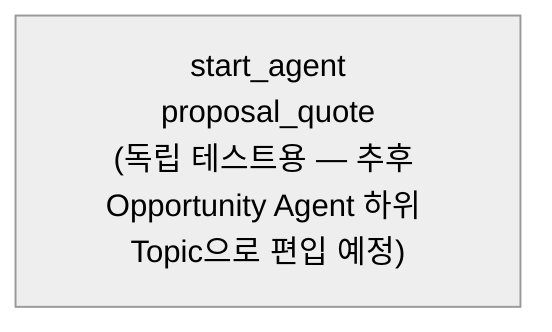

# Agent Spec: Sponsorship_Proposal_Assistant (→ 향후 "Proposal / Quote" Subagent/Topic)

> ⚠️ **✅ 2026-08-31 SUPERSEDED.** 이 문서가 설계한 구현(커밋 `f762840f`)은 `origin/main`에 merge된 적이 없다. 같은 이름의 PermSet(`CA_Opportunity_Agent_Access`)과 Apex 3개를 Opportunity Agent 통합 담당자(Eunyeong Doh)가 독립적으로 다시 만들어 그 버전이 실제로 채택·운영 중이다. 승우가 검토 후 **Eunyeong의 구현을 공식 채택**하기로 확인했다(`docs/05_DECISIONS.md` Decision 021 "2026-08-31 최종 갱신" 참고). 이 문서는 삭제하지 않고 설계 이력으로 보존하되, 아래 내용을 현재 구현으로 취급하지 않는다.
>
> **2026-08-27 구현 완료 (Simulated Preview까지 검증됨).** Agent Script 작성 → 로컬 컴파일 통과 →
> Org 검증 통과 → Apex 액션 3개 배포 → AiAuthoringBundle 배포 → Simulated 모드 Preview로
> 추천/초안/확인 게이트/중복 저장 방지까지 전부 정상 동작 확인.
>
> **Live Preview도 완료(2026-08-27, 실제 데이터).** `d'Alba Long-Term Sponsorship`
> Opportunity(006bm00000VonmrAAB)로 end-to-end 테스트: 실제 Opportunity/PricebookEntry
> 조회 → 실제 가격(11억 등)으로 패키지 추천 → 초안 작성 → 명시 확인 → 실제 Quote
> (`0Q0bm000003F6rNCAS`) + QuoteLineItem(1.1B, Qty 1) 생성 + Opportunity 3개 Benefit
> 필드 갱신까지 SOQL로 직접 재확인 완료. 도중 Live 모드에서만 드러난 버그 발견:
> Salesforce Record Id를 주고받는 입출력(opportunityId/productId/quoteId)은 `string`이
> 아니라 `object` + `complex_data_type_name: "lightning__recordIdType"`로 선언해야
> 함(Simulated 모드·로컬 컴파일·Org 검증 전부 이 오류를 못 잡고 Live 모드 세션 시작
> 시점에만 에러로 드러남) — 수정 후 통과. **Publish/Activate는 아직 안 함**(초안 유지
> 원칙, 팀 통합 전 단계).
> `CA_Opportunity_Agent_Access`에 이 Action들이 쓰는 Object/Field 최소 권한을 병합 배포 완료
> (은영님의 기존 권한은 전부 보존). 그 과정에서 `PricebookEntry`/`QuoteLineItem` object 권한이
> 배포는 성공해도 실제로 저장 안 되는 현상을 발견했으나, Setup UI(Permission Set > Object
> Settings)에서 두 Object 모두 Object Permission 칸이 "--"(설정 자체 불가 — 부모 Object인
> Quote/Product2·Pricebook2에서 상속)로 표시되는 것을 육안 확인해 **버그가 아니라 정상 동작**임을
> 검증함(2026-08-27). `Quote: Create` + `Product2/Pricebook2: Read`만으로 이미 충분.
>
> **이 문서가 `SPONSORSHIP_PROPOSAL_STRATEGIST_AGENT_SPEC.md`(2026-08-26 Draft, Decision 021)를
> 대체합니다** — 그 Draft는 팀 승인 전 로컬 설계만 있던 상태였고, 이 문서는 실제 구현·배포·
> Live Preview까지 완료된 현재 버전입니다. 경위는 `docs/05_DECISIONS.md` Decision 021의
> "2026-08-27 갱신" 절 참고.
>
> 배포된 산출물:
> `salesforce/main/default/aiAuthoringBundles/Sponsorship_Proposal_Assistant/`,
> `salesforce/main/default/classes/{OpportunityProposalContext,SponsorshipPackageLookup,SponsorshipProposalSaver}.cls`.
> 부수 변경: `sfdx-project.json`의 `sourceApiVersion`을 58.0 → 67.0으로 올림(AiAuthoringBundle이
> API v66.0 이상 요구 — 프로젝트 전체에 적용되는 변경이라 팀 공유 필요).

## 팀 아키텍처 공유 반영 (2026-08-27)

Opportunity 영역 담당자(메인 Opportunity Agent + Activity/Deal Intelligence/Discovery 담당)로부터 아래 구조 공유를 받아 이 Spec에 반영했다.

- **최종 구조**: 메인 `Opportunity Agent`(단일 진입점, 라우팅) 하위에 전문 Subagent(Topic) 5개 — Activity Management / Deal Intelligence / Discovery Management / **Proposal / Quote**(이 Spec 담당) / Negotiation.
- **이 Spec의 위치**: "Proposal / Quote" Topic 담당. **독립적으로 개발·테스트**하고, 메인 Opportunity Agent 연결(Planner 통합)은 담당자가 마지막에 일괄 진행 — 이번 Spec에서는 Router나 메인 Agent를 만들지 않는다.
- **책임 경계**: 제안 구성/상품·패키지/가격/Quote 조회·생성·수정까지만 — Negotiation(협상 조건, 승인, 후속조치)은 범위 밖.
- **표준 Action 우선**: Record 조회/생성/수정이 표준 Agent Action으로 가능하면 그걸 먼저 쓰고, 안 될 때만 Flow/Apex. (§Actions 각 항목에 검토 결과 기록 — 이번엔 Org REST API로 확인 시도했으나 404로 막혀 미확정, Setup UI 재확인 필요.)
- **느슨한 결합**: Action은 특정 Agent의 Instruction에 의존하지 않고 입출력이 명확한 독립 단위로 — 이미 이 Spec의 설계 방향과 일치.
- **Delete 제외(V1)**: Create/Update만, 그것도 사용자 확인 후. Delete Action은 추가하지 않는다(필요하면 먼저 논의).
- **권한 관리**: Agent 전용 PermSet `CA_Opportunity_Agent_Access`(담당자가 이미 생성·배포 완료, Id `0PSbm00000VgHXFGA3`)로 통합 관리. **`CA_Opportunity_Qualification_Access`(은영님의 기존 PermSet)는 절대 건드리지 않는다.** 이 Spec의 Action이 실제로 어떤 Object/Field를 쓰는지 확정된 뒤에만 `CA_Opportunity_Agent_Access`에 최소 권한 추가(Delete 제외, 다른 Subagent 몫까지 미리 추가 금지). **`PRM_Manager_Access`(승우가 앞서 복구·확장한 PermSet)는 사람이 Salesforce 화면을 직접 쓸 때의 권한이고, 이 Agent 자체의 실행 권한과는 별개** — Agent 관련 권한 추가는 전부 `CA_Opportunity_Agent_Access` 쪽으로 한다.

## Purpose & Scope

"이 매니저"(B2B PRM/스폰서십 영업 담당자)가 Opportunity의 Proposal 단계에서 (1) 적합한 Sponsorship Package(Product2) 추천을 받고, (2) 제안서 초안(추천 근거 + 기대 효과)을 작성하고, (3) 명시적으로 확인한 뒤에만 그 내용을 실제 Quote/QuoteLineItem 및 Opportunity 필드로 Salesforce에 저장하도록 돕는다. `00_STORY.md §8.3` Step 6("Sponsorship Package/Quote 제안")에 해당하는 단계를 지원하며, 향후 메인 `Opportunity Agent`의 "Proposal / Quote" Topic으로 편입될 것을 전제로 설계한다.

## Behavioral Intent

- 추천/초안 작성은 자유롭게(agentic) 수행하되, **실제 레코드 저장(DML)은 사용자의 명시적 확인 없이는 절대 실행하지 않는다** — Sponsorship 계약과 관련된 실제 데이터라 되돌리기 어렵다.
- **Delete 액션 없음(V1 범위 제외, 팀 공유 사항)** — Create/Update만, Update도 확인 후에만.
- 액션 구현 타입: 우선 표준 Agent Action 재사용을 검토했으나 이번 세션에서 확정하지 못함(아래 Actions 절 참고) — 현재는 Invocable Apex(NEEDS CREATION)로 제안. Org에 이미 존재하는 Product2(Sponsorship Package RecordType)/PricebookEntry/Opportunity 필드/Lead 필드(`P2_B2B_ORG_BASELINE.md §15` 기준 확인됨)를 조회·저장한다.
- **느슨한 결합**: 각 Action은 이 Agent의 Instruction에 강하게 묶이지 않고, 입력/출력이 명확한 독립 단위로 설계했다 — 다른 Subagent(Topic)에서도 재사용 가능해야 한다는 팀 방침에 따름.
- 가드레일: 이 Agent는 Opportunity 하나를 대상으로 한 Proposal/Quote 작성에만 집중한다. Negotiation(협상 조건·승인·후속조치), Lead 발굴, Pipeline 전체 현황은 범위 밖(다른 담당 Subagent의 몫).
- 결정적 로직이 반드시 소비해야 하는 값: `proposal_confirmed`(사용자의 명시적 저장 승인 여부), `quote_id`(이미 저장됐는지 — 중복 저장 방지).
- 대화 이력에 남는 사실(이름, 이전 답변 등)은 변수로 따로 안 만든다.

## Subagent Posture

| Subagent | Posture | Why | Deterministic Controls |
|---|---|---|---|
| `proposal_quote` | mixed | 추천/초안 작성은 agentic(LLM 판단), 실제 저장(DML)만 결정적 게이트로 보호 | `save_proposal`은 `proposal_confirmed == True and quote_id == ""`일 때만 노출 |

이름을 `proposal_quote`로 정한 이유: 향후 메인 `Opportunity Agent`에 편입될 때 Topic 이름("Proposal / Quote")과 그대로 대응되도록 해서, 담당자가 통합할 때 이 `subagent` 블록을 최소 수정으로 옮겨 붙일 수 있게 하기 위함.

## Subagent Map

> **✅ 2026-08-27 확인 완료 — 표준 Action 대체 불가, Apex 유지 확정.** 승우가 Agentforce
> Builder의 Asset Library(281개 Action)를 `opportunity`/`quote`/`lead`/`product`/
> `pricebook`/`price` 키워드로 전부 검색. 결과: Opportunity 관련 7개는 전부 AI
> 분석/추천용(유사 Opportunity 찾기, 다음 단계 제안 등, 우리 커스텀 필드 조회와 무관),
> Lead 관련 5개는 Data Cloud 마케팅 점수·일과 요약 등(우리 Lead 커스텀 스코어링 필드와
> 무관), Product 관련 12개는 Service/Commerce/SDO 데모용, Quote/Pricebook 관련은
> 사실상 0건(무관한 D360 SQL Action 1개 제외). **이 Org의 Asset Library는 범용 Record
> CRUD가 아니라 특정 Sales/Service AI 기능 모음이라, 커스텀 필드·커스텀 RecordType을
> 다루는 이 도메인 로직은 애초에 대상이 아니었음.** 팀 방침(표준 Action 우선)을 실제로
> 검증한 뒤 내린 결론이므로 Apex 3개(§Actions) 그대로 유지 확정.

Router나 별도 Subagent를 만들지 않는다 — 이 워크플로우 전체가 "Opportunity 하나의 Proposal/Quote 작성"이라는 하나의 objective/authority 안에 있고, 저장 단계의 권한 차이는 `available when` 게이트로 같은 scope 안에서 처리 가능하다(Rule 7, 가장 작은 아키텍처 우선). 메인 Opportunity Agent로의 라우팅 연결은 이 Spec의 범위가 아니다 — 담당자가 마지막에 통합.

## Variables

| Variable | Type / Default | Trusted Writer | Named Consumer | Cause | Reset / Expiry |
|---|---|---|---|---|---|
| `proposal_confirmed` | `mutable boolean = False` | `confirm_save`(`@utils.setVariables`, 사용자의 명확한 "저장해줘" 확인 발화일 때만 모델이 호출) | `save_proposal`의 `available when` | 실제 레코드 생성은 되돌리기 어려운 결과 — 명시적 승인 필수 | 이 Opportunity 관련 대화가 끝나거나 사용자가 취소하면 다음 대화에서 자연 소멸(세션 종료). 별도 리셋 액션 없음 — 저장 전이라면 다시 초안을 논의해도 무방(재확인 후 save 호출) |
| `quote_id` | `mutable string = ""` | `save_proposal` output(`@outputs.quoteId`) | `save_proposal`의 `available when`(중복 생성 방지), 응답 텍스트(생성된 Quote 안내) | 한 Opportunity당 이 대화에서 중복 Quote 생성 방지(멱등성) | 리셋 없음 — 한 번 저장되면 이 대화에서는 재저장 불가(새 Quote가 필요하면 새 대화/다른 Sub Agent 기능으로) |

## Actions

### get_opportunity_context (`proposal_quote` subagent)

- **Target:** `apex://OpportunityProposalContext` (제안)
- **Status:** NEEDS CREATION

#### Inputs

| Name | Type | Required | Source |
|---|---|---|---|
| opportunityId | string | Yes | 사용자가 언급한 Opportunity(이름 또는 Id) — 이름으로 말하면 먼저 조회해서 Id 확정 필요(§ 아래 참고) |

#### Outputs

| Name | Type | Visible to User? | Source | Notes |
|---|---|---|---|---|
| opportunityName | string | Yes | `Opportunity.Name` | |
| targetSegment | string | Yes | `Opportunity.Target_Segment__c` | Opportunity 자체 값(Text, 비어있을 수 있음) |
| partnerTier | string | Yes | `Opportunity.Partner_Tier__c` | Picklist, 비어있을 수 있음 |
| existingShortTermBenefit | string | Yes | `Opportunity.Expected_Benefit_Short_Term__c` | 이미 작성된 초안이 있으면 재사용 |
| existingMidTermBenefit | string | Yes | `Opportunity.Expected_Benefit_Mid_Term__c` | |
| existingLongTermBenefit | string | Yes | `Opportunity.Expected_Benefit_Long_Term__c` | |
| leadTargetSegment | string | Yes | 전환된 Lead의 `Target_Segment__c`(Picklist: 10-30 Female/Male, 40-60 Female/Male, Family, etc) | `Lead.ConvertedOpportunityId = :opportunityId`로 역조회. 없으면 빈 값 |
| leadSegmentMatch | number | Yes | 전환된 Lead의 `Segment_Match__c`(Percent) | Agentforce Fit Score — 있으면 추천 근거로 활용 |
| leadRecommendationReason | string | Yes | 전환된 Lead의 `Recommendation_Reason__c` | Agentforce가 생성한 추천 사유 — 있으면 제안서 초안에 참고 |
| leadScore | number | Yes | 전환된 Lead의 `Lead_Score__c` | 참고용(계약 가능성 — Fit과는 별개 개념) |
| hasConvertedLead | boolean | True(내부 판단용이 아니라 사용자에게도 "Lead 정보 없음" 안내가 유용해 노출) | 계산 | Lead 매칭 실패 시 false |

#### 표준 Action 검토

Opportunity+연결된 Lead를 함께 조회해야 해서(단일 Object 조회가 아니라 관계 조회), 일반적인 "Get Record"류 표준 Action 하나로는 부족할 가능성이 높다. 다만 이번 세션에선 Org REST(`/services/data/v67.0/actions/standard`)가 404를 반환해 표준 Action 카탈로그를 직접 확인하지 못했다 — **실제 구현 전 Setup > Agent Builder의 "Add Action" 표준 목록에서 재확인 필요**. 표준 액션 2개(Opportunity 조회 + Lead 조회)를 조합해서 대체 가능하면 그쪽을 우선한다.

#### Stubbing Requirement (표준 Action으로 안 될 경우)

- Apex 클래스 `OpportunityProposalContext`, `Request`/`Result` inner class.
- `Result`는 단일 object 반환(`object`, `complex_data_type_name: "@apexClassType/c__OpportunityProposalContext$Result"`).
- 쿼리: `SELECT Name, Target_Segment__c, Partner_Tier__c, Expected_Benefit_Short_Term__c, Expected_Benefit_Mid_Term__c, Expected_Benefit_Long_Term__c FROM Opportunity WHERE Id = :opportunityId` + `SELECT Target_Segment__c, Segment_Match__c, Recommendation_Reason__c, Lead_Score__c FROM Lead WHERE ConvertedOpportunityId = :opportunityId LIMIT 1`(없으면 hasConvertedLead=false, 나머지 빈 값).
- 읽기 전용(Read-Only) 액션이라 `CA_Opportunity_Agent_Access`에 Opportunity/Lead 관련 필드 Read 권한만 있으면 됨(Delete·Edit 불필요).

### list_sponsorship_packages (`proposal_quote` subagent)

- **Target:** `apex://SponsorshipPackageLookup` (제안)
- **Status:** NEEDS CREATION

#### Inputs

없음(항상 전체 Active 목록 반환 — 목록이 13개뿐이라 필터링 없이도 충분, `P2_B2B_ORG_BASELINE.md §15.1` 기준).

#### Outputs

| Name | Type | Visible to User? | Source | Notes |
|---|---|---|---|---|
| packages | list[object] | Yes | `Product2`(RecordType=Sponsorship_Package) + `PricebookEntry` | 각 항목: productId, productName, productCode, unitPrice |

#### 표준 Action 검토

Product2 + PricebookEntry 서브쿼리 조합이라 역시 관계 조회다. 필터 없이 "Sponsorship Package RecordType, Active"만 거는 단순 조회라 표준 "Get Records"류 Action + RecordType 필터로 대체될 가능성이 `get_opportunity_context`보다는 높다 — **Setup UI 재확인 대상**.

#### Stubbing Requirement (표준 Action으로 안 될 경우)

- Apex 클래스 `SponsorshipPackageLookup`, `Result` inner class(productId, productName, productCode, unitPrice 필드).
- 쿼리: `SELECT Id, Name, ProductCode, (SELECT UnitPrice FROM PricebookEntries WHERE Pricebook2.IsStandard = true AND IsActive = true LIMIT 1) FROM Product2 WHERE RecordType.DeveloperName = 'Sponsorship_Package' AND IsActive = true`.
- `complex_data_type_name: "@apexClassType/c__SponsorshipPackageLookup$Result"` (list[object]).
- 읽기 전용 액션 — `CA_Opportunity_Agent_Access`에 Product2/PricebookEntry Read 권한만 필요.

### confirm_save (`proposal_quote` subagent) — 유틸리티 액션

- **Target:** `@utils.setVariables`
- **Status:** 표준 유틸리티(구현 불필요)
- 사용자가 초안을 보고 "이걸로 저장해줘" 등 **명확하게** 저장을 승인했을 때만 모델이 호출. `set @variables.proposal_confirmed = True`.
- 단순히 "좋아 보인다", "괜찮네" 같은 애매한 반응만으로는 호출하지 않는다 — instructions에서 이 구분을 명시.

### save_proposal (`proposal_quote` subagent) — 결정적 게이트 보호 대상

- **Target:** `apex://SponsorshipProposalSaver` (제안)
- **Status:** NEEDS CREATION
- **가시성:** `available when @variables.proposal_confirmed == True and @variables.quote_id == ""`

#### Inputs

| Name | Type | Required | Source |
|---|---|---|---|
| opportunityId | string | Yes | 대화 맥락(이미 조회한 Opportunity) |
| productId | string | Yes | 사용자가 선택/동의한 Sponsorship Package |
| quoteName | string | Yes | 모델이 제안(예: "{Opportunity명} Quote v1"), 사용자가 원하면 수정 |
| shortTermBenefit | string | No | 초안 내용(사용자 확인/수정 반영) |
| midTermBenefit | string | No | 〃 |
| longTermBenefit | string | No | 〃 |
| targetSegment | string | No | 초안 내용(비어있지 않으면 Opportunity.Target_Segment__c 갱신) |

#### Outputs

| Name | Type | Visible to User? | Source | Notes |
|---|---|---|---|---|
| quoteId | string | True(링크 안내용) | 생성된 `Quote.Id` | `set @variables.quote_id = @outputs.quoteId` |
| quoteName | string | True | 생성된 `Quote.Name` | |
| success | boolean | False | 계산 | 내부 판단용 |

#### 표준 Action 검토

Quote 생성 + QuoteLineItem 생성 + (조건부) Opportunity 업데이트를 **하나의 원자적 트랜잭션**으로 묶고, 성공 시 `quote_id`를 신뢰 가능한 단일 출력으로 받아 중복 저장을 막는 멱등성 가드가 필요하다 — 표준 "Create Record" 액션 여러 개를 이어붙이면 이 원자성/멱등성을 보장하기 어렵다(하나가 실패했을 때 부분 커밋 위험, 재호출 시 중복 생성 위험). **이 액션은 커스텀 Apex로 유지하는 것을 권장** — 다만 최종 판단은 표준 액션 카탈로그 확인(Setup UI) 후 재검토.

#### Stubbing Requirement

- Apex 클래스 `SponsorshipProposalSaver`. 하나의 트랜잭션 안에서: ① `Quote` 생성(OpportunityId, Pricebook2Id=Standard Price Book, Name), ② 해당 Product의 Standard PricebookEntry로 `QuoteLineItem` 생성(QuoteId, PricebookEntryId, Quantity=1, UnitPrice=PricebookEntry 가격), ③ 전달된 Benefit/TargetSegment 값이 있으면 `Opportunity` UPDATE.
- **권한**: 이 클래스는 DML을 수행하므로 **`CA_Opportunity_Agent_Access`**(Agent 전용 PermSet, `PRM_Manager_Access`가 아님)에 Quote/QuoteLineItem Create + Opportunity Edit 권한이 필요 — 단, 팀 방침에 따라 **이 Apex 클래스가 실제로 작성되고 정확한 Object/Field 사용이 확정된 뒤에만** 추가한다(미리 추가 금지). Delete 권한은 추가하지 않는다(V1 범위 제외).
- QuoteLineItem 객체 권한이 (승우가 만든) `PRM_Manager_Access`에서 배포는 성공해도 실제 반영이 안 되는 이슈가 있었다(`P2_B2B_ORG_BASELINE.md §15.3`) — `CA_Opportunity_Agent_Access`에 권한을 추가할 때도 동일 현상이 재현되는지 반드시 먼저 확인. 원인 불명이라 Setup UI에서 직접 권한 부여 화면을 열어 QuoteLineItem이 선택 가능한 Object로 나오는지부터 확인 권장.

## Action Invocation Strategy

| Action | Invocation Mode | Why |
|---|---|---|
| `get_opportunity_context` | Planner slot-fill(`with opportunityId = ...`) | 사용자가 Opportunity를 언급하면 모델이 판단해서 호출 |
| `list_sponsorship_packages` | Planner slot-fill(입력 없음) | 사용자가 추천을 요청하면 호출 |
| `confirm_save` | Planner 판단(`@utils.setVariables`) | 명시적 확인 발화일 때만 — instructions로 판단 기준 명시 |
| `save_proposal` | Planner slot-fill + `available when` 게이트 | 확인 전에는 아예 안 보임(루프/오남용 방지) |

## Deterministic Controls

- `save_proposal` 가시성: `available when @variables.proposal_confirmed == True and @variables.quote_id == ""` — 원인: 실제 계약 관련 레코드의 비가역적 생성이라 반드시 명시적 승인 필요 + 중복 생성 방지.

## Architecture Pattern

Single-Subagent(`start_agent proposal_quote:`), Router 없음 — 독립 테스트 단계에서는 이 자체를 `start_agent`로 두고, 편입 시점에 담당자가 `subagent proposal_quote:` 블록으로 옮겨 메인 Opportunity Agent의 router에 연결한다. Section 9(Action Loop Prevention) 패턴 적용 — `save_proposal`은 slot-fill + `available when` + 성공 후 `quote_id` 소비로 3중 방지.

## Agent Configuration

- **developer_name(독립 테스트용 임시 Agent):** `Sponsorship_Proposal_Assistant` — 편입 시 이 최상위 Agent 자체는 버려지고, 내부 `proposal_quote` subagent 블록 + 3개 Action만 메인 Opportunity Agent로 이전됨.
- **agent_label:** "스폰서십 제안서 어시스턴트"
- **agent_type:** `AgentforceEmployeeAgent` — 내부 PRM 담당자 전용 도구, 외부 고객 채널 아님. `access.default_agent_user` 불필요.

---

## 다음 단계(승인 시)

1. Setup > Agent Builder의 "Add Action" 표준 목록에서 3개 Action이 표준 Action으로 대체 가능한지 먼저 확인(§Actions 각 항목 "표준 Action 검토" 참고) — 팀 방침(표준 우선) 준수
2. `sf agent generate authoring-bundle`로 스캐폴딩 생성
3. 표준으로 안 되는 Action만 Apex로 — 우선 **Stub으로 시작해 Agent 흐름부터 Preview로 검증**한 뒤 실제 쿼리/DML을 채우는 순서 추천(QuoteLineItem 권한 이슈가 아직 안 풀렸기 때문)
4. 로컬 컴파일 → (가능하면) Org 검증 → Preview(Simulated 모드로 라우팅/흐름 먼저 확인)
5. 실제 Object/Field 사용이 확정되면 `CA_Opportunity_Agent_Access`에 최소 권한만 추가(Delete 제외) — 이 PermSet에 이미 배정된 User로 Live Preview 가능한지 확인. **`PRM_Manager_Access`는 이 Agent 권한 관리에 사용하지 않는다.**
