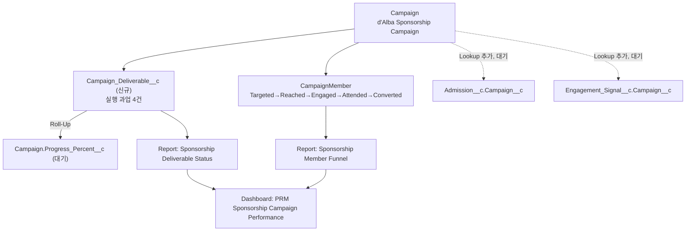

# P2 Sponsorship Campaign Performance — 구현 진행 현황

> [`P2_SPONSORSHIP_CAMPAIGN_PERFORMANCE_FUTURE_SCOPE.md`](./P2_SPONSORSHIP_CAMPAIGN_PERFORMANCE_FUTURE_SCOPE.md)의 Phase B(Standard + Declarative MVP)를 CloudAlpacas Org에 실제로 구현한 진행 상황 기록입니다.
> **작업은 완료되지 않았습니다.** 일부 필드가 Salesforce 플랫폼 반영 대기 중이라 중단한 상태이며, 이 문서는 다음 세션에서 이어가기 위한 체크포인트입니다.

| 항목 | 내용 |
| --- | --- |
| 작성자 | 승우(Rafael) |
| 기준일 | 2026-08-20 |
| 대상 Org | CloudAlpacas (Org Id `00Dbm00000tkYqDEAU`, `trailsignup-2abe91721f6a94.my.salesforce.com`) |
| 대상 Campaign | `d'Alba Sponsorship Campaign` (Id `701bm00002hfEJlAAM`) |
| 구현 상태 | **부분 완료 — 일부 필드 Salesforce 반영 대기 중, 다음 세션에서 이어감** |
| 구현 방식 | 커스텀 오브젝트/필드는 SFDX CLI(Metadata API) 배포, 데이터/Report/Dashboard는 REST API |

## 1. 구현 범위 표시 규칙

- **[완료]**: Org에 배포·생성되었고 정상 동작까지 확인됨
- **[대기]**: Org에 배포는 됐으나(Tooling API로 존재 확인) 플랫폼 반영 지연으로 아직 사용 불가
- **[생략]**: 이번 범위에서 의도적으로 만들지 않음(후속 작업으로 이월)

## 2. 이번에 만든 것 전체 그림



## 3. 커스텀 오브젝트/필드 — [완료]

SFDX CLI(`sf project deploy start`)로 Metadata API를 통해 배포했습니다(105개 컴포넌트, 오류 0건). CA SF 커넥터는 커스텀 오브젝트·필드 생성을 지원하지 않아(6절 참고) 이 경로를 사용했습니다.

### 3.1 신규 오브젝트 `Campaign_Deliverable__c`

| 필드 API Name | Type | 용도 | 상태 |
| --- | --- | --- | --- |
| `Campaign__c` | Master-Detail → Campaign | 성과 귀속 기준 | [완료] |
| `Status__c` | Picklist (Not Started/In Progress/Blocked/Completed) | 과업 상태 | [완료] |
| `Weight__c` | Percent | 전체 진행률 계산 가중치 | [완료] |
| `Due_Date__c` | Date | 약속 완료일 | [대기] |
| `Completed_Date__c` | Date | 실제 완료일 | [대기] |
| `Evidence_URL__c` | URL | 사진·영상 등 증빙 링크 | [대기] |
| `Notes__c` | Long Text Area | 비고 | [대기] |

### 3.2 Campaign 진행률 필드(선언형, Flow 불필요)

| 필드 API Name | Type | 계산식 | 상태 |
| --- | --- | --- | --- |
| `Total_Deliverable_Weight__c` | Roll-Up Summary (SUM) | Campaign_Deliverable__c.Weight__c 합계 | [대기] |
| `Completed_Deliverable_Weight__c` | Roll-Up Summary (SUM, 필터 Status=Completed) | 완료분 Weight 합계 | [대기] |
| `Progress_Percent__c` | Formula (Percent) | `Completed_Deliverable_Weight__c ÷ Total_Deliverable_Weight__c × 100` | [대기] |

### 3.3 Campaign 귀속 Lookup

| 오브젝트.필드 | Type | 상태 |
| --- | --- | --- |
| `Admission__c.Campaign__c` | Lookup → Campaign | [대기] |
| `Engagement_Signal__c.Campaign__c` | Lookup → Campaign | [대기] |

> [대기] 항목은 Tooling API(`CustomField` 쿼리)로 메타데이터 존재는 확인됐지만, SOQL 쿼리 엔진에는 아직 반영되지 않았습니다(4절 참고). 재배포가 필요한 문제가 아니라 시간이 지나면 자연 해소됩니다.

### 3.4 Page Layout 반영 — 부분 [완료]

`Campaign-Sponsorship Collaboration Layout`에 3.2절 필드 3개를 담은 "Campaign Performance" 섹션을 추가해 배포했고(SFDX 재조회로 서버 반영 확인됨), `Campaign_Deliverable__c` Related List(`Campaign_Deliverables`)도 같은 방식으로 추가를 시도했습니다.

| 변경 | 배포 결과 | 화면 표시 |
| --- | --- | --- |
| "Campaign Performance" 섹션(필드 3개) | [완료] — 서버에 저장 확인 | [대기] — 하드 리프레시(Ctrl+Shift+R) 후에도 화면에 안 보임 |
| `Campaign_Deliverables` Related List | [대기] — `Cannot find related list:Campaign_Deliverables` 오류로 배포 실패 | — |

Related List 배포 실패가 중요한 단서입니다. Layout에 적은 relationshipName(`Campaign_Deliverables`)은 필드 정의와 정확히 일치하는데도(재조회로 재확인) 배포 엔진이 이 관계를 못 찾습니다. 필드 자체를 Layout에 넣는 건 방금 성공했으니, **막힌 지점이 "필드 존재 여부"에서 "관계(Relationship) 레지스트리"로 좁혀졌습니다.** 그리고 브라우저 강력 새로고침 이후에도 이미 배포된 필드 섹션이 화면에 안 뜨는 것까지 더하면, SOQL·describe·Related List 배포·Lightning 화면 렌더링까지 **4곳 모두 같은 하나의 스키마 레지스트리를 참조**하고 있고, 그 레지스트리만 유독 이번에 만든 항목들을 아직 못 따라잡은 것으로 보입니다.

## 4. 데이터 — 부분 [완료]

### 4.1 Campaign Member Status 5단계 확장 — [완료]

기존 `Targeted`/`Responded` 2단계를 5단계 Funnel로 확장했습니다. 연결된 CampaignMember가 없어 안전하게 변경했습니다.

| Status | SortOrder | HasResponded | 비고 |
| --- | --- | --- | --- |
| Targeted | 1 | No | 기존 유지 |
| Reached | 2 | No | 신규 |
| Engaged | 3 | Yes | 신규 |
| Attended | 4 | Yes | 신규 |
| Converted | 5 | Yes | 기존 `Responded`를 재활용 |

### 4.2 Campaign Deliverable 4건 — 부분 [완료]

`d'Alba Sponsorship Campaign`에 문서 예시와 동일한 4건을 생성했습니다. `Campaign__c`/`Status__c`/`Weight__c`는 입력 완료, `Due_Date__c`/`Completed_Date__c`/`Notes__c`는 필드 반영 대기로 아직 못 채웠습니다.

| Id | Status | Weight | 채울 예정 값(Due/Completed/Notes) |
| --- | --- | ---: | --- |
| `a5Xbm0000003foDEAQ` | Completed | 20% | 2026-07-15 / 2026-07-12 / "제작협 광고 시안 승인" |
| `a5Xbm0000003foEEAQ` | Completed | 20% | 2026-07-20 / 2026-07-18 / "QR Landing Page 게시 및 테스트 완료" |
| `a5Xbm0000003foFEAQ` | In Progress | 30% | 2026-08-25 / — / "경기장 백네트 LED 광고판 설치 진행 중" |
| `a5Xbm0000003foGEAQ` | Not Started | 30% | 2026-09-10 / — / "Brand Day 현장 부스 및 SNS 홍보 이벤트 사전준비" |

## 5. Report / Dashboard — [완료]

| 이름 | Id | Report Type | 형식 |
| --- | --- | --- | --- |
| `Sponsorship Deliverable Status - d'Alba` | `00Obm00000NabF7EAJ` | Campaigns with Campaign Deliverables | SUMMARY, Status별 그룹 + Weight 합계, Campaign=d'Alba 필터 |
| `Sponsorship Member Funnel - dAlba` | `00Obm00000NabGjEAJ` | Campaigns with Campaign Members | SUMMARY, Member Status별 그룹, Campaign=d'Alba 필터 |

Dashboard `PRM Sponsorship Campaign Performance`(Id `01Zbm000008aPzNEAU`, `Company Dashboards` 폴더)에 위 두 Report를 컴포넌트로 연결했습니다.

| 컴포넌트 | 시각화 | 소스 Report |
| --- | --- | --- |
| Total Deliverables | Metric (Weight 합계) | Deliverable Status |
| Member Funnel | Table (Status별 인원수) | Member Funnel |

> 원래는 Deliverable Status를 Status별 세부 Table로 넣으려 했으나, 조인 Report Type의 그룹핑 키(`Campaign_Deliverable__c.Status__c`)에 점(`.`)이 포함되면 커넥터가 다른 컴포넌트와 조합 시 요청을 깨뜨리는 문제가 있어 Metric으로 대체했습니다(6.2절). Status별 세부 내역은 Report `Sponsorship Deliverable Status - d'Alba`를 직접 열면 정상적으로 보입니다.

## 6. 기술적으로 확인된 사항 (다음 세션 참고용)

### 6.1 CA SF 커넥터는 메타데이터 생성을 지원하지 않음

- `POST /tooling/sobjects/CustomObject`(`FullName`/`Metadata` 압축 표현) → 커넥터가 describe 필드 목록 기준으로 검증해서 `INVALID_FIELD`로 거부
- `/metadata-experts/execute-action` → `CustomObject` 타입을 처리하는 provider가 이 org에 없음(`No provider found`)
- **해결책**: 로컬에 이미 인증되어 있던 SFDX CLI(alias `CloudAlpacas`, Org Id `00Dbm00000tkYqDEAU` — 커넥터가 보던 Org와 동일 확인됨)로 `sf project deploy start` 사용. 데이터 CRUD(Product2, PricebookEntry 등)에는 커넥터가 문제없이 동작함.
- SFDX 프로젝트 위치: 세션 스크래치패드(`.../scratchpad/campaign-performance`) — **임시 디렉터리라 다음 세션에서 사라질 수 있음.** 재작업 시 `sf project retrieve` + `sf project deploy`로 새로 구성하면 됨(오브젝트/필드 XML은 본 문서 3절 내용대로 재작성 가능).

### 6.2 Dashboard 컴포넌트 API의 실제 버그

- 컴포넌트의 `properties.groupings[].sortAggregate` 키를 명시하면(값이 `null`이어도) 커넥터가 요청 자체를 파싱하지 못함(`JSON_PARSER_ERROR`) → **`sortAggregate` 키를 아예 생략**하면 정상 동작
- 그룹핑 컬럼명에 점(`.`)이 포함된 채(`Campaign_Deliverable__c.Status__c`) 다른 컴포넌트와 함께 저장하면 재현성 있게 실패 → 점 없는 컬럼명(예: `MEMBER_STATUS`)은 문제없음
- Dashboard PATCH(update)는 `PATCH` 메서드 필요, POST는 신규 생성에만 사용

### 6.3 필드 반영 지연은 플랫폼 이슈로 확정

`Due_Date__c` 등 [대기] 필드는 **CA SF 커넥터와 완전히 독립된 두 번째 경로(로컬 SFDX CLI → 실제 Salesforce REST API 직접 호출)로도 동일하게 조회 실패**를 확인했습니다. Tooling API `CustomField` 메타데이터 조회로는 7개 필드 모두 정상 존재가 확인되므로, 이는 도구 캐시 문제가 아니라 Salesforce 플랫폼이 필드를 쿼리 엔진에 아직 완전히 반영하지 않은 상태입니다. 재시도가 아니라 **시간 경과**로 해결됩니다.

### 6.4 같은 원인이 4개 서로 다른 표면에서 재현됨

같은 스키마 반영 지연이 아래 4곳에서 독립적으로 확인되어, 특정 도구의 버그가 아니라 **Org 전체가 공유하는 하나의 스키마 레지스트리 지연**이라는 확신이 커졌습니다.

| 표면 | 증상 | 확인 시각 |
| --- | --- | --- |
| SOQL 쿼리 엔진(커넥터·직접 API 둘 다) | `INVALID_FIELD: No such column` | 2026-08-20 오후~저녁, 반복 재현 |
| `/sobjects/{obj}/describe` | 7개 필드 중 3개(Campaign__c/Status__c/Weight__c)만 노출, 나머지 4개는 계속 누락 | 동일 |
| Layout 메타데이터 배포(관계) | `Cannot find related list:Campaign_Deliverables` — relationshipName은 정확히 일치 확인됨 | 2026-08-20 21:10경 |
| Lightning 레코드 페이지 렌더링 | Layout에 필드 섹션이 정상 배포·저장됐는데도(재조회로 확인) 하드 리프레시 후에도 화면에 미표시 | 2026-08-20 21:15경 |

반대로 **Object Manager의 Fields & Relationships 목록**(Setup UI)과 **Tooling API `CustomField` 쿼리**는 처음부터 7개 필드 전부를 정상적으로 보여줬습니다. 즉 메타데이터 정의 자체는 문제없이 저장돼 있고, 이를 실행 시점에 참조하는 스키마 레지스트리(쿼리 엔진·describe·관계 조회·UI 렌더러가 공유)만 반영이 밀려 있는 상태입니다.

## 7. 다음 세션에서 할 일

| 우선순위 | 작업 |
| --- | --- |
| P1 | [대기] 필드들이 쿼리 가능해졌는지, Campaign 상세 페이지에 "Campaign Performance" 섹션이 보이는지 재확인 |
| P1 | Campaign_Deliverable__c 4건에 `Due_Date__c`/`Completed_Date__c`/`Notes__c` 값 채우기(4.2절 표의 예정 값 사용) |
| P1 | Campaign `Progress_Percent__c` 등 롤업 필드가 정상 계산되는지 확인 |
| P1 | `Campaign_Deliverables` Related List를 Layout에 재배포 시도(3.4절 — relationshipName은 이미 맞게 작성되어 있어 재시도만 하면 됨) |
| P2 | Dashboard의 "Total Deliverables" Metric을 Status별 세부 Table로 교체 시도(6.2절 우회 방법 참고) |
| P2 | `Admission__c`/`Engagement_Signal__c`에 실제 Campaign 귀속 데이터 연결(현재 두 오브젝트 모두 레코드 0건이라 급하지 않음) |
| P3 | Lightning App Page에 Dashboard 배치(Setup UI 수동 작업으로 충분) |

## 8. GitHub 반영 제안

권장 경로:

```text
docs/prm/P2_CAMPAIGN_PERFORMANCE_IMPLEMENTATION_STATUS.md
```

권장 Commit Message:

```text
docs: track P2 campaign performance implementation progress
```
